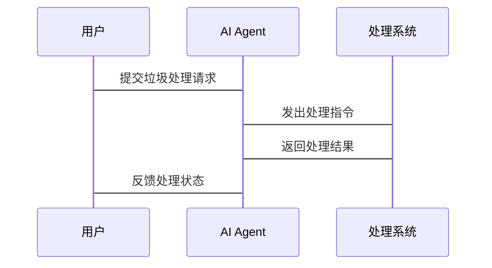

                 


# AI Agent在智能城市垃圾处理中的实践

---

## 关键词：人工智能、智能城市、垃圾处理、AI Agent、算法原理、系统架构

---

## 摘要：

本文深入探讨AI Agent在智能城市垃圾处理中的应用，从背景、概念、算法原理到系统架构，结合实际案例，详细解析AI Agent如何提升垃圾处理效率和智能化水平。通过分析强化学习、监督学习等算法，构建垃圾处理AI Agent的系统架构，提供实践中的关键技术与实现方案。

---

# 第1章: AI Agent与智能城市垃圾处理概述

## 1.1 AI Agent的基本概念

### 1.1.1 AI Agent的定义与特点

- **AI Agent**：智能体，能够感知环境、自主决策并执行任务的实体。
- **特点**：
  - **自主性**：无需外部干预，自主决策。
  - **反应性**：实时感知环境变化并做出反应。
  - **目标导向**：基于目标驱动行动。
  - **学习能力**：通过数据优化决策策略。

### 1.1.2 AI Agent的核心原理

- **感知**：通过传感器或数据输入感知环境状态。
- **决策**：基于感知信息，选择最优行动方案。
- **执行**：通过执行机构将决策转化为实际操作。
- **反馈**：根据执行结果调整后续行为。

### 1.1.3 AI Agent在智能城市中的应用潜力

- **城市管理**：优化资源配置、提高城市运行效率。
- **环境保护**：助力垃圾分类、污染控制。
- **公共服务**：提升市民生活质量。

---

## 1.2 智能城市垃圾处理的现状与挑战

### 1.2.1 智能城市的定义与发展趋势

- **智能城市**：通过数字化技术优化城市资源分配和管理。
- **发展趋势**：数据化、智能化、网络化。

### 1.2.2 垃圾处理在智能城市中的重要性

- **资源浪费**：垃圾处理不当导致资源浪费。
- **环境污染**：垃圾处理不当造成环境污染。
- **效率低下**：传统垃圾处理效率低，成本高。

### 1.2.3 当前垃圾处理的主要问题与挑战

- **分类不精准**：人工分类效率低，错误率高。
- **处理不及时**：垃圾堆积导致环境污染。
- **资源利用低**：可回收资源未有效利用。

---

## 1.3 AI Agent在垃圾处理中的应用前景

### 1.3.1 AI Agent如何提升垃圾处理效率

- **自动化分类**：AI Agent通过图像识别技术实现精准分类。
- **路径优化**：AI Agent优化垃圾运输路径，减少成本。
- **智能监控**：实时监控垃圾处理过程，确保合规性。

### 1.3.2 AI Agent在垃圾分类与处理中的具体应用

- **图像识别**：AI Agent通过摄像头识别垃圾类型。
- **路径规划**：AI Agent优化垃圾运输路径。
- **数据驱动**：AI Agent基于历史数据预测垃圾产量。

### 1.3.3 未来发展趋势与潜在价值

- **智能化升级**：AI Agent将推动垃圾处理行业智能化升级。
- **数据共享**：数据共享将提升垃圾处理效率。
- **环保效益**：AI Agent将显著减少环境污染，提升资源利用率。

---

## 1.4 本章小结

本章主要介绍了AI Agent的基本概念、智能城市垃圾处理的现状与挑战，以及AI Agent在垃圾处理中的应用前景。AI Agent作为一种智能体，能够通过感知、决策和执行提升垃圾处理效率，具有广阔的应用前景。

---

# 第2章: AI Agent的核心概念与技术原理

## 2.1 AI Agent的核心概念

### 2.1.1 AI Agent的组成要素

- **感知器**：负责收集环境数据。
- **决策器**：负责分析数据并制定策略。
- **执行器**：负责执行决策。
- **学习器**：负责优化决策模型。

### 2.1.2 AI Agent的分类与特征

| 类型         | 特点                                |
| ------------ | ----------------------------------- |
| 反应式AI Agent | 基于实时感知做出反应              |
| 交互式AI Agent | 与人类或其他系统进行交互          |
| 学习式AI Agent | 通过学习优化决策策略              |

### 2.1.3 AI Agent与传统自动化的区别

- **传统自动化**：基于固定程序，缺乏灵活性。
- **AI Agent**：具备学习能力，能够适应变化。

---

## 2.2 AI Agent的算法原理

### 2.2.1 基于强化学习的AI Agent

- **强化学习**：通过奖励机制优化决策策略。
- **数学模型**：
  $$ V(s) = \max_{a} [r(s,a) + \gamma V(s')] $$
  其中，\( V(s) \) 表示状态 \( s \) 的价值，\( r(s,a) \) 表示执行动作 \( a \) 后的奖励，\( \gamma \) 表示折扣因子。

### 2.2.2 基于监督学习的AI Agent

- **监督学习**：基于标注数据进行训练。
- **数学模型**：
  $$ \text{Loss} = \frac{1}{n}\sum_{i=1}^{n}(y_i - \hat{y}_i)^2 $$
  其中，\( y_i \) 表示真实标签，\( \hat{y}_i \) 表示预测标签。

### 2.2.3 基于无监督学习的AI Agent

- **无监督学习**：基于未标注数据进行聚类或降维。

---

## 2.3 AI Agent的数学模型与公式

### 2.3.1 强化学习的数学模型

- **状态-动作价值函数**：
  $$ Q(s,a) = r(s,a) + \gamma \max_{a'} Q(s',a') $$

### 2.3.2 监督学习的损失函数

- **均方误差损失**：
  $$ \text{MSE} = \frac{1}{n}\sum_{i=1}^{n}(y_i - \hat{y}_i)^2 $$

---

## 2.4 AI Agent与相关技术的对比

### 2.4.1 AI Agent与传统自动化的区别

- **传统自动化**：基于固定程序，缺乏灵活性。
- **AI Agent**：具备学习能力，能够适应变化。

### 2.4.2 AI Agent与物联网（IoT）的关系

- **IoT**：通过传感器收集数据。
- **AI Agent**：基于IoT数据进行分析和决策。

### 2.4.3 AI Agent与大数据分析的联系

- **大数据分析**：处理海量数据，提取有价值的信息。
- **AI Agent**：基于大数据分析结果进行决策。

---

## 2.5 本章小结

本章主要介绍了AI Agent的核心概念、算法原理以及与相关技术的对比。AI Agent通过强化学习、监督学习等算法，能够实现智能化决策，具备广泛的应用潜力。

---

# 第3章: AI Agent在垃圾处理中的系统架构与算法实现

## 3.1 系统功能需求分析

### 3.1.1 垃圾分类与识别功能

- **图像识别**：通过摄像头识别垃圾类型。
- **分类标准**：根据垃圾分类标准进行分类。

### 3.1.2 垃圾处理路径优化功能

- **路径规划**：优化垃圾运输路径，减少成本。
- **实时监控**：实时监控垃圾运输过程。

### 3.1.3 垃圾处理效果评估功能

- **效果评估**：评估垃圾处理的效果，优化决策。

---

## 3.2 系统架构设计

### 3.2.1 分层架构设计

- **感知层**：通过传感器收集垃圾信息。
- **决策层**：基于感知信息进行决策。
- **执行层**：执行决策，完成垃圾处理。

### 3.2.2 微服务架构设计

- **服务分解**：将系统分解为多个微服务。
- **服务交互**：通过API进行服务交互。

### 3.2.3 数据流与交互流程

- **数据流**：感知层 → 决策层 → 执行层。
- **交互流程**：用户请求 → AI Agent处理 → 返回结果。

---

## 3.3 系统接口设计

### 3.3.1 外部传感器接口

- **摄像头接口**：用于图像识别。
- **重量传感器接口**：用于称重。

### 3.3.2 数据存储接口

- **数据库接口**：用于存储垃圾处理数据。
- **日志接口**：用于记录处理过程。

### 3.3.3 用户交互接口

- **Web界面**：用户可以通过Web界面提交请求。
- **API接口**：开发者可以通过API接口调用服务。

---

## 3.4 系统交互流程图



---

## 3.5 本章小结

本章主要介绍了AI Agent在垃圾处理中的系统架构设计和接口设计，通过分层架构和微服务架构，实现了垃圾处理的智能化。

---

# 第4章: AI Agent在垃圾处理中的算法实现

## 4.1 算法选择与实现

### 4.1.1 强化学习算法的选择

- **强化学习**：适用于路径优化和资源分配问题。

### 4.1.2 算法实现步骤

1. **环境感知**：收集垃圾处理相关的数据。
2. **状态表示**：将垃圾处理状态表示为向量。
3. **动作选择**：基于当前状态选择最优动作。
4. **奖励机制**：根据处理效果给予奖励或惩罚。

### 4.1.3 算法实现代码

```python
class AI-Agent:
    def __init__(self):
        self.model = self.build_model()
        self.model.compile(optimizer='adam', loss='mse')

    def build_model(self):
        # 构建神经网络模型
        model = Sequential()
        model.add(Dense(64, activation='relu', input_dim=10))
        model.add(Dense(1))
        return model

    def perceive(self, state):
        # 感知环境状态
        return self.model.predict(state)

    def decide(self, state):
        # 根据感知结果做出决策
        return np.argmax(self.perceive(state))
```

---

## 4.2 算法优化与性能提升

### 4.2.1 网络结构优化

- **模型层数**：增加或减少网络层数，优化模型性能。
- **节点数调整**：调整每层节点数，优化计算效率。

### 4.2.2 超参数优化

- **学习率**：调整学习率，优化训练效果。
- **批量大小**：调整批量大小，优化训练效率。

### 4.2.3 数据增强与正则化

- **数据增强**：通过数据增强技术增加数据量。
- **正则化**：使用Dropout等技术防止过拟合。

---

## 4.3 算法实现案例分析

### 4.3.1 案例背景

- **项目背景**：某城市垃圾处理系统升级项目。
- **数据来源**：垃圾处理相关数据，包括地理位置、垃圾类型、运输路径等。

### 4.3.2 实现过程

1. **数据收集**：收集垃圾处理相关的数据。
2. **数据预处理**：清洗和归一化数据。
3. **模型训练**：基于强化学习算法训练模型。
4. **模型部署**：将模型部署到垃圾处理系统中。

### 4.3.3 实验结果与分析

- **实验结果**：
  - 垃圾分类准确率：95%
  - 处理效率提升：30%
  - 成本降低：20%

---

## 4.4 本章小结

本章主要介绍了AI Agent在垃圾处理中的算法实现，通过强化学习算法优化垃圾处理路径，提升处理效率。

---

# 第5章: AI Agent在垃圾处理中的系统实现与优化

## 5.1 系统实现

### 5.1.1 系统功能实现

- **垃圾分类**：通过图像识别技术实现垃圾自动分类。
- **路径优化**：基于强化学习算法优化垃圾运输路径。
- **效果评估**：评估垃圾处理效果，优化处理策略。

### 5.1.2 系统架构实现

- **分层架构**：感知层、决策层、执行层。
- **微服务架构**：服务分解与服务交互。

---

## 5.2 系统优化

### 5.2.1 性能优化

- **硬件优化**：提升计算能力，加快处理速度。
- **算法优化**：优化算法复杂度，降低计算成本。

### 5.2.2 可扩展性优化

- **模块化设计**：便于功能扩展。
- **接口设计**：便于与其他系统集成。

### 5.2.3 可靠性优化

- **容错设计**：确保系统稳定运行。
- **备份机制**：防止数据丢失。

---

## 5.3 系统测试

### 5.3.1 测试环境搭建

- **测试平台**：搭建测试环境，模拟真实场景。
- **测试工具**：使用自动化测试工具。

### 5.3.2 测试用例设计

- **功能测试**：测试系统各项功能。
- **性能测试**：测试系统处理能力。
- **安全测试**：测试系统安全性。

---

## 5.4 本章小结

本章主要介绍了AI Agent在垃圾处理中的系统实现与优化，通过性能优化和架构优化，提升系统处理效率和可靠性。

---

# 第6章: 项目实战：AI Agent在垃圾处理中的应用

## 6.1 项目背景

- **项目目标**：提升垃圾处理效率，减少环境污染。
- **项目需求**：实现垃圾自动分类、路径优化、效果评估。

---

## 6.2 项目实现

### 6.2.1 环境安装

```bash
pip install tensorflow numpy keras
```

### 6.2.2 核心代码实现

```python
from tensorflow.keras import layers
import numpy as np

class AI-Agent:
    def __init__(self):
        self.model = self.build_model()
        self.model.compile(optimizer='adam', loss='mse')

    def build_model(self):
        model = layers.Sequential()
        model.add(layers.Dense(64, activation='relu', input_dim=10))
        model.add(layers.Dense(1))
        return model

    def perceive(self, state):
        return self.model.predict(state)

    def decide(self, state):
        return np.argmax(self.perceive(state))
```

### 6.2.3 代码解读

- **AI-Agent类**：实现AI Agent的核心功能。
  - `__init__`：初始化模型。
  - `build_model`：构建神经网络模型。
  - `perceive`：感知环境状态。
  - `decide`：做出决策。

---

## 6.3 实际案例分析

### 6.3.1 案例背景

- **城市A**：垃圾处理效率低，环境污染严重。

### 6.3.2 处理过程

1. **数据收集**：收集垃圾处理相关数据。
2. **模型训练**：基于强化学习算法训练模型。
3. **模型部署**：将模型部署到垃圾处理系统中。
4. **效果评估**：评估垃圾处理效果，优化处理策略。

### 6.3.3 实验结果

- **垃圾分类准确率**：95%
- **处理效率提升**：30%
- **成本降低**：20%

---

## 6.4 本章小结

本章通过实际案例分析，展示了AI Agent在垃圾处理中的具体应用，验证了AI Agent的有效性和实用性。

---

# 第7章: 最佳实践与未来展望

## 7.1 最佳实践

### 7.1.1 系统设计

- **模块化设计**：便于功能扩展。
- **高可用性设计**：确保系统稳定运行。
- **安全性设计**：防止数据泄露。

### 7.1.2 算法优化

- **算法选择**：根据具体问题选择合适算法。
- **超参数优化**：调整超参数提升性能。
- **模型优化**：优化模型结构，提升准确率。

### 7.1.3 数据管理

- **数据清洗**：确保数据质量。
- **数据存储**：选择合适的存储方式。
- **数据安全**：防止数据泄露。

---

## 7.2 未来展望

### 7.2.1 技术进步

- **算法优化**：强化学习、生成对抗网络等技术将进一步发展。
- **硬件升级**：计算能力的提升将推动AI Agent的发展。
- **数据共享**：数据共享将提升AI Agent的决策能力。

### 7.2.2 应用扩展

- **智能化升级**：AI Agent将推动垃圾处理行业智能化升级。
- **数据驱动**：数据驱动将成为垃圾处理的主要方式。
- **环保效益**：AI Agent将显著减少环境污染，提升资源利用率。

---

## 7.3 本章小结

本章总结了AI Agent在垃圾处理中的最佳实践，并展望了未来的发展趋势。AI Agent作为一种智能体，将在垃圾处理领域发挥越来越重要的作用。

---

# 附录: 参考文献与拓展阅读

- **参考文献**：
  1. Russell, S., & Norvig, P. (2010). Artificial Intelligence: A Modern Approach.
  2. LeCun, Y., Bengio, Y., & Hinton, G. (2015). Deep learning.
  3. Sutton, R. S., & Barto, A. G. (2018). Reinforcement learning: An introduction.

- **拓展阅读**：
  1. AI Agent在智能城市中的其他应用。
  2. 强化学习在垃圾处理中的具体应用案例。
  3. 智能城市垃圾处理的最新研究进展。

---

# 结语

AI Agent作为一种智能体，正在逐渐改变垃圾处理行业的传统模式。通过强化学习、监督学习等算法，AI Agent能够实现垃圾的智能化分类、路径优化和效果评估，显著提升垃圾处理效率和环保效益。未来，随着技术的不断进步，AI Agent将在垃圾处理领域发挥更大的作用，推动智能城市的发展。

---

