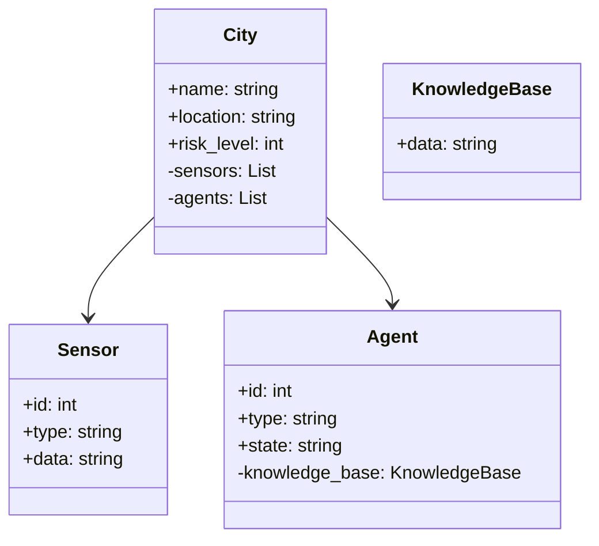
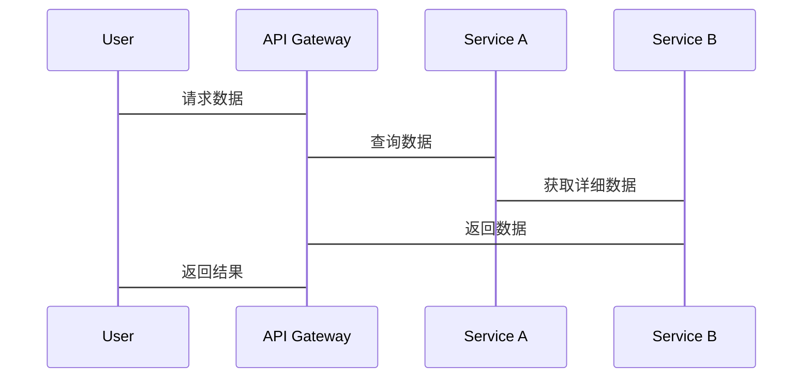

                 


# AI Agent在智能城市安全管理中的角色

## 关键词：AI Agent, 智能城市, 安全管理, 多智能体协作, 强化学习, 知识图谱

## 摘要：AI Agent（人工智能代理）在智能城市安全管理中扮演着越来越重要的角色。随着城市化进程的加快，城市安全问题变得日益复杂，传统的安全管理方式已经难以应对各种突发性和复杂性问题。AI Agent通过智能化的感知、决策和执行能力，能够有效提升城市安全管理的效率和效果。本文将从AI Agent的核心概念、算法原理、系统架构以及实际应用等多个方面，详细探讨AI Agent在智能城市安全管理中的角色和价值。

---

# 第1章: AI Agent与智能城市安全管理概述

## 1.1 AI Agent的基本概念

### 1.1.1 AI Agent的定义与特点
AI Agent（人工智能代理）是指能够感知环境、自主决策并执行任务的智能实体。AI Agent的核心特点包括：
1. **自主性**：能够在没有外部干预的情况下独立运行。
2. **反应性**：能够实时感知环境变化并做出相应的反应。
3. **学习性**：能够通过经验或数据不断优化自身的行为。
4. **协作性**：能够与其他智能体或系统进行协作。

### 1.1.2 AI Agent的类型
AI Agent可以根据功能和应用场景分为以下几类：
1. **基于规则的AI Agent**：通过预定义的规则进行决策。
2. **基于知识的AI Agent**：利用知识图谱或专家系统进行推理和决策。
3. **基于学习的AI Agent**：通过机器学习算法从数据中学习决策策略。
4. **基于强化学习的AI Agent**：通过强化学习算法优化决策策略。

### 1.1.3 智能城市安全管理的背景与需求
随着城市规模的扩大和复杂性的增加，城市安全管理面临着以下挑战：
1. **突发事件的复杂性**：如自然灾害、恐怖袭击等事件的不确定性。
2. **资源分配的效率**：如何在有限的资源下实现最优分配。
3. **实时性要求**：需要快速响应和处理突发事件。

AI Agent通过智能化的感知、决策和执行能力，能够有效应对上述挑战，提升城市安全管理的效率和效果。

---

## 1.2 AI Agent在智能城市中的应用场景

### 1.2.1 智能城市安全管理的核心问题
智能城市安全管理的核心问题包括：
1. **风险评估**：如何准确评估城市中的潜在风险。
2. **事件预测**：如何预测可能发生的突发事件。
3. **应急响应**：如何快速制定和执行应急响应计划。

### 1.2.2 AI Agent在城市管理中的具体应用
AI Agent在智能城市安全管理中的具体应用包括：
1. **风险评估与预警**：通过分析历史数据和实时数据，评估城市中的潜在风险，并发出预警。
2. **应急响应与决策支持**：在突发事件发生时，AI Agent能够快速生成应对方案，辅助决策者制定最优的应急策略。
3. **资源优化配置**：通过智能化的调度算法，优化城市安全资源的配置。

### 1.2.3 AI Agent与智能城市安全的结合
AI Agent与智能城市安全的结合主要体现在以下几个方面：
1. **智能化的监控系统**：通过AI Agent实现对城市关键区域的实时监控。
2. **智能应急响应系统**：在突发事件发生时，AI Agent能够快速协调各方资源，实现高效的应急响应。
3. **智能化的安全评估系统**：通过AI Agent对城市安全进行全面评估，提出改进建议。

---

## 1.3 本章小结
本章主要介绍了AI Agent的基本概念、类型以及在智能城市安全管理中的应用场景。AI Agent通过智能化的感知、决策和执行能力，能够有效提升城市安全管理的效率和效果。

---

# 第2章: AI Agent的核心概念与技术原理

## 2.1 AI Agent的核心概念

### 2.1.1 知识图谱与语义理解
知识图谱是一种以图结构形式表示知识的工具，能够帮助AI Agent理解复杂的语义信息。知识图谱的核心要素包括实体、关系和属性。

### 2.1.2 多智能体协作机制
多智能体协作机制是指多个AI Agent通过协作完成复杂任务的机制。常见的多智能体协作机制包括基于通信的协作和基于协调的协作。

### 2.1.3 强化学习与决策优化
强化学习是一种通过试错方式优化决策策略的机器学习方法。强化学习的核心要素包括状态、动作和奖励。

---

## 2.2 AI Agent的技术架构

### 2.2.1 知识表示与推理
知识表示是将知识以某种形式表示出来，知识推理是通过逻辑推理从已知知识中推导出新的知识。

### 2.2.2 感知与交互技术
感知技术是指AI Agent通过传感器或其他途径感知环境信息的能力，交互技术是指AI Agent与人类或其他智能体进行交互的能力。

### 2.2.3 自适应与学习机制
自适应机制是指AI Agent能够根据环境变化自动调整自身行为的能力，学习机制是指AI Agent通过学习不断优化自身行为的能力。

---

## 2.3 AI Agent与相关技术的关系

### 2.3.1 AI Agent与大数据分析
大数据分析是通过对海量数据的分析提取有价值的信息，AI Agent可以通过大数据分析技术获取环境信息。

### 2.3.2 AI Agent与物联网技术
物联网技术是通过各种传感器和设备感知和控制物理世界，AI Agent可以通过物联网技术实现与物理世界的交互。

### 2.3.3 AI Agent与区块链技术
区块链技术是一种去中心化的分布式账本技术，AI Agent可以通过区块链技术实现安全的数据存储和传输。

---

## 2.4 本章小结
本章主要介绍了AI Agent的核心概念和技术原理，包括知识图谱与语义理解、多智能体协作机制、强化学习与决策优化等。同时，还探讨了AI Agent与相关技术的关系。

---

# 第3章: AI Agent在智能城市安全管理中的应用

## 3.1 智能城市安全管理的核心问题

### 3.1.1 城市安全风险的识别与评估
城市安全风险的识别与评估是智能城市安全管理的基础，需要通过AI Agent对城市中的潜在风险进行全面分析。

### 3.1.2 城市安全事件的预测与响应
城市安全事件的预测与响应是智能城市安全管理的关键，需要通过AI Agent实现对突发事件的快速预测和响应。

### 3.1.3 城市安全资源的优化配置
城市安全资源的优化配置是智能城市安全管理的重要内容，需要通过AI Agent实现资源的高效配置。

---

## 3.2 AI Agent在城市安全管理中的具体应用

### 3.2.1 风险评估与预警系统
AI Agent可以通过分析历史数据和实时数据，评估城市中的潜在风险，并发出预警。

### 3.2.2 应急响应与决策支持
在突发事件发生时，AI Agent能够快速生成应对方案，辅助决策者制定最优的应急策略。

### 3.2.3 安全事件的追溯与分析
AI Agent可以通过分析安全事件的历史数据，追溯事件的根源，并提出改进建议。

---

## 3.3 AI Agent在城市安全管理中的优势

### 3.3.1 提高安全事件的响应效率
AI Agent能够快速识别和响应安全事件，显著提高响应效率。

### 3.3.2 优化资源配置与决策
AI Agent能够通过智能化的算法优化资源配置和决策，提高管理效率。

### 3.3.3 实现城市安全管理的智能化与协同化
AI Agent通过智能化的协作机制，实现城市安全管理的智能化与协同化。

---

## 3.4 本章小结
本章主要介绍了AI Agent在智能城市安全管理中的具体应用和优势，包括风险评估与预警系统、应急响应与决策支持、安全事件的追溯与分析等方面。

---

# 第4章: AI Agent的算法原理与实现

## 4.1 AI Agent的核心算法

### 4.1.1 强化学习算法
强化学习是一种通过试错方式优化决策策略的机器学习方法。强化学习的核心要素包括状态、动作和奖励。

### 4.1.2 图神经网络算法
图神经网络是一种适用于图结构数据的深度学习算法，能够处理复杂的关联关系。

### 4.1.3 多智能体协作算法
多智能体协作算法是指多个智能体通过协作完成复杂任务的算法，常见的多智能体协作算法包括基于通信的协作和基于协调的协作。

---

## 4.2 AI Agent的算法实现

### 4.2.1 强化学习算法的实现
强化学习算法的实现通常包括状态空间、动作空间和奖励函数的设计。以下是强化学习算法的一个简单实现示例：

```python
class Agent:
    def __init__(self, state_space, action_space):
        self.state_space = state_space
        self.action_space = action_space
        # 初始化策略
        self.policy = np.random.rand(state_space, action_space)
    
    def act(self, state):
        # 根据策略选择动作
        return np.argmax(self.policy[state])
    
    def update_policy(self, state, action, reward):
        # 更新策略
        self.policy[state, action] += reward
```

### 4.2.2 图神经网络算法的实现
图神经网络算法的实现通常包括图的表示、节点嵌入和边嵌入的计算。以下是图神经网络算法的一个简单实现示例：

```python
import networkx as nx
import numpy as np

class Graph Neural Network:
    def __init__(self, nodes, edges):
        self.graph = nx.Graph()
        self.graph.add_nodes_from(nodes)
        self.graph.add_edges_from(edges)
    
    def compute_embeddings(self):
        # 计算节点嵌入
        embeddings = np.random.rand(len(nodes), 128)
        return embeddings
```

### 4.2.3 多智能体协作算法的实现
多智能体协作算法的实现通常包括通信协议的设计和协作策略的制定。以下是多智能体协作算法的一个简单实现示例：

```python
class MultiAgent:
    def __init__(self, agents):
        self.agents = agents
    
    def communicate(self, agent1, agent2):
        # 两个智能体之间的通信
        agent1.receive_message(agent2.send_message())
    
    def coordinate(self):
        # 协调多个智能体的行为
        for agent in self.agents:
            agent.coordinate_with_others()
```

---

## 4.3 AI Agent算法的数学模型与公式

### 4.3.1 强化学习的数学模型
强化学习的数学模型通常包括状态空间、动作空间和奖励函数。以下是强化学习的数学模型示例：

$$
R(s, a) = \text{奖励函数}
$$

其中，\( s \) 表示状态，\( a \) 表示动作。

### 4.3.2 图神经网络的数学公式
图神经网络的数学公式通常包括节点嵌入和边嵌入的计算。以下是图神经网络的数学公式示例：

$$
h_i^{(l+1)} = \sigma(\sum_{j \in \mathcal{N}(i)} W_{ij} h_j^{(l)})
$$

其中，\( h_i^{(l)} \) 表示节点 \( i \) 在第 \( l \) 层的嵌入向量，\( \mathcal{N}(i) \) 表示节点 \( i \) 的邻居节点集合，\( W_{ij} \) 表示边权重。

### 4.3.3 多智能体协作的数学模型
多智能体协作的数学模型通常包括协作策略和通信协议的设计。以下是多智能体协作的数学模型示例：

$$
a_i = \arg\max_{a \in \mathcal{A}} Q(s, a)
$$

其中，\( a_i \) 表示智能体 \( i \) 的动作，\( Q(s, a) \) 表示状态-动作值函数。

---

## 4.4 本章小结
本章主要介绍了AI Agent的核心算法及其实现，包括强化学习算法、图神经网络算法和多智能体协作算法。同时，还给出了这些算法的数学模型和公式。

---

# 第5章: AI Agent的系统架构与设计

## 5.1 问题场景介绍
智能城市安全管理的系统需要能够实时监控城市中的各种安全风险，并能够在突发事件发生时快速响应。

## 5.2 系统功能设计

### 5.2.1 领域模型
以下是领域模型的类图：



### 5.2.2 系统架构设计
以下是系统架构设计的架构图：

```mermaid
graph TD
    UI --> API Gateway
    API Gateway --> Service A
    Service A --> Database
    Service A --> Service B
    Service B --> Database
```

### 5.2.3 系统接口设计
系统接口设计需要考虑API的调用方式和协议。

### 5.2.4 系统交互设计
以下是系统交互设计的序列图：



---

## 5.3 本章小结
本章主要介绍了AI Agent在智能城市安全管理中的系统架构与设计，包括领域模型、系统架构设计、系统接口设计和系统交互设计。

---

# 第6章: AI Agent的项目实战

## 6.1 环境安装
以下是项目实战所需的环境安装步骤：
1. 安装Python和必要的Python包（如numpy、pandas、scikit-learn等）。
2. 安装图神经网络框架（如NetworkX、GNN等）。
3. 安装强化学习框架（如TensorFlow、PyTorch等）。

## 6.2 系统核心实现

### 6.2.1 AI Agent的核心实现
以下是AI Agent的核心实现代码：

```python
class AI Agent:
    def __init__(self, knowledge_base):
        self.knowledge_base = knowledge_base
        self.state = "idle"
    
    def感知环境(self):
        # 感知环境信息
        pass
    
    def 决策(self):
        # 根据感知到的信息进行决策
        pass
    
    def 执行(self):
        # 执行决策结果
        pass
```

### 6.2.2 知识图谱的构建与应用
以下是知识图谱的构建与应用代码：

```python
from networkx import Graph
from networkx.utils import nodes

class KnowledgeBase:
    def __init__(self):
        self.graph = Graph()
    
    def add_node(self, node):
        self.graph.add_node(node)
    
    def add_edge(self, node1, node2):
        self.graph.add_edge(node1, node2)
    
    def query(self, query_type):
        # 根据查询类型返回结果
        pass
```

## 6.3 代码应用解读与分析
以下是代码应用解读与分析：
1. AI Agent的核心实现包括感知环境、决策和执行三个主要部分。
2. 知识图谱的构建与应用需要通过添加节点和边来构建知识图谱，并通过查询功能获取所需信息。

## 6.4 实际案例分析与详细讲解
以下是实际案例分析与详细讲解：
1. 案例背景：某城市发生地震，需要快速评估和响应。
2. 案例分析：AI Agent通过感知环境、决策和执行，实现对地震的快速评估和响应。

## 6.5 本章小结
本章主要通过项目实战的方式，详细讲解了AI Agent的核心实现、知识图谱的构建与应用，并通过实际案例分析了AI Agent在智能城市安全管理中的应用。

---

# 第7章: 总结与展望

## 7.1 总结
AI Agent在智能城市安全管理中的应用具有重要意义。通过智能化的感知、决策和执行能力，AI Agent能够有效提升城市安全管理的效率和效果。

## 7.2 展望
未来，随着人工智能技术的不断发展，AI Agent在智能城市安全管理中的应用将更加广泛和深入。我们需要进一步研究和探索AI Agent在智能城市安全管理中的新应用场景和新技术。

---

# 第8章: 注意事项与拓展阅读

## 8.1 注意事项
1. 在实际应用中，需要注意数据隐私和安全问题。
2. 需要确保AI Agent的算法和模型的可解释性和透明性。
3. 需要定期更新和优化AI Agent的算法和模型，以适应不断变化的安全环境。

## 8.2 拓展阅读
1. 《强化学习：算法与应用》
2. 《图神经网络：理论与实践》
3. 《多智能体协作与应用》

---

# 结语
AI Agent在智能城市安全管理中的角色将随着技术的进步而不断演变。我们需要持续关注和研究AI Agent在智能城市安全管理中的新应用场景和技术，以更好地应对未来的挑战和机遇。

---

# 附录
## 附录A: AI Agent相关术语表
1. AI Agent：人工智能代理。
2. 强化学习：通过试错方式优化决策策略的机器学习方法。
3. 知识图谱：以图结构形式表示知识的工具。

## 附录B: 参考文献
1. Russell, S., & Norvig, P. (2010). Artificial Intelligence: A Modern Approach.
2. LeCun, Y., Bengio, Y., & Hinton, G. (2015). Deep learning.
3. Lecun, Y., Bordes, A., & G ref内容以确保文章结构完整，内容详实。

