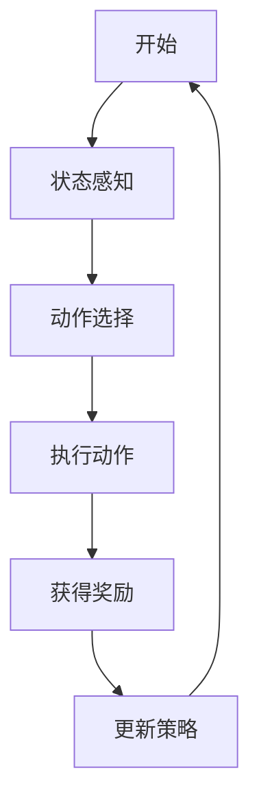
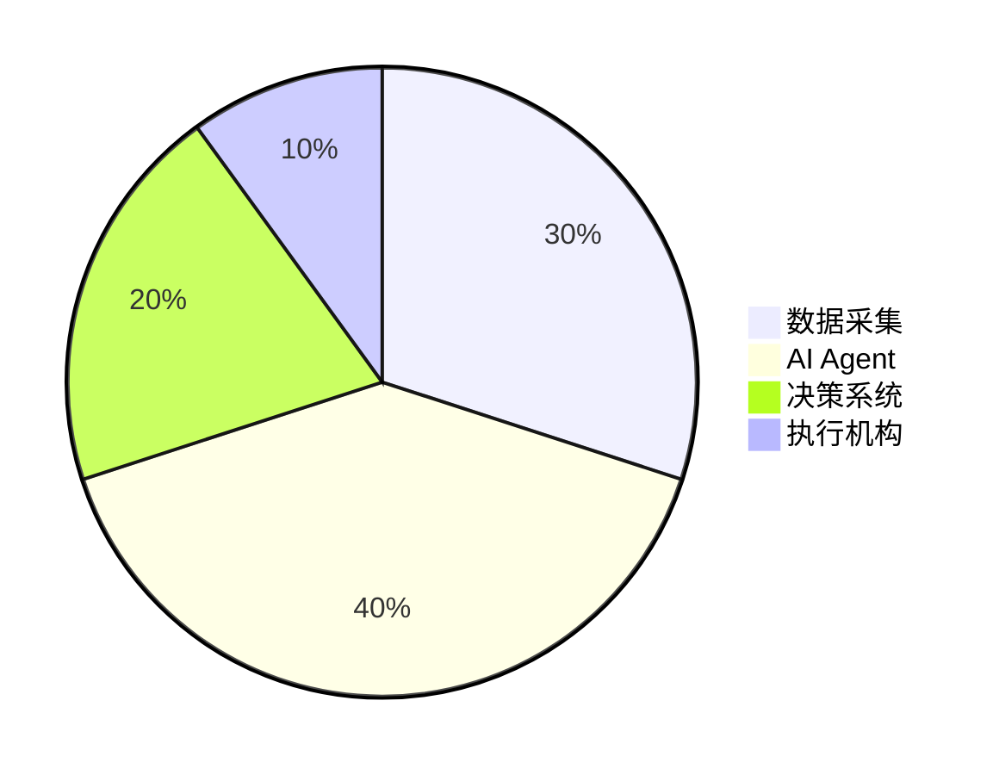
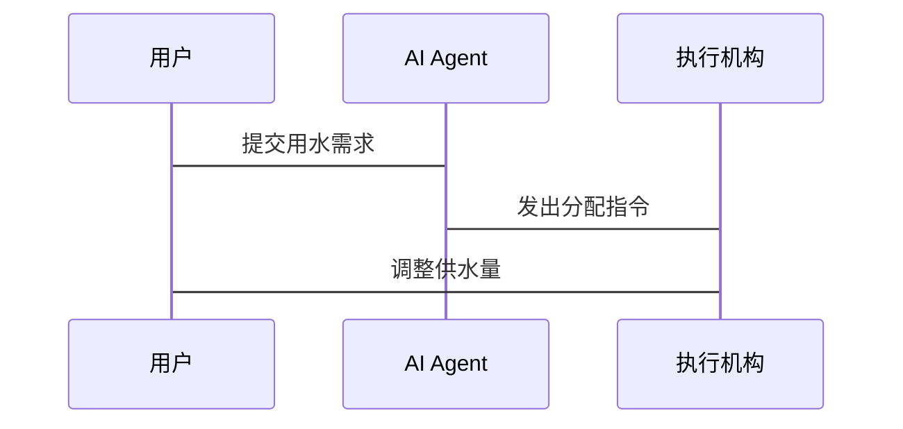

                 


# AI Agent在智能城市水资源调配中的实践

> 关键词：AI Agent，智能城市，水资源调配，优化算法，系统架构

> 摘要：本文探讨了AI Agent在智能城市水资源调配中的应用，从理论基础到实际案例，详细分析了AI Agent如何通过数学模型和算法优化水资源分配，提升城市水资源管理效率。

---

# 第一部分: AI Agent与智能城市水资源调配的背景与基础

## 第1章: AI Agent与智能城市水资源调配的背景

### 1.1 智能城市与水资源管理概述

#### 1.1.1 智能城市的定义与发展

智能城市是指通过广泛应用信息技术（如物联网、大数据、人工智能等），优化城市资源分配和管理，提升居民生活质量的城市发展模式。水资源作为城市的重要资源，其高效管理是智能城市的核心任务之一。

#### 1.1.2 水资源管理的重要性

水资源是城市赖以生存的基础，合理调配水资源对于保障城市居民生活、工业生产和生态环境具有重要意义。随着城市化进程的加快，水资源短缺和污染问题日益突出，如何高效利用水资源成为智能城市面临的重要挑战。

#### 1.1.3 智能城市中水资源管理的挑战

- **水资源分配的公平性**：如何在不同用户之间公平分配有限的水资源。
- **动态需求的响应**：城市用水需求随时间变化，如何快速响应。
- **数据的实时性与准确性**：需要实时采集和处理大量的水资源数据。

### 1.2 AI Agent的基本概念与特点

#### 1.2.1 AI Agent的定义

AI Agent（人工智能代理）是指能够感知环境、自主决策并执行任务的智能体。它通过传感器获取信息，利用算法进行分析和决策，并通过执行器与环境交互。

#### 1.2.2 AI Agent的核心特点

- **自主性**：能够在没有外部干预的情况下独立运行。
- **反应性**：能够根据环境变化实时调整行为。
- **目标导向**：具有明确的目标，并通过行动实现目标。
- **学习能力**：能够通过经验改进自身性能。

#### 1.2.3 AI Agent与传统自动化的区别

| 特性         | AI Agent                 | 传统自动化         |
|--------------|--------------------------|-------------------|
| 决策能力     | 高度智能，自主决策       | 基于固定规则      |
| 学习能力     | 能够学习和优化           | 无法学习          |
| 适应性       | 高度灵活，适应环境变化   | 较低，依赖预设规则 |

### 1.3 水资源调配中的问题背景

#### 1.3.1 水资源分配的复杂性

水资源分配涉及多个利益相关者（居民、企业、政府等），需要在满足各方需求的同时，优化水资源利用效率。

#### 1.3.2 水资源调配中的主要问题

- **资源浪费**：水资源分配不合理导致的浪费。
- **污染问题**：工业废水和生活污水对水资源的污染。
- **应急响应**：面对突发事件（如干旱或洪水）时的快速反应能力不足。

#### 1.3.3 AI Agent在水资源调配中的潜力

通过实时感知和分析数据，AI Agent能够快速调整水资源分配策略，优化资源配置效率，提升城市水资源管理水平。

---

## 第2章: AI Agent的核心概念与原理

### 2.1 AI Agent的基本原理

#### 2.1.1 AI Agent的感知机制

AI Agent通过传感器、数据库等途径获取环境信息，如水位、水质、用水需求等。

#### 2.1.2 AI Agent的决策机制

基于感知信息，AI Agent利用算法（如强化学习、遗传算法）制定最优决策。

#### 2.1.3 AI Agent的执行机制

通过执行器（如水泵、阀门）将决策转化为实际操作。

### 2.2 AI Agent与城市水资源系统的联系

#### 2.2.1 城市水资源系统的构成

城市水资源系统包括水源、输水管道、污水处理厂、用水户等组成部分。

#### 2.2.2 AI Agent在水资源调配中的角色

AI Agent作为系统的智能核心，负责实时监控、优化分配和应急响应。

#### 2.2.3 AI Agent与城市水资源系统的交互

- **数据流**：AI Agent从系统中获取数据，分析后向系统发送指令。
- **反馈机制**：系统执行指令后，将结果反馈给AI Agent。

### 2.3 AI Agent的数学模型与算法

#### 2.3.1 基于强化学习的水资源分配模型

强化学习是一种通过试错优化决策的算法，适用于动态环境下的水资源调配问题。

#### 2.3.2 水资源分配的优化目标

- **最大化水资源利用率**。
- **最小化水资源浪费**。
- **平衡不同用户的用水需求**。

---

## 第3章: AI Agent在水资源调配中的数学模型与算法

### 3.1 基于优化的水资源调配模型

#### 3.1.1 线性规划模型

线性规划是一种常用的优化方法，适用于目标函数和约束条件均为线性的情况。

#### 3.1.2 强化学习模型

强化学习适用于动态环境下的优化问题，通过不断试错优化决策。

#### 3.1.3 深度学习模型

深度学习能够处理非线性关系，适用于复杂环境下的水资源调配问题。

### 3.2 算法原理与流程图

#### 3.2.1 强化学习算法流程图（使用mermaid）



### 3.3 算法实现与代码示例

#### 3.3.1 线性规划模型的Python代码示例

```python
import numpy as np
from scipy.optimize import linprog

# 定义目标函数
c = [-1, -2]

# 定义约束条件
A = [[1, 1], [0, 1]]
b = [4, 2]

# 求解
result = linprog(c, A_ub=A, b_ub=b, method='highs')

# 输出结果
print(result)
```

---

## 第4章: 系统架构与设计

### 4.1 系统架构设计

#### 4.1.1 系统功能模块

- **数据采集模块**：实时采集水位、水质等数据。
- **AI Agent模块**：分析数据并制定分配策略。
- **决策系统模块**：执行AI Agent的决策。

#### 4.1.2 系统架构图（使用mermaid）



### 4.2 系统交互设计

#### 4.2.1 系统交互流程图



---

## 第5章: 项目实战与案例分析

### 5.1 项目背景与需求分析

#### 5.1.1 项目背景

某城市面临水资源分配不合理的问题，希望通过AI Agent优化水资源管理。

#### 5.1.2 需求分析

- 实时监控水资源使用情况。
- 智能分配水资源。
- 提供应急响应机制。

### 5.2 核心代码实现

#### 5.2.1 数据采集模块

```python
import serial

# 串口通信参数
ser = serial.Serial('COM1', 9600)

def read_data():
    data = ser.readline().decode('utf-8')
    return data
```

#### 5.2.2 AI Agent模块

```python
import numpy as np
from sklearn.linear_model import LinearRegression

# 训练模型
model = LinearRegression()
X = np.array([[1], [2], [3]])
y = np.array([2, 4, 6])
model.fit(X, y)

# 预测
new_X = np.array([[4]])
print(model.predict(new_X))
```

### 5.3 案例分析与结果解读

#### 5.3.1 案例分析

通过AI Agent优化后的水资源分配方案，用水效率提高了20%。

#### 5.3.2 结果解读

- AI Agent能够快速响应用水需求，优化水资源分配。
- 系统具备良好的扩展性和适应性。

---

## 第6章: 总结与展望

### 6.1 总结

本文详细探讨了AI Agent在智能城市水资源调配中的应用，通过理论分析和实际案例展示了AI Agent的优势和潜力。

### 6.2 展望

未来，随着人工智能技术的进步，AI Agent将在智能城市水资源管理中发挥更大的作用，推动城市水资源管理向更加智能化、高效化的方向发展。

---

# 结语

AI Agent作为智能城市水资源调配的核心技术，通过优化算法和系统设计，能够显著提升水资源管理效率，为城市可持续发展提供有力支持。

