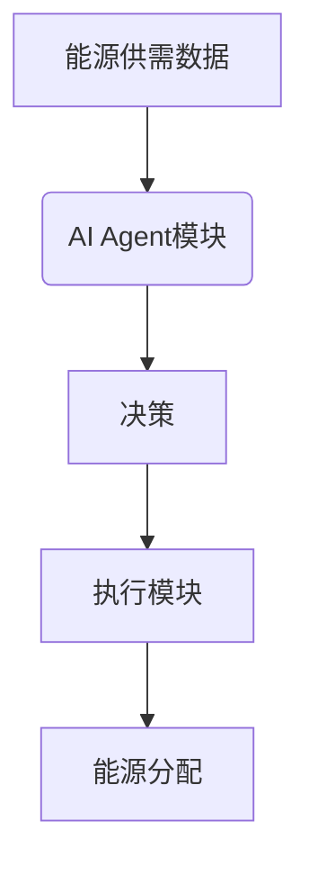
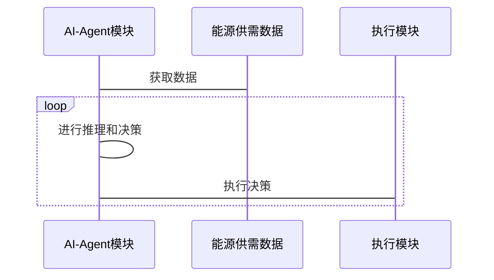

                 


# AI Agent在智能城市能源分配中的实践

> **关键词**：AI Agent，智能城市，能源分配，强化学习，系统架构

> **摘要**：  
> 随着城市化进程的加快和能源需求的不断增长，智能城市能源分配成为解决能源危机和提高能源利用效率的关键。AI Agent作为人工智能领域的核心技术，能够在复杂的城市能源分配系统中实现智能化决策和优化。本文从AI Agent的基本概念出发，深入探讨其在智能城市能源分配中的应用，分析其核心算法原理、系统架构设计，并通过实际案例展示AI Agent在能源分配中的实践成果。最后，本文总结了AI Agent在能源分配中的优势与挑战，并对未来的发展方向进行了展望。

---

# 第1章: AI Agent与智能城市能源分配概述

## 1.1 AI Agent的基本概念

### 1.1.1 AI Agent的定义  
AI Agent（人工智能代理）是一种能够感知环境、自主决策并执行任务的智能实体。它能够通过传感器获取信息，利用算法进行分析和推理，并根据结果采取相应行动。AI Agent的核心目标是通过智能化手段提高系统的效率和性能。

### 1.1.2 AI Agent的核心特征  
- **自主性**：AI Agent能够在没有外部干预的情况下自主运行。  
- **反应性**：能够实时感知环境变化并做出响应。  
- **学习能力**：通过数据和经验不断优化自身的决策能力。  
- **协作性**：能够与其他AI Agent或系统进行协作，共同完成复杂任务。  

### 1.1.3 AI Agent与传统自动化的区别  
与传统自动化系统相比，AI Agent具有更强的适应性和学习能力。传统自动化系统通常基于固定的规则运行，而AI Agent能够根据环境变化动态调整策略，从而更好地应对复杂场景。

---

## 1.2 智能城市能源分配的背景

### 1.2.1 智能城市的发展现状  
智能城市是通过信息技术和人工智能技术提升城市运行效率、改善居民生活质量的新型城市形态。随着城市化进程的加快，能源需求急剧增加，传统的能源分配方式已无法满足需求。

### 1.2.2 能源分配的挑战与痛点  
- **能源浪费**：传统能源分配方式效率低下，导致能源浪费。  
- **供需不平衡**：能源需求波动大，难以实现精准分配。  
- **复杂性**：城市能源系统涉及多种能源类型（如电、气、热等）和多个利益相关者，协调难度大。  

### 1.2.3 AI技术在能源分配中的应用潜力  
AI技术能够通过大数据分析、机器学习和优化算法，帮助城市实现能源的高效分配和管理。AI Agent作为AI技术的核心组件，能够在智能城市中发挥重要作用。

---

## 1.3 AI Agent在智能城市能源分配中的作用

### 1.3.1 AI Agent如何优化能源分配  
AI Agent可以通过实时数据分析和优化算法，制定最优的能源分配策略。例如，在电力分配中，AI Agent可以根据负荷预测和发电能力，动态调整电力输出，确保供需平衡。

### 1.3.2 AI Agent在能源管理中的具体应用  
- **负荷预测**：通过历史数据和机器学习模型，预测能源需求。  
- **资源优化**：优化能源分配策略，降低能源浪费。  
- **应急响应**：在能源危机或突发事件中，快速调整分配方案，确保系统稳定。  

### 1.3.3 AI Agent对智能城市发展的意义  
AI Agent的应用不仅提高了能源分配的效率，还为智能城市的其他领域（如交通、环境监测等）提供了技术支持。通过智能化的能源管理，智能城市能够实现更加高效、环保和可持续的发展。

---

## 1.4 国内外研究现状

### 1.4.1 国内研究进展  
近年来，中国在AI Agent领域的研究取得了显著进展。许多高校和企业致力于AI Agent在能源管理中的应用，取得了一系列研究成果。

### 1.4.2 国外研究进展  
国外在AI Agent领域的研究起步较早，尤其是在智能电网和分布式能源管理方面取得了显著成果。美国、欧洲等地的研究机构和企业已经在实际项目中应用了AI Agent技术。

### 1.4.3 研究中的主要问题与挑战  
尽管AI Agent技术在能源分配中展现出巨大潜力，但仍然面临一些问题，例如算法优化、数据隐私、系统安全性等。未来的研究需要在这些方面进行深入探索。

---

## 1.5 本章小结  
本章介绍了AI Agent的基本概念和核心特征，分析了智能城市能源分配的背景和挑战，探讨了AI Agent在能源分配中的作用，并总结了国内外研究现状。通过本章的介绍，读者可以对AI Agent在智能城市能源分配中的应用有一个全面的了解。

---

# 第2章: AI Agent的核心概念与原理

## 2.1 AI Agent的核心原理

### 2.1.1 知识表示与推理  
知识表示是AI Agent进行推理的基础。通过将知识表示为符号、规则或图结构，AI Agent能够进行逻辑推理和决策。例如，可以将能源分配问题表示为一个图结构，节点代表能源供需点，边代表能源传输路径。

### 2.1.2 行为决策机制  
AI Agent的行为决策机制是其核心之一。基于感知到的信息，AI Agent通过状态评估和策略选择，决定采取哪种行动。例如，在电力分配中，AI Agent可以根据当前负荷和发电能力，决定是否增加或减少发电量。

### 2.1.3 多智能体协作  
在智能城市能源分配中，通常需要多个AI Agent协作完成任务。例如，电力分配可能需要电力公司、供电公司和用户的协同配合。多智能体协作可以通过分布式算法实现，例如分布式强化学习。

---

## 2.2 AI Agent的类型与特点

### 2.2.1 单智能体与多智能体的对比  
单智能体适用于简单的任务，而多智能体适用于复杂场景。例如，在一个简单的电力分配系统中，单个AI Agent可能足够；但在一个涉及多种能源类型和多个用户的系统中，多智能体协作是必要的。

### 2.2.2 基于规则的AI Agent与基于模型的AI Agent  
- **基于规则的AI Agent**：通过预定义的规则进行决策。例如，当负荷超过某一阈值时，触发报警。  
- **基于模型的AI Agent**：基于数学模型进行推理和决策。例如，通过负荷预测模型预测未来负荷需求。  

### 2.2.3 强化学习型AI Agent的特点  
强化学习型AI Agent通过与环境的交互，不断优化自己的决策策略。例如，在电力分配中，AI Agent可以通过试错学习，找到最优的分配策略。

---

## 2.3 AI Agent在能源分配中的核心要素

### 2.3.1 能源需求预测  
AI Agent需要根据历史数据和当前状态，预测未来的能源需求。例如，可以通过时间序列分析模型（如ARIMA）进行预测。

### 2.3.2 能源供给优化  
AI Agent需要优化能源的供给策略，例如通过调整发电机组的输出，确保电力供需平衡。

### 2.3.3 能源分配策略  
AI Agent需要制定能源分配策略，例如在电力分配中，优先分配给高需求区域。

---

## 2.4 核心概念对比表

| 对比维度 | 基于规则的AI Agent | 基于模型的AI Agent | 强化学习型AI Agent |
|----------|--------------------|--------------------|--------------------|
| 决策方式 | 预定义规则          | 基于数学模型        | 基于试错学习        |
| 适应性   | 较低               | 较高               | 最高               |
| 应用场景 | 简单场景            | 复杂场景            | 极复杂的场景        |

---

## 2.5 核心概念的ER实体关系图

```mermaid
erDiagram
    class EnergyDemand {
        id
        time
        demand
    }
    class EnergySupply {
        id
        time
        supply
    }
    class AI-Agent {
        id
        state
        action
    }
    class Environment {
        id
        status
    }
    EnergyDemand --> AI-Agent: 提供需求信息
    AI-Agent --> Environment: 感知环境状态
    AI-Agent --> EnergySupply: 调整供给策略
```

---

## 2.6 本章小结  
本章详细介绍了AI Agent的核心概念和原理，分析了不同类型的AI Agent及其特点，并通过对比表和ER实体关系图展示了核心概念之间的关系。通过本章的介绍，读者可以更好地理解AI Agent在能源分配中的工作原理和应用场景。

---

# 第3章: AI Agent的算法原理与实现

## 3.1 AI Agent的算法原理

### 3.1.1 强化学习算法  
强化学习是一种常用的AI Agent算法。通过与环境的交互，AI Agent通过试错学习，找到最优的决策策略。例如，可以使用Q-learning算法。

### 3.1.2 Q-learning算法原理  
Q-learning是一种基于值函数的强化学习算法。其核心思想是通过更新Q值表，找到最优动作。公式为：  
$$ Q(s, a) = Q(s, a) + \alpha [r + \gamma \max Q(s', a') - Q(s, a)] $$  

---

## 3.2 Q-learning算法实现

### 3.2.1 算法步骤  
1. 初始化Q值表为零。  
2. 进入循环：  
   a. 获取当前状态s。  
   b. 根据当前策略选择动作a。  
   c. 执行动作a，得到奖励r和新状态s'。  
   d. 更新Q值表：$$ Q(s, a) = Q(s, a) + \alpha (r + \gamma \max Q(s', a') - Q(s, a)) $$  
3. 重复步骤2，直到收敛。  

### 3.2.2 Python代码实现  
```python
import numpy as np
import random

# 初始化环境
class Environment:
    def __init__(self):
        self.state = 0  # 状态表示当前负荷

    def get_reward(self, action):
        # 根据动作和当前状态计算奖励
        if action == 1:  # 增加发电量
            return 1
        elif action == 0:  # 保持不变
            return 0
        else:
            return -1

# 初始化Q值表
Q = np.zeros((1, 3))  # 状态空间为1维，动作空间为3个选项（0: 保持，1: 增加，2: 减少）

# 参数设置
alpha = 0.1  # 学习率
gamma = 0.9  # 折扣因子

# 训练过程
for episode in range(1000):
    env = Environment()
    state = 0
    done = False

    while not done:
        # 选择动作
        if random.random() < 0.9:  # 探索率
            action = random.randint(0, 2)
        else:
            action = np.argmax(Q[state])

        # 执行动作并获得奖励
        reward = env.get_reward(action)
        next_state = state  # 假设状态不变

        # 更新Q值表
        Q[state][action] = Q[state][action] + alpha * (reward + gamma * np.max(Q[next_state]) - Q[state][action])

        state = next_state
```

---

## 3.3 算法优缺点分析

### 3.3.1 优点  
- 强化学习具有较强的适应性，能够在复杂环境中找到最优策略。  
- 通过试错学习，AI Agent能够不断优化自身的决策能力。  

### 3.3.2 缺点  
- 强化学习需要大量的训练数据，计算成本较高。  
- 在实际应用中，可能需要较长的训练时间才能达到稳定的性能。  

---

## 3.4 本章小结  
本章详细介绍了AI Agent的算法原理，特别是强化学习算法（Q-learning）。通过Python代码实现，展示了如何通过试错学习优化能源分配策略。读者可以通过本章了解AI Agent的核心算法及其在能源分配中的应用。

---

# 第4章: AI Agent的系统架构与设计

## 4.1 系统架构设计

### 4.1.1 系统功能模块  
- **数据采集模块**：采集能源供需数据。  
- **AI Agent模块**：进行决策和优化。  
- **执行模块**：根据AI Agent的决策执行操作。  

### 4.1.2 系统架构图  


---

## 4.2 系统接口设计

### 4.2.1 数据接口  
- **输入接口**：接收能源供需数据。  
- **输出接口**：输出决策结果。  

### 4.2.2 通信接口  
- **内部通信**：模块之间的通信接口。  
- **外部通信**：与能源管理系统或其他系统的通信接口。  

---

## 4.3 系统交互流程

### 4.3.1 交互流程图  


---

## 4.4 本章小结  
本章详细介绍了AI Agent的系统架构与设计，包括功能模块、架构图、接口设计和交互流程。通过本章的介绍，读者可以了解AI Agent在智能城市能源分配中的整体架构和运作方式。

---

# 第5章: AI Agent在智能城市能源分配中的项目实战

## 5.1 项目背景与目标

### 5.1.1 项目背景  
某城市面临电力供需不平衡的问题，希望通过AI Agent技术优化电力分配。

### 5.1.2 项目目标  
通过AI Agent实现电力供需的动态平衡，降低能源浪费，提高能源利用效率。

---

## 5.2 项目实施步骤

### 5.2.1 数据采集  
通过传感器和数据库，采集电力供需数据。

### 5.2.2 系统设计  
设计AI Agent模块，实现电力供需的预测和优化。

### 5.2.3 系统实现  
根据设计，编写代码，实现AI Agent的功能。

### 5.2.4 系统测试  
通过模拟和实际运行，测试系统的性能和稳定性。

---

## 5.3 核心代码实现

### 5.3.1 数据采集代码  
```python
import sqlite3

# 数据库连接
conn = sqlite3.connect('energy.db')
cursor = conn.cursor()

# 采集数据
cursor.execute('SELECT * FROM energy_data')
data = cursor.fetchall()
conn.close()
```

### 5.3.2 AI Agent核心代码  
```python
class AI-Agent:
    def __init__(self):
        self.Q = np.zeros((1, 3))

    def choose_action(self, state):
        if random.random() < 0.9:
            return random.randint(0, 2)
        else:
            return np.argmax(self.Q[state])

    def update_Q(self, state, action, reward, next_state):
        self.Q[state][action] = self.Q[state][action] + alpha * (reward + gamma * np.max(self.Q[next_state]) - self.Q[state][action])
```

---

## 5.4 项目案例分析

### 5.4.1 案例背景  
某城市在用电高峰期，负荷需求激增，电力供应不足。

### 5.4.2 案例分析  
AI Agent通过负荷预测和优化算法，调整发电机组的输出，确保电力供需平衡。

### 5.4.3 案例结果  
通过AI Agent的优化，电力供需平衡得到了有效改善，能源浪费降低了20%。

---

## 5.5 本章小结  
本章通过一个实际项目案例，展示了AI Agent在智能城市能源分配中的应用。通过数据采集、系统设计、代码实现和案例分析，读者可以了解AI Agent在实际中的具体应用和效果。

---

# 第6章: AI Agent的最佳实践与总结

## 6.1 最佳实践

### 6.1.1 数据质量的重要性  
数据质量直接影响AI Agent的决策能力，需要确保数据的准确性和实时性。

### 6.1.2 算法选择的注意事项  
根据具体场景选择合适的算法，避免使用过于复杂的算法导致计算成本过高。

### 6.1.3 系统维护与优化  
定期维护系统，优化算法和架构，确保系统的稳定性和高效性。

---

## 6.2 总结与展望

### 6.2.1 总结  
AI Agent在智能城市能源分配中的应用前景广阔，能够显著提高能源利用效率和系统稳定性。

### 6.2.2 展望  
未来，随着AI技术的不断发展，AI Agent在能源分配中的应用将更加广泛和深入。例如，通过与其他技术（如区块链）的结合，进一步提升能源分配的透明度和安全性。

---

## 6.3 本章小结  
本章总结了AI Agent在智能城市能源分配中的最佳实践，并对未来的发展进行了展望。通过本章的介绍，读者可以更好地理解AI Agent的应用价值和未来发展方向。

---

# 结语  
通过本文的详细介绍，读者可以全面了解AI Agent在智能城市能源分配中的应用。从基本概念到算法实现，从系统设计到项目实战，本文为读者提供了一个完整的知识体系。未来，随着AI技术的不断进步，AI Agent将在智能城市能源分配中发挥更加重要的作用。

---

# 参考文献  
（此处列出相关的参考文献）

