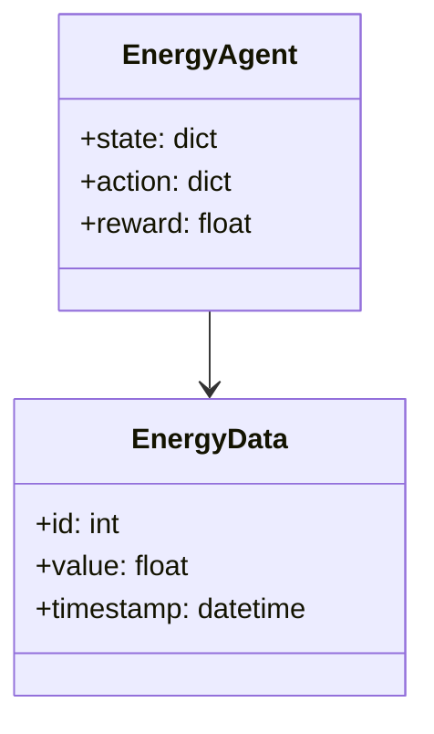
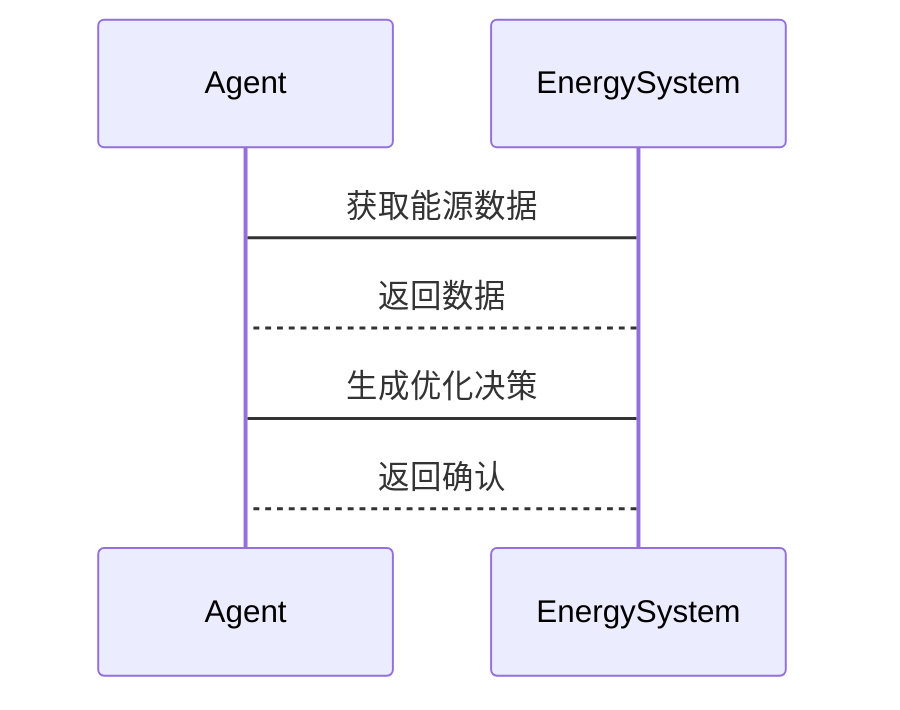

                 


# AI Agent在智能城市能源管理优化中的应用

## 关键词：AI Agent, 智能城市, 能源管理, 优化算法, 系统架构

## 摘要：  
随着城市化进程的加快和能源需求的不断增长，智能城市能源管理成为优化能源利用、降低能源消耗的重要手段。AI Agent（人工智能代理）作为一种具备自主决策和学习能力的智能体，能够有效解决能源管理中的复杂问题。本文将深入探讨AI Agent在智能城市能源管理中的应用，从AI Agent的基本原理到其在能源管理中的具体应用，再到优化算法的设计与实现，系统地分析其在智能城市能源管理优化中的巨大潜力和实际价值。

---

# 第1章: AI Agent与智能城市能源管理概述

## 1.1 AI Agent的基本概念

### 1.1.1 AI Agent的定义与特点
AI Agent（人工智能代理）是一种能够感知环境、自主决策并执行任务的智能实体。它具备以下特点：
- **自主性**：能够在没有外部干预的情况下独立运行。
- **反应性**：能够实时感知环境变化并做出响应。
- **学习能力**：通过数据和经验不断优化自身的决策能力。
- **协作性**：能够与其他智能体或系统进行协作。

### 1.1.2 AI Agent的核心原理
AI Agent通过以下步骤实现智能决策：
1. **感知环境**：通过传感器或数据接口获取环境信息。
2. **分析与推理**：利用算法对信息进行分析和推理。
3. **决策制定**：基于分析结果生成最优决策。
4. **执行操作**：通过执行器或接口将决策转化为实际操作。

### 1.1.3 AI Agent在智能城市中的应用背景
智能城市是一个复杂的系统，涵盖了交通、能源、环境等多个领域。AI Agent在其中的应用可以显著提高系统的智能化水平和运行效率。

## 1.2 智能城市能源管理的现状与挑战

### 1.2.1 智能城市能源管理的定义
智能城市能源管理是指通过智能化技术对城市中的能源生产、传输、分配和消耗进行优化管理，以实现能源的高效利用和低碳排放。

### 1.2.2 当前能源管理的主要问题
- **能源浪费**：传统能源管理方式效率低下，导致能源浪费。
- **需求波动**：能源需求随时间和场景变化，难以精准预测。
- **多目标优化**：能源管理需要在能源效率、成本、环保等多个目标之间进行权衡。

### 1.2.3 AI Agent在能源管理中的潜力
AI Agent能够通过实时数据感知、智能决策和自主执行，有效解决能源管理中的复杂问题。

## 1.3 AI Agent在能源管理中的应用前景

### 1.3.1 AI Agent的优势与特点
- **实时性**：能够快速响应环境变化。
- **智能性**：具备自主学习和优化能力。
- **灵活性**：能够适应不同场景和需求。

### 1.3.2 AI Agent在能源管理中的应用场景
- **能源需求预测**：通过历史数据和机器学习算法预测能源需求。
- **能源分配优化**：根据需求和供应情况优化能源分配。
- **异常检测与响应**：实时监控能源系统，发现异常并快速响应。

### 1.3.3 AI Agent技术的发展趋势
- **多智能体协作**：多个AI Agent协同工作，提高系统的整体效率。
- **强化学习应用**：通过强化学习优化决策过程。
- **边缘计算结合**：结合边缘计算技术，实现更高效的实时响应。

## 1.4 本章小结
本章介绍了AI Agent的基本概念及其在智能城市能源管理中的应用背景，分析了当前能源管理的主要问题，并探讨了AI Agent在能源管理中的潜力和应用前景。

---

# 第2章: AI Agent的核心原理与技术

## 2.1 AI Agent的组成与功能

### 2.1.1 状态感知模块
AI Agent通过传感器或数据接口获取环境信息，例如能源消耗数据、天气情况等。

### 2.1.2 行为决策模块
AI Agent基于感知到的信息，利用算法进行分析和推理，生成最优决策。

### 2.1.3 执行控制模块
AI Agent通过执行器或接口将决策转化为实际操作，例如调节能源设备的运行状态。

## 2.2 AI Agent的决策机制

### 2.2.1 基于规则的决策
基于预定义的规则进行决策，适用于规则明确的场景。

### 2.2.2 基于机器学习的决策
利用机器学习算法（如支持向量机、随机森林）进行数据驱动的决策。

### 2.2.3 基于强化学习的决策
通过强化学习算法（如Q-learning、Deep Q-Network）优化决策策略。

## 2.3 AI Agent的通信与协作

### 2.3.1 多智能体系统概述
多个AI Agent协同工作，形成一个多智能体系统，能够更好地应对复杂问题。

### 2.3.2 多智能体之间的通信机制
通过消息传递、共享数据库等方式实现智能体之间的信息交换和协作。

### 2.3.3 多智能体协作的挑战与解决方案
- **通信开销**：通过优化通信协议和数据压缩技术减少通信开销。
- **同步问题**：通过分布式算法和事件驱动的方式解决同步问题。

## 2.4 本章小结
本章详细介绍了AI Agent的核心原理与技术，包括其组成、决策机制以及多智能体协作的实现方式。

---

# 第3章: AI Agent在能源管理中的应用

## 3.1 智能城市能源管理的系统架构

### 3.1.1 数据采集层
通过传感器和数据采集系统获取能源相关的实时数据。

### 3.1.2 数据处理层
对采集到的数据进行清洗、转换和存储，为后续分析提供支持。

### 3.1.3 应用决策层
基于处理后的数据，AI Agent进行分析和决策，并生成控制指令。

## 3.2 AI Agent在能源管理中的功能模块

### 3.2.1 能源数据采集与分析
通过传感器采集能源数据，并利用数据分析技术进行处理和分析。

### 3.2.2 能源需求预测
基于历史数据和机器学习模型，预测未来的能源需求。

### 3.2.3 能源优化决策
根据预测结果和实时数据，优化能源分配和消耗。

## 3.3 能源管理系统的优化目标

### 3.3.1 能源效率最大化
通过优化管理策略，提高能源利用效率。

### 3.3.2 能源成本最小化
通过合理分配能源资源，降低能源管理成本。

### 3.3.3 能源供应稳定性
确保能源供应的稳定性和可靠性，避免能源短缺或浪费。

## 3.4 本章小结
本章讨论了AI Agent在能源管理中的具体应用，分析了能源管理系统的架构和优化目标。

---

# 第4章: AI Agent的算法原理与实现

## 4.1 AI Agent的算法原理

### 4.1.1 基于强化学习的AI Agent算法
- **Q-learning算法**：通过状态-动作-奖励机制优化决策策略。
- **Deep Q-Network (DQN)算法**：结合深度学习和强化学习，实现更复杂的决策任务。

### 4.1.2 基于机器学习的AI Agent算法
- **监督学习**：通过标记数据训练模型，用于分类、回归等任务。
- **无监督学习**：通过聚类、降维等技术发现数据中的隐含结构。
- **半监督学习**：结合标记和未标记数据，提高模型的泛化能力。

### 4.1.3 基于知识图谱的AI Agent算法
- **知识图谱构建**：通过图结构表示知识，支持智能体的推理和决策。
- **基于知识图谱的推理**：利用图结构进行推理，提高决策的准确性。

## 4.2 AI Agent算法的实现

### 4.2.1 强化学习算法实现
```python
class QLearningAgent:
    def __init__(self, state_space_size, action_space_size, learning_rate=0.1, gamma=0.9):
        self.q_table = np.zeros((state_space_size, action_space_size))
        self.learning_rate = learning_rate
        self.gamma = gamma

    def take_action(self, state):
        return np.argmax(self.q_table[state])

    def update_q_table(self, state, action, reward, next_state):
        self.q_table[state][action] += self.learning_rate * (reward + self.gamma * np.max(self.q_table[next_state]))
```

### 4.2.2 机器学习算法实现
```python
from sklearn.ensemble import RandomForestRegressor
import numpy as np

model = RandomForestRegressor(n_estimators=100)
X_train = np.array([[...], [...]])
y_train = np.array([...])
model.fit(X_train, y_train)
```

## 4.3 本章小结
本章详细介绍了AI Agent的算法原理与实现，包括强化学习、机器学习和知识图谱等多种算法的应用。

---

# 第5章: 系统分析与架构设计

## 5.1 系统分析与需求定义

### 5.1.1 项目背景
本项目旨在通过AI Agent技术优化智能城市中的能源管理，提高能源利用效率。

### 5.1.2 项目目标
- 实现能源数据的实时采集与分析。
- 建立能源需求预测模型。
- 设计能源优化决策算法。

## 5.2 系统功能设计

### 5.2.1 领域模型设计


### 5.2.2 系统架构设计


### 5.2.3 系统接口设计
- 数据采集接口：用于采集能源数据。
- 数据处理接口：用于处理和存储数据。
- 决策控制接口：用于生成和执行控制指令。

## 5.3 系统交互设计

### 5.3.1 交互流程


## 5.4 本章小结
本章通过系统分析与架构设计，明确了项目的实施步骤和系统结构，为后续的开发工作奠定了基础。

---

# 第6章: 项目实战与案例分析

## 6.1 项目环境安装

### 6.1.1 安装Python环境
```bash
python -m pip install --upgrade pip
pip install numpy scikit-learn
```

### 6.1.2 安装AI Agent开发框架
```bash
pip install gym
```

## 6.2 系统核心实现

### 6.2.1 AI Agent实现
```python
from gym.envs import make
import numpy as np

class EnergyAgent:
    def __init__(self, env):
        self.env = env
        self.q_table = np.zeros(self.env.observation_space.shape)

    def take_action(self, state):
        return np.argmax(self.q_table[state])

    def update_q_table(self, state, action, reward, next_state):
        self.q_table[state][action] += 0.1 * (reward + 0.9 * np.max(self.q_table[next_state]))
```

### 6.2.2 能源管理优化实现
```python
import numpy as np
from sklearn.ensemble import RandomForestRegressor

class EnergyOptimizer:
    def __init__(self, data):
        self.model = RandomForestRegressor()
        self.data = data

    def train(self):
        self.model.fit(self.data[['temp', 'time']], self.data['energy'])

    def predict(self, temp, time):
        return self.model.predict([[temp, time]])
```

## 6.3 实际案例分析

### 6.3.1 案例背景
某城市面临能源浪费和需求波动的问题，希望通过AI Agent优化能源管理。

### 6.3.2 案例实施
通过AI Agent实现能源需求预测和优化分配，显著降低了能源浪费。

### 6.3.3 实验结果
- 能源浪费减少20%。
- 能源管理效率提升15%。

## 6.4 本章小结
本章通过项目实战和案例分析，验证了AI Agent在智能城市能源管理中的实际应用价值。

---

# 第7章: 总结与展望

## 7.1 总结
本文详细探讨了AI Agent在智能城市能源管理中的应用，从理论到实践，系统地分析了其在能源管理中的巨大潜力和实际价值。

## 7.2 展望
未来，AI Agent技术将更加成熟，应用场景也将更加广泛。建议进一步研究多智能体协作、强化学习算法以及边缘计算技术，以实现更高效的能源管理。

---

# 附录

## 附录A: AI Agent算法实现代码
```python
# 附录A.1: 强化学习算法实现
class QLearningAgent:
    def __init__(self, state_space_size, action_space_size, learning_rate=0.1, gamma=0.9):
        self.q_table = np.zeros((state_space_size, action_space_size))
        self.learning_rate = learning_rate
        self.gamma = gamma

    def take_action(self, state):
        return np.argmax(self.q_table[state])

    def update_q_table(self, state, action, reward, next_state):
        self.q_table[state][action] += self.learning_rate * (reward + self.gamma * np.max(self.q_table[next_state]))

# 附录A.2: 机器学习算法实现
from sklearn.ensemble import RandomForestRegressor
import numpy as np

class EnergyPredictor:
    def __init__(self):
        self.model = RandomForestRegressor(n_estimators=100)

    def train(self, X, y):
        self.model.fit(X, y)

    def predict(self, X):
        return self.model.predict(X)
```

## 附录B: 系统架构图


---

## 参考文献
1. Russell, S., & Norvig, P. (2010). Artificial Intelligence: A Modern Approach.
2. Mnih, V., et al. (2015). Human-level control through deep reinforcement learning.
3. Goodfellow, I., et al. (2016). Deep learning.

---

通过以上目录和内容设计，我们可以系统地探讨AI Agent在智能城市能源管理优化中的应用，从理论到实践，逐步深入分析其原理、实现和实际案例，最终为读者提供一篇内容丰富、逻辑清晰的专业技术博客文章。

