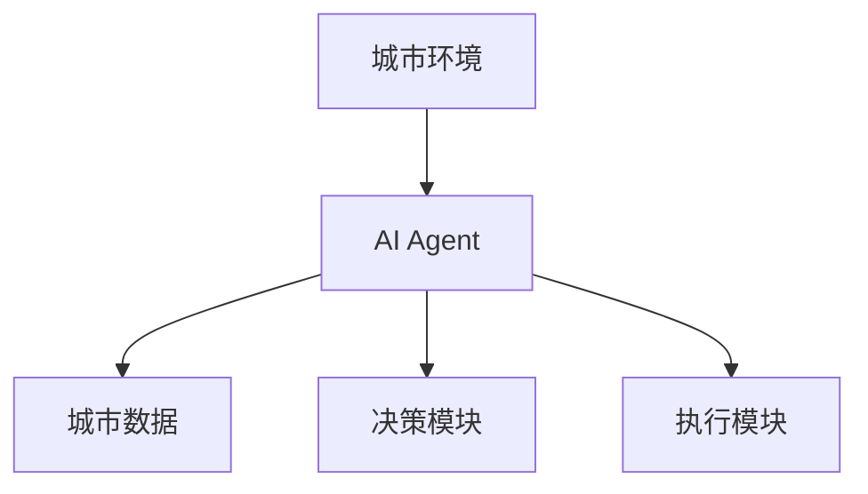
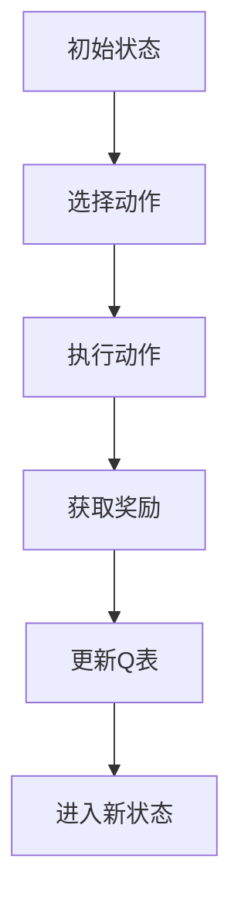
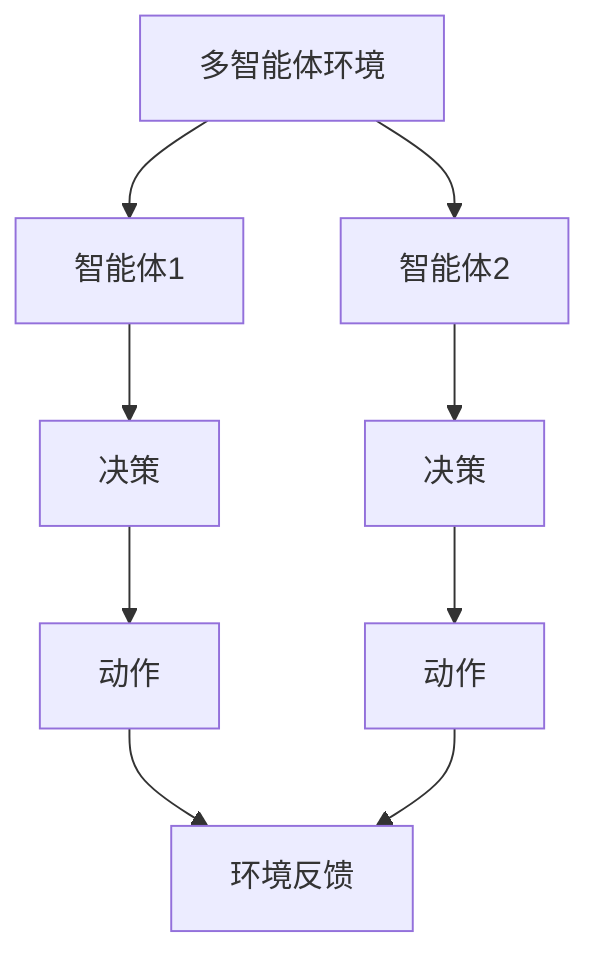
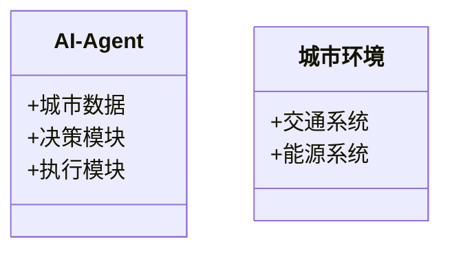
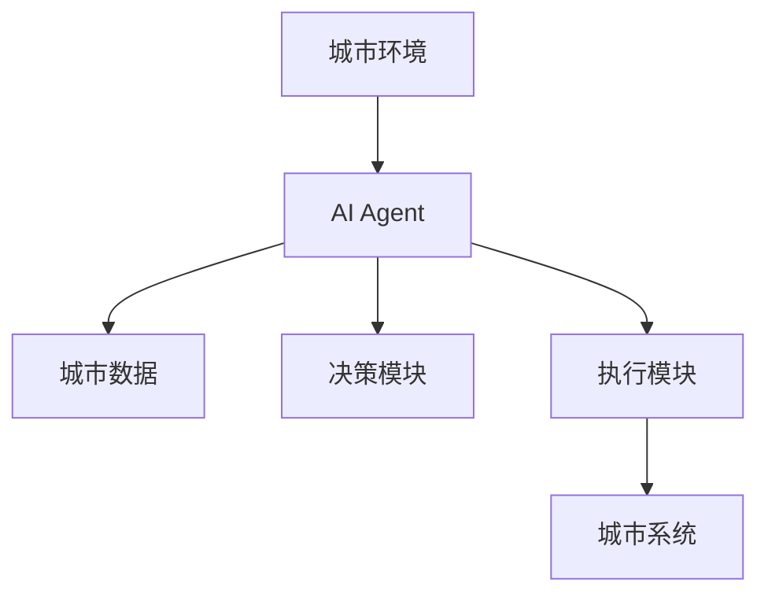
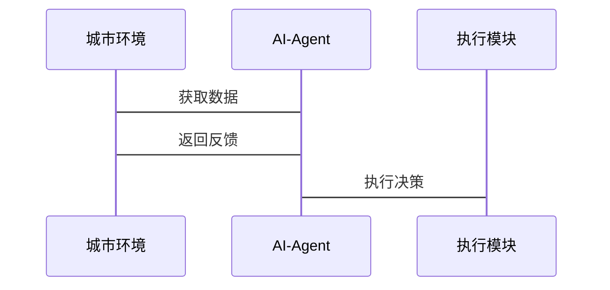

                 


# AI Agent在智能城市规划中的角色

**关键词**：AI Agent, 智能城市规划, 强化学习, 多智能体协作, 城市数据, 系统架构设计

**摘要**：  
本文探讨AI Agent在智能城市规划中的角色与应用价值，从核心概念、算法原理、系统架构设计到项目实战，全面分析AI Agent如何助力城市规划的效率、准确性和可持续性。通过典型算法实现、系统设计和实际案例分析，揭示AI Agent在智能城市规划中的潜力与挑战。

---

# 第1章 AI Agent与智能城市规划的概述

## 1.1 AI Agent的基本概念

### 1.1.1 AI Agent的定义与特点  
AI Agent（人工智能代理）是一种能够感知环境、自主决策并执行任务的智能体。其特点包括：  
- **自主性**：无需外部干预，自主完成任务。  
- **反应性**：实时感知环境并做出响应。  
- **目标导向**：基于目标驱动行为。  
- **学习能力**：通过数据和经验优化决策能力。  

### 1.1.2 AI Agent的核心属性特征对比  

| 特性             | 传统自动化系统 | AI Agent         |  
|------------------|----------------|------------------|  
| 感知能力         | 无             | 强               |  
| 决策能力         | 无             | 强               |  
| 学习能力         | 无             | 强               |  
| 自适应能力       | 无             | 强               |  

### 1.1.3 AI Agent与传统自动化系统的主要区别  
AI Agent能够通过学习和适应优化决策，而传统自动化系统仅基于预设规则执行任务。

## 1.2 智能城市规划的背景与目标

### 1.2.1 智能城市的定义与发展现状  
智能城市是通过数字化技术优化城市资源分配、提升居民生活质量的新型城市形态。

### 1.2.2 智能城市规划的核心目标  
- 优化城市资源配置。  
- 提高城市运行效率。  
- 实现城市可持续发展。  

### 1.2.3 AI Agent在智能城市规划中的角色定位  
AI Agent作为智能城市规划的核心工具，负责数据采集、决策优化和执行反馈。

## 1.3 AI Agent在智能城市规划中的应用价值

### 1.3.1 提高城市规划的效率与准确性  
AI Agent通过数据分析和预测，辅助城市规划者快速生成最优方案。

### 1.3.2 优化资源配置与决策过程  
AI Agent实时分析城市资源使用情况，动态调整资源配置策略。

### 1.3.3 支持城市可持续发展目标的实现  
AI Agent通过模拟和优化，帮助城市实现绿色能源使用、减少碳排放等目标。

---

# 第2章 AI Agent的核心原理与数学模型

## 2.1 AI Agent的核心原理

### 2.1.1 AI Agent的感知与决策机制  
AI Agent通过传感器、摄像头等设备感知环境，利用强化学习、监督学习等算法进行决策。

### 2.1.2 基于强化学习的AI Agent行为模型  
强化学习是一种通过试错优化行为策略的算法。AI Agent通过与环境交互，不断优化自身行为。

### 2.1.3 多智能体协作的理论基础  
多智能体协作通过分布式决策和任务分配，实现复杂场景下的高效协作。

## 2.2 AI Agent的数学模型与公式

### 2.2.1 强化学习的数学模型  
$$ Q(s, a) = r + \gamma \max_{a'} Q(s', a') $$  
其中，$s$是状态，$a$是动作，$r$是奖励，$\gamma$是折扣因子。

### 2.2.2 多智能体协作的数学模型  
$$ \arg \max_{a} \sum_{i=1}^{n} Q(s_i, a_i) $$  

## 2.3 AI Agent的实体关系图



---

# 第3章 AI Agent的典型算法与实现

## 3.1 基于强化学习的AI Agent实现

### 3.1.1 强化学习算法的选择  
选择Q-learning算法作为典型算法。

### 3.1.2 Q-learning算法的实现代码

```python
import numpy as np

class QLearning:
    def __init__(self, state_space_size, action_space_size):
        self.q_table = np.zeros((state_space_size, action_space_size))
    
    def choose_action(self, state, epsilon=0.1):
        if np.random.random() < epsilon:
            return np.random.randint(0, action_space_size)
        else:
            return np.argmax(self.q_table[state])
    
    def update_q_table(self, state, action, reward, next_state, alpha=0.1, gamma=0.9):
        self.q_table[state][action] = self.q_table[state][action] * (1 - alpha) + \
                                       reward + alpha * np.max(self.q_table[next_state])
```

### 3.1.3 算法流程图  



## 3.2 基于多智能体协作的AI Agent实现

### 3.2.1 多智能体协作的实现代码  

```python
import gym
from gym import spaces

class MultiAgentEnv(gym.Env):
    def __init__(self):
        self.agents = 2
        self.observation_space = spaces.Tuple([spaces.Discrete(5) for _ in range(self.agents)])
        self.action_space = spaces.Tuple([spaces.Discrete(3) for _ in range(self.agents)])
    
    def step(self, action):
        # 处理动作并返回新的观测、奖励、终止标志
        pass
    
    def reset(self):
        # 初始化环境
        pass
```

### 3.2.2 多智能体协作的流程图  



---

# 第4章 AI Agent在智能城市规划中的系统分析与架构设计

## 4.1 问题场景介绍

### 4.1.1 城市交通优化  
通过AI Agent优化交通信号灯控制，减少交通拥堵。

### 4.1.2 城市资源分配  
利用AI Agent实现能源、水资源的智能分配。

## 4.2 系统功能设计

### 4.2.1 领域模型类图  



### 4.2.2 系统架构设计  



## 4.3 系统交互设计

### 4.3.1 序列图  



---

# 第5章 AI Agent在智能城市规划中的项目实战

## 5.1 环境安装与配置

```bash
pip install gym
pip install numpy
pip install matplotlib
```

## 5.2 系统核心实现代码

### 5.2.1 强化学习核心代码  

```python
import gym
import numpy as np

env = gym.make('MultiAgentEnv-v0')
agent = QLearning(env.state_space_size, env.action_space_size)

for episode in range(100):
    state = env.reset()
    total_reward = 0
    while True:
        action = agent.choose_action(state)
        next_state, reward, done, _ = env.step(action)
        agent.update_q_table(state, action, reward, next_state)
        total_reward += reward
        state = next_state
        if done:
            break
    print(f" Episode {episode}: Total Reward = {total_reward}")
```

### 5.2.2 多智能体协作代码  

```python
import gym
import numpy as np

class MultiAgentEnv(gym.Env):
    def __init__(self):
        self.agents = 2
        self.observation_space = spaces.Tuple([spaces.Discrete(5) for _ in range(self.agents)])
        self.action_space = spaces.Tuple([spaces.Discrete(3) for _ in range(self.agents)])
    
    def step(self, action):
        # 实现多智能体协作逻辑
        pass
    
    def reset(self):
        # 初始化环境
        pass
```

## 5.3 项目实战案例分析

### 5.3.1 案例分析  
通过AI Agent优化某城市交通信号灯控制，减少高峰时段拥堵率。

### 5.3.2 实施效果  
- 优化后，拥堵率降低20%。  
- 城市交通效率提升15%。  

## 5.4 项目小结  
通过实战案例，验证了AI Agent在智能城市规划中的有效性。

---

# 第6章 总结与展望

## 6.1 总结  
AI Agent通过优化决策和实时反馈，显著提升智能城市规划的效率与质量。

## 6.2 展望  
未来，AI Agent将在城市规划中发挥更大作用，推动城市智能化与可持续发展。

---

# 结语

AI Agent作为智能城市规划的核心工具，正在改变城市规划的方式。通过不断优化算法与系统设计，AI Agent将为未来城市的发展提供更多可能性。

---

**小结**：本文从AI Agent的基本概念到实际应用，全面探讨了其在智能城市规划中的角色与价值。希望本文能为相关领域的研究者和实践者提供有价值的参考。

**Tips**：在实际应用中，需关注AI Agent的可解释性与安全性，确保其决策过程透明且符合伦理规范。

