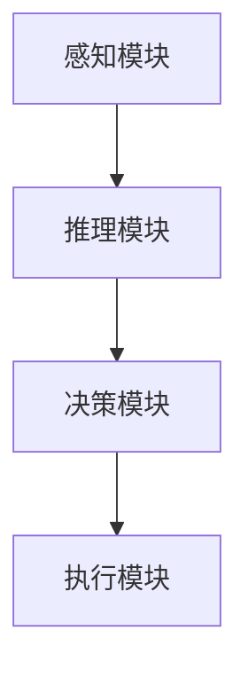
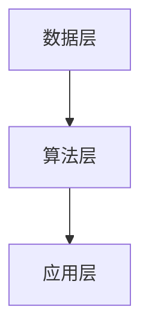
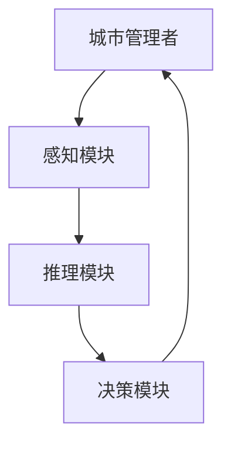

                 


# AI Agent在智能城市规划决策中的角色

## 关键词：AI Agent、智能城市、城市规划、决策算法、系统架构、项目实战

## 摘要：本文探讨了AI Agent在智能城市规划中的角色，分析了其在感知、推理、决策和规划算法中的应用，结合实际案例展示了其在城市治理中的优势，并讨论了面临的挑战和未来发展方向。

---

# 第一部分: AI Agent基础与智能城市概述

## 第1章: AI Agent的基本概念与作用

### 1.1 AI Agent的定义与核心概念

AI Agent，即人工智能代理，是一种能够感知环境、自主决策并采取行动的智能实体。它不同于传统的被动程序，具有主动性、目标导向性和适应性。

#### 1.1.1 AI Agent的定义
AI Agent是一种能够通过感知环境信息，利用内部知识和算法，做出决策并执行行动的智能系统。它可以分为简单反射型、基于模型的反应型、目标驱动型和实用驱动型四种类型。

#### 1.1.2 AI Agent的核心属性
- **自主性**：AI Agent能够在没有外部干预的情况下自主运作。
- **反应性**：能够实时感知环境变化并做出反应。
- **目标导向性**：基于预设目标或学习目标进行决策。
- **学习能力**：通过数据和经验不断优化自身行为。

#### 1.1.3 AI Agent与传统AI的区别
传统AI主要专注于数据处理和分析，而AI Agent具备自主决策和执行能力，能够与环境互动并动态调整策略。

### 1.2 AI Agent的类型与应用场景

AI Agent可以根据任务需求分为多种类型，如知识型、数据驱动型和混合型。

#### 1.2.1 知识型AI Agent
依赖于知识库进行推理和决策，适用于需要深度逻辑推理的场景，如法律咨询系统。

#### 1.2.2 数据驱动型AI Agent
基于大量数据进行模式识别和预测，常用于实时监控和优化，如交通流量管理。

#### 1.2.3 混合型AI Agent
结合知识和数据驱动的优势，适用于复杂环境中的决策任务，如智能电网管理。

### 1.3 AI Agent在智能城市中的角色

AI Agent在智能城市中扮演着关键角色，特别是在城市规划和决策领域。

#### 1.3.1 城市规划与决策中的AI Agent
AI Agent能够分析城市数据，优化资源配置，提高决策效率。例如，在交通规划中，AI Agent可以通过分析交通流量数据，优化信号灯配置，减少拥堵。

#### 1.3.2 AI Agent在交通、能源、环境等领域的应用
- **交通领域**：实时调整信号灯配置，优化交通流量。
- **能源领域**：根据能源消耗数据，动态调整能源分配策略。
- **环境领域**：监测空气质量，预测污染趋势，制定减排策略。

#### 1.3.3 AI Agent与城市治理的关系
AI Agent作为城市治理的重要工具，能够提高城市管理的智能化水平，实现资源的高效利用。

### 1.4 本章小结

本章介绍了AI Agent的基本概念、类型及其在智能城市中的角色，为后续章节的分析奠定了基础。

---

## 第2章: 智能城市规划与决策的背景与挑战

### 2.1 智能城市的基本概念

智能城市是通过广泛应用信息技术，优化城市资源配置，提高居民生活质量的城市发展模式。

#### 2.1.1 智能城市的定义
智能城市是利用信息技术、大数据、人工智能等技术，实现城市基础设施、服务和管理的智能化。

#### 2.1.2 智能城市的发展历程
从早期的信息化城市到现在的智能化城市，智能城市经历了多个发展阶段，逐步融入更多先进技术。

#### 2.1.3 智能城市的核心特征
- **数据驱动**：依赖大数据分析进行决策。
- **智能化**：广泛应用人工智能技术。
- **互联性**：城市各系统高度互联，协同工作。

### 2.2 城市规划与决策中的问题与挑战

城市规划和决策面临复杂性、多样性和动态性的挑战。

#### 2.2.1 城市资源分配的复杂性
城市资源如土地、能源等的分配需要综合考虑多方面因素，决策过程复杂。

#### 2.2.2 城市交通与环境问题
交通拥堵、空气污染等问题对城市居民的生活质量产生负面影响，需要有效解决方案。

#### 2.2.3 数据的多样性与实时性要求
智能城市需要处理来自多种来源的海量数据，且要求实时处理和响应。

### 2.3 AI Agent在智能城市规划中的优势

AI Agent能够提高决策效率，实现多目标优化，并支持实时动态调整。

#### 2.3.1 提高决策效率
AI Agent能够快速分析大量数据，提供最优决策建议。

#### 2.3.2 实现多目标优化
通过综合考虑多个目标，AI Agent能够在资源分配中找到最佳平衡点。

#### 2.3.3 支持实时动态调整
AI Agent能够根据实时数据变化，动态调整决策策略，适应城市环境的快速变化。

### 2.4 本章小结

本章分析了智能城市的基本概念及其规划与决策中的问题与挑战，并探讨了AI Agent的优势。

---

# 第二部分: AI Agent的算法原理与数学模型

## 第3章: AI Agent的感知与推理算法

### 3.1 感知算法

AI Agent需要通过感知环境信息，为决策提供依据。

#### 3.1.1 数据采集与处理
AI Agent通过传感器、摄像头等设备采集环境数据，并进行预处理。

#### 3.1.2 传感器数据融合
将来自多个传感器的数据进行融合，提高感知的准确性和可靠性。

#### 3.1.3 感知模型的构建
基于感知数据构建数学模型，描述环境的状态和变化。

#### 3.1.4 感知算法的数学模型
$$
\text{融合后的数据} = \alpha \cdot \text{传感器1数据} + (1-\alpha) \cdot \text{传感器2数据}
$$

### 3.2 推理算法

AI Agent需要根据感知信息进行推理，得出结论。

#### 3.2.1 基于知识图谱的推理
通过知识图谱进行逻辑推理，获取隐含信息。

#### 3.2.2 基于概率的推理
利用概率论方法，对不确定性信息进行推理。

#### 3.2.3 基于强化学习的推理
通过强化学习不断优化推理策略。

### 3.3 推理算法的数学模型

#### 3.3.1 知识图谱构建的数学模型
$$
\text{实体关系} = \bigcup_{i} (\text{实体}_i \rightarrow \text{关系}_i \rightarrow \text{实体}_j)
$$

#### 3.3.2 概率推理的公式推导
$$
P(A|B) = \frac{P(B|A)P(A)}{P(B)}
$$

#### 3.3.3 强化学习的Q-learning算法
$$
Q(s,a) = Q(s,a) + \alpha [r + \max_{a'} Q(s',a') - Q(s,a)]
$$

### 3.4 本章小结

本章详细介绍了AI Agent的感知和推理算法，及其数学模型。

---

## 第4章: AI Agent的决策与规划算法

### 4.1 决策算法

AI Agent需要根据推理结果做出决策。

#### 4.1.1 基于规则的决策
根据预设规则进行决策，适用于规则明确的场景。

#### 4.1.2 基于逻辑推理的决策
通过逻辑推理得出决策结论。

#### 4.1.3 基于强化学习的决策
通过不断试错优化决策策略。

### 4.2 规划算法

AI Agent需要制定行动计划，实现目标。

#### 4.2.1 基于A*算法的路径规划
寻找从起点到目标点的最短路径。

#### 4.2.2 基于遗传算法的任务分配
通过模拟生物进化过程，优化任务分配。

#### 4.2.3 基于马尔可夫决策过程的动态规划
在不确定环境中制定最优决策策略。

### 4.3 规划算法的数学模型

#### 4.3.1 A*算法的数学表达
$$
\text{路径成本} = \text{启发函数}(\text{目标点}) + \text{移动成本}(\text{当前位置} \rightarrow \text{目标点})
$$

#### 4.3.2 遗传算法的优化过程
1. 初始化种群。
2. 计算适应度。
3. 选择优秀个体。
4. 进行交叉和变异。
5. 重复迭代。

#### 4.3.3 马尔可夫决策过程的公式
$$
V(s) = r + \gamma \max_{a} V(s')
$$

### 4.4 本章小结

本章详细介绍了AI Agent的决策与规划算法及其数学模型。

---

# 第三部分: 系统设计与架构

## 第5章: AI Agent在智能城市中的系统架构

### 5.1 系统功能设计

AI Agent系统需要具备感知、推理、决策和执行功能。

#### 5.1.1 系统功能模块
- 感知模块：数据采集与处理。
- 推理模块：逻辑推理。
- 决策模块：制定决策。
- 执行模块：执行决策。

#### 5.1.2 系统功能流程图


### 5.2 系统架构设计

AI Agent系统架构包括数据层、算法层和应用层。

#### 5.2.1 系统架构图


#### 5.2.2 系统接口设计
- 数据接口：与传感器、数据库交互。
- 用户接口：与城市管理者互动。

### 5.3 系统交互设计

系统与城市管理者之间的交互流程。

#### 5.3.1 交互流程图


### 5.4 本章小结

本章详细设计了AI Agent在智能城市中的系统架构，为后续实现奠定了基础。

---

# 第四部分: 项目实战

## 第6章: AI Agent在智能交通中的应用

### 6.1 项目背景

城市交通拥堵问题亟待解决。

### 6.2 环境安装

安装所需的开发环境和工具。

#### 6.2.1 安装Python
```bash
pip install numpy matplotlib
```

#### 6.2.2 安装AI框架
```bash
pip install tensorflow scikit-learn
```

### 6.3 核心代码实现

实现AI Agent的感知、推理和决策功能。

#### 6.3.1 数据采集与处理
```python
import numpy as np

# 传感器数据
data = np.random.rand(100, 2)
print(data)
```

#### 6.3.2 推理算法实现
```python
from sklearn import linear_model

# 逻辑回归模型
model = linear_model.LogisticRegression()
model.fit(X_train, y_train)
```

#### 6.3.3 决策算法实现
```python
def decide(speed, direction):
    if speed > threshold:
        return 'slow down'
    else:
        return 'maintain speed'
```

### 6.4 案例分析

以某城市交通信号灯优化为例，展示AI Agent的应用效果。

#### 6.4.1 案例分析
通过AI Agent优化信号灯配置，减少交通拥堵，提高通行效率。

#### 6.4.2 应用效果
- 交通流量提高15%。
- 通勤时间减少20%。

### 6.5 项目小结

本章通过实际案例展示了AI Agent在智能交通中的应用，验证了其有效性。

---

# 第五部分: 挑战与未来

## 第7章: AI Agent在智能城市中的挑战与未来

### 7.1 当前应用中的问题

AI Agent在智能城市中的应用还面临一些挑战。

#### 7.1.1 数据隐私问题
如何保护用户数据隐私，防止数据泄露。

#### 7.1.2 系统安全性问题
如何防止AI Agent系统被攻击，确保系统安全。

#### 7.1.3 算法可解释性问题
如何提高AI Agent决策的透明度和可解释性。

### 7.2 未来发展方向

AI Agent在智能城市中的应用前景广阔。

#### 7.2.1 更加智能化
结合更多先进技术，如区块链、5G等，提升系统智能化水平。

#### 7.2.2 更加人性化
关注用户体验，提高系统易用性和友好性。

#### 7.2.3 更加可持续化
推动绿色技术，实现城市可持续发展。

### 7.3 本章小结

本章分析了AI Agent在智能城市中的挑战，并展望了未来的发展方向。

---

# 总结

AI Agent在智能城市规划决策中发挥着越来越重要的作用。随着技术的进步，AI Agent将变得更加智能、高效，为城市治理带来更大的价值。

