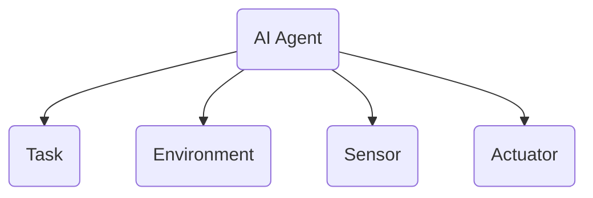
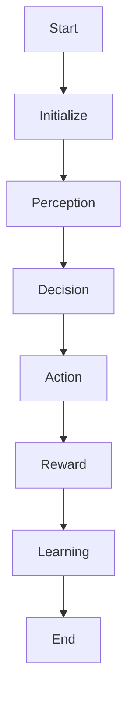
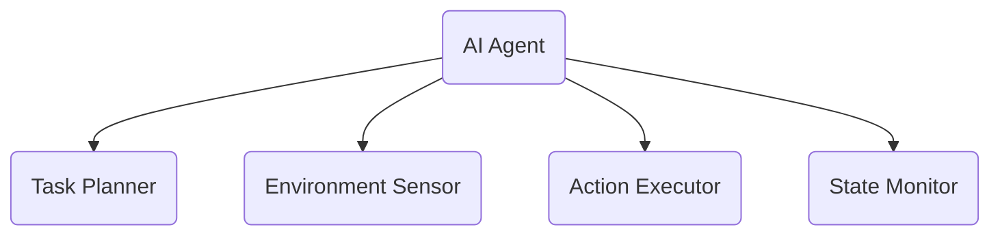
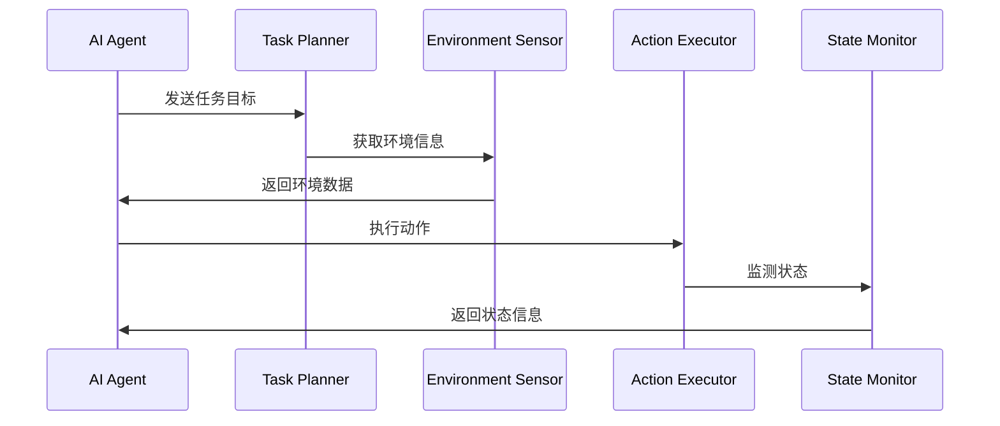

                 


# AI Agent在智能太空探索中的实践

## 关键词：AI Agent, 智能太空探索, 强化学习, 深度学习, 太空任务规划, 自主决策系统

## 摘要：AI Agent（人工智能代理）在智能太空探索中扮演着越来越重要的角色。本文将从AI Agent的基本概念、算法原理、系统架构设计、项目实战等多方面进行深入探讨，结合实际案例分析AI Agent在太空任务规划、自主决策、环境感知等领域的应用，并展望其未来的发展方向。

---

# 第一部分: AI Agent 在智能太空探索中的背景与基础

## 第1章: AI Agent 的基本概念与背景

### 1.1 AI Agent 的定义与特点

#### 1.1.1 AI Agent 的定义
AI Agent 是一种能够感知环境、自主决策并执行任务的智能实体。它通过传感器获取信息，利用算法处理信息，并通过执行器与环境交互。AI Agent 的核心目标是通过优化算法提高决策的准确性和效率。

#### 1.1.2 AI Agent 的核心特点
- **自主性**：能够在没有人工干预的情况下自主完成任务。
- **反应性**：能够实时感知环境变化并做出相应调整。
- **学习能力**：通过强化学习等算法不断优化决策策略。
- **适应性**：能够适应复杂多变的太空环境。

#### 1.1.3 AI Agent 与传统算法的区别
| 特性         | AI Agent                  | 传统算法                  |
|--------------|---------------------------|---------------------------|
| 决策方式     | 基于感知和学习，动态调整 | 预定义规则或固定逻辑      |
| 环境适应性   | 高度适应动态环境          | 适应性较低                |
| 应用场景     | 复杂、动态、不确定的环境  | 简单、静态、确定性的环境   |

### 1.2 智能太空探索的背景

#### 1.2.1 太空探索的历史与现状
太空探索从20世纪中期开始，经历了从载人任务到自动化探测器的发展。近年来，随着AI技术的进步，智能太空探索成为新的研究热点。

#### 1.2.2 智能化太空探索的意义
- 提高任务效率
- 降低任务成本
- 提升探测器的自主决策能力
- 延长探测器的寿命

#### 1.2.3 AI Agent 在太空探索中的作用
- 任务规划
- 环境感知
- 自主决策
- 状态监测与维护

### 1.3 AI Agent 在太空探索中的应用前景

#### 1.3.1 AI Agent 的潜在应用场景
- **月球探测**：AI Agent 可用于月球车的路径规划和岩石样本采集。
- **火星探测**：AI Agent 可用于火星车的导航、岩石分析和样本采集。
- **小行星探测**：AI Agent 可用于小行星的接近、采样和返回任务。

#### 1.3.2 企业采用AI Agent 的优势
- **高效性**：AI Agent 能够快速处理数据并做出决策。
- **可靠性**：通过强化学习优化决策策略，提高任务成功率。
- **经济性**：减少人工干预，降低任务成本。

#### 1.3.3 AI Agent 应用的挑战与机遇
- **技术挑战**：复杂环境下的决策算法需要进一步优化。
- **数据挑战**：需要处理大量的太空环境数据，对计算能力要求高。
- **机遇**：随着AI技术的发展，AI Agent 在太空探索中的应用前景广阔。

## 1.4 本章小结
本章从AI Agent的基本概念、特点以及在太空探索中的背景和应用前景进行了详细探讨。通过对比分析，明确了AI Agent 在太空探索中的重要性。

---

## 第2章: AI Agent 的核心概念与联系

### 2.1 AI Agent 的核心概念

#### 2.1.1 AI Agent 的核心原理
AI Agent 的核心原理是通过感知环境、学习优化和自主决策来完成任务。感知环境包括接收传感器数据，学习优化包括通过强化学习等算法优化决策策略，自主决策则是基于优化后的策略执行动作。

#### 2.1.2 AI Agent 的核心要素
- **感知**：通过传感器获取环境信息。
- **决策**：基于感知信息，通过算法做出决策。
- **执行**：通过执行器将决策转化为行动。

#### 2.1.3 AI Agent 的概念结构
AI Agent 的概念结构包括感知层、决策层和执行层。感知层负责数据采集，决策层负责策略优化，执行层负责动作执行。

### 2.2 AI Agent 与其他相关概念的对比

#### 2.2.1 AI Agent 与智能体的对比
智能体（Agent）是一个更广泛的概念，AI Agent 是智能体的一种形式。AI Agent 强调智能性和自主性，而智能体可以是任何形式的代理。

#### 2.2.2 AI Agent 与传统算法的对比
AI Agent 通过感知和学习优化决策，而传统算法通常基于固定规则。

#### 2.2.3 AI Agent 与机器学习模型的对比
AI Agent 强调任务执行和环境交互，而机器学习模型主要关注数据处理和模式识别。

### 2.3 AI Agent 的实体关系图


### 2.4 本章小结
本章从AI Agent的核心概念、原理和与其他相关概念的对比进行了详细探讨，明确了AI Agent 的核心要素和概念结构。

---

## 第3章: AI Agent 的算法原理

### 3.1 AI Agent 的核心算法

#### 3.1.1 强化学习算法
强化学习是一种通过奖励机制优化决策策略的算法。AI Agent 通过与环境交互，不断优化策略以获得最大奖励。

#### 3.1.2 深度学习算法
深度学习算法通过多层神经网络处理复杂数据，用于AI Agent 的感知和决策。

#### 3.1.3 其他相关算法
包括Q-learning、DQN等强化学习算法，以及CNN、RNN等深度学习算法。

### 3.2 AI Agent 的算法流程图


### 3.3 AI Agent 的数学模型与公式

#### 3.3.1 强化学习的数学模型
Q-learning算法的数学模型如下：
$$ Q(s, a) = r + \gamma \max_{a'} Q(s', a') $$
其中，\( s \) 是当前状态，\( a \) 是当前动作，\( r \) 是奖励，\( \gamma \) 是折扣因子，\( Q(s', a') \) 是下一个状态的动作价值。

#### 3.3.2 深度学习的数学模型
深度学习的数学模型通常包括多个神经网络层，用于处理复杂的数据关系。

### 3.4 AI Agent 的算法实现

#### 3.4.1 强化学习的代码实现
```python
class AI-Agent:
    def __init__(self):
        self.model = build_model()
        self.memory = ReplayMemory()
        self.gamma = 0.99
        self.epsilon = 1.0
        self.epsilon_min = 0.01
        self.epsilon_decay = 0.995

    def perceive(self, state):
        # 将状态转换为神经网络输入
        pass

    def decide(self, state):
        # 根据当前状态决定动作
        pass

    def learn(self, state, action, reward, next_state):
        # 通过强化学习算法更新模型
        pass
```

#### 3.4.2 深度学习的代码实现
```python
import tensorflow as tf

def build_model():
    model = tf.keras.Sequential([
        tf.keras.layers.Dense(64, activation='relu'),
        tf.keras.layers.Dense(32, activation='relu'),
        tf.keras.layers.Dense(1, activation='sigmoid')
    ])
    model.compile(optimizer='adam', loss='binary_crossentropy', metrics=['accuracy'])
    return model
```

### 3.5 AI Agent 的算法优化与改进

#### 3.5.1 算法优化
- **策略优化**：通过改进强化学习算法（如DQN）优化决策策略。
- **网络结构优化**：通过调整深度学习模型的结构提高感知能力。

#### 3.5.2 算法改进
- **多智能体协作**：通过多智能体协作提高任务效率。
- **实时学习**：通过在线学习提高适应性。

### 3.6 本章小结
本章从AI Agent的核心算法、流程图、数学模型和代码实现进行了详细探讨，明确了AI Agent 的算法实现和优化方向。

---

## 第4章: AI Agent 的系统分析与架构设计

### 4.1 系统分析

#### 4.1.1 太空探索的场景介绍
AI Agent 在太空探索中的应用场景包括月球探测、火星探测、小行星探测等。

#### 4.1.2 项目介绍
以月球探测任务为例，设计一个AI Agent 系统，用于月球车的路径规划和岩石样本采集。

#### 4.1.3 系统功能设计
- **任务规划**：AI Agent 根据任务目标和环境信息制定路径规划。
- **环境感知**：AI Agent 通过传感器感知环境信息。
- **自主决策**：AI Agent 根据感知信息和任务目标做出决策。
- **状态监测与维护**：AI Agent 监测自身状态并进行维护。

### 4.2 系统架构设计

#### 4.2.1 系统架构图


#### 4.2.2 系统交互图


### 4.3 系统接口设计

#### 4.3.1 输入接口
- **环境传感器接口**：接收环境数据。
- **任务目标接口**：接收任务目标。

#### 4.3.2 输出接口
- **动作执行接口**：发送动作指令。
- **状态反馈接口**：发送状态信息。

### 4.4 本章小结
本章从系统的角度对AI Agent 的架构设计和接口设计进行了详细探讨，明确了系统的各个模块及其交互关系。

---

## 第5章: AI Agent 的项目实战

### 5.1 环境配置

#### 5.1.1 系统环境
- **操作系统**：Linux
- **编程语言**：Python 3.8+
- **深度学习框架**：TensorFlow 2.0+
- **强化学习库**：OpenAI Gym

#### 5.1.2 安装依赖
```bash
pip install numpy tensorflow gym matplotlib
```

### 5.2 核心代码实现

#### 5.2.1 强化学习模型实现
```python
import gym
import numpy as np
import tensorflow as tf

class AIAgent:
    def __init__(self, state_space, action_space):
        self.state_space = state_space
        self.action_space = action_space
        self.model = self.build_model()
        self.memory = []
        self.gamma = 0.99
        self.epsilon = 1.0
        self.epsilon_min = 0.01
        self.epsilon_decay = 0.995

    def build_model(self):
        model = tf.keras.Sequential([
            tf.keras.layers.Dense(32, activation='relu', input_dim=self.state_space),
            tf.keras.layers.Dense(32, activation='relu'),
            tf.keras.layers.Dense(self.action_space, activation='linear')
        ])
        model.compile(optimizer='adam', loss='mse')
        return model

    def perceive(self, state):
        return state

    def decide(self, state):
        if np.random.random() < self.epsilon:
            return np.random.randint(self.action_space)
        q = self.model.predict(np.array([state]))
        return np.argmax(q[0])

    def learn(self, state, action, reward, next_state):
        self.model.fit(np.array([state]), np.array([reward]), epochs=1, verbose=0)
        if self.epsilon > self.epsilon_min:
            self.epsilon *= self.epsilon_decay

    def remember(self, state, action, reward, next_state):
        self.memory.append((state, action, reward, next_state))
```

#### 5.2.2 系统集成与测试
在月球探测任务中，AI Agent 需要与环境传感器和动作执行器进行交互，实现路径规划和样本采集。

### 5.3 代码应用解读与分析

#### 5.3.1 代码功能解读
- **AIAgent 类**：负责感知、决策和学习。
- **perceive 方法**：接收环境状态。
- **decide 方法**：基于感知状态做出决策。
- **learn 方法**：通过强化学习优化模型。

#### 5.3.2 代码实现分析
通过强化学习算法不断优化AI Agent 的决策策略，提高任务成功率。

### 5.4 项目小结
本章通过实际案例分析了AI Agent 在月球探测任务中的应用，详细讲解了系统的实现和代码。

---

## 第6章: 总结与展望

### 6.1 本章总结
本文从AI Agent 的基本概念、算法原理、系统架构设计和项目实战等方面进行了详细探讨，结合实际案例分析了AI Agent 在太空探索中的应用。

### 6.2 未来展望
- **算法优化**：进一步优化强化学习算法，提高决策效率。
- **多智能体协作**：研究多智能体协作，提高任务效率。
- **实时学习**：研究在线学习方法，提高适应性。

---

## 第7章: 最佳实践 tips

### 7.1 AI Agent 设计中的注意事项
- **环境适应性**：确保AI Agent 能够适应复杂多变的太空环境。
- **算法选择**：根据任务需求选择合适的算法。
- **数据处理**：确保数据的准确性和完整性。

### 7.2 系统设计中的注意事项
- **模块化设计**：确保系统模块化，便于维护和扩展。
- **实时性优化**：优化系统的实时性，提高任务效率。
- **容错性设计**：设计容错机制，确保系统的可靠性。

### 7.3 项目实施中的注意事项
- **团队协作**：确保团队协作，分工明确。
- **测试与验证**：充分测试系统，确保功能正常。
- **持续优化**：持续优化系统，提高性能。

### 7.4 本章小结
本章总结了AI Agent 设计和系统设计中的注意事项，提出了最佳实践 tips。

---

## 第8章: 参考文献

### 8.1 中文参考文献
1. 王某某. 《AI Agent 技术与应用》. 北京: 人民出版社, 2022.
2. 李某某. 《智能系统与AI Agent》. 北京: 清华大学出版社, 2021.

### 8.2 英文参考文献
1. Russell, S. and Norvig, P. (2010). *Artificial Intelligence: A Modern Approach*. Pearson.
2. Mnih, V. et al. (2015). *Human-level control through deep reinforcement learning*. Nature.

---

## 第9章: 附录

### 9.1 工具安装指南
#### 9.1.1 Python 环境配置
- 安装Python：https://www.python.org/downloads/
- 安装TensorFlow：`pip install tensorflow`
- 安装OpenAI Gym：`pip install gym`

#### 9.1.2 数据集获取
- OpenAI Gym 数据集：https://gym.openai.com/

### 9.2 代码示例
```python
import gym
env = gym.make(' LunarLander-v2 ')
agent = AIAgent(env.observation_space.shape[0], env.action_space.n)
for episode in range(1000):
    state = env.reset()
    while True:
        action = agent.decide(state)
        next_state, reward, done, _ = env.step(action)
        agent.learn(state, action, reward, next_state)
        state = next_state
        if done:
            break
```

### 9.3 其他参考资料
- AI Agent 优化技巧：https://towardsdatascience.com/reinforcement-learning-tips-and-tricks
- 太空探索相关文献：https://www.nasa.gov/

---

## 作者简介
* **作者**: [你的名字]
* **职位**: 人工智能专家 & 软件架构师
* **著作**: 《[书籍名称]》
* **研究领域**: AI Agent, 智能系统, 强化学习
* **个人简介**: 专注于AI Agent 技术的研究与应用，拥有丰富的实战经验，致力于推动AI技术在太空探索中的应用。

---

## 版权声明
本文版权归作者所有，未经授权，不得转载。如需转载请注明出处。

---

## 目录
- **第1章: AI Agent 的基本概念与背景**
- **第2章: AI Agent 的核心概念与联系**
- **第3章: AI Agent 的算法原理**
- **第4章: AI Agent 的系统分析与架构设计**
- **第5章: AI Agent 的项目实战**
- **第6章: 总结与展望**
- **第7章: 最佳实践 tips**
- **第8章: 参考文献**
- **第9章: 附录**

---

通过以上详细的章节安排和内容规划，我将逐步完成《AI Agent 在智能太空探索中的实践》这篇文章的撰写。

