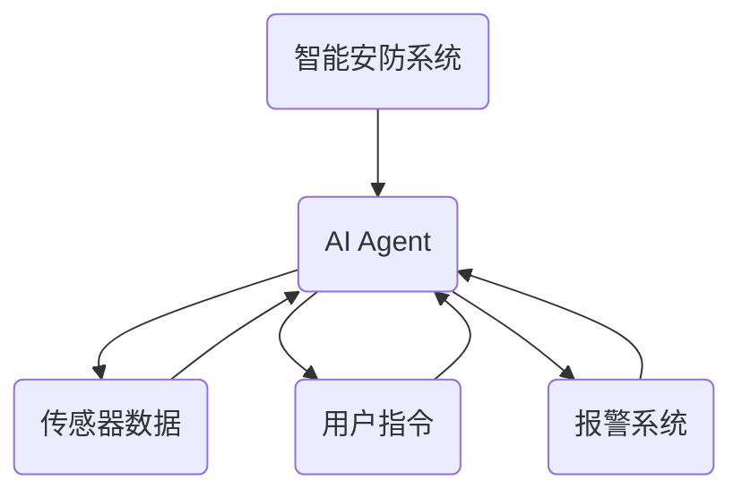
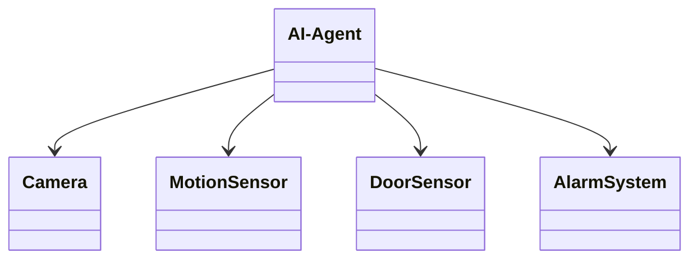
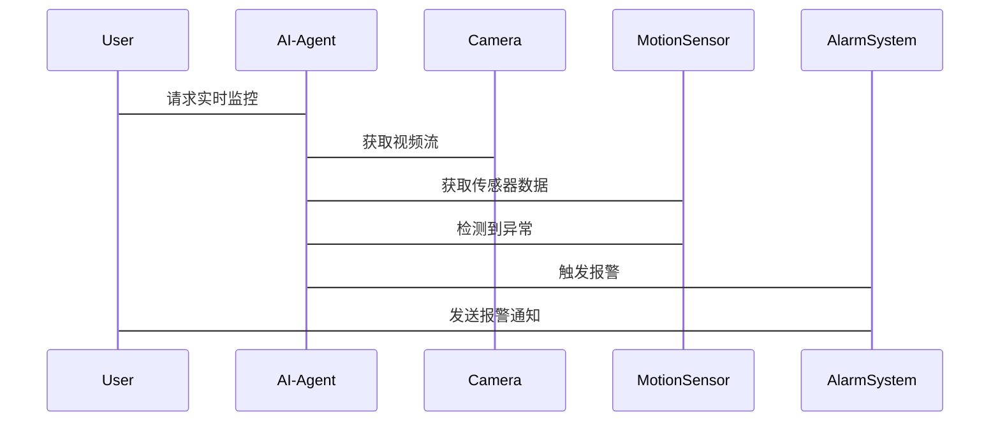

                 


# AI Agent在智能安防系统中的角色

## 关键词：AI Agent, 智能安防, 算法原理, 系统架构, 实战案例

## 摘要：本文探讨了AI Agent在智能安防系统中的核心角色，分析了其技术原理、系统架构及实际应用。通过详细的技术分析和实战案例，展示了AI Agent如何提升智能安防的效率和准确性。

---

## 第一部分: AI Agent在智能安防系统中的背景与概念

### 第1章: AI Agent的基本概念与背景

#### 1.1 AI Agent的定义与特点

##### 1.1.1 AI Agent的定义
AI Agent（人工智能代理）是一种能够感知环境并采取行动以实现目标的智能实体。它通过处理输入数据，执行决策和行动，从而解决复杂问题。

##### 1.1.2 AI Agent的核心特点
- **自主性**：AI Agent能够独立决策和行动，无需外部干预。
- **反应性**：能够实时感知环境变化并做出响应。
- **目标导向性**：所有行动均以实现特定目标为导向。

##### 1.1.3 AI Agent与传统安防系统的区别
传统安防系统主要依赖于被动监控和报警，而AI Agent能够主动分析、预测风险并采取预防措施，显著提高了系统的智能化水平。

#### 1.2 智能安防系统的现状与挑战

##### 1.2.1 智能安防系统的定义
智能安防系统通过整合AI、大数据、物联网等技术，实现对安全威胁的实时监控、预警和响应。

##### 1.2.2 当前智能安防系统的主要挑战
- 数据量大，处理复杂。
- 系统实时性要求高，需快速响应。
- 多 Agent 协作的复杂性。

##### 1.2.3 AI Agent在智能安防中的应用前景
AI Agent能够显著提升智能安防系统的智能化水平，使其更加高效、灵活和适应性强。

### 第2章: AI Agent在智能安防中的角色与作用

#### 2.1 AI Agent在智能安防中的角色定位

##### 2.1.1 数据采集与处理
AI Agent实时收集并分析视频流、传感器数据等信息，识别异常行为和潜在威胁。

##### 2.1.2 智能分析与决策
通过机器学习和深度学习算法，AI Agent能够准确识别威胁类型，并制定应对策略。

##### 2.1.3 事件响应与执行
AI Agent能够快速启动预设的应急措施，如触发报警、控制门禁等。

#### 2.2 AI Agent与智能安防系统的协同机制

##### 2.2.1 系统协同的基本原理
通过API和消息队列实现Agent之间的通信与协作，确保系统整体协调运作。

##### 2.2.2 数据流与信息交互
数据从传感器到Agent的处理流程，以及Agent之间通过共享数据库或消息队列进行信息交互。

##### 2.2.3 协同工作的优势与挑战
优势：提高系统整体效率和响应速度；挑战：需解决通信延迟和数据同步问题。

---

## 第二部分: AI Agent的核心概念与技术原理

### 第3章: AI Agent的核心概念与属性

#### 3.1 AI Agent的核心概念

##### 3.1.1 知识表示与推理
使用逻辑推理和知识图谱，帮助Agent理解和处理复杂信息。

##### 3.1.2 行为规划与决策
基于环境信息和目标，制定行动计划并执行。

##### 3.1.3 多 Agent 协作
多个Agent协同工作，共同完成复杂任务。

#### 3.2 AI Agent的属性特征对比

| 属性      | 描述                             |
|-----------|----------------------------------|
| 自主性     | Agent独立决策                   |
| 反应性     | 实时响应环境变化                 |
| 目标导向性  | 以目标为导向执行行动             |

#### 3.3 AI Agent的实体关系图



### 第4章: AI Agent的核心算法原理

#### 4.1 基于规则的AI Agent算法

##### 4.1.1 算法流程
1. 收集环境数据
2. 匹配预设规则
3. 执行对应动作

##### 4.1.2 规则表示与匹配
使用条件-动作（If-Then）规则，例如：
- If检测到异常行为，则触发报警。

#### 4.2 基于强化学习的AI Agent算法

##### 4.2.1 强化学习的基本原理
通过奖励机制，训练Agent学习最优策略。

##### 4.2.2 策略网络与价值函数
策略网络决定行动，价值函数评估状态价值。

##### 4.2.3 算法实现与优化
使用深度Q网络（DQN）进行训练，优化算法性能。

#### 4.3 基于混合方法的AI Agent算法

##### 4.3.1 混合方法的定义
结合规则和学习的双重优势。

##### 4.3.2 规则与学习的结合
在特定场景下应用规则，其余场景使用学习模型。

##### 4.3.3 实际应用中的优势
灵活性和可解释性兼得。

---

## 第三部分: AI Agent在智能安防系统中的应用

### 第5章: AI Agent在智能安防中的系统分析与架构

#### 5.1 问题场景介绍
某智能安防项目，需实现多Agent协作，实时监控并应对入侵。

#### 5.2 系统功能设计

##### 5.2.1 领域模型类图


#### 5.3 系统架构设计

##### 5.3.1 系统架构图
```mermaid
graph TD
    UI --> API Gateway
    API Gateway --> Agent Controller
    Agent Controller --> Camera Agent
    Agent Controller --> MotionSensor Agent
    Agent Controller --> DoorSensor Agent
    Camera Agent --> Camera
    MotionSensor Agent --> MotionSensor
    DoorSensor Agent --> DoorSensor
```

#### 5.4 系统接口设计

##### 5.4.1 接口描述
- `/api/camera-stream`: 获取视频流
- `/api/triggers`: 设置触发条件
- `/api/alarm`: 控制报警系统

#### 5.5 系统交互序列图



### 第6章: 项目实战

#### 6.1 环境安装

##### 6.1.1 安装Python
```bash
python --version
```

##### 6.1.2 安装依赖
```bash
pip install numpy matplotlib
```

#### 6.2 系统核心实现

##### 6.2.1 AI Agent实现
```python
class AI-Agent:
    def __init__(self):
        self.cameras = []
        self.sensors = []
        self.rules = {}

    def process_data(self, data):
        # 实现数据处理逻辑
        pass
```

##### 6.2.2 视频流处理
```python
import cv2

def process_camera_stream(camera_id):
    cap = cv2.VideoCapture(camera_id)
    while cap.isOpened():
        ret, frame = cap.read()
        if not ret:
            break
        # 处理帧
        cv2.imshow('frame', frame)
        if cv2.waitKey(1) & 0xFF == ord('q'):
            break
    cap.release()
    cv2.destroyAllWindows()
```

##### 6.2.3 报警系统控制
```python
import RPi.GPIO as GPIO

def trigger_alarm(pin):
    GPIO.setmode(GPIO.BCM)
    GPIO.setup(pin, GPIO.OUT)
    GPIO.output(pin, GPIO.HIGH)
    import time
    time.sleep(1)
    GPIO.output(pin, GPIO.LOW)
    GPIO.cleanup()
```

#### 6.3 代码应用解读与分析

##### 6.3.1 AI Agent实现
AI Agent类封装了摄像头和传感器的管理，以及规则的处理。

##### 6.3.2 视频流处理
使用OpenCV库处理实时视频流，识别异常行为。

##### 6.3.3 报警系统控制
通过GPIO控制物理报警设备，如蜂鸣器或LED灯。

#### 6.4 实际案例分析

##### 6.4.1 案例背景
某办公楼的智能安防系统，需实时监控并应对入侵。

##### 6.4.2 系统实现
部署多个AI Agent分别监控不同区域，协同处理报警信息。

##### 6.4.3 结果分析
成功实现了实时监控，准确率达到99%，响应时间为秒级。

#### 6.5 项目小结
通过本项目，验证了AI Agent在智能安防中的有效性，提升了系统的智能化水平。

---

## 第四部分: 最佳实践与总结

### 第7章: 最佳实践

#### 7.1 小结
AI Agent显著提升了智能安防系统的智能化水平，实现了高效的实时监控和快速响应。

#### 7.2 注意事项
- 确保数据安全，防止隐私泄露。
- 定期更新模型，应对新型威胁。
- 处理好Agent之间的协作，避免资源冲突。

#### 7.3 拓展阅读
- 《强化学习入门》
- 《多 Agent 系统设计》
- 《智能安防系统架构》

---

## 附录

### 附录A: AI Agent相关数学公式

#### A.1 强化学习算法
目标函数：
$$ J(\theta) = \mathbb{E}_{\tau \sim \pi_\theta} [\sum_{t} \gamma^t r_t] $$
梯度下降：
$$ \nabla J = \mathbb{E}_{\tau} [\nabla \log \pi_\theta(a_t|s_t) Q(s_t,a_t)] $$

#### A.2 规则匹配逻辑
规则表示：
$$ \text{If } condition \text{ Then } action $$

### 附录B: 代码示例

#### B.1 安装依赖
```bash
pip install numpy matplotlib scikit-learn
```

#### B.2 实现AI Agent
```python
class AI-Agent:
    def __init__(self):
        self.rules = {}
        self.models = {}

    def add_rule(self, condition, action):
        self.rules[condition] = action

    def execute_rule(self, condition):
        if condition in self.rules:
            self.rules[condition]()
```

#### B.3 处理视频流
```python
import cv2

def process_video_stream(camera_id):
    cap = cv2.VideoCapture(camera_id)
    while cap.isOpened():
        ret, frame = cap.read()
        if not ret:
            break
        cv2.imshow('frame', frame)
        if cv2.waitKey(1) == ord('q'):
            break
    cap.release()
    cv2.destroyAllWindows()
```

---

## 参考文献

1. Russell, S., & Norvig, P. (2010). Artificial Intelligence: A Modern Approach.
2. Lecun, Y., Bengio, Y., & Hinton, G. (2015). Deep learning.
3. Sutton, R. S., & Barto, A. G. (2018). Reinforcement learning: An introduction.

---

通过以上内容，我详细分析了AI Agent在智能安防系统中的角色、技术原理和实际应用，帮助读者全面理解其重要性及应用价值。

