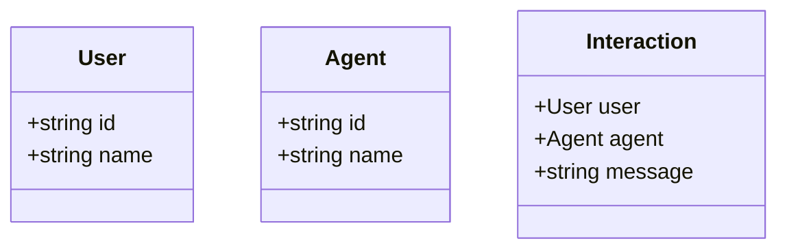

                 


# AI Agent在智能客户服务中的角色

## 关键词：AI Agent、智能客服、自然语言处理、强化学习、系统架构设计、项目实战

## 摘要：  
随着人工智能技术的飞速发展，AI Agent（智能体）在智能客户服务中的角色日益重要。本文将从AI Agent的核心概念、算法原理、系统架构设计、项目实战等多个方面详细探讨AI Agent在智能客户服务中的应用。通过本文，读者将能够全面理解AI Agent的工作原理，并掌握如何在实际项目中应用相关技术。  

---

# 第一部分: 引言

## 第1章: AI Agent的基本概念与背景

### 1.1 AI Agent的定义与特点  
AI Agent（人工智能智能体）是指能够感知环境并采取行动以实现目标的智能系统。它具备以下特点：  
1. **自主性**：能够在没有外部干预的情况下独立运行。  
2. **反应性**：能够实时感知环境并做出反应。  
3. **目标导向**：所有行为都以实现特定目标为导向。  

### 1.2 AI Agent在智能客户服务中的应用背景  
智能客户服务是指通过技术手段为用户提供高效、个性化的服务。AI Agent在其中扮演着关键角色，能够实现以下功能：  
- 自动响应用户的查询。  
- 识别用户需求并提供个性化解决方案。  
- 实时监控并优化服务流程。  

### 1.3 问题背景与解决思路  
传统客服系统存在以下问题：  
1. 人工客服效率低，无法满足大规模用户需求。  
2. 服务质量不稳定，受人工因素影响较大。  
3. 数据孤岛问题，难以实现跨系统协同。  

AI Agent通过自然语言处理（NLP）、机器学习（ML）等技术，能够有效解决上述问题。  

---

# 第二部分: AI Agent的核心概念与工作原理

## 第2章: AI Agent的核心概念  

### 2.1 AI Agent的感知层  

#### 2.1.1 自然语言处理（NLP）技术  
自然语言处理是AI Agent实现语言理解的核心技术。其主要步骤包括：  
1. **分词**：将输入文本分割成词语或短语。  
2. **实体识别**：识别文本中的实体（如人名、地名等）。  
3. **意图识别**：理解用户的真实需求。  

#### 2.1.2 感知层的实现流程  
1. 接收用户输入。  
2. 对输入进行分词和实体识别。  
3. 确定用户的意图。  

#### 2.1.3 感知层的关键技术对比  
| 技术 | 优点 | 缺点 |  
|------|------|------|  
| 基于规则的方法 | 实现简单 | 灵活性差 |  
| 统计方法 | 数据驱动，效果好 | 需要大量数据 |  
| 深度学习方法 | 效果最优 | 计算资源消耗大 |  

### 2.2 AI Agent的决策层  

#### 2.2.1 决策层的算法选择  
常用的决策算法包括：  
1. **规则引擎**：基于预定义的规则进行决策。  
2. **强化学习**：通过试错优化决策策略。  
3. **概率推理**：基于概率模型进行决策。  

#### 2.2.2 决策层的逻辑架构  
1. 接收感知层的输入。  
2. 根据输入生成多个候选决策方案。  
3. 评估每个方案的优劣，选择最优方案。  

#### 2.2.3 决策层的优缺点分析  
| 决策方法 | 优点 | 缺点 |  
|------|------|------|  
| 规则引擎 | 实现简单 | 需要手动维护规则 |  
| 强化学习 | 自适应性强 | 需要大量数据训练 |  
| 概率推理 | 处理不确定性问题能力强 | 实现复杂 |  

### 2.3 AI Agent的执行层  

#### 2.3.1 执行层的功能模块  
1. **动作规划**：根据决策结果生成具体动作。  
2. **动作执行**：将规划好的动作执行到位。  
3. **反馈处理**：根据执行结果调整后续行为。  

#### 2.3.2 执行层的关键技术  
- 动作规划：基于图搜索算法（如A*算法）实现。  
- 动作执行：通过API调用或其他系统接口实现。  

---

## 第3章: AI Agent的算法原理  

### 3.1 自然语言处理（NLP）算法  

#### 3.1.1 基于规则的NLP实现  
1. 创建词典或规则库。  
2. 根据规则匹配用户输入。  

#### 3.1.2 统计NLP实现  
1. 基于TF-IDF算法进行关键词提取。  
2. 使用朴素贝叶斯算法进行分类。  

#### 3.1.3 深度学习NLP实现  
1. 使用Transformer模型（如BERT）进行文本理解。  
2. 通过预训练模型进行意图识别。  

#### 3.1.4 NLP算法对比分析  
| 算法 | 优点 | 缺点 |  
|------|------|------|  
| 基于规则 | 实现简单 | 需要手动维护规则 |  
| TF-IDF | 数据驱动 | 效果受数据质量影响 |  
| 朴素贝叶斯 | 实现简单 | 对特征工程依赖性强 |  
| Transformer | 效果最优 | 计算资源消耗大 |  

#### 3.1.5 NLP算法实现代码示例  
```python
# 基于规则的NLP实现
def nlp_rule_matching(text):
    rule_dict = {
        'greeting': ['hello', 'hi', 'hey'],
        'farewell': ['bye', 'goodbye']
    }
    for intent, patterns in rule_dict.items():
        if any(pattern in text for pattern in patterns):
            return intent
    return None
```

---

### 3.2 强化学习算法  

#### 3.2.1 强化学习的基本原理  
强化学习是一种通过试错优化决策策略的算法。其核心包括：  
1. **状态**（State）：环境当前的状况。  
2. **动作**（Action）：智能体采取的行动。  
3. **奖励**（Reward）：对决策结果的评价。  

#### 3.2.2 强化学习在决策优化中的应用  
1. **状态表示**：将用户需求和系统状态表示为向量。  
2. **动作选择**：基于当前状态选择最优动作。  
3. **策略优化**：通过不断试错优化策略。  

#### 3.2.3 强化学习算法的数学模型  
策略 π(a|s) 表示在状态 s 时选择动作 a 的概率。  
目标函数：  
$$ J(\pi) = \mathbb{E}[R] $$  
其中，R 表示最终获得的奖励。  

#### 3.2.4 强化学习算法实现代码示例  
```python
# 强化学习算法实现
class Agent:
    def __init__(self, state_space, action_space):
        self.state_space = state_space
        self.action_space = action_space
        self奖励机制：定义奖励函数，根据状态和动作返回奖励值。
```

---

## 第4章: AI Agent的系统架构设计  

### 4.1 问题场景介绍  
智能客户服务系统需要实现以下功能：  
- 多轮对话交互。  
- 用户需求识别与分类。  
- 自动派单与处理。  

### 4.2 系统功能设计  

#### 4.2.1 领域模型设计  


#### 4.2.2 系统架构设计  
```mermaid
containerDiagram
    User
    Agent
    Database
    API Gateway
```

#### 4.2.3 系统接口设计  
- 用户与Agent交互接口：  
  ```mermaid
  sequenceDiagram
      User->Agent: 发送查询请求
      Agent->Database: 查询数据
      Database-->>Agent: 返回数据
      Agent->User: 返回结果
  ```

---

## 第5章: 项目实战  

### 5.1 环境安装  
1. 安装Python环境。  
2. 安装NLP相关库（如spaCy、NLTK）。  
3. 安装机器学习库（如Scikit-learn、TensorFlow）。  

### 5.2 系统核心实现  

#### 5.2.1 自然语言处理模块实现  
```python
import spacy

nlp = spacy.load("en_core_web_sm")

def process_text(text):
    doc = nlp(text)
    return [token.text for token in doc]
```

#### 5.2.2 决策模块实现  
```python
from sklearn.tree import DecisionTreeClassifier

# 假设X为特征矩阵，y为标签
model = DecisionTreeClassifier()
model.fit(X, y)
```

### 5.3 实际案例分析  
以智能客服系统为例，展示如何实现一个多轮对话交互功能。  

### 5.4 项目小结  

---

## 第6章: 最佳实践与总结  

### 6.1 最佳实践  
1. 数据预处理是关键。  
2. 选择合适的算法模型。  
3. 不断优化系统性能。  

### 6.2 小结  
通过本文的讲解，读者可以全面了解AI Agent在智能客户服务中的应用，并掌握相关技术的实现方法。  

---

## 第7章: 注意事项与拓展阅读  

### 7.1 注意事项  
1. 数据隐私问题需要注意。  
2. 系统稳定性需要保证。  
3. 需要不断优化模型。  

### 7.2 拓展阅读  
- 《自然语言处理入门》  
- 《强化学习实战》  
- 《系统架构设计指南》  

---

希望以上内容对您有所帮助！如果需要进一步调整或补充，请随时告诉我！

