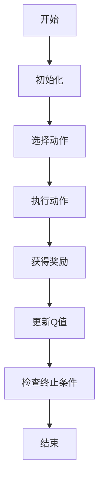
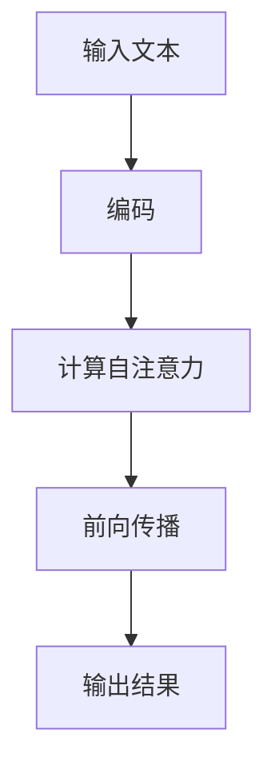
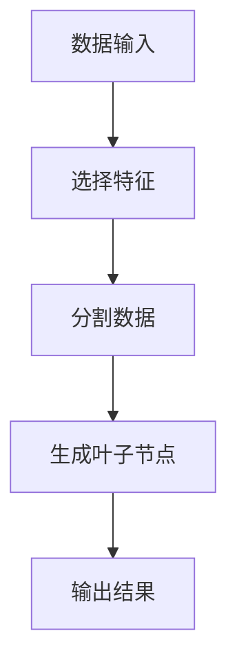
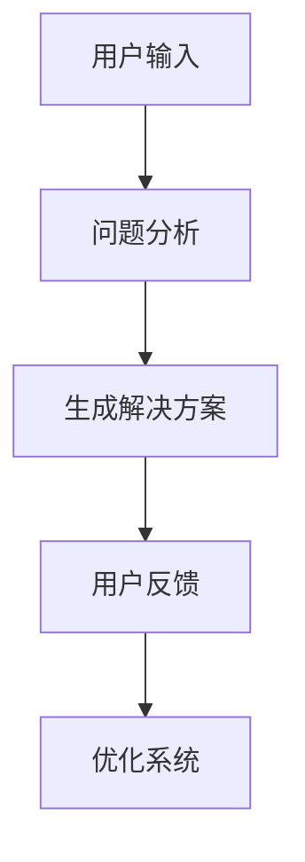
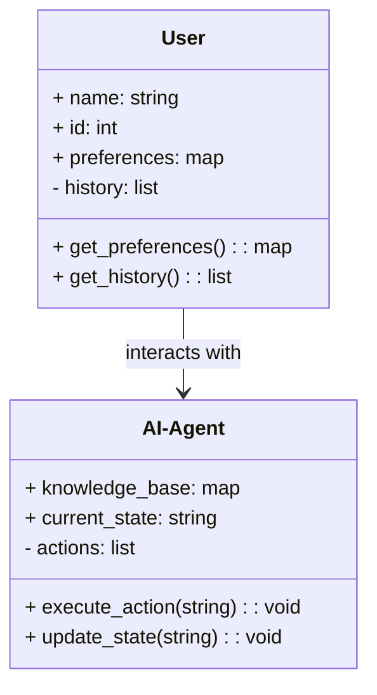
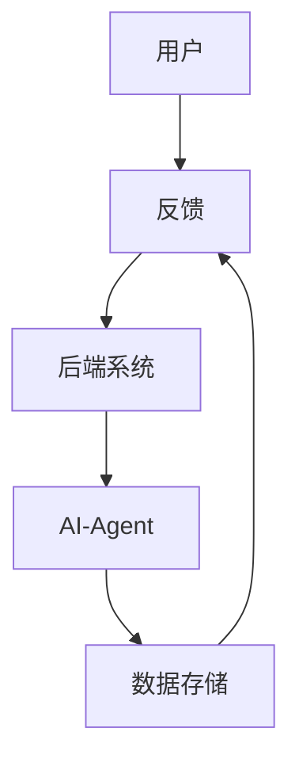
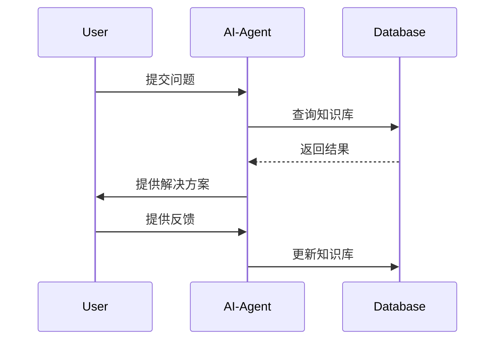

                 


# AI Agent在智能客户服务中的角色

## 关键词：AI Agent、智能客户服务、机器学习、自然语言处理、强化学习、决策树、系统架构

## 摘要：  
随着人工智能技术的快速发展，AI Agent（人工智能代理）在智能客户服务中的角色日益重要。本文将详细探讨AI Agent在智能客户服务中的背景、核心概念、算法原理、系统架构以及实际应用案例。通过分析AI Agent的技术原理和应用场景，结合具体案例，揭示其在智能客户服务中的优势与挑战，为读者提供全面的了解和深入的见解。

---

## 第一部分: AI Agent在智能客户服务中的背景与概念

## 第1章: AI Agent与智能客户服务概述

### 1.1 AI Agent的基本概念
#### 1.1.1 AI Agent的定义与特点
AI Agent是一种能够感知环境、自主决策并执行任务的智能实体。其特点包括：
- **自主性**：能够自主决策，无需外部干预。
- **反应性**：能够实时感知环境并做出反应。
- **学习能力**：能够通过数据和经验不断优化自身行为。
- **交互性**：能够与用户或其他系统进行有效交互。

#### 1.1.2 智能客户服务的定义与特点
智能客户服务是指通过智能化技术为用户提供高效、个性化的服务。其特点包括：
- **自动化**：通过AI技术实现服务流程的自动化。
- **个性化**：根据用户需求提供定制化服务。
- **实时性**：能够快速响应用户需求。

#### 1.1.3 AI Agent在智能客户服务中的作用
AI Agent在智能客户服务中扮演着关键角色，主要体现在：
- **客户交互**：通过自然语言处理技术与客户进行对话。
- **问题解决**：利用机器学习算法分析问题并提供解决方案。
- **数据驱动决策**：基于大数据分析提供智能化建议。

### 1.2 AI Agent在智能客户服务中的背景
#### 1.2.1 智能客户服务的发展历程
智能客户服务经历了从人工服务到半自动化再到全自动化的过程。随着AI技术的进步，AI Agent逐渐成为智能客户服务的核心技术。

#### 1.2.2 当前智能客户服务的痛点与挑战
- **效率低下**：人工客服响应慢，效率低。
- **成本高昂**：人工客服需要大量人力资源，成本高。
- **个性化不足**：传统客服难以提供个性化服务。

#### 1.2.3 AI Agent的出现与解决方案
AI Agent通过自动化、智能化的方式解决了传统客户服务的痛点，显著提高了服务效率和质量。

### 1.3 本章小结
本章主要介绍了AI Agent的基本概念、智能客户服务的定义与特点，以及AI Agent在智能客户服务中的作用和背景。AI Agent的引入为智能客户服务带来了新的可能性，其优势日益凸显。

---

## 第二部分: AI Agent的核心概念与技术原理

## 第2章: AI Agent的核心概念与原理

### 2.1 AI Agent的核心概念
#### 2.1.1 AI Agent的构成要素
AI Agent的构成要素包括：
- **感知模块**：负责接收外部输入并进行解析。
- **决策模块**：基于感知信息进行分析和决策。
- **执行模块**：根据决策结果执行具体操作。
- **学习模块**：通过数据和经验不断优化自身行为。

#### 2.1.2 AI Agent的分类与应用场景
AI Agent可以根据功能和应用场景进行分类：
- **任务型AI Agent**：专注于完成特定任务，如智能助手。
- **交互型AI Agent**：专注于与用户进行交互，如聊天机器人。
- **监控型AI Agent**：专注于实时监控和反馈，如安全监控系统。

#### 2.1.3 AI Agent的决策机制与流程
AI Agent的决策机制通常包括以下几个步骤：
1. **感知环境**：接收外部输入并解析信息。
2. **分析问题**：基于感知信息进行问题分析。
3. **生成解决方案**：通过算法生成可能的解决方案。
4. **选择最优方案**：基于评估标准选择最优解决方案。
5. **执行操作**：根据选择的方案执行具体操作。

### 2.2 AI Agent的核心技术原理
#### 2.2.1 机器学习与深度学习
机器学习与深度学习是AI Agent的核心技术之一，主要用于数据的分析与模式识别。例如，使用深度学习模型进行自然语言处理和情感分析。

#### 2.2.2 自然语言处理（NLP）
自然语言处理技术使得AI Agent能够理解和生成人类语言。通过NLP技术，AI Agent可以与用户进行有效的对话交互。

#### 2.2.3 强化学习与决策树
强化学习用于AI Agent的决策优化，而决策树则用于分类和预测。

### 2.3 AI Agent与智能客户服务的结合
#### 2.3.1 AI Agent在智能客户服务中的核心任务
- **客户咨询**：通过NLP技术为客户提供个性化解答。
- **问题诊断**：基于机器学习算法分析客户问题并提供解决方案。
- **服务推荐**：根据客户行为和偏好推荐相关服务。

#### 2.3.2 AI Agent与传统客户服务的区别
- **自动化**：AI Agent能够实现服务流程的自动化。
- **智能化**：AI Agent能够通过学习不断优化服务策略。
- **7x24小时服务**：AI Agent可以全天候为客户提供服务。

### 2.4 本章小结
本章详细介绍了AI Agent的核心概念、技术原理及其在智能客户服务中的应用场景。通过分析AI Agent的构成要素和决策机制，进一步理解其在智能客户服务中的重要性。

---

## 第三部分: AI Agent的算法原理与数学模型

## 第3章: AI Agent的算法原理

### 3.1 强化学习算法
#### 3.1.1 强化学习的基本概念
强化学习是一种通过试错机制来优化决策的算法。其核心在于通过与环境的交互获得奖励，并根据奖励值优化策略。

#### 3.1.2 Q-learning算法的数学模型
Q-learning算法的数学模型如下：
$$ Q(s, a) = Q(s, a) + \alpha (r + \gamma \max Q(s', a') - Q(s, a)) $$
其中，$s$是当前状态，$a$是动作，$r$是奖励，$\gamma$是折扣因子，$\alpha$是学习率。

#### 3.1.3 算法流程图（Mermaid）


### 3.2 自然语言处理算法
#### 3.2.1 Transformer模型的基本原理
Transformer模型通过自注意力机制实现高效的文本处理。其基本原理如下：
$$ \text{Attention}(Q, K, V) = \text{softmax}\left( \frac{QK^T}{\sqrt{d_k}} \right)V $$

#### 3.2.2 BERT模型的应用
BERT模型通过预训练技术实现大规模语料库的深度学习，广泛应用于文本分类、问答系统等领域。

#### 3.2.3 算法流程图（Mermaid）


### 3.3 决策树算法
#### 3.3.1 决策树的基本概念
决策树是一种基于树状结构的分类模型，通过不断分割数据实现分类或回归。

#### 3.3.2 ID3算法的数学模型
ID3算法的数学模型如下：
$$ \text{信息增益} = \sum_{i=1}^{n} p_i \log_2 p_i $$

#### 3.3.3 算法流程图（Mermaid）


### 3.4 本章小结
本章详细介绍了AI Agent中常用的几种算法原理，包括强化学习、自然语言处理和决策树算法，并通过数学公式和流程图进行了详细讲解。

---

## 第四部分: AI Agent的系统架构与设计

## 第4章: AI Agent的系统架构设计

### 4.1 系统功能设计
#### 4.1.1 客户服务场景介绍
以智能客服系统为例，系统需要实现客户咨询、问题诊断、服务推荐等功能。

#### 4.1.2 系统功能模块划分
系统功能模块包括：
- **用户交互模块**：负责与用户的对话交互。
- **问题分析模块**：负责对用户问题进行分析和分类。
- **解决方案模块**：负责生成和优化解决方案。
- **反馈模块**：负责收集用户反馈并优化系统。

#### 4.1.3 系统功能流程图（Mermaid）


### 4.2 系统架构设计
#### 4.2.1 领域模型（Mermaid类图）


#### 4.2.2 系统架构图（Mermaid）


#### 4.2.3 系统交互图（Mermaid序列图）


### 4.3 本章小结
本章详细介绍了AI Agent的系统架构设计，包括功能模块划分、类图设计和系统交互流程。通过系统架构设计，进一步理解AI Agent在智能客户服务中的实现方式。

---

## 第五部分: AI Agent的项目实战

## 第5章: AI Agent的项目实战

### 5.1 项目背景与需求分析
#### 5.1.1 项目背景
以智能客服系统为例，项目目标是通过AI Agent实现客户咨询、问题诊断和个性化推荐。

#### 5.1.2 项目需求
- **客户咨询**：能够回答客户的问题。
- **问题诊断**：能够识别客户的问题类型。
- **服务推荐**：能够根据客户偏好推荐服务。

### 5.2 系统核心实现
#### 5.2.1 环境安装
- **Python 3.8及以上版本**
- **TensorFlow 2.0及以上版本**
- **Keras 2.4.3及以上版本**
- **自然语言处理库（如spaCy）**

#### 5.2.2 核心代码实现
```python
class AI-Agent:
    def __init__(self):
        self.knowledge_base = {}
        self.current_state = "idle"

    def receive_input(self, input_text):
        # 接收用户输入
        pass

    def analyze_question(self, input_text):
        # 分析用户问题
        pass

    def generate_solution(self, question):
        # 生成解决方案
        pass

    def execute_action(self, action):
        # 执行操作
        pass

    def update_state(self, new_state):
        # 更新状态
        self.current_state = new_state
```

#### 5.2.3 代码解读与分析
- **receive_input**：接收用户的输入并进行初步解析。
- **analyze_question**：分析用户问题并分类。
- **generate_solution**：根据问题类型生成解决方案。
- **execute_action**：根据解决方案执行具体操作。
- **update_state**：更新系统的当前状态。

### 5.3 项目案例分析
#### 5.3.1 案例背景
以客户咨询为例，客户提出一个问题：“我的订单状态如何？”

#### 5.3.2 系统处理流程
1. **接收输入**：客户输入问题。
2. **分析问题**：识别问题类型为订单查询。
3. **生成解决方案**：查询订单状态并返回结果。
4. **执行操作**：输出订单状态信息。
5. **收集反馈**：记录客户的反馈并优化系统。

### 5.4 项目小结
本章通过一个具体的项目案例，详细讲解了AI Agent的实现过程。从环境安装到核心代码实现，再到案例分析，使读者能够更好地理解AI Agent在智能客户服务中的实际应用。

---

## 第六部分: 总结与展望

## 第6章: 总结与展望

### 6.1 本章总结
本文详细探讨了AI Agent在智能客户服务中的角色，包括其背景、核心概念、算法原理、系统架构和实际应用案例。通过分析AI Agent的技术优势，揭示了其在智能客户服务中的重要性。

### 6.2 未来展望
随着AI技术的不断发展，AI Agent在智能客户服务中的应用将更加广泛和深入。未来的研究方向包括：
- **多模态交互**：结合视觉、听觉等多模态信息进行交互。
- **自适应学习**：通过不断学习优化服务策略。
- **边缘计算**：将AI Agent部署在边缘设备上，实现更低延迟的服务。

### 6.3 最佳实践 Tips
- **选择合适的AI框架**：根据需求选择合适的机器学习框架。
- **数据质量管理**：确保数据的准确性和完整性。
- **用户隐私保护**：在处理用户数据时，必须遵守隐私保护法规。

### 6.4 小结
AI Agent作为智能客户服务的核心技术，将在未来发挥越来越重要的作用。通过不断的技术创新和实践应用，AI Agent将为智能客户服务带来更多的可能性。

---

## 附录: 参考文献与拓展阅读

## 参考文献
1. Russell, S., & Norvig, P. (2010). Artificial Intelligence: A Modern Approach. Pearson.
2. LeCun, Y., Bengio, Y., & Hinton, G. (2015). Deep learning. Nature, 521(7552), 436-444.
3. Vaswani, A., et al. (2017). Attention is all you need. Advances in neural information processing systems, 30, 590-599.

## 拓展阅读
- 网站：[AI-Agent.org](http://www.ai-agent.org)
- 书籍：《机器学习实战》
- 课程：Coursera上的《人工智能基础》

---

以上是《AI Agent在智能客户服务中的角色》的完整目录和内容概要。希望这篇技术博客文章能够为读者提供关于AI Agent在智能客户服务中的全面了解和深入的见解。

