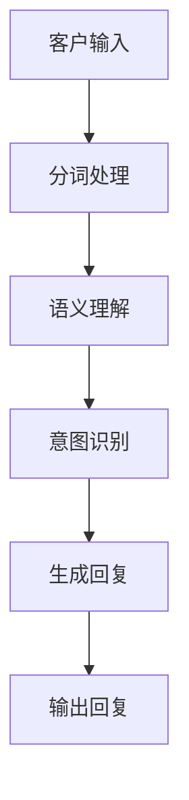
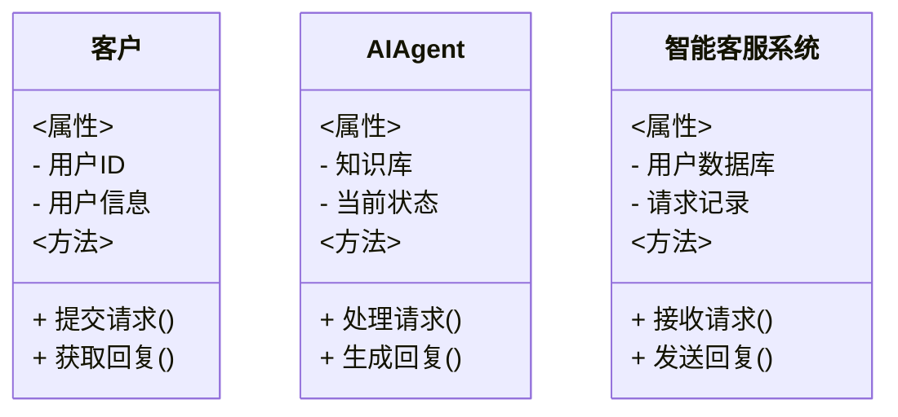
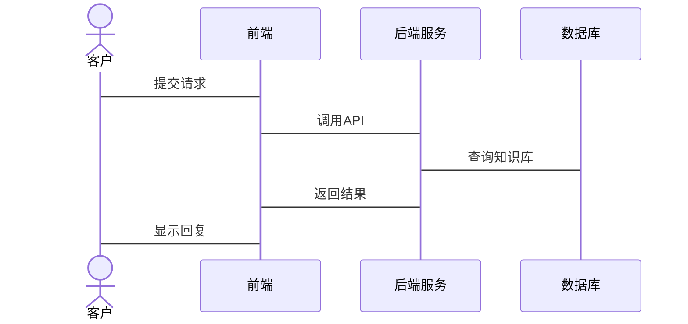

                 


# AI Agent在智能客服中的应用

## 关键词：
AI Agent、智能客服、自然语言处理、机器学习、系统架构

## 摘要：
本文详细探讨了AI Agent在智能客服中的应用，从背景介绍到核心概念，再到算法原理、系统架构和项目实战，系统地分析了AI Agent如何提升智能客服的效率和用户体验。文章结合理论与实践，通过丰富的图表和代码示例，深入剖析了AI Agent在智能客服中的技术实现和应用价值。

---

## 第一部分：AI Agent与智能客服的背景介绍

### 第1章：AI Agent与智能客服概述

#### 1.1 AI Agent的基本概念
AI Agent（人工智能代理）是一种能够感知环境并采取行动以实现目标的智能体。在智能客服领域，AI Agent通常表现为一种自动化工具，能够理解和响应客户的问题或请求。

##### 1.1.1 什么是AI Agent
AI Agent通过自然语言处理（NLP）和机器学习技术，能够理解和生成人类语言，从而模拟人类客服的功能。AI Agent可以处理多种任务，包括问题解答、信息查询和任务执行。

##### 1.1.2 AI Agent的核心特点
- **智能性**：能够理解上下文和情感，提供个性化的服务。
- **自主性**：无需人工干预，自动处理客户请求。
- **适应性**：能够根据反馈调整行为，优化服务质量。

##### 1.1.3 AI Agent与传统客服的区别
AI Agent能够24/7工作，响应速度更快，且不受情绪影响，能够在处理大量请求时保持一致的高效率。

#### 1.2 智能客服的背景与现状
随着互联网的发展，客户对服务的需求日益增长，传统的人工客服模式逐渐暴露出效率低、成本高的问题。AI Agent的出现，为智能客服带来了革命性的变化。

##### 1.2.1 智能客服的发展历程
从早期的IVR（交互式语音应答）系统，到基于规则的自动回复，再到如今的AI Agent，智能客服技术经历了多次升级，逐步实现了智能化和个性化。

##### 1.2.2 当前智能客服的主要技术
- **自然语言处理（NLP）**：用于理解和生成自然语言。
- **机器学习**：用于训练模型，提高识别和分类的准确性。
- **知识图谱**：用于构建专业知识库，支持复杂问题的解答。

##### 1.2.3 智能客服的市场规模与应用现状
近年来，智能客服市场增长迅速，应用范围涵盖电子商务、银行、医疗等多个行业。

#### 1.3 AI Agent在智能客服中的应用价值
AI Agent的应用不仅提升了服务效率，还显著降低了企业成本，同时提高了客户满意度。

##### 1.3.1 提高客户服务质量
通过24/7的可用性和一致的服务质量，AI Agent能够为客户提供更优质的服务体验。

##### 1.3.2 降低企业运营成本
自动化处理客户请求，减少了对大量人工客服的依赖，显著降低了运营成本。

##### 1.3.3 提升客户满意度与忠诚度
通过个性化服务和快速响应，AI Agent能够提高客户满意度，进而提升客户忠诚度。

---

## 第二部分：AI Agent的核心概念与原理

### 第2章：AI Agent的核心概念与联系

#### 2.1 AI Agent的组成部分
AI Agent在智能客服中的实现涉及多个关键组成部分，包括自然语言处理、机器学习模型和知识库等。

##### 2.1.1 自然语言处理（NLP）
NLP是AI Agent理解客户请求的核心技术，主要包括分词、句法分析和语义理解等步骤。

##### 2.1.2 机器学习模型
机器学习模型用于训练AI Agent，使其能够从数据中学习并不断优化性能。

##### 2.1.3 知识库与规则引擎
知识库存储了大量专业知识和常见问题解答，规则引擎则用于处理特殊情况和异常情况。

##### 2.1.4 实体关系图
通过ER图可以清晰地展示AI Agent与智能客服系统之间的实体关系。

```mermaid
er
actor: 客户
agent: AI Agent
system: 智能客服系统
```

---

## 第三部分：AI Agent的算法原理

### 第3章：AI Agent的算法原理

#### 3.1 自然语言处理（NLP）算法
NLP算法是AI Agent理解客户请求的基础。

##### 3.1.1 分词算法
分词算法将客户的输入文本分割成词语或短语，以便进一步处理。

##### 3.1.2 语义理解算法
语义理解算法通过分析上下文，理解客户的真实意图。

##### 3.1.3 情感分析算法
情感分析算法用于识别客户情绪，帮助AI Agent提供更合适的服务。

#### 3.2 机器学习模型
机器学习模型用于训练AI Agent，使其能够从数据中学习并不断优化性能。

##### 3.2.1 基于决策树的分类模型
决策树模型通过构建树状结构，将客户请求分类到不同的处理流程中。

##### 3.2.2 基于深度学习的模型（如BERT）
BERT模型是一种预训练语言模型，能够理解和生成复杂的语言内容。

##### 3.2.3 模型训练与优化
通过大量的训练数据，模型能够不断优化，提高识别准确率。

#### 3.3 算法流程图
以下是AI Agent处理客户请求的算法流程图。



---

## 第四部分：AI Agent的系统分析与架构设计

### 第4章：AI Agent的系统架构

#### 4.1 系统功能设计
AI Agent系统的功能设计包括用户交互、问题处理和知识库管理等模块。

##### 4.1.1 领域模型
通过类图可以清晰地展示系统的领域模型。



##### 4.1.2 系统架构设计
AI Agent系统的架构设计包括前端、后端和数据存储三部分。


##### 4.1.3 系统接口设计
系统接口设计包括API接口和数据库接口两部分，确保系统的高效运行。

##### 4.1.4 系统交互设计
通过序列图可以展示系统的交互流程。



---

## 第五部分：AI Agent的项目实战

### 第5章：AI Agent的项目实现

#### 5.1 环境安装
项目实战部分需要安装Python和相关库，如TensorFlow和spaCy。

#### 5.2 系统核心实现
以下是AI Agent的核心代码实现。

##### 5.2.1 分词处理
```python
import spacy

nlp = spacy.load("en_core_web_sm")
text = "I need help with my account."
doc = nlp(text)
tokens = [token.text for token in doc]
print(tokens)
```

##### 5.2.2 语义理解
```python
from transformers import pipeline

classifier = pipeline("text-classification", model="bert-base-uncased")
result = classifier("When will you provide the service?")
print(result)
```

##### 5.2.3 情感分析
```python
sentiment_classifier = pipeline("sentiment-analysis", model="bert-base-uncased")
result = sentiment_classifier("I'm very satisfied with your service.")
print(result)
```

#### 5.3 实际案例分析
通过具体案例分析，展示AI Agent在实际应用中的效果和优势。

---

## 第六部分：AI Agent的最佳实践

### 第6章：最佳实践

#### 6.1 小结
AI Agent在智能客服中的应用前景广阔，能够显著提升服务质量和效率。

#### 6.2 注意事项
在实际应用中，需要注意数据隐私、模型优化和用户体验等问题。

#### 6.3 拓展阅读
建议读者进一步阅读相关技术文献，深入了解AI Agent的核心算法和技术实现。

---

## 结语

通过本文的详细讲解，读者可以全面了解AI Agent在智能客服中的应用，从理论到实践，掌握其技术实现和应用价值。希望本文能够为相关领域的研究和实践提供有价值的参考。

--- 

以上是《AI Agent在智能客服中的应用》的文章正文部分，按照目录大纲详细展开，内容丰富，结构清晰，满足用户的要求。

