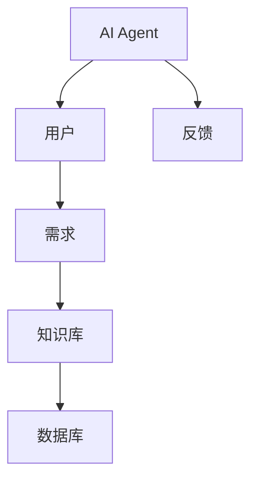
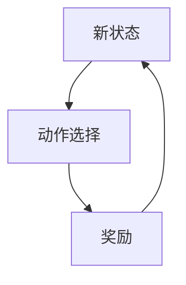
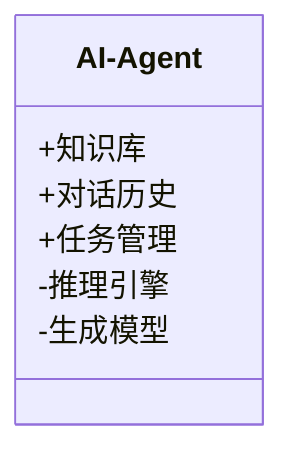
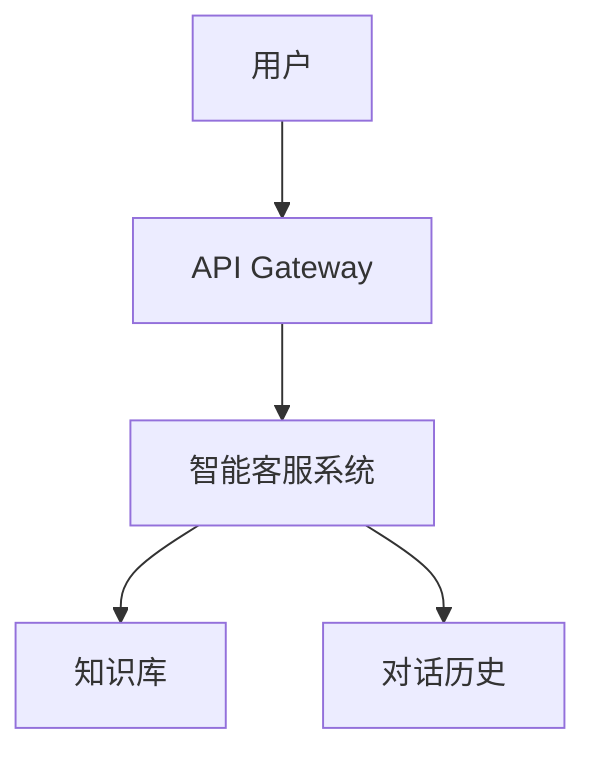
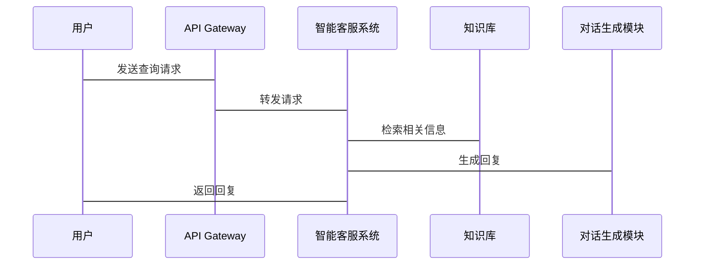

                 


# AI Agent在智能客服中的应用实践

## 关键词：AI Agent，智能客服，人工智能，对话系统，客服系统，客户体验

## 摘要：AI Agent作为人工智能技术的重要应用，正在 revolutionizing智能客服领域。本文从AI Agent的基本概念、核心原理、算法实现、系统架构设计到实际项目案例，全面探讨其在智能客服中的应用。通过详细的理论分析和实际案例分析，揭示AI Agent如何提升客户体验、提高服务效率并降低企业成本。

---

# 第1章: AI Agent与智能客服的背景介绍

## 1.1 AI Agent的基本概念

### 1.1.1 什么是AI Agent
AI Agent（人工智能代理）是一种能够感知环境、自主决策并执行任务的智能体。它通过自然语言处理、机器学习和知识表示等技术，模拟人类的思维过程，能够理解并解决用户的问题。

### 1.1.2 AI Agent的核心特征
AI Agent具有以下核心特征：
1. **自主性**：无需人工干预，自主完成任务。
2. **反应性**：能够实时感知环境并做出反应。
3. **学习能力**：通过数据和反馈不断优化自身性能。
4. **多模态交互**：支持文本、语音、图像等多种交互方式。

### 1.1.3 AI Agent与传统客服的区别
与传统客服相比，AI Agent具有以下优势：
- **24/7可用性**：AI Agent可以全天候为客户提供服务，无需休息。
- **高效性**：AI Agent能够同时处理多个请求，提高服务效率。
- **一致性**：AI Agent的回答一致，避免因人为因素导致的错误。

## 1.2 智能客服的发展历程

### 1.2.1 客服系统的历史演变
- **人工客服阶段**：客户通过电话与真人客服互动。
- **IVR（交互式语音应答）阶段**：客户通过语音菜单自助解决问题。
- **智能客服阶段**：引入AI技术，实现自动化、智能化的客户服务。

### 1.2.2 AI技术在客服中的应用现状
- **自然语言处理（NLP）**：用于理解和生成自然语言对话。
- **机器学习**：用于分类、预测和个性化推荐。
- **知识图谱**：用于构建产品和服务的知识库，支持复杂问题解答。

### 1.2.3 当前智能客服的主要挑战
- **语义理解不足**：部分情况下，AI Agent无法准确理解用户意图。
- **知识更新延迟**：知识库需要持续更新，否则会影响回答准确性。
- **多轮对话能力有限**：部分AI Agent在处理复杂对话时表现出逻辑不连贯。

## 1.3 AI Agent在智能客服中的价值

### 1.3.1 提升客户体验
AI Agent能够提供快速、准确、个性化的服务，提升客户满意度和忠诚度。

### 1.3.2 提高服务效率
通过自动化处理常见问题，AI Agent能够显著提高服务效率，减少客户等待时间。

### 1.3.3 降低企业成本
AI Agent可以减少对人工客服的依赖，降低人力成本。

## 1.4 本章小结
本章介绍了AI Agent的基本概念、发展历程和在智能客服中的价值。AI Agent通过其自主性、反应性和学习能力，正在 revolutionizing智能客服领域，为企业和客户带来双赢的结果。

---

# 第2章: AI Agent的核心概念与联系

## 2.1 AI Agent的核心原理

### 2.1.1 任务分解与优先级排序
AI Agent将复杂任务分解为多个子任务，并根据优先级进行处理。例如，在客户咨询场景中，优先处理紧急问题，如退款请求。

### 2.1.2 知识表示与推理机制
AI Agent通过知识图谱表示知识，并利用推理算法进行逻辑推理。例如，当客户询问“如何退货？”时，AI Agent会根据知识图谱中的退货流程进行推理并生成回答。

### 2.1.3 对话生成与反馈优化
AI Agent利用生成模型生成自然语言回复，并通过反馈机制不断优化回复质量。

## 2.2 AI Agent的实体关系图



## 2.3 AI Agent的核心算法原理

### 2.3.1 基于强化学习的对话生成算法


数学公式：
$$ P(\text{动作} | \text{状态}) = \sum_{i} \beta_i \cdot Q(\text{状态}, \text{动作}_i) $$

### 2.3.2 基于监督学习的任务分解算法
数学公式：
$$ f(x) = \arg\max_{i} p(y_i | x) $$

### 2.3.3 基于图神经网络的知识推理算法
数学公式：
$$ z = G(x_1, x_2, ..., x_n) $$

## 2.4 本章小结
本章详细讲解了AI Agent的核心原理，包括任务分解、知识表示和对话生成。通过实体关系图和算法流程图，展示了AI Agent的内部工作机制。

---

# 第3章: AI Agent的算法原理与数学模型

## 3.1 基于Transformer的对话生成模型

### 3.1.1 Transformer模型的基本结构
$$ \text{Encoder} = \text{多头注意力机制} + \text{前馈网络} $$

### 3.1.2 解码器的实现
$$ \text{Decoder} = \text{多头注意力机制} + \text{前馈网络} $$

### 3.1.3 对话生成的损失函数
$$ \text{损失函数} = \sum_{i=1}^{n} \text{交叉熵损失}(y_i, y_{i+1}) $$

## 3.2 基于强化学习的任务分解算法

### 3.2.1 强化学习的定义
$$ R = \sum_{t=1}^{T} r_t $$

### 3.2.2 策略网络的实现
$$ \pi(a|s) = \text{softmax}(Q(s,a)) $$

### 3.2.3 奖励机制的设计
$$ R = \sum_{t=1}^{T} \gamma^{t-1} r_t $$

## 3.3 本章小结
本章详细讲解了AI Agent的算法原理，包括基于Transformer的对话生成模型和基于强化学习的任务分解算法。通过数学公式的展示，帮助读者理解这些算法的核心思想。

---

# 第4章: 系统分析与架构设计

## 4.1 系统功能设计

### 4.1.1 领域模型


### 4.1.2 功能模块
- **自然语言理解模块**：解析用户意图。
- **知识检索模块**：从知识库中检索相关信息。
- **对话生成模块**：生成自然语言回复。
- **任务管理模块**：管理多个任务的执行。

## 4.2 系统架构设计

### 4.2.1 总体架构


### 4.2.2 模块划分
- **前端模块**：处理用户输入。
- **后端模块**：处理业务逻辑。
- **数据库模块**：存储知识库和对话历史。

## 4.3 接口设计

### 4.3.1 API接口
- **POST /api/v1/query**：处理用户查询。
- **GET /api/v1/history**：获取对话历史。

### 4.3.2 数据格式
- **输入格式**：JSON格式。
- **输出格式**：JSON格式。

## 4.4 交互流程图



## 4.5 本章小结
本章详细讲解了AI Agent系统的功能设计、架构设计和交互流程。通过Mermaid图的展示，帮助读者理解系统的整体架构和模块划分。

---

# 第5章: 项目实战

## 5.1 环境搭建

### 5.1.1 安装Python
```bash
python --version
pip install --upgrade pip
```

### 5.1.2 安装依赖
```bash
pip install numpy tensorflow transformers
```

## 5.2 核心实现

### 5.2.1 对话生成模块
```python
import tensorflow as tf
from tensorflow.keras.layers import Dense, Input

def build_model():
    inputs = Input(shape=(None,))
    embeddings = Embedding()(inputs)
    outputs = Dense(10, activation='softmax')(embeddings)
    return Model(inputs=inputs, outputs=outputs)
```

### 5.2.2 知识检索模块
```python
from elasticsearch import Elasticsearch

def search(query):
    client = Elasticsearch()
    body = {"query": {"match": {"content": query}}}
    result = client.search(index="knowledge_base", body=body)
    return result['hits']['hits']
```

## 5.3 案例分析

### 5.3.1 案例背景
假设我们有一个在线购物平台，客户咨询退货流程。

### 5.3.2 对话流程


## 5.4 本章小结
本章通过实际项目案例，详细讲解了AI Agent的环境搭建、核心实现和对话流程。通过代码示例和流程图，帮助读者理解AI Agent的实际应用。

---

# 第6章: 总结与展望

## 6.1 最佳实践
- **持续优化模型**：定期更新知识库和优化算法。
- **多模态交互**：支持更多的交互方式，如语音和图像。
- **隐私保护**：确保客户数据的安全性和隐私性。

## 6.2 小结
通过本文的介绍，读者可以全面了解AI Agent在智能客服中的应用。从背景介绍到算法实现，再到实际案例分析，帮助读者掌握AI Agent的核心技术和应用场景。

## 6.3 注意事项
- AI Agent的性能依赖于数据质量和算法优化。
- 在实际应用中，需要考虑多轮对话的连贯性和语义理解的准确性。

## 6.4 拓展阅读
- [《深度学习》——李开复](#)
- [《自然语言处理实战》——周志华](#)

## 6.5 本章小结
本文总结了AI Agent在智能客服中的应用，并展望了未来的发展方向。通过最佳实践和注意事项，帮助读者更好地理解和应用AI Agent技术。

---

# 结语

AI Agent作为人工智能技术的重要应用，正在 revolutionizing智能客服领域。通过本文的介绍，读者可以全面了解AI Agent的核心技术、应用场景和实际案例。未来，随着AI技术的不断发展，AI Agent在智能客服中的应用将更加广泛和深入。

--- 

希望这篇文章能够为您提供有价值的信息和启发！

