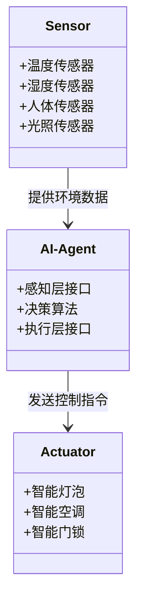

                 


# AI Agent在智能家居自动化中的应用

> 关键词：AI Agent, 智能家居, 自动化, 强化学习, 物联网, 人工智能

> 摘要：本文详细探讨了AI Agent在智能家居自动化中的应用，从基本概念到实际案例，结合强化学习算法和系统架构设计，全面解析了AI Agent如何提升智能家居的智能化水平。

---

## 第一部分: AI Agent与智能家居自动化概述

### 第1章: AI Agent的基本概念与智能家居概述

#### 1.1 AI Agent的定义与特点
AI Agent（智能体）是指在计算环境中能够感知环境并采取行动以实现目标的实体。AI Agent具有以下核心特点：
- **自主性**：能够在没有外部干预的情况下独立运行。
- **反应性**：能够实时感知环境并做出相应的反应。
- **目标导向**：通过采取行动来实现预设的目标。
- **学习能力**：能够通过经验改进自身的决策能力。

#### 1.2 智能家居的发展历程
智能家居是指通过物联网技术将家庭中的设备（如灯光、空调、安防系统等）连接起来，并通过智能化的控制实现便捷、节能和安全的生活环境。智能家居的发展经历了以下几个阶段：
- **阶段一：单一设备智能化**：例如，智能灯泡可以通过手机APP控制开关。
- **阶段二：设备联动**：多个设备通过智能家居平台协同工作，例如，当检测到有人进入房间时，自动开启灯光和空调。
- **阶段三：智能化决策**：通过AI Agent实现智能化的决策，例如，基于家庭成员的行为习惯优化能源使用。

#### 1.3 AI Agent在智能家居中的作用
AI Agent在智能家居中的作用主要体现在以下几个方面：
- **智能化决策**：通过分析家庭成员的行为习惯和环境数据，优化智能家居的运行策略。
- **动态调整**：根据实时数据动态调整设备的运行状态，例如，在用电高峰期减少非必要的能源消耗。
- **个性化服务**：基于家庭成员的偏好提供个性化的服务，例如，为不同家庭成员提供不同的睡眠模式。

---

### 第2章: 智能家居自动化的核心技术

#### 2.1 智能家居的感知层技术
智能家居的感知层主要包括传感器和物联网技术，用于采集环境数据并传递给AI Agent进行处理。常见的传感器包括：
- **温度传感器**：用于检测室内温度。
- **湿度传感器**：用于检测室内湿度。
- **人体传感器**：用于检测家庭成员的活动。
- **光照传感器**：用于检测室内光照强度。

#### 2.2 智能家居的决策层技术
决策层是智能家居的核心部分，主要由AI Agent负责。AI Agent通过分析感知层提供的数据，结合预设的规则和学习模型，做出决策并发送指令给执行层。常见的决策算法包括：
- **基于规则的决策系统**：通过预设的规则进行简单的逻辑判断，例如，如果室温超过25℃，则开启空调。
- **基于机器学习的决策系统**：通过训练模型实现更复杂的决策，例如，基于家庭成员的行为习惯优化能源使用。

#### 2.3 智能家居的执行层技术
执行层是智能家居的执行机构，主要包括各种智能设备，如灯光、空调、安防系统等。这些设备根据AI Agent的指令执行相应的操作。常见的执行机构包括：
- **智能灯泡**：根据指令调节亮度和颜色。
- **智能空调**：根据指令调节温度和运行模式。
- **智能门锁**：根据指令开启或关闭门锁。

---

## 第二部分: AI Agent在智能家居中的应用场景

### 第3章: 智能家居中的日常任务自动化

#### 3.1 家庭成员行为习惯的建模
AI Agent通过分析家庭成员的行为数据，建立行为模型，例如，家庭成员的起床时间、起床后通常会做什么等。通过行为模型，AI Agent可以预测家庭成员的需求并提前做出相应的安排。

#### 3.2 日常任务的自动执行
AI Agent可以根据家庭成员的行为习惯自动执行日常任务，例如：
- **早晨**：当家庭成员起床后，AI Agent自动开启灯光和空调，并播放音乐。
- **晚上**：当家庭成员入睡后，AI Agent自动关闭灯光和空调，并开启安防系统。

#### 3.3 任务优先级的动态调整
AI Agent可以根据任务的重要性和紧急程度动态调整任务的执行顺序，例如，在用电高峰期优先执行节能任务。

---

### 第4章: 智能家居中的能源管理

#### 4.1 能源消耗的实时监控
AI Agent通过感知层的传感器实时监控家庭的能源消耗情况，例如，实时监控家中的用电量、水流量等。

#### 4.2 基于AI Agent的能源优化策略
AI Agent可以根据能源消耗数据和家庭成员的行为习惯，制定能源优化策略，例如：
- **高峰时段节能**：在用电高峰期，AI Agent自动关闭非必要的设备，例如，关闭娱乐设备。
- **智能空调控制**：根据室温和家庭成员的行为习惯，自动调节空调的运行模式。

#### 4.3 能源管理的案例分析
以智能空调为例，AI Agent可以根据室温和家庭成员的行为习惯，动态调整空调的运行模式。例如，当家庭成员在睡觉时，AI Agent会将空调设置为“睡眠模式”，并根据室温自动调节温度。

---

## 第三部分: AI Agent在智能家居中的算法实现

### 第5章: 强化学习在AI Agent中的应用

#### 5.1 强化学习的基本原理
强化学习是一种机器学习技术，通过智能体与环境的交互，逐步优化决策策略。强化学习的核心在于通过试错的方式找到最优的决策路径。

#### 5.2 基于强化学习的AI Agent算法实现
以下是基于强化学习的AI Agent算法实现的Python代码示例：

```python
import numpy as np
import gym

# 定义环境
env = gym.make('CartPole-v1')

# 初始化参数
learning_rate = 0.01
gamma = 0.99
epsilon = 1.0
epsilon_min = 0.01
epsilon_decay = 0.995

# 定义神经网络
class QNetwork:
    def __init__(self, state_size, action_size):
        self.state_size = state_size
        self.action_size = action_size
        self.model = self.build_model()

    def build_model(self):
        model = tf.keras.Sequential()
        model.add(tf.keras.layers.Dense(24, activation='relu', input_shape=(self.state_size,)))
        model.add(tf.keras.layers.Dense(self.action_size, activation='linear'))
        model.compile(loss='mean_squared_error', optimizer=tf.keras.optimizers.Adam(learning_rate))
        return model

    def get_action(self, state):
        if np.random.random() < self.epsilon:
            return np.random.randint(0, self.action_size)
        else:
            state = np.array([state])
            q_values = self.model.predict(state)
            return np.argmax(q_values[0])

    def train(self, state, action, reward, next_state):
        state = np.array([state])
        next_state = np.array([next_state])
        target = self.model.predict(state)
        next_q = self.model.predict(next_state)
        target[0][action] = reward + gamma * np.max(next_q[0])
        self.model.fit(state, target, epochs=1, verbose=0)
        self.epsilon = max(self.epsilon_min, self.epsilon * self.epsilon_decay)

# 初始化QNetwork
qnetwork = QNetwork(env.observation_space.shape[0], env.action_space.n)

# 开始训练
for episode in range(1000):
    state = env.reset()
    total_reward = 0
    while True:
        action = qnetwork.get_action(state)
        next_state, reward, done, _ = env.step(action)
        qnetwork.train(state, action, reward, next_state)
        total_reward += reward
        state = next_state
        if done:
            break
    print(f"Episode {episode + 1}, Total Reward: {total_reward}")
```

#### 5.3 强化学习的数学模型与公式
强化学习的核心在于Q-learning算法，其数学模型如下：

$$ Q(s, a) = Q(s, a) + \alpha [r + \gamma \max Q(s', a') - Q(s, a)] $$

其中：
- \( Q(s, a) \) 表示在状态 \( s \) 下采取动作 \( a \) 的价值。
- \( \alpha \) 是学习率。
- \( r \) 是奖励。
- \( \gamma \) 是折扣因子。
- \( s' \) 是下一个状态。
- \( a' \) 是下一个动作。

---

## 第四部分: AI Agent在智能家居中的系统架构设计

### 第6章: 系统分析与架构设计方案

#### 6.1 系统场景介绍
智能家居系统需要实现设备的智能化控制和能源优化管理。系统包括感知层、决策层和执行层三个部分。

#### 6.2 系统功能设计
以下是系统功能设计的Mermaid类图：



#### 6.3 系统架构设计
以下是系统架构设计的Mermaid架构图：

```mermaid
container 智能家居系统 {
    AI-Agent
    Sensor
    Actuator
}
```

---

## 第五部分: AI Agent在智能家居中的项目实战

### 第7章: 项目实战

#### 7.1 环境搭建
安装必要的Python库，例如：
```bash
pip install gym numpy tensorflow
```

#### 7.2 系统核心实现
以下是AI Agent的核心实现代码：

```python
class AI-Agent:
    def __init__(self, state_size, action_size):
        self.state_size = state_size
        self.action_size = action_size
        self.qnetwork = QNetwork(state_size, action_size)

    def take_action(self, state):
        return self.qnetwork.get_action(state)

    def learn(self, state, action, reward, next_state):
        self.qnetwork.train(state, action, reward, next_state)
```

#### 7.3 代码应用解读
AI Agent通过感知层获取环境数据，通过决策层进行分析和判断，最后通过执行层实现设备的控制。

#### 7.4 案例分析
以智能灯光控制为例，AI Agent可以根据室温和家庭成员的行为习惯，自动调节灯光的亮度和颜色。

---

## 第六部分: 最佳实践与总结

### 第8章: 最佳实践

#### 8.1 小结
AI Agent在智能家居中的应用前景广阔，可以通过强化学习等技术实现智能化的决策和控制。

#### 8.2 注意事项
在实际应用中，需要注意数据隐私和系统安全性，确保智能家居系统的安全运行。

#### 8.3 拓展阅读
建议进一步学习强化学习和深度学习的相关知识，以及研究智能家居领域的最新技术动态。

---

通过本文的详细分析和案例讲解，读者可以全面了解AI Agent在智能家居自动化中的应用，从理论到实践，掌握AI Agent的核心技术与实际应用。

