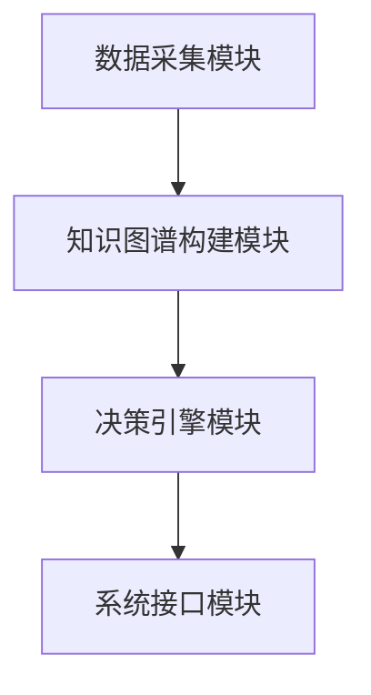
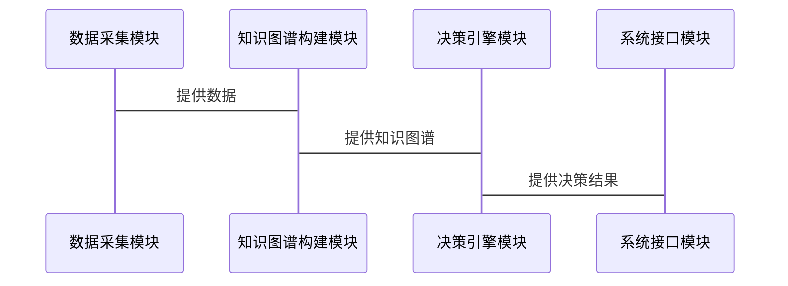

                 


# AI Agent在智能工厂管理中的全面应用策略

## 关键词：AI Agent、智能工厂、工业4.0、智能制造、知识图谱、强化学习

## 摘要：  
本文探讨了AI Agent在智能工厂管理中的应用策略，从理论到实践，系统性地分析了AI Agent的核心概念、技术原理、应用场景及系统架构。通过结合实际案例和详细的技术实现，本文为智能工厂的管理者和技术开发者提供了全面的策略和实践指南，帮助企业在智能制造转型中提升效率和竞争力。

---

# 第一部分: AI Agent与智能工厂管理概述

## 第1章: AI Agent与智能工厂管理概述

### 1.1 AI Agent的基本概念

#### 1.1.1 什么是AI Agent  
AI Agent（人工智能代理）是一种能够感知环境、自主决策并执行任务的智能实体。它通过传感器获取数据，利用算法进行分析和推理，最终做出决策并执行操作。AI Agent可以是软件程序、机器人或其他智能设备。

#### 1.1.2 AI Agent的核心特征  
以下是AI Agent的核心特征对比表：

| **特征**       | **描述**                                                                 |
|----------------|--------------------------------------------------------------------------|
| **自主性**      | AI Agent能够自主决策，无需人工干预。                                       |
| **反应性**      | 能够实时感知环境变化并做出反应。                                           |
| **目标导向**    | 以预设目标为导向，优化决策和行动。                                         |
| **学习能力**    | 通过机器学习算法不断优化自身的决策能力。                                   |

#### 1.1.3 AI Agent与传统自动化的区别  
AI Agent与传统自动化的区别如下：  
- **传统自动化**：基于固定程序，仅能执行预设任务，缺乏灵活性。  
- **AI Agent**：具备学习和适应能力，能够根据环境变化动态调整行为。

### 1.2 智能工厂管理的背景与挑战

#### 1.2.1 智能工厂的定义与特点  
智能工厂是以工业4.0为核心，结合物联网（IoT）、大数据、人工智能等技术，实现生产过程的智能化、数字化和网络化。其特点包括：  
- **智能化生产**：通过AI和大数据优化生产流程。  
- **实时监控**：利用物联网技术实时采集和分析数据。  
- **灵活调整**：能够快速响应市场变化和客户需求。

#### 1.2.2 智能工厂管理的主要挑战  
智能工厂管理面临以下挑战：  
- **数据量大**：生产过程中产生的数据量巨大，难以高效处理。  
- **复杂性高**：生产流程涉及多个环节，协调难度大。  
- **动态变化**：市场需求和生产条件不断变化，需要快速响应。

#### 1.2.3 AI Agent在智能工厂管理中的作用  
AI Agent在智能工厂管理中的作用包括：  
- **优化生产调度**：通过实时数据分析，优化生产资源的分配。  
- **质量控制**：利用AI算法预测和检测质量问题。  
- **供应链管理**：通过智能决策优化供应链的效率。

### 1.3 AI Agent在智能工厂管理中的应用价值

#### 1.3.1 提高生产效率  
AI Agent通过优化生产流程和资源分配，显著提高生产效率。例如，AI Agent可以实时监控生产线状态，动态调整生产节奏，减少浪费。

#### 1.3.2 优化资源利用率  
AI Agent能够根据生产需求和资源 availability，智能分配和调度资源，从而提高资源利用率。

#### 1.3.3 实现智能化决策  
AI Agent通过分析海量数据，提供基于数据的决策支持，帮助管理者做出更明智的决策。

### 1.4 本章小结  
本章介绍了AI Agent的基本概念和智能工厂管理的背景与挑战，并分析了AI Agent在智能工厂管理中的应用价值。

---

## 第2章: AI Agent的核心概念与原理

### 2.1 AI Agent的定义与分类

#### 2.1.1 AI Agent的定义  
AI Agent是一种能够感知环境、自主决策并执行任务的智能实体。

#### 2.1.2 AI Agent的分类  
AI Agent可以分为以下几类：  
- **基于规则的AI Agent**：通过预设规则进行决策。  
- **基于机器学习的AI Agent**：通过学习数据进行决策。  
- **基于知识图谱的AI Agent**：利用知识图谱进行推理和决策。

#### 2.1.3 各类AI Agent的特点对比  
以下是各类AI Agent的特点对比：

| **类型**           | **特点**                                                                 |
|--------------------|--------------------------------------------------------------------------|
| **基于规则的AI Agent** | 依赖预设规则，适用于简单场景。                                             |
| **基于机器学习的AI Agent** | 具备学习能力，适用于复杂场景。                                             |
| **基于知识图谱的AI Agent** | 能够进行推理和知识关联，适用于需要深度理解的场景。                       |

### 2.2 AI Agent的核心技术

#### 2.2.1 机器学习  
机器学习是AI Agent的核心技术之一。通过监督学习、无监督学习和强化学习，AI Agent能够从数据中学习规律并做出决策。

#### 2.2.2 自然语言处理  
自然语言处理（NLP）技术使得AI Agent能够理解和生成人类语言，从而实现与人类的交互。

#### 2.2.3 知识图谱  
知识图谱是一种结构化的知识表示方法，AI Agent可以通过知识图谱进行推理和关联分析。

### 2.3 AI Agent与知识图谱的关系

#### 2.3.1 知识图谱的定义与特点  
知识图谱是一种将知识表示为图结构的数据模型，节点表示实体，边表示实体之间的关系。

#### 2.3.2 AI Agent如何利用知识图谱  
AI Agent可以通过知识图谱进行推理和关联分析，从而做出更智能的决策。

#### 2.3.3 知识图谱在智能工厂管理中的应用  
知识图谱在智能工厂管理中的应用包括：  
- **设备状态监测**：通过知识图谱关联设备状态和历史数据，预测设备故障。  
- **生产优化**：通过知识图谱关联生产流程和资源分配，优化生产效率。

### 2.4 AI Agent的算法原理

#### 2.4.1 监督学习  
监督学习是一种机器学习方法，通过标注数据训练模型，使其能够预测新的数据。

#### 2.4.2 无监督学习  
无监督学习是一种机器学习方法，通过未标注数据发现数据中的结构和模式。

#### 2.4.3 强化学习  
强化学习是一种机器学习方法，通过试错机制优化决策策略。

### 2.5 本章小结  
本章详细介绍了AI Agent的核心概念和技术原理，包括AI Agent的分类、核心技术以及知识图谱的应用。

---

## 第3章: AI Agent在智能工厂管理中的应用场景

### 3.1 生产过程优化

#### 3.1.1 生产调度优化  
AI Agent可以通过分析生产数据，优化生产调度，提高生产效率。

#### 3.1.2 生产资源分配  
AI Agent可以根据生产需求和资源 availability，智能分配和调度资源。

#### 3.1.3 生产效率提升  
AI Agent通过优化生产流程和资源分配，显著提高生产效率。

### 3.2 质量控制与预测

#### 3.2.1 质量检测优化  
AI Agent可以通过图像识别技术，优化产品质量检测。

#### 3.2.2 故障预测与诊断  
AI Agent可以通过分析设备状态数据，预测设备故障并进行诊断。

#### 3.2.3 质量数据分析与优化  
AI Agent可以通过分析质量数据，优化生产流程，提高产品质量。

### 3.3 供应链管理

#### 3.3.1 供应链优化  
AI Agent可以通过分析供应链数据，优化供应链的效率。

#### 3.3.2 供应商管理  
AI Agent可以通过分析供应商数据，优化供应商选择和管理。

#### 3.3.3 库存管理  
AI Agent可以通过分析库存数据，优化库存管理，减少库存成本。

### 3.4 维护与设备管理

#### 3.4.1 设备状态监测  
AI Agent可以通过分析设备状态数据，监测设备运行状态。

#### 3.4.2 设备维护计划  
AI Agent可以根据设备状态数据，制定设备维护计划。

#### 3.4.3 设备寿命预测  
AI Agent可以通过分析设备状态数据，预测设备寿命，优化设备更换计划。

### 3.5 本章小结  
本章详细介绍了AI Agent在智能工厂管理中的应用场景，包括生产过程优化、质量控制与预测、供应链管理以及维护与设备管理。

---

## 第4章: AI Agent的系统架构与设计

### 4.1 系统功能设计

#### 4.1.1 数据采集与处理  
AI Agent需要采集生产过程中的数据，包括设备状态、生产数据、质量数据等。

#### 4.1.2 知识图谱构建  
AI Agent需要构建知识图谱，将生产过程中的知识进行结构化表示。

#### 4.1.3 AI Agent决策引擎  
AI Agent需要具备决策引擎，根据数据和知识图谱进行推理和决策。

#### 4.1.4 系统接口设计  
AI Agent需要与工厂管理系统进行接口设计，确保数据的实时传输和交互。

### 4.2 系统架构设计

#### 4.2.1 系统功能模块  
AI Agent系统的功能模块包括数据采集模块、知识图谱构建模块、决策引擎模块和系统接口模块。

#### 4.2.2 系统架构图  
以下是AI Agent系统的架构图：



#### 4.2.3 系统交互流程  
以下是AI Agent系统的交互流程：



### 4.3 本章小结  
本章详细介绍了AI Agent的系统架构与设计，包括系统功能设计和系统架构设计。

---

## 第5章: AI Agent在智能工厂管理中的项目实战

### 5.1 项目背景

#### 5.1.1 项目介绍  
本项目旨在利用AI Agent技术优化某智能工厂的生产管理流程。

#### 5.1.2 项目目标  
本项目的目標包括：  
- 实现生产过程的智能化管理。  
- 优化生产效率和资源利用率。  
- 提高产品质量和客户满意度。

### 5.2 系统核心实现

#### 5.2.1 环境配置  
本项目需要以下环境配置：  
- 操作系统：Linux/Windows/MacOS  
- 开发工具：Python、TensorFlow、Keras  
- 数据库：MySQL/PostgreSQL  
- 人工智能框架：TensorFlow/PyTorch

#### 5.2.2 核心代码实现  
以下是AI Agent的核心代码实现：

```python
import numpy as np
import tensorflow as tf
from tensorflow import keras

# 数据预处理
def preprocess_data(data):
    # 数据标准化
    mean = np.mean(data)
    std = np.std(data)
    normalized_data = (data - mean) / std
    return normalized_data

# 构建模型
def build_model(input_shape):
    model = keras.Sequential()
    model.add(keras.layers.Dense(64, activation='relu', input_shape=input_shape))
    model.add(keras.layers.Dense(32, activation='relu'))
    model.add(keras.layers.Dense(1, activation='sigmoid'))
    model.compile(optimizer='adam', loss='binary_crossentropy', metrics=['accuracy'])
    return model

# 训练模型
def train_model(model, x_train, y_train):
    model.fit(x_train, y_train, epochs=100, batch_size=32, verbose=1)

# 使用模型进行预测
def predict_model(model, x_test):
    predictions = model.predict(x_test)
    return predictions
```

#### 5.2.3 算法实现与优化  
以下是AI Agent算法的优化策略：

- **模型选择**：选择适合的机器学习模型，如随机森林、支持向量机等。  
- **特征工程**：提取关键特征，提高模型性能。  
- **超参数调优**：通过网格搜索等方法优化模型参数。

### 5.3 实际案例分析与详细讲解

#### 5.3.1 案例背景  
某智能工厂希望通过AI Agent优化生产调度，提高生产效率。

#### 5.3.2 数据分析  
通过对生产数据的分析，发现设备利用率不足，生产调度不合理。

#### 5.3.3 模型训练  
使用监督学习算法训练模型，预测生产调度的最优方案。

#### 5.3.4 系统实现  
根据模型预测结果优化生产调度，显著提高生产效率。

### 5.4 本章小结  
本章通过实际案例分析，详细讲解了AI Agent在智能工厂管理中的项目实战，包括环境配置、核心代码实现和算法优化。

---

## 第6章: AI Agent在智能工厂管理中的最佳实践

### 6.1 最佳实践Tips

#### 6.1.1 数据质量管理  
确保数据的准确性和完整性，是AI Agent系统成功的关键。

#### 6.1.2 模型选择与优化  
选择适合的模型并进行优化，能够显著提高系统的性能。

#### 6.1.3 系统安全与隐私保护  
确保系统的安全性和数据隐私，是AI Agent系统成功的重要保障。

### 6.2 小结与总结

#### 6.2.1 小结  
AI Agent在智能工厂管理中的应用前景广阔，能够显著提高生产效率和资源利用率。

#### 6.2.2 总结  
通过本文的分析和实践，我们看到AI Agent在智能工厂管理中的重要性，未来将有更多创新的应用场景。

### 6.3 注意事项

#### 6.3.1 数据隐私  
在处理生产数据时，需要注意数据隐私保护，避免数据泄露。

#### 6.3.2 系统稳定性  
确保AI Agent系统的稳定性，避免因系统故障导致生产中断。

#### 6.3.3 模型更新  
定期更新模型，确保系统的决策能力不断提升。

### 6.4 拓展阅读

#### 6.4.1 AI Agent与工业4.0  
AI Agent是工业4.0的重要组成部分，未来将有更多创新的应用场景。

#### 6.4.2 人工智能在智能制造中的应用  
人工智能在智能制造中的应用将更加广泛和深入，推动工业智能化的发展。

---

## 第7章: 未来展望与总结

### 7.1 未来展望

#### 7.1.1 AI Agent技术的发展趋势  
AI Agent技术将更加智能化和自主化，能够处理更复杂的问题。

#### 7.1.2 智能工厂管理的未来方向  
智能工厂管理将更加智能化和数据驱动，AI Agent将在其中发挥更重要的作用。

### 7.2 总结

通过本文的分析和实践，我们看到AI Agent在智能工厂管理中的重要性，未来将有更多创新的应用场景，推动工业智能化的发展。

---

## 参考文献  
1. 《人工智能导论》  
2. 《工业4.0与智能制造》  
3. 《知识图谱与深度学习》  
4. 《机器学习实战》  

---

## 附录: AI Agent相关技术的代码实现

### 附录A: 数据预处理代码

```python
import pandas as pd
import numpy as np

def preprocess_data(dataframe):
    # 删除缺失值
    dataframe = dataframe.dropna()
    # 标准化处理
    numeric_cols = dataframe.select_dtypes(include=[np.number]).columns
    dataframe[numeric_cols] = dataframe[numeric_cols].apply(lambda x: (x - x.mean()) / x.std())
    return dataframe
```

### 附录B: 知识图谱构建代码

```python
from knowledge_graph import KnowledgeGraph

def build_knowledge_graph(data):
    kg = KnowledgeGraph()
    for item in data:
        kg.add_entity(item['id'], item['type'])
        for relation in item['relations']:
            kg.add_relation(item['id'], relation['target'], relation['type'])
    return kg
```

### 附录C: AI Agent决策引擎代码

```python
import tensorflow as tf
from tensorflow import keras

def build_decision_engine(input_shape):
    model = keras.Sequential()
    model.add(keras.layers.Dense(64, activation='relu', input_shape=input_shape))
    model.add(keras.layers.Dense(32, activation='relu'))
    model.add(keras.layers.Dense(1, activation='sigmoid'))
    model.compile(optimizer='adam', loss='binary_crossentropy', metrics=['accuracy'])
    return model
```

---

通过以上内容，我们可以看到AI Agent在智能工厂管理中的全面应用策略，从理论到实践，从概念到代码，为读者提供了一个完整的解决方案。

