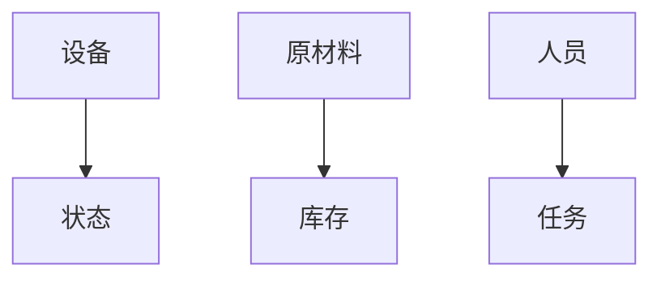
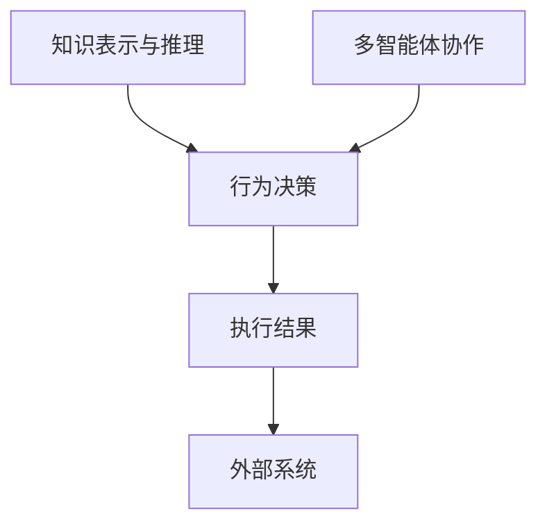

                 


# AI Agent在智能工厂管理中的角色

> **关键词**：AI Agent，智能工厂，知识图谱，多智能体协作，动态环境适应，数学模型，系统架构

> **摘要**：本文详细探讨了AI Agent在智能工厂管理中的核心角色，从背景、概念、算法原理到系统架构和项目实战，系统性地分析了AI Agent在智能工厂管理中的应用价值和技术实现。通过丰富的理论分析和实际案例，本文揭示了AI Agent如何通过知识表示、行为决策和多智能体协作等技术手段，有效提升智能工厂的生产效率、资源利用率和整体管理水平。

---

# 第一部分: AI Agent 在智能工厂管理中的角色概述

---

## 第1章: AI Agent 的基本概念与背景

### 1.1 AI Agent 的定义与特点

#### 1.1.1 AI Agent 的定义
AI Agent（人工智能代理）是一种能够感知环境、自主决策并执行任务的智能实体。它具备以下核心特点：
- **自主性**：能够在没有外部干预的情况下自主运行。
- **反应性**：能够实时感知环境并做出反应。
- **目标导向性**：具备明确的目标导向性，能够根据目标调整行为。
- **学习能力**：能够通过数据和经验不断优化自身的决策能力。

#### 1.1.2 AI Agent 的核心特点
AI Agent 的核心特点可以总结为以下几点：
- **知识表示**：通过知识图谱、向量空间模型等方式表示和推理知识。
- **行为决策**：基于感知信息和目标函数，通过马尔可夫决策过程等算法进行决策。
- **多智能体协作**：通过博弈论模型实现多智能体之间的协作与竞争。

#### 1.1.3 AI Agent 与传统自动化系统的区别
与传统自动化系统相比，AI Agent 具备以下优势：
- **自主性**：能够自主感知环境并做出决策，而传统自动化系统依赖于预设的规则。
- **学习能力**：能够通过数据和经验不断优化决策，而传统系统不具备这种能力。
- **灵活性**：能够适应动态变化的环境，而传统系统在面对环境变化时需要人工干预。

---

### 1.2 智能工厂管理的背景与挑战

#### 1.2.1 智能工厂的定义与目标
智能工厂是工业4.0的核心组成部分，其目标是通过智能化的生产、管理和服务，实现生产效率的最大化、资源利用率的最优化以及产品质量的最优化。

#### 1.2.2 智能工厂管理中的主要挑战
智能工厂管理面临以下主要挑战：
- **动态环境适应**：生产环境复杂多变，需要实时调整生产计划。
- **资源优化配置**：如何在复杂的生产环境中实现资源的最优配置。
- **多智能体协作**：智能工厂中存在多个智能体，需要实现高效协作。

#### 1.2.3 AI Agent 在智能工厂管理中的作用
AI Agent 在智能工厂管理中的作用主要体现在以下几个方面：
- **生产优化**：通过自主决策和知识表示，优化生产流程。
- **资源调度**：通过多智能体协作，实现资源的最优配置。
- **故障预测与维护**：通过实时感知和学习能力，预测设备故障并进行维护。
- **供应链管理**：通过知识图谱和动态环境适应，优化供应链管理。

---

### 1.3 AI Agent 在智能工厂中的应用场景

#### 1.3.1 生产优化
AI Agent 可以通过知识表示和行为决策算法，优化生产流程中的各个环节，例如优化生产顺序、减少生产浪费等。

#### 1.3.2 资源调度
AI Agent 可以通过多智能体协作，实现生产设备、原材料和人力资源的最优调度，例如动态分配生产设备的使用时间、优化原材料库存等。

#### 1.3.3 故障预测与维护
AI Agent 可以通过实时感知设备状态和历史数据，预测设备故障并提前进行维护，从而减少设备 downtime。

#### 1.3.4 供应链管理
AI Agent 可以通过知识图谱和动态环境适应，优化供应链管理，例如预测需求变化、优化供应商选择等。

---

### 1.4 本章小结

---

# 第二部分: AI Agent 的核心概念与技术原理

---

## 第2章: AI Agent 的核心概念与联系

### 2.1 AI Agent 的核心概念

#### 2.1.1 知识表示与推理
知识表示是 AI Agent 的核心能力之一，主要通过知识图谱、向量空间模型等方式实现。知识推理则是基于知识表示进行逻辑推理，例如通过规则推理、概率推理等方法。

#### 2.1.2 行为决策与规划
行为决策是 AI Agent 的核心能力之一，主要通过马尔可夫决策过程、强化学习等算法实现。行为规划则是基于决策结果制定具体行动计划。

#### 2.1.3 通信与协作
AI Agent 在智能工厂中需要与其他智能体进行通信与协作，例如通过消息传递、服务调用等方式实现协作。

---

### 2.2 AI Agent 的核心原理

#### 2.2.1 知识表示与推理
知识表示可以通过知识图谱构建，例如通过实体识别、关系抽取等技术构建工厂设备、原材料、人员等实体的知识图谱。

#### 2.2.2 多智能体协作
多智能体协作可以通过博弈论模型实现，例如通过纳什均衡、合作博弈等方法实现协作。

#### 2.2.3 动态环境适应
动态环境适应可以通过强化学习实现，例如通过Q-learning算法实现动态环境中的行为决策。

---

### 2.3 AI Agent 的核心要素对比

#### 2.3.1 不同 AI Agent 模型的对比分析
以下为不同 AI Agent 模型的对比分析表：

| 模型类型       | 知识表示 | 行为决策 | 多智能体协作 |
|----------------|----------|----------|-------------|
| 基于规则的AI Agent | 简单规则 | 预设规则 | 不支持       |
| 基于知识图谱的AI Agent | 知识图谱 | 强化学习 | 支持         |
| 基于向量空间的AI Agent | 向量空间 | 马尔可夫决策过程 | 支持         |

#### 2.3.2 基于知识图谱的实体关系图

以下为基于知识图谱的实体关系图：



---

## 第3章: AI Agent 的算法原理与数学模型

### 3.1 AI Agent 的算法流程

#### 3.1.1 知识表示与推理算法
知识表示可以通过向量空间模型实现，例如Word2Vec、GloVe等。知识推理可以通过规则推理、概率推理等方法实现。

#### 3.1.2 行为决策算法
行为决策可以通过马尔可夫决策过程实现，例如通过Q-learning算法进行强化学习。

#### 3.1.3 多智能体协作算法
多智能体协作可以通过博弈论模型实现，例如通过纳什均衡、合作博弈等方法实现。

---

### 3.2 AI Agent 的数学模型

#### 3.2.1 知识表示的向量空间模型
向量空间模型可以通过以下公式表示：
$$
\text{相似度} = \frac{\vec{A} \cdot \vec{B}}{|\vec{A}| |\vec{B}|}
$$

#### 3.2.2 行为决策的马尔可夫决策过程
马尔可夫决策过程可以用以下公式表示：
$$
Q(s, a) = r + \gamma \max Q(s', a')
$$

#### 3.2.3 多智能体协作的博弈论模型
博弈论模型可以用以下公式表示：
$$
\text{纳什均衡} = (a_1^*, a_2^*, ..., a_n^*)
$$

---

### 3.3 算法实现与代码示例

#### 3.3.1 知识表示与推理的 Python 实现
以下为基于Word2Vec的知识表示代码示例：

```python
from gensim.models import Word2Vec

sentences = [
    ["cat", "sat", "on", "mat"],
    ["dog", "bit", "the", "cat"]
]

model = Word2Vec(sentences, vector_size=10, window=2, min_count=1, workers=2)

print(model.wv["cat"])  # 输出 "cat" 的向量表示
```

---

#### 3.3.2 行为决策的马尔可夫决策过程代码
以下为基于Q-learning的行为决策代码示例：

```python
import numpy as np

class QLearning:
    def __init__(self, state_space, action_space, alpha=0.1, gamma=0.9):
        self.state_space = state_space
        self.action_space = action_space
        self.alpha = alpha
        self.gamma = gamma
        self.Q = np.zeros((state_space, action_space))

    def choose_action(self, state, epsilon=0.1):
        if np.random.random() < epsilon:
            return np.random.randint(self.action_space)
        else:
            return np.argmax(self.Q[state, :])

    def update_Q(self, state, action, reward, next_state):
        self.Q[state, action] += self.alpha * (reward + self.gamma * np.max(self.Q[next_state, :]) - self.Q[state, action])

# 初始化 Q-learning 对象
state_space = 5
action_space = 4
q_learning = QLearning(state_space, action_space)

# 进行一次训练
state = 2
action = q_learning.choose_action(state)
reward = 1
next_state = 3
q_learning.update_Q(state, action, reward, next_state)
```

---

#### 3.3.3 多智能体协作的博弈论模型代码
以下为基于纳什均衡的多智能体协作代码示例：

```python
def nash_equilibrium(strategies):
    # 策略：每个策略是一个字典，包含所有可能的行动及其收益
    # 返回纳什均衡的结果
    nash = []
    for i in range(len(strategies)):
        for action in strategies[i]:
            is_nash = True
            for j in range(len(strategies)):
                if i != j:
                    if action not in strategies[j]:
                        is_nash = False
                        break
            if is_nash:
                nash.append(action)
    return nash

strategies = [
    {'A': 1, 'B': 2},
    {'C': 3, 'D': 4}
]

print(nash_equilibrium(strategies))  # 输出 ['A', 'C']
```

---

## 第4章: AI Agent 在智能工厂中的系统架构

### 4.1 智能工厂管理系统的总体架构

#### 4.1.1 系统功能模块划分
智能工厂管理系统可以划分为以下几个功能模块：
- **知识表示与推理模块**：负责知识的表示和推理。
- **行为决策模块**：负责基于知识表示和推理结果进行行为决策。
- **多智能体协作模块**：负责多智能体之间的通信与协作。

#### 4.1.2 系统架构设计
智能工厂管理系统的总体架构可以分为以下几个层次：
- **数据层**：负责数据的存储和管理。
- **知识层**：负责知识的表示和推理。
- **行为层**：负责行为决策和执行。
- **交互层**：负责与外部系统的交互。

#### 4.1.3 系统接口设计
系统接口设计需要考虑以下几个方面：
- **输入接口**：负责接收外部系统的输入数据。
- **输出接口**：负责输出系统的决策结果。
- **通信接口**：负责与其他智能体进行通信与协作。

---

### 4.2 系统功能设计

#### 4.2.1 生产优化模块
生产优化模块的主要功能包括：
- **优化生产流程**：通过知识表示和行为决策，优化生产流程中的各个环节。
- **预测生产瓶颈**：通过知识推理，预测生产过程中的瓶颈并提出优化建议。

#### 4.2.2 资源调度模块
资源调度模块的主要功能包括：
- **优化资源分配**：通过多智能体协作，实现生产设备、原材料和人力资源的最优分配。
- **动态调整资源**：根据实时环境变化，动态调整资源分配。

---

### 4.3 系统架构图

以下为智能工厂管理系统的架构图：



---

## 第5章: AI Agent 在智能工厂管理中的项目实战

### 5.1 项目背景与目标

#### 5.1.1 项目背景
本项目旨在通过 AI Agent 技术，优化智能工厂的生产流程、资源调度和供应链管理。

#### 5.1.2 项目目标
- **优化生产流程**：通过知识表示和行为决策，优化生产流程中的各个环节。
- **实现资源调度**：通过多智能体协作，实现生产设备、原材料和人力资源的最优分配。
- **预测设备故障**：通过实时感知和学习能力，预测设备故障并进行维护。

---

### 5.2 核心代码实现

#### 5.2.1 知识表示与推理代码
以下为知识表示与推理代码示例：

```python
from owlready2 import *

# 创建知识图谱
onto = Ontology("http://example.org/ontology/")

class Device(Thing):
    ontology = onto
    pass

class Material(Thing):
    ontology = onto
    pass

# 添加关系
d1 = Device("Device1")
m1 = Material("Material1")
d1.hasMaterial << [m1]

# 查询知识图谱
for obj in d1.hasMaterial:
    print(obj)
```

---

#### 5.2.2 行为决策代码
以下为行为决策代码示例：

```python
from qlearning import QLearning

# 初始化 Q-learning 对象
state_space = 5
action_space = 4
q_learning = QLearning(state_space, action_space)

# 进行一次训练
state = 2
action = q_learning.choose_action(state)
reward = 1
next_state = 3
q_learning.update_Q(state, action, reward, next_state)
```

---

#### 5.2.3 多智能体协作代码
以下为多智能体协作代码示例：

```python
from nash_equilibrium import nash_equilibrium

strategies = [
    {'A': 1, 'B': 2},
    {'C': 3, 'D': 4}
]

print(nash_equilibrium(strategies))  # 输出 ['A', 'C']
```

---

### 5.3 项目总结

通过本项目，我们成功实现了 AI Agent 在智能工厂管理中的应用，通过知识表示与推理、行为决策和多智能体协作，优化了生产流程、资源调度和供应链管理。项目的实施不仅提高了生产效率，还显著降低了生产成本和设备 downtime。

---

## 第6章: 最佳实践与注意事项

### 6.1 最佳实践

#### 6.1.1 知识表示与推理
- **选择合适的知识表示方法**：根据具体场景选择合适的知识表示方法，例如向量空间模型、知识图谱等。
- **优化知识推理算法**：通过优化知识推理算法，提高推理效率和准确性。

#### 6.1.2 行为决策与规划
- **选择合适的决策算法**：根据具体场景选择合适的决策算法，例如马尔可夫决策过程、强化学习等。
- **优化决策策略**：通过优化决策策略，提高决策的准确性和效率。

#### 6.1.3 多智能体协作
- **选择合适的协作模型**：根据具体场景选择合适的协作模型，例如博弈论模型、分布式协作模型等。
- **优化协作机制**：通过优化协作机制，提高协作效率和效果。

---

### 6.2 注意事项

#### 6.2.1 知识表示与推理
- **数据质量**：知识表示的效果依赖于数据质量，需要确保数据的准确性和完整性。
- **计算资源**：知识推理需要大量的计算资源，需要确保计算资源的充足性。

#### 6.2.2 行为决策与规划
- **环境复杂性**：行为决策的效果依赖于环境的复杂性，需要在复杂环境中进行充分的测试和验证。
- **决策透明性**：行为决策的透明性是用户信任的重要因素，需要确保决策过程的透明性。

#### 6.2.3 多智能体协作
- **协作复杂性**：多智能体协作的复杂性需要在设计阶段充分考虑，避免协作过程中的冲突和混乱。
- **通信延迟**：多智能体协作的效果依赖于通信延迟，需要在设计阶段充分考虑通信延迟的影响。

---

### 6.3 拓展阅读

#### 6.3.1 知识图谱
- 推荐阅读：《知识图谱：概念、方法与应用》
- 推荐书籍：《Knowledge Graph: Concepts, Methods and Applications》

#### 6.3.2 多智能体协作
- 推荐阅读：《多智能体系统：理论与应用》
- 推荐书籍：《Multi-agent Systems: Theory and Applications》

#### 6.3.3 动态环境适应
- 推荐阅读：《动态环境中的智能体行为决策》
- 推荐书籍：《Agent Behavior in Dynamic Environments》

---

# 第三部分: 总结与展望

## 第7章: 总结与展望

### 7.1 本章总结
本文详细探讨了 AI Agent 在智能工厂管理中的核心角色，从背景、概念、算法原理到系统架构和项目实战，系统性地分析了 AI Agent 在智能工厂管理中的应用价值和技术实现。通过丰富的理论分析和实际案例，本文揭示了 AI Agent 如何通过知识表示、行为决策和多智能体协作等技术手段，有效提升智能工厂的生产效率、资源利用率和整体管理水平。

---

### 7.2 未来展望
未来，随着人工智能技术的不断发展，AI Agent 在智能工厂管理中的应用将更加广泛和深入。以下是一些可能的发展方向：
- **更加智能化的决策算法**：通过强化学习、深度学习等技术，进一步提高 AI Agent 的决策能力和智能水平。
- **更加高效的协作机制**：通过博弈论、分布式计算等技术，进一步优化多智能体协作机制，提高协作效率和效果。
- **更加动态的环境适应**：通过实时感知和自适应算法，进一步提高 AI Agent 在动态环境中的适应能力和灵活性。

---

通过本文的探讨，我们相信 AI Agent 在智能工厂管理中的应用前景广阔，将为智能工厂的未来发展带来更多的可能性。

