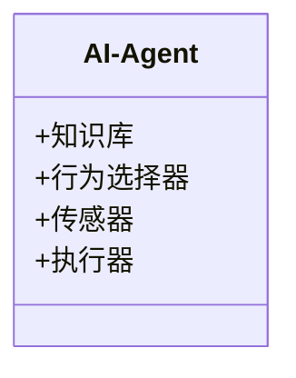
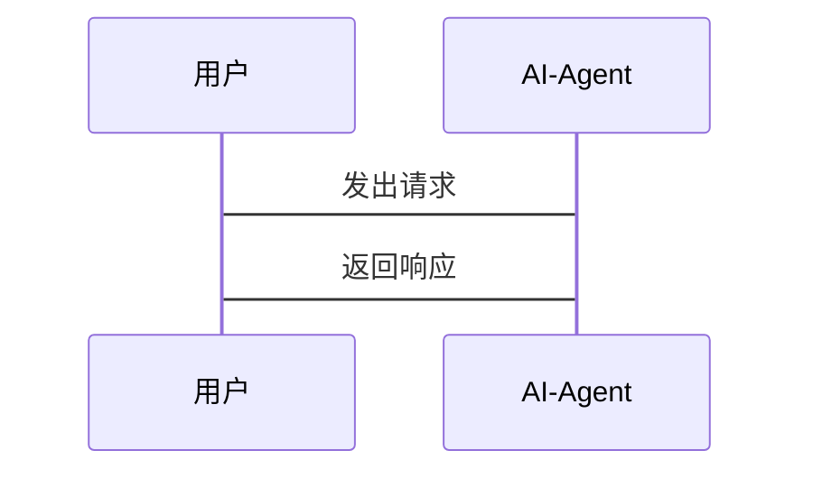

                 


```markdown
# AI Agent在智能工程设计中的应用

> 关键词：人工智能、智能工程、AI Agent、智能体设计、智能系统架构

> 摘要：本文深入探讨了AI Agent在智能工程设计中的应用，从基础概念到核心原理，再到系统架构和实际案例，全面分析了AI Agent在智能工程中的重要作用。通过详细讲解相关算法、数学模型和系统设计，本文为读者提供了从理论到实践的全面指南。

---

## 第一部分: AI Agent基础与核心概念

### 第1章: AI Agent概述

#### 1.1 AI Agent的基本概念
- 什么是AI Agent
- AI Agent的核心特征
- AI Agent与传统程序的区别

#### 1.2 AI Agent的分类
- 单智能体与多智能体系统
- 基于规则的AI Agent
- 基于模型的AI Agent
- 基于学习的AI Agent

#### 1.3 AI Agent的应用场景
- 智能推荐系统
- 自动化决策系统
- 智能对话系统
- 智慧城市中的AI Agent

### 第2章: AI Agent的核心原理

#### 2.1 知识表示与推理
- 知识表示的基本概念
- 常用的知识表示方法
- 推理机制的分类

#### 2.2 行为选择与决策
- 决策树的基本原理
- 基于强化学习的决策
- 基于概率的决策方法

#### 2.3 通信与协作
- 多智能体系统中的通信机制
- 协作任务的分配策略
- 冲突解决与协调

### 第3章: AI Agent的算法原理

#### 3.1 强化学习算法
- Q-learning算法
- Deep Q-Network (DQN)算法
- 策略梯度方法

#### 3.2 多智能体协作算法
- 基于博弈论的协作方法
- 基于分布式计算的协作方法
- 基于图神经网络的协作方法

#### 3.3 知识表示与推理算法
- 逻辑推理算法
- 概念图表示法
- 知识图谱构建算法

### 第4章: AI Agent的数学模型与公式

#### 4.1 强化学习的数学模型
- 状态空间的定义
- 动作空间的定义
- 奖励函数的定义
- Q-learning算法的数学公式
  $$ Q(s,a) = Q(s,a) + \alpha [r + \gamma \max Q(s',a') - Q(s,a)] $$

#### 4.2 多智能体协作的数学模型
- 博弈论模型
- 分布式计算模型
- 图神经网络模型

#### 4.3 知识表示的数学模型
- 命题逻辑表示
- 概率图表示
- 向量空间模型

### 第5章: AI Agent的系统架构与设计

#### 5.1 系统架构设计
- 单智能体架构
- 多智能体架构
- 分层架构

#### 5.2 系统功能设计
- 领域模型Mermaid类图


#### 5.3 系统架构设计Mermaid架构图


#### 5.4 系统接口设计
- 输入接口
- 输出接口
- 通信接口

#### 5.5 系统交互Mermaid序列图


---

## 第二部分: AI Agent在智能工程中的应用

### 第6章: 项目实战

#### 6.1 环境安装
- 安装Python
- 安装深度学习框架（如TensorFlow或PyTorch）
- 安装自然语言处理库（如spaCy或NLTK）
- 安装强化学习库（如OpenAI Gym）

#### 6.2 核心实现源代码
```python
# 示例：基于Q-learning的AI Agent实现
import numpy as np
import gym

class AI_Agent:
    def __init__(self, env):
        self.env = env
        self.q_table = np.zeros([env.observation_space.shape[0], env.action_space.n])
        self.learning_rate = 0.1
        self.discount_factor = 0.9

    def take_action(self, state):
        return np.argmax(self.q_table[state])

    def learn(self, state, action, reward, next_state):
        self.q_table[state][action] = self.q_table[state][action] + self.learning_rate * (reward + self.discount_factor * np.max(self.q_table[next_state]) - self.q_table[state][action])

# 创建环境并训练AI Agent
env = gym.make('CartPole-v0')
agent = AI_Agent(env)
for _ in range(1000):
    state = env.reset()
    while True:
        action = agent.take_action(state)
        next_state, reward, done, _ = env.step(action)
        agent.learn(state, action, reward, next_state)
        if done:
            break
```

#### 6.3 实际案例分析
- 案例1：智能推荐系统中的AI Agent
- 案例2：自动化决策系统中的AI Agent
- 案例3：智能对话系统中的AI Agent

---

## 第三部分: 总结与展望

### 第7章: 总结

#### 7.1 核心概念回顾
- AI Agent的基本概念
- AI Agent的核心原理
- AI Agent的系统架构

#### 7.2 实践经验总结
- 项目实战的经验
- 系统设计的注意事项
- 算法实现的关键点

### 第8章: 展望

#### 8.1 AI Agent技术的发展趋势
- 强化学习的未来发展方向
- 多智能体协作的未来研究
- 知识表示与推理的未来研究

#### 8.2 对智能工程的潜在影响
- AI Agent在智能工程中的未来应用
- 新兴技术对AI Agent的推动作用
- AI Agent与其他技术的融合

---

## 第四部分: 最佳实践与小结

### 第9章: 最佳实践 tips

#### 9.1 系统设计 tips
- 如何设计高效的AI Agent系统
- 系统架构设计的关键点
- 系统接口设计的注意事项

#### 9.2 项目开发 tips
- 项目开发的常见问题及解决方案
- 开发工具的选择与使用
- 代码实现的优化技巧

### 第10章: 小结

#### 10.1 本文总结
- AI Agent在智能工程设计中的核心作用
- 本文的主要内容和结论

#### 10.2 展望与建议
- 未来研究方向
- 对读者的建议
- 对技术发展的展望

---

## 第五部分: 注意事项与拓展阅读

### 第11章: 注意事项

#### 11.1 系统设计中的常见问题
- 系统架构设计中的误区
- 算法实现中的常见错误
- 系统测试中的注意事项

#### 11.2 开发中的注意事项
- 代码实现中的潜在问题
- 系统部署中的注意事项
- 维护与更新的要点

### 第12章: 拓展阅读

#### 12.1 推荐书籍
- 《深度学习》
- 《强化学习》
- 《多智能体系统》

#### 12.2 推荐论文
- 经典强化学习论文
- 多智能体协作的最新研究
- 知识表示与推理的前沿论文

---

## 结语

通过本文的详细讲解，读者可以全面了解AI Agent在智能工程设计中的应用，从理论到实践，掌握AI Agent的核心原理和实际开发技巧。希望本文能为读者在智能工程领域提供有价值的参考和启发。
```

