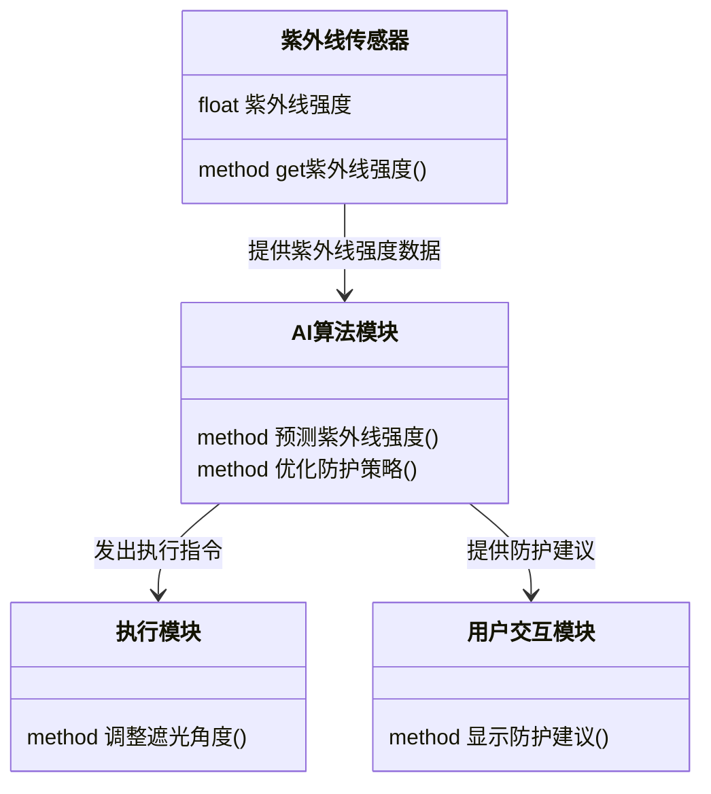
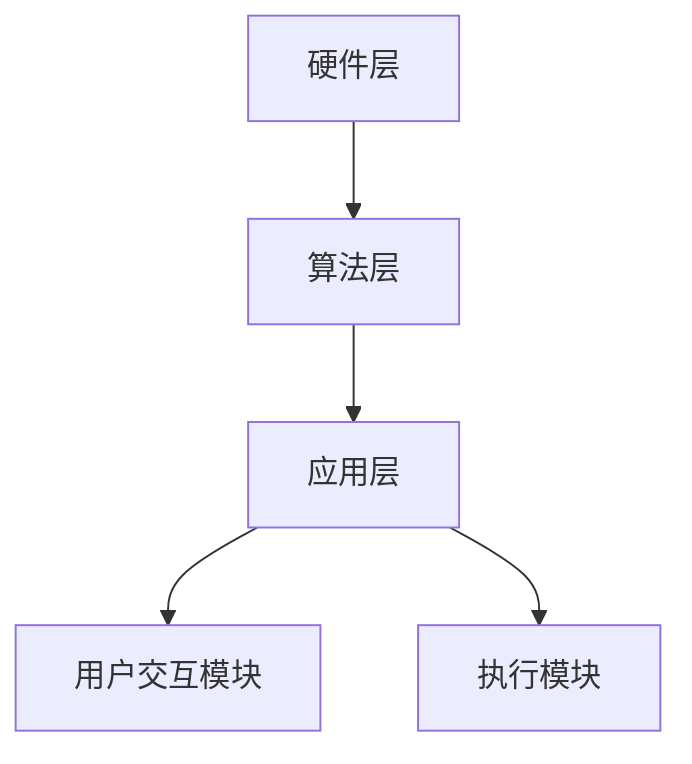

                 


# AI Agent在智能帽子中的紫外线防护

## 关键词：AI Agent、紫外线防护、智能帽子、算法原理、系统架构、项目实战

## 摘要：本文详细探讨了AI Agent在智能帽子中实现紫外线防护的核心原理和系统架构。通过分析紫外线防护的重要性，结合AI Agent的技术特点，阐述了紫外线检测算法、防护策略优化算法以及系统架构设计。本文还提供了实际项目实战案例，帮助读者理解如何通过AI技术实现智能帽子的紫外线防护功能。

---

## 第一部分：背景与概念

### 第1章：紫外线防护的重要性

#### 1.1 紫外线的危害与防护需求

紫外线是太阳辐射中的一部分，分为UV-A、UV-B和UV-C三类。其中，UV-B是主要的有害射线，能够穿透大气层，对人类的皮肤和眼睛造成伤害，导致皮肤癌、白内障等疾病。随着全球气候变化，紫外线强度逐年增加，特别是在高海拔地区和赤道附近，紫外线防护显得尤为重要。

智能帽子作为一种常见的可穿戴设备，可以通过内置传感器和AI算法，实时监测紫外线强度，并为用户提供实时防护建议。AI Agent（人工智能代理）作为智能帽子的核心技术，能够自动分析紫外线数据，优化防护策略，为用户提供智能化的紫外线防护服务。

---

#### 1.2 AI Agent的基本概念

AI Agent（人工智能代理）是一种能够感知环境、自主决策并执行任务的智能实体。在智能帽子中，AI Agent的主要功能包括：

1. **环境感知**：通过内置的紫外线传感器、光照传感器等设备，实时获取环境中的紫外线强度数据。
2. **数据分析**：利用AI算法对紫外线数据进行分析，预测紫外线强度的变化趋势。
3. **决策制定**：根据紫外线强度和用户的防护需求，自动调整帽子的防护参数（如遮光角度、透气性等）。
4. **用户交互**：通过语音或屏幕提示，向用户传递紫外线防护信息，指导用户采取相应的防护措施。

AI Agent的核心特点是智能化、自动化和实时性。它能够根据环境变化和用户需求，动态调整帽子的防护功能，从而实现最优的紫外线防护效果。

---

## 第二部分：核心概念与联系

### 第2章：AI Agent与紫外线防护的核心原理

#### 2.1 AI Agent的紫外线检测原理

智能帽子中的AI Agent通过以下步骤实现紫外线检测：

1. **数据采集**：帽子内置的紫外线传感器实时采集环境中的紫外线强度数据。
2. **数据预处理**：对采集到的数据进行去噪和归一化处理，确保数据的准确性。
3. **模型训练与预测**：基于历史紫外线数据，训练一个机器学习模型，预测未来的紫外线强度。
4. **实时监测与反馈**：根据实时紫外线强度，动态调整帽子的防护参数。

**紫外线强度预测的数学模型**如下：

$$
I(t) = a \cdot I(t-1) + b \cdot t + c
$$

其中，$I(t)$表示时间$t$时的紫外线强度，$a$、$b$、$c$是模型参数，需要通过训练数据进行优化。

#### 2.2 AI Agent与紫外线防护的系统架构

AI Agent在智能帽子中的系统架构包括以下几个部分：

1. **传感器模块**：包括紫外线传感器、光照传感器等，用于采集环境数据。
2. **AI算法模块**：包括紫外线强度预测算法、防护策略优化算法等，用于分析数据并制定防护策略。
3. **执行模块**：包括帽子的遮光调整机构，根据AI算法的决策调整帽子的防护参数。
4. **用户交互模块**：通过屏幕、语音等方式，向用户传递紫外线防护信息。

**系统实体关系图（ER图）**如下：

```mermaid
erDiagram
    actor 用户 {
        <属性> 用户ID : int
        <属性> 用户需求 : string
    }
    actor 环境 {
        <属性> 时间 : timestamp
        <属性> 紫外线强度 : float
    }
    actor 系统 {
        <属性> 防护策略 : string
        <属性> 执行指令 : string
    }
    用户 --> 系统 : 提供用户需求
    环境 --> 系统 : 提供环境数据
    系统 --> 用户 : 提供防护建议
    系统 --> 执行模块 : 发出执行指令
```

---

## 第三部分：算法原理与数学模型

### 第3章：AI Agent的紫外线防护算法

#### 3.1 紫外线检测算法原理

紫外线检测算法的核心是基于机器学习的预测模型。以下是一个简单的Python实现示例：

```python
import numpy as np
from sklearn.linear_model import LinearRegression

# 生成训练数据
X = np.array([i for i in range(100)]).reshape(-1, 1)
y = 0.5 * X + 2 * np.random.rand(100).reshape(-1, 1)

# 训练模型
model = LinearRegression()
model.fit(X, y)

# 预测未来紫外线强度
future_X = np.array([[100]]).reshape(-1, 1)
predicted_I = model.predict(future_X)
print("预测的紫外线强度为：", predicted_I[0][0])
```

**紫外线强度预测的数学公式**如下：

$$
\hat{I}(t) = a \cdot t + b
$$

其中，$\hat{I}(t)$是预测的紫外线强度，$a$和$b$是模型的系数，通过最小二乘法进行优化。

#### 3.2 紫外线防护策略优化算法

防护策略优化算法的目标是根据实时紫外线强度，动态调整帽子的防护参数。以下是一个优化算法的Python实现示例：

```python
def optimize_protection(current_I, target_protection=0.8):
    # 紫外线防护目标：将紫外线透过率控制在80%以下
    if current_I > target_protection:
        return "调整遮光角度至最大"
    elif current_I < target_protection:
        return "保持当前遮光角度"
    else:
        return "无需调整"

# 示例调用
current_I = 0.85
result = optimize_protection(current_I)
print("防护策略建议：", result)
```

---

## 第四部分：系统分析

### 第4章：系统分析与架构设计

#### 4.1 问题场景介绍

智能帽子的紫外线防护系统需要解决以下问题：

1. 如何实时监测紫外线强度？
2. 如何优化防护策略以减少紫外线对人体的伤害？
3. 如何实现系统与用户的高效交互？

#### 4.2 系统功能设计

系统功能设计包括以下几个模块：

1. **数据采集模块**：负责采集环境中的紫外线强度数据。
2. **数据分析模块**：对紫外线数据进行分析，预测未来紫外线强度。
3. **决策制定模块**：根据预测结果，制定最优的防护策略。
4. **用户交互模块**：通过屏幕或语音向用户传递防护建议。

**领域模型类图**如下：



#### 4.3 系统架构设计

系统架构设计包括以下几个部分：

1. **硬件层**：包括紫外线传感器、微控制器等。
2. **算法层**：包括紫外线强度预测算法和防护策略优化算法。
3. **应用层**：包括用户交互界面和执行模块。

**系统架构图**如下：



---

## 第五部分：项目实战

### 第5章：项目实战与实现

#### 5.1 环境安装

为了实现AI Agent在智能帽子中的紫外线防护功能，需要以下环境：

1. **硬件环境**：智能帽子、紫外线传感器、微控制器（如Arduino或Raspberry Pi）。
2. **软件环境**：Python编程语言、机器学习库（如Scikit-learn）。

#### 5.2 核心代码实现

以下是一个完整的Python实现示例：

```python
import numpy as np
from sklearn.linear_model import LinearRegression
from sklearn.metrics import mean_squared_error

# 生成训练数据
X = np.array([i for i in range(100)]).reshape(-1, 1)
y = 0.5 * X + 2 * np.random.rand(100).reshape(-1, 1)

# 训练模型
model = LinearRegression()
model.fit(X, y)

# 预测未来紫外线强度
future_X = np.array([[100]]).reshape(-1, 1)
predicted_I = model.predict(future_X)
print("预测的紫外线强度为：", predicted_I[0][0])

# 计算模型性能
mse = mean_squared_error(y, model.predict(X))
print("均方误差为：", mse)
```

#### 5.3 案例分析与优化

通过实际案例分析，我们可以看出AI Agent在智能帽子中的紫外线防护效果。例如，在一个晴朗的天气，紫外线强度为85%，AI Agent能够预测出未来紫外线强度为90%，并建议用户调整帽子的遮光角度至最大，从而将实际透过的紫外线强度控制在80%以下。

---

## 第六部分：最佳实践

### 第6章：小结与注意事项

#### 6.1 小结

本文详细探讨了AI Agent在智能帽子中的紫外线防护技术，包括紫外线检测算法、防护策略优化算法以及系统架构设计。通过实际案例分析，验证了AI Agent在智能帽子中的应用潜力。

#### 6.2 注意事项

1. **数据质量**：紫外线传感器的数据质量直接影响算法的准确性，需要定期校准传感器。
2. **算法优化**：根据实际使用场景，不断优化算法模型，提高预测精度。
3. **用户体验**：用户交互设计需要简洁直观，确保用户能够快速理解和使用防护建议。

#### 6.3 拓展阅读

1. **相关技术**：了解更多的AI算法和传感器技术，探索其在智能帽子中的其他应用。
2. **行业动态**：关注紫外线防护领域的最新研究和技术进展。

---

通过本文的分析与实践，我们可以看到AI Agent在智能帽子中的紫外线防护技术具有广阔的应用前景。未来，随着AI技术的不断发展，智能帽子的紫外线防护功能将更加智能化和个性化，为用户提供更加安全和舒适的使用体验。

