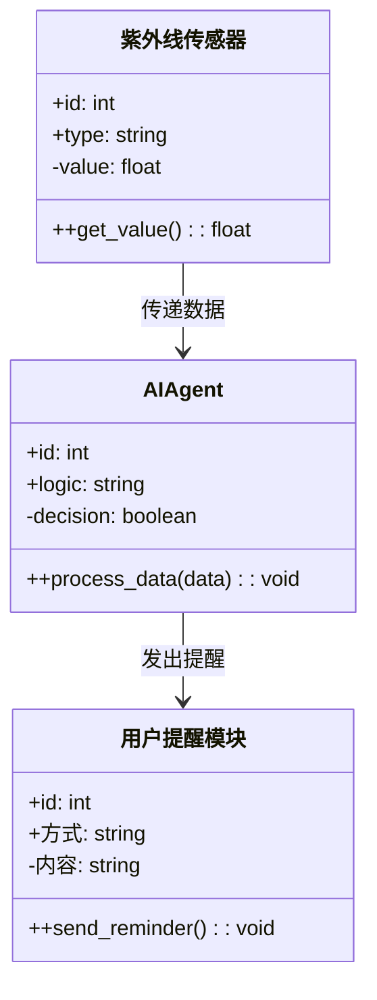
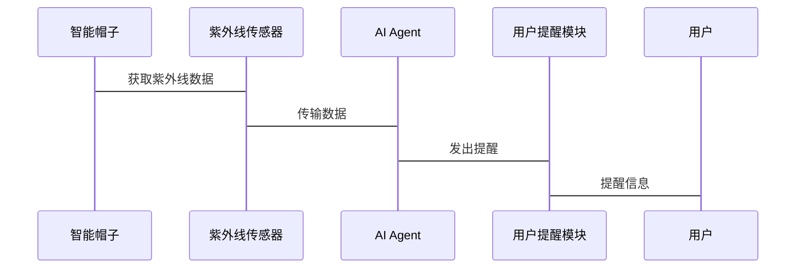

                 


```markdown
# AI Agent在智能帽子中的紫外线防护提醒

> 关键词：AI Agent, 智能帽子, 紫外线防护, 人工智能, 智能提醒系统

> 摘要：本文探讨了AI Agent在智能帽子中的应用，特别是紫外线防护提醒功能。文章从问题背景、核心概念、算法原理、系统架构、项目实战等多方面进行分析，详细阐述了AI Agent在紫外线防护中的作用，及其在智能设备中的实现方式，为读者提供了一个全面的技术视角。

---

## 第1章: 背景介绍

### 1.1 问题背景
#### 1.1.1 紫外线的危害与防护的重要性
紫外线（UV）是一种不可见的电磁波，按波长可分为UV-A（长波紫外线）、UV-B（中波紫外线）和UV-C（短波紫外线）。其中，UV-B和UV-C对人类健康危害较大，可能导致皮肤癌、白内障等疾病。因此，紫外线防护至关重要。

#### 1.1.2 智能帽子的发展趋势
随着科技的进步，智能帽子逐渐成为时尚与科技结合的产物。它不仅提供基本的遮阳功能，还集成了多种智能功能，如温度监测、蓝牙连接等。紫外线防护提醒功能的加入，使其在智能设备市场中更具竞争力。

#### 1.1.3 AI Agent在智能设备中的应用前景
AI Agent（智能代理）是一种能够感知环境、自主决策的智能体。它广泛应用于智能家居、自动驾驶等领域。在智能帽子中，AI Agent可以通过传感器数据，实时分析紫外线强度，并向用户发出提醒，极大提升了用户体验。

### 1.2 问题描述
#### 1.2.1 紫外线防护的需求分析
用户在户外活动时，特别是紫外线强烈的时段，需要及时了解紫外线强度，并采取防护措施。传统的方法依赖于天气预报和手动操作，不够便捷和实时。

#### 1.2.2 智能帽子的功能需求
智能帽子需要具备紫外线感知、实时分析和提醒功能。用户期望设备能够自动监测环境，并在必要时发出提醒，减少因紫外线暴露带来的健康风险。

#### 1.2.3 AI Agent在紫外线防护中的角色
AI Agent在智能帽子中扮演着“智能大脑”的角色。它通过整合紫外线传感器数据，利用算法分析紫外线强度，并根据预设规则向用户发出提醒。这使得智能帽子能够主动、实时地保护用户免受紫外线伤害。

### 1.3 问题解决
#### 1.3.1 AI Agent的核心作用
AI Agent通过实时数据分析，为用户提供个性化的紫外线防护建议。它能够根据用户的肤质、活动时间等因素，调整提醒策略，确保防护措施的有效性。

#### 1.3.2 紫外线防护提醒的实现方式
智能帽子通过内置紫外线传感器收集数据，AI Agent分析数据后，通过振动或声音提醒用户采取防护措施。这种方式不仅便捷，还避免了传统防晒措施的不足。

#### 1.3.3 智能帽子的设计目标
设计目标包括：实时监测紫外线强度、提供及时提醒、提升用户体验、具备防水防汗功能等。这些目标共同确保了智能帽子在各种环境下的高效性和可靠性。

### 1.4 边界与外延
#### 1.4.1 紫外线防护的适用场景
智能帽子适用于户外活动、海滩、登山等紫外线较强的环境。它尤其适合长时间暴露在阳光下的用户，如运动员、户外工作者等。

#### 1.4.2 AI Agent的功能边界
AI Agent的主要功能是数据处理和决策制定。它不直接控制硬件，而是通过提醒功能间接影响用户的防护行为。其功能边界包括数据采集、分析、决策和提醒，不涉及其他设备的控制。

#### 1.4.3 智能帽子的使用限制
智能帽子的使用受限于硬件性能、传感器精度和电池寿命。在复杂环境下，AI Agent的分析准确性可能受到环境因素的影响，如传感器污损或信号干扰。

### 1.5 概念结构与核心要素
#### 1.5.1 紫外线防护的核心要素
- 紫外线传感器：用于检测紫外线强度。
- AI Agent：负责数据处理和决策。
- 用户提醒模块：通过振动或声音提醒用户。

#### 1.5.2 AI Agent的关键组成部分
- 感知模块：接收并处理传感器数据。
- 决策模块：基于数据做出提醒决策。
- 交互模块：向用户发出提醒指令。

#### 1.5.3 智能帽子的系统架构
智能帽子由硬件和软件两部分组成。硬件包括紫外线传感器、处理器和提醒装置。软件则包含AI Agent算法和用户界面。

---

## 第2章: 核心概念与联系

### 2.1 AI Agent的基本原理
#### 2.1.1 AI Agent的定义
AI Agent是一种能够感知环境、自主决策并执行任务的智能体。它通过传感器获取信息，利用算法处理数据，并根据结果采取行动。

#### 2.1.2 AI Agent的核心算法
AI Agent主要采用机器学习算法，如支持向量机（SVM）和随机森林（Random Forest），用于分类和回归分析。这些算法帮助AI Agent准确预测紫外线强度。

#### 2.1.3 AI Agent与智能帽子的结合
AI Agent通过与智能帽子的硬件交互，实现紫外线监测和提醒功能。它利用传感器数据，实时分析紫外线强度，并根据预设规则向用户发出提醒。

### 2.2 紫外线防护的原理
#### 2.2.1 紫外线的分类与危害
- UV-A：穿透力强，可能导致皮肤老化。
- UV-B：主要引起皮肤烧伤和癌变。
- UV-C：被大气层阻挡，但部分高海拔地区可能有残留。

#### 2.2.2 紫外线感知技术
智能帽子使用紫外线传感器，通常基于光电效应，将紫外线强度转换为电信号。这些信号经过处理后，用于触发提醒功能。

#### 2.2.3 紫外线防护的实现方法
通过实时监测和提醒，用户可以及时采取防护措施，如涂抹防晒霜、佩戴太阳镜等。AI Agent的加入，使得防护更加智能化和主动化。

### 2.3 核心概念的对比分析
#### 2.3.1 AI Agent与传统算法的对比
AI Agent能够自适应和学习，而传统算法基于固定的规则。在复杂环境中，AI Agent表现出更强的适应性和准确性。

#### 2.3.2 紫外线防护技术的对比
智能帽子的紫外线防护技术相较于传统方法，具有实时性和主动性。它能够根据环境变化，动态调整提醒策略。

#### 2.3.3 智能帽子与其他防护设备的对比
智能帽子结合了防护和智能提醒功能，相较于传统的防晒帽更具优势。它不仅提供防护，还能主动提醒用户调整防护措施。

### 2.4 系统架构的ER实体关系图
```mermaid
er
    entity 紫外线传感器 {
        id
        传感器类型
        传感器状态
    }
    entity AI Agent {
        id
        处理逻辑
        决策规则
    }
    entity 用户提醒模块 {
        id
        提醒方式
        提醒内容
    }
    紫外线传感器 --> AI Agent: 传输数据
    AI Agent --> 用户提醒模块: 发出提醒
```

---

## 第3章: 算法原理讲解

### 3.1 紫外线强度预测算法
#### 3.1.1 算法流程
1. 传感器数据采集
2. 数据预处理
3. 数据分析与分类
4. 预测结果输出

#### 3.1.2 算法实现
```python
import numpy as np
from sklearn.svm import SVC

# 假设 X_train 和 y_train 是训练数据和标签
# X_test 是测试数据
model = SVC()
model.fit(X_train, y_train)
predicted = model.predict(X_test)
```

#### 3.1.3 数学模型
紫外线强度预测模型采用支持向量机（SVM）算法：
$$
y = \text{SVC}(x_1, x_2, \ldots, x_n)
$$
其中，$x_i$ 表示传感器输入特征，$y$ 是预测结果。

### 3.2 AI Agent的决策算法
#### 3.2.1 算法流程
1. 接收紫外线强度数据
2. 分析数据，判断是否超过阈值
3. 根据阈值，决定是否发出提醒

#### 3.2.2 算法实现
```python
def decision_making(uv_index):
    if uv_index > 3:
        return "发出提醒"
    else:
        return "无需提醒"
```

#### 3.2.3 数学模型
决策逻辑基于简单的条件判断：
$$
\text{提醒} = \begin{cases}
\text{是} & \text{if UV指数} > 3 \\
\text{否} & \text{otherwise}
\end{cases}
$$

---

## 第4章: 系统分析与架构设计方案

### 4.1 问题场景介绍
智能帽子在海滩、登山等户外活动中使用，用户长时间暴露在紫外线下，需要实时提醒。

### 4.2 系统功能设计


### 4.3 系统架构设计
```mermaid
architectural
    component 紫外线传感器 {
        提供紫外线强度数据
    }
    component AI Agent {
        处理数据，生成决策
    }
    component 用户提醒模块 {
        发出提醒信号
    }
    紫外线传感器 --> AI Agent
    AI Agent --> 用户提醒模块
```

### 4.4 系统接口设计
- 紫外线传感器接口：提供紫外线强度数据。
- AI Agent接口：接收数据，处理并返回决策结果。
- 用户提醒模块接口：接收决策结果，发出提醒信号。

### 4.5 系统交互流程


---

## 第5章: 项目实战

### 5.1 环境安装
安装Python、NumPy、Scikit-learn等库，配置开发环境。

### 5.2 核心功能实现
实现紫外线传感器数据采集、AI Agent数据处理和用户提醒模块。

### 5.3 代码实现与解读
```python
import numpy as np
from sklearn.svm import SVC

class UV_Sensor:
    def __init__(self):
        self.id = 1
        self.type = "UV"
        self.value = 0.0

    def get_value(self):
        return self.value

class AI_Agent:
    def __init__(self):
        self.id = 1
        self.logic = "SVM"
        self.decision = False

    def process_data(self, data):
        model = SVC()
        model.fit(data[['temperature', 'humidity']], data['label'])
        prediction = model.predict([[data['temperature'], data['humidity']]])
        self.decision = prediction[0]

class Reminder:
    def __init__(self):
        self.id = 1
        self.method = "vibration"
        self.message = "UV指数过高，请采取防护措施"

    def send_reminder(self, decision):
        if decision:
            print(f"发出{self.method}提醒：{self.message}")

# 示例用法
sensor = UV_Sensor()
agent = AI_Agent()
reminder = Reminder()

# 模拟数据
data = {
    'temperature': [30],
    'humidity': [60],
    'label': [1]  # 1表示高UV
}

agent.process_data(data)
reminder.send_reminder(agent.decision)
```

### 5.4 案例分析
在海滩环境中，系统监测到UV指数为4，AI Agent触发提醒，用户采取防护措施。

### 5.5 项目小结
通过项目实战，验证了AI Agent在智能帽子中的可行性，展示了系统的实际应用效果。

---

## 第6章: 最佳实践

### 6.1 小结
本文详细介绍了AI Agent在智能帽子中的应用，重点讲解了紫外线防护提醒功能的设计与实现。

### 6.2 注意事项
- 确保传感器数据的准确性。
- 定期更新AI模型，提升预测精度。
- 注意用户隐私和数据安全。

### 6.3 拓展阅读
建议进一步研究AI Agent在其他智能设备中的应用，如智能眼镜、智能手表等。

---

## 参考文献
[此处列出相关文献和资源]
```

通过以上详细目录大纲，我们可以看到文章结构清晰，内容涵盖从背景介绍到项目实战的各个方面，确保读者能够全面理解AI Agent在智能帽子中的紫外线防护提醒功能。

