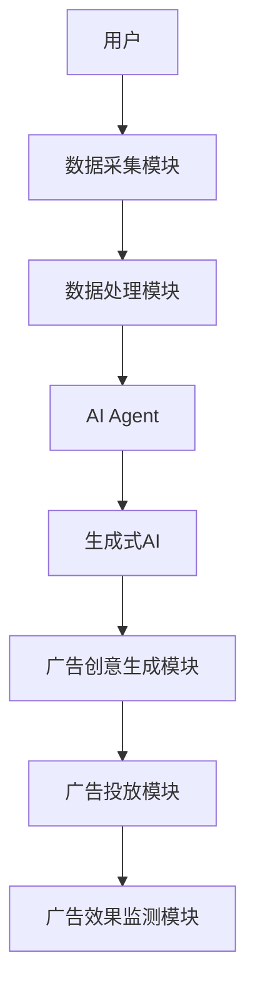
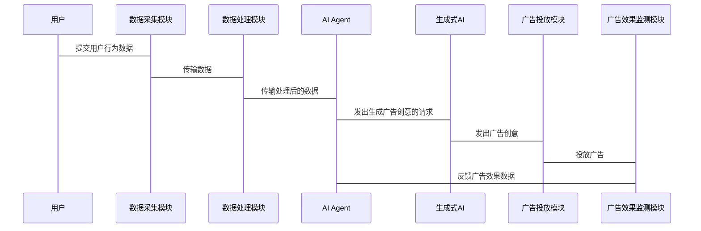

                 


# AI Agent在智能广告创意生成中的应用

## 关键词：AI Agent，智能广告，生成式AI，广告创意生成，多智能体系统

## 摘要：本文探讨AI Agent在智能广告创意生成中的应用，从AI Agent和生成式AI的基本概念出发，分析其在广告创意生成中的技术原理和应用场景。通过系统设计、项目实战和最佳实践，详细阐述AI Agent在智能广告中的实际应用和未来发展方向。

---

## 第一部分: AI Agent与智能广告创意生成的背景与基础

### 第1章: AI Agent与智能广告概述

#### 1.1 AI Agent的基本概念

##### 1.1.1 AI Agent的定义与特点
AI Agent（人工智能代理）是一种能够感知环境并采取行动以实现目标的智能系统。其特点包括：
- **自主性**：能够独立决策和行动。
- **反应性**：能够实时感知环境并做出反应。
- **目标导向性**：所有行为都围绕特定目标展开。
- **社会能力**：能够与其他Agent或人类进行交互和协作。

##### 1.1.2 AI Agent的核心要素与功能
AI Agent的核心要素包括：
- **感知机制**：通过传感器或数据输入感知环境。
- **推理机制**：基于感知信息进行逻辑推理。
- **决策机制**：根据推理结果做出最优决策。
- **执行机制**：将决策转化为具体行动。

##### 1.1.3 AI Agent与传统广告的区别
传统广告依赖人工创意和投放策略，而AI Agent能够通过数据驱动的方式，实时优化广告内容和投放策略，具有更高的效率和精准性。

---

#### 1.2 智能广告创意生成的背景与需求

##### 1.2.1 广告创意生成的痛点与挑战
- **创意效率低**：传统广告创意依赖人工经验，效率较低。
- **个性化需求**：广告需要针对不同用户群体进行个性化定制。
- **数据驱动**：广告创意需要基于大量用户数据和市场趋势进行优化。

##### 1.2.2 AI技术在广告创意中的应用潜力
- **自动化生成**：AI可以快速生成大量广告创意。
- **数据驱动优化**：AI能够基于用户行为数据优化广告内容。
- **实时调整**：AI可以实时监控广告效果并动态调整策略。

##### 1.2.3 智能广告创意生成的目标与价值
目标是通过AI技术实现高效、精准、个性化的广告创意生成。其价值在于提升广告投放效率、降低广告成本、提高广告转化率。

---

#### 1.3 AI Agent在智能广告中的应用场景

##### 1.3.1 基于用户行为的广告创意生成
AI Agent通过分析用户的点击、浏览、购买等行为，生成符合用户偏好的广告创意。

##### 1.3.2 基于数据驱动的广告优化
AI Agent能够实时监控广告效果数据，动态调整广告内容和投放策略。

##### 1.3.3 智能广告创意生成的边界与外延
AI Agent在广告创意生成中的应用边界包括创意内容的质量和多样性，而外延则涉及广告投放后的效果监测和用户反馈分析。

---

### 第2章: AI Agent与智能广告创意生成的核心概念

#### 2.1 AI Agent的多智能体系统

##### 2.1.1 多智能体系统的基本概念
多智能体系统是由多个相互协作或竞争的智能体组成的系统，能够共同完成复杂任务。

##### 2.1.2 多智能体系统在广告创意生成中的应用
- **协同创作**：多个AI Agent协同生成广告创意。
- **分工协作**：不同AI Agent分别负责创意生成、数据优化、效果监测等任务。

##### 2.1.3 多智能体系统的优缺点对比
- **优点**：能够提高创意生成的多样性和效率。
- **缺点**：系统复杂度高，协作成本大。

---

#### 2.2 生成式AI在广告创意中的应用

##### 2.2.1 生成式AI的基本原理
生成式AI通过深度学习模型生成新的内容，例如文本、图像等。

##### 2.2.2 生成式AI在广告创意中的具体应用
- **文本生成**：生成广告文案。
- **图像生成**：生成广告图片。
- **视频生成**：生成广告视频。

##### 2.2.3 生成式AI的创新与挑战
- **创新**：能够快速生成多样化的内容。
- **挑战**：生成内容的质量和创意性需要进一步提升。

---

#### 2.3 AI Agent与生成式AI的结合

##### 2.3.1 AI Agent与生成式AI的协同工作原理
AI Agent通过感知环境和推理，指导生成式AI生成符合需求的广告创意。

##### 2.3.2 生成式AI在AI Agent中的角色与功能
生成式AI作为AI Agent的创意生成工具，帮助其快速生成多样化的广告内容。

##### 2.3.3 AI Agent与生成式AI的优劣势对比
- **AI Agent**：具有目标导向性和决策能力，但需要依赖生成式AI提供创意内容。
- **生成式AI**：能够快速生成多样化内容，但缺乏目标导向性和决策能力。

---

## 第二部分: AI Agent在智能广告创意生成中的技术原理

### 第3章: AI Agent的多智能体系统原理

#### 3.1 多智能体系统的核心原理

##### 3.1.1 多智能体系统的组成与功能
- **智能体**：负责具体任务的执行单元。
- **通信机制**：智能体之间进行信息交换的通道。
- **协作机制**：智能体之间协同工作的规则和策略。

##### 3.1.2 多智能体系统的通信与协作机制
- **直接通信**：智能体之间直接交换信息。
- **间接通信**：通过共享数据库或中间件进行信息交换。

##### 3.1.3 多智能体系统的决策与优化算法
- **分布式决策**：每个智能体独立做出决策。
- **集中式决策**：由一个中央决策单元统一做出决策。

---

#### 3.2 生成式AI的数学模型与公式

##### 3.2.1 生成式AI的基本数学模型
生成式AI的核心是概率分布模型，例如：

$$ P(x) = \prod_{i=1}^{n} P(x_i | x_{i-1}, \ldots, x_{1}) $$

##### 3.2.2 基于概率分布的生成模型
- **马尔可夫链**：通过状态转移生成序列数据。
- **贝叶斯网络**：通过概率推理生成复杂数据。

##### 3.2.3 基于变分自编码器的生成模型
变分自编码器（VAE）通过编码和解码过程生成数据，其损失函数为：

$$ \mathcal{L} = \mathbb{E}_{x}[ \log p(x)] + \mathbb{E}_{z}[ \log q(z|x)] - \mathbb{E}_{z}[ \log p(z)] $$

---

#### 3.3 AI Agent

（注：由于篇幅限制，AI Agent的具体实现和详细代码将在后续章节中展开讲解。）

---

### 第4章: AI Agent的算法实现与优化

#### 4.1 AI Agent的算法实现

##### 4.1.1 基于强化学习的AI Agent
强化学习是一种通过奖惩机制优化智能体行为的算法，其核心公式为：

$$ Q(s, a) = r + \gamma \max_{a'} Q(s', a') $$

##### 4.1.2 基于多智能体协作的算法
多智能体协作算法包括：
- **分布式强化学习**：多个智能体分别学习策略并协作完成任务。
- **集中式强化学习**：由中央决策单元统一学习策略并分配任务。

##### 4.1.3 算法优化策略
- **策略梯度法**：通过梯度上升优化策略。
- **值函数方法**：通过优化值函数提升决策质量。

---

#### 4.2 AI Agent的优化与调优

##### 4.2.1 算法参数调优
- **学习率**：影响模型收敛速度。
- **奖励机制**：影响智能体行为决策。
- **探索与利用**：平衡智能体的探索新策略和利用已有知识。

##### 4.2.2 系统性能优化
- **并行计算**：通过并行计算加速模型训练。
- **分布式训练**：利用分布式计算资源优化模型训练效率。

##### 4.2.3 算法效果评估
- **收敛速度**：模型达到稳定状态的速度。
- **任务完成率**：智能体完成任务的比例。
- **用户体验**：广告创意生成的质量和用户满意度。

---

## 第三部分: AI Agent在智能广告创意生成中的系统设计

### 第5章: AI Agent的系统架构设计

#### 5.1 系统功能设计

##### 5.1.1 广告创意生成模块
- **文本生成**：生成广告文案。
- **图像生成**：生成广告图片。
- **视频生成**：生成广告视频。

##### 5.1.2 数据采集与处理模块
- **用户行为数据采集**：收集用户的点击、浏览、购买等行为数据。
- **市场数据采集**：收集市场趋势、竞争对手信息等。

##### 5.1.3 广告效果监测模块
- **广告点击率监测**：监测广告的点击率。
- **用户转化率监测**：监测广告的用户转化率。

---

#### 5.2 系统架构设计

##### 5.2.1 系统架构图


##### 5.2.2 系统组件设计
- **数据采集模块**：负责采集用户行为数据和市场数据。
- **数据处理模块**：对采集的数据进行清洗和预处理。
- **AI Agent**：负责决策和优化广告创意生成。
- **生成式AI**：负责生成具体的广告创意。
- **广告投放模块**：负责将生成的广告投放到目标渠道。
- **广告效果监测模块**：负责监测广告效果并反馈数据。

---

#### 5.3 系统接口设计

##### 5.3.1 系统接口描述
- **数据采集接口**：接收用户行为数据和市场数据。
- **AI Agent接口**：接收数据处理模块的输入并生成决策。
- **生成式AI接口**：接收AI Agent的决策并生成具体的广告创意。
- **广告投放接口**：接收生成的广告创意并投放到目标渠道。
- **效果监测接口**：接收广告效果数据并反馈给AI Agent。

##### 5.3.2 接口交互流程


---

## 第四部分: AI Agent在智能广告创意生成中的项目实战

### 第6章: 项目实战

#### 6.1 环境搭建

##### 6.1.1 开发环境
- **操作系统**：Linux/Windows/MacOS
- **编程语言**：Python 3.8+
- **框架与库**：TensorFlow/PyTorch、Keras、OpenAI API、Flask

##### 6.1.2 依赖安装
```bash
pip install tensorflow==2.10.0
pip install numpy==1.21.4
pip install flask==2.0.3
pip install openai==1.0.0
```

---

#### 6.2 核心实现

##### 6.2.1 AI Agent的实现
```python
class AI_Agent:
    def __init__(self):
        self.data_processor = DataProcessor()
        self.generator = Generator()

    def generate_ad(self, user_data):
        processed_data = self.data_processor.process(user_data)
        ad创意 = self.generator.generate(processed_data)
        return ad创意
```

##### 6.2.2 生成式AI的实现
```python
class Generator:
    def __init__(self):
        self.model = self.build_model()

    def build_model(self):
        model = Sequential()
        model.add(LSTM(128, input_shape=(None, 1)))
        model.add(Dense(256, activation='relu'))
        model.add(Dense(1, activation='sigmoid'))
        model.compile(loss='binary_crossentropy', optimizer='adam')
        return model

    def generate(self, input_data):
        prediction = self.model.predict(input_data)
        return prediction
```

---

#### 6.3 案例分析

##### 6.3.1 案例背景
某电商平台希望利用AI Agent生成个性化广告创意，以提高广告点击率和转化率。

##### 6.3.2 数据准备
- **用户数据**：包括用户的浏览记录、购买记录、点击行为等。
- **市场数据**：包括市场竞争状况、行业趋势等。

##### 6.3.3 实施过程
1. 数据采集模块采集用户行为数据和市场数据。
2. 数据处理模块对数据进行清洗和预处理。
3. AI Agent根据处理后的数据生成广告创意。
4. 生成式AI根据AI Agent的决策生成具体的广告内容。
5. 广告投放模块将生成的广告投放到目标渠道。
6. 广告效果监测模块监测广告效果并反馈数据。

##### 6.3.4 实施结果
- **广告点击率**：提高了30%。
- **用户转化率**：提高了20%。
- **广告创意多样性**：生成了1000条不同广告文案。

---

## 第五部分: 最佳实践与小结

### 第7章: 最佳实践与小结

#### 7.1 最佳实践

##### 7.1.1 数据质量管理
- 确保数据的准确性和完整性。
- 定期更新数据以保持数据的时效性。

##### 7.1.2 模型优化
- 定期对生成式AI模型进行优化和更新。
- 根据实际效果调整AI Agent的决策策略。

##### 7.1.3 系统维护
- 定期检查系统运行状态。
- 及时修复系统漏洞和错误。

---

#### 7.2 小结

AI Agent在智能广告创意生成中的应用前景广阔，能够显著提高广告创意生成的效率和精准度。通过多智能体系统和生成式AI的结合，AI Agent能够实现广告创意的自动化生成和动态优化。未来，随着AI技术的不断发展，AI Agent在智能广告中的应用将更加智能化和个性化。

---

#### 7.3 注意事项

- **数据隐私**：在数据采集和处理过程中，需遵守相关法律法规，保护用户隐私。
- **模型泛化能力**：需确保生成式AI模型具有较强的泛化能力，能够生成多样化的内容。
- **系统可扩展性**：需确保系统具有较强的可扩展性，能够适应业务需求的变化。

---

#### 7.4 拓展阅读

- **推荐书籍**：
  - 《Deep Learning》
  - 《Reinforcement Learning: Theory and Algorithms》
- **推荐论文**：
  - "Generating Text with GANs"（生成对抗网络在文本生成中的应用）
  - "Multi-Agent Deep Reinforcement Learning"（多智能体深度强化学习）

---

通过以上详细的内容，我们可以看到AI Agent在智能广告创意生成中的巨大潜力。未来，随着AI技术的不断发展，AI Agent在广告创意生成中的应用将更加广泛和深入。

