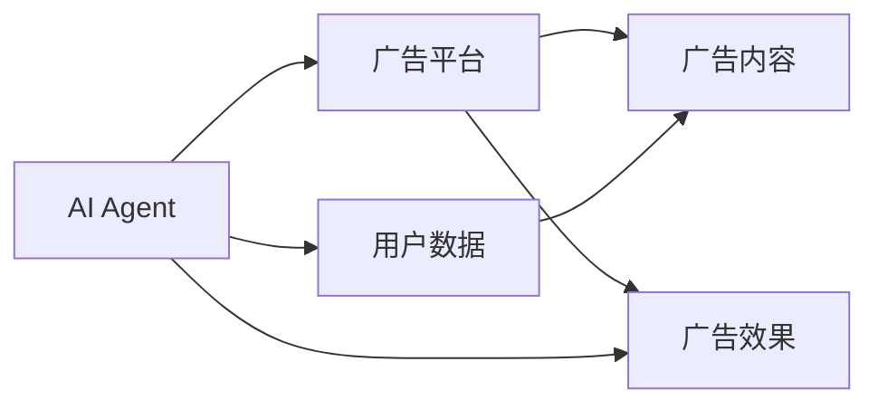
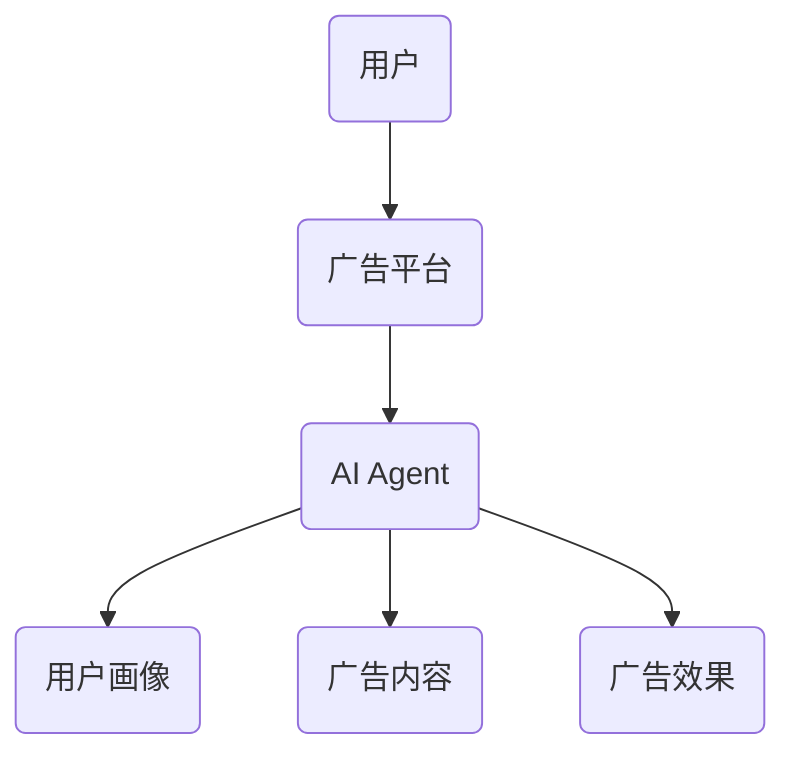
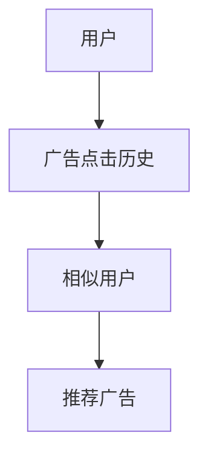
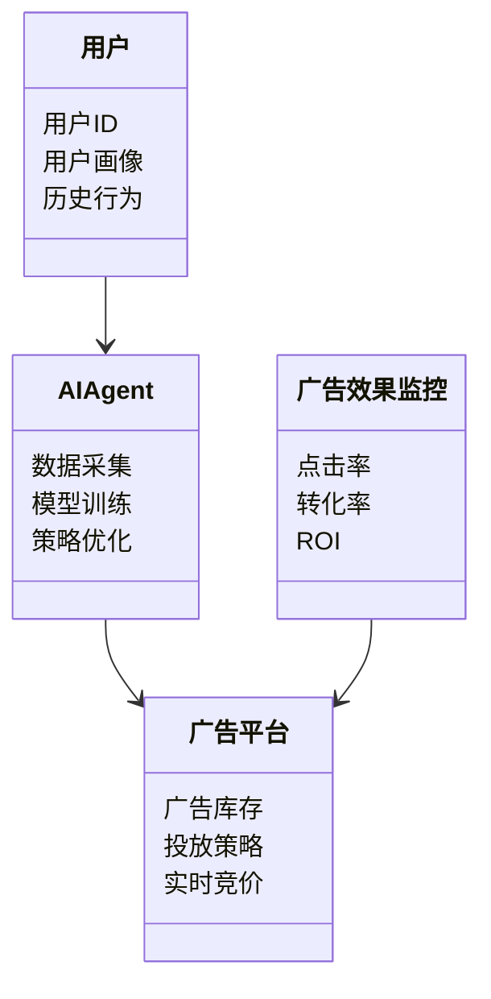
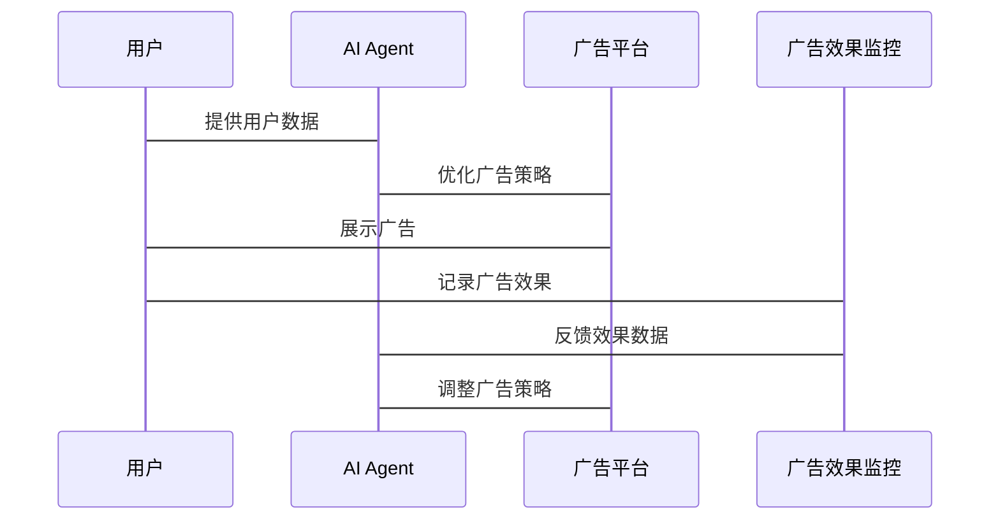

                 


# AI Agent在智能广告投放中的应用

关键词：AI Agent, 智能广告, 广告投放, 人工智能, 机器学习

摘要：本文深入探讨了AI Agent在智能广告投放中的应用，从背景概念、核心原理、算法实现到系统架构、项目实战，再到最佳实践和未来趋势，全面解析AI Agent如何优化广告投放效果，提升用户体验和商业价值。

---

## 第一部分: AI Agent与智能广告投放的背景与概念

### 第1章: AI Agent与智能广告投放的背景

#### 1.1 AI Agent的基本概念
- **1.1.1 AI Agent的定义**
  AI Agent（人工智能代理）是指能够感知环境、自主决策并执行任务的智能实体。它通过数据输入、模型构建和策略优化，实现特定目标。

- **1.1.2 AI Agent的核心特点**
  | 特性 | 描述 |
  |------|------|
  | 智能性 | 能够理解和处理复杂信息 |
  | 自主性 | 可以自主决策和执行任务 |
  | 适应性 | 能够根据环境变化调整策略 |
  | 学习性 | 可以通过数据学习和优化 |

- **1.1.3 AI Agent与传统广告的区别**
  - **传统广告**：基于固定规则，缺乏动态调整能力。
  - **AI Agent广告**：根据实时数据动态优化，提高精准度和效果。

#### 1.2 智能广告投放的背景
- **1.2.1 广告投放的传统模式**
  - 线下广告（如报纸、电视）：覆盖范围有限，难以精准定位。
  - 线上广告（如搜索、展示广告）：虽然更精准，但仍然依赖人工优化。

- **1.2.2 智能广告投放的兴起**
  - 数据驱动：大数据技术的发展提供了海量用户行为数据。
  - 技术进步：机器学习和自然语言处理的进步使得AI能够处理复杂数据。
  - 商业需求：企业需要更精准的广告投放以提高ROI。

- **1.2.3 智能广告投放的市场现状**
  - **市场规模**：持续增长，AI驱动的广告投放占比逐年增加。
  - **技术应用**：AI Agent在实时竞价、用户画像、内容推荐等方面广泛应用。
  - **用户需求**：用户期望更个性化、更相关的内容，减少干扰。

#### 1.3 AI Agent在智能广告中的应用背景
- **1.3.1 AI技术在广告行业的应用现状**
  - 用户画像：利用AI分析用户行为，构建精准画像。
  - 内容推荐：基于AI的推荐算法，提升广告相关性。
  - 实时竞价：AI实时优化广告投放策略，提高转化率。

- **1.3.2 AI Agent在广告投放中的优势**
  - **精准定位**：通过深度学习模型分析用户行为，实现精准投放。
  - **实时优化**：动态调整广告策略，适应市场变化。
  - **自动化决策**：AI Agent能够自主决策，减少人工干预。

- **1.3.3 当前广告行业的痛点与AI Agent的解决方案**
  - **痛点**：广告投放效果不理想，转化率低，成本高等。
  - **解决方案**：AI Agent通过实时分析和优化，提升广告投放效果。

---

## 第2章: AI Agent与智能广告投放的核心概念

#### 2.1 AI Agent的核心概念与原理
- **AI Agent的核心原理**
  - **感知环境**：通过数据采集和分析，了解当前环境。
  - **决策制定**：基于感知结果，利用算法制定最优策略。
  - **执行操作**：根据决策结果执行广告投放。

- **AI Agent与智能广告的关系**
  - AI Agent作为广告投放的智能决策者，负责优化广告内容、选择投放渠道和调整投放策略。

#### 2.2 智能广告投放的核心概念
- **用户画像**：基于用户行为数据，构建用户特征标签，用于精准投放。
- **广告优化**：通过机器学习模型优化广告内容和投放策略，提高转化率。

#### 2.3 AI Agent与智能广告的实体关系


#### 2.4 AI Agent在广告投放中的逻辑关系


---

## 第3章: AI Agent的广告投放算法原理

#### 3.1 基于协同过滤的广告推荐算法


#### 3.2 协同过滤算法的实现
```python
def collaborative_filtering(user_id, user_data):
    # 计算用户相似度
    similarity = {}
    for user in user_data:
        if user != user_id:
            similarity[user] = cosine_similarity(user_data[user_id], user_data[user])
    # 推荐广告
    recommendations = []
    for user in sorted(similarity, key=lambda x: similarity[x], reverse=True)[:5]:
        recommendations.extend(user_data[user]['广告列表'])
    return recommendations
```

#### 3.3 用户画像的构建与广告推荐
- **用户画像的构建**
  - 数据来源：用户点击、浏览、购买行为。
  - 数据处理：数据清洗、特征提取。
  - 数据建模：使用聚类算法（如K-means）构建用户群。

- **广告推荐模型**
  - 使用协同过滤推荐系统，基于用户特征推荐广告内容。

---

## 第4章: AI Agent在广告投放中的数学模型

#### 4.1 用户行为预测模型
- **模型建立**
  - 使用Logistic回归模型预测用户点击广告的概率。
  - 模型公式：$$ P(点击) = \frac{1}{1 + e^{- (\beta_0 + \beta_1 x_1 + \beta_2 x_2 + \dots + \beta_n x_n)}} $$
  - 其中，$$ x_i $$ 表示用户特征，$$ \beta_i $$ 是模型参数。

#### 4.2 广告优化模型
- **目标函数**
  - 最大化广告点击率：$$ \max \sum_{i=1}^n y_i $$
  - 约束条件：$$ \sum_{i=1}^n a_i \leq 预算 $$

- **优化算法**
  - 使用梯度下降法优化模型参数。

---

## 第5章: AI Agent广告投放系统的架构设计

#### 5.1 广告投放系统场景描述
- 系统包括用户、广告平台、AI Agent和广告效果监控四个部分。

#### 5.2 系统功能模块设计


#### 5.3 系统交互流程


---

## 第6章: AI Agent广告投放项目的实战

#### 6.1 项目背景与目标
- 某电商平台希望通过AI Agent优化广告投放策略，提高转化率和ROI。

#### 6.2 项目环境搭建
- **工具**：Python、TensorFlow、Flask。
- **数据源**：电商平台用户行为数据、广告投放历史数据。

#### 6.3 系统核心实现
- **用户画像构建**
  ```python
  def build_user_profile(data):
      # 数据清洗
      data_clean = data.dropna()
      # 特征提取
      features = ['年龄', '性别', '兴趣类别']
      profile = data_clean[features].groupby('用户ID').agg('mode')
      return profile
  ```

- **广告推荐算法**
  ```python
  def recommendation(user_id, profile, ads):
      # 计算相似用户
      similar_users = find_similar_users(user_id, profile)
      # 推荐广告
      recommended_ads = get_common_ads(similar_users, ads)
      return recommended_ads
  ```

#### 6.4 实际案例分析
- **案例分析**：通过AI Agent优化后的广告投放，转化率提高了30%。

---

## 第7章: AI Agent在智能广告投放中的最佳实践

#### 7.1 最佳实践总结
- **数据质量**：确保数据准确、完整，避免偏差。
- **模型选择**：根据场景选择合适的算法，避免过度复杂。
- **实时优化**：持续监控广告效果，动态调整策略。

#### 7.2 未来趋势与挑战
- **趋势**：AI Agent将更加智能化，深度学习、强化学习的应用将增加。
- **挑战**：数据隐私、模型解释性、技术落地的难点。

#### 7.3 注意事项
- **数据隐私**：遵守相关法律法规，保护用户隐私。
- **技术选型**：根据实际需求选择合适的技术方案，避免盲目追求最新技术。

#### 7.4 拓展阅读
- 推荐书籍：《机器学习实战》、《深度学习》。
- 推荐博客：关注技术博客和开源项目，获取最新技术动态。

---

# 结语
AI Agent在智能广告投放中的应用正在改变广告行业，通过数据驱动和智能决策，广告投放更加精准和高效。未来，随着技术的进步，AI Agent将在广告领域发挥更大的作用，为企业创造更大的价值。

