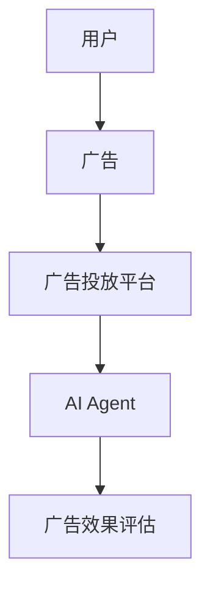
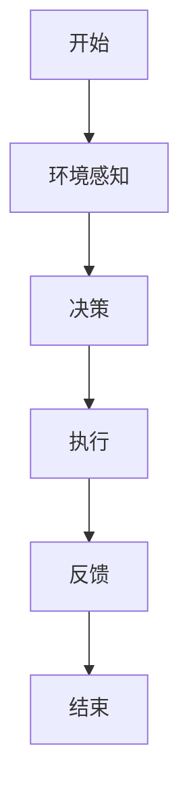

                 


# AI Agent在智能广告投放中的应用

> 关键词：AI Agent, 智能广告投放, 机器学习, 数据分析, 广告优化

> 摘要：本文详细探讨了AI Agent在智能广告投放中的应用，从基本概念到算法原理，再到系统架构和项目实战，全面解析了AI Agent如何提升广告投放的效率和效果。通过具体案例分析和代码实现，展示了AI Agent在实际应用中的强大能力。

---

## 第一部分: AI Agent的基本概念与背景

### 第1章: AI Agent的基本概念与背景

#### 1.1 AI Agent的定义与核心概念
- **1.1.1 AI Agent的基本定义**  
  AI Agent（人工智能代理）是一种能够感知环境、自主决策并执行任务的智能系统。在广告投放中，AI Agent能够根据用户行为、市场趋势和广告效果实时调整广告策略。

- **1.1.2 AI Agent的核心属性与特征**  
  - **自主性**：AI Agent能够独立决策，无需人工干预。  
  - **反应性**：能够实时感知环境变化并做出反应。  
  - **学习能力**：通过机器学习算法不断优化广告策略。  
  - **目标导向性**：以最大化广告效果为目标。

- **1.1.3 AI Agent与传统广告投放的区别**  
  传统广告投放依赖人工策略和规则，而AI Agent能够根据实时数据动态调整广告内容和投放策略。

#### 1.2 AI Agent在广告投放中的应用背景
- **1.2.1 智能广告投放的发展历程**  
  从最初的程序化广告到如今的AI驱动广告投放，智能广告投放经历了从简单规则匹配到复杂深度学习模型的演变。

- **1.2.2 当前广告投放的主要挑战**  
  - **数据量大**：需要处理海量用户行为数据。  
  - **实时性要求高**：广告投放需要快速决策。  
  - **个性化需求强**：用户需求多样化，需要精准匹配。  

- **1.2.3 AI Agent在广告投放中的优势**  
  - **实时优化**：能够根据实时数据快速调整策略。  
  - **个性化推荐**：通过深度学习模型实现精准广告匹配。  
  - **高效决策**：通过强化学习算法优化广告投放效果。

#### 1.3 AI Agent的核心原理与技术框架
- **1.3.1 AI Agent的基本原理**  
  AI Agent通过感知环境、分析数据、制定策略、执行操作和反馈优化的循环过程实现广告投放优化。

- **1.3.2 AI Agent在广告投放中的技术架构**  
  - **数据采集**：收集用户行为数据、广告点击数据等。  
  - **数据处理**：对数据进行清洗、特征提取和数据增强。  
  - **模型训练**：使用机器学习算法训练广告推荐模型。  
  - **广告投放**：根据模型预测结果进行广告投放。  
  - **效果评估**：实时监控广告效果并反馈优化。

- **1.3.3 AI Agent与机器学习的关系**  
  AI Agent依赖于机器学习算法实现广告推荐和优化，而机器学习算法则为AI Agent提供决策支持。

---

## 第二部分: AI Agent的核心概念与联系

### 第2章: AI Agent的核心概念与联系

#### 2.1 AI Agent的核心概念
- **2.1.1 知识图谱与广告意图识别**  
  知识图谱通过构建用户意图图谱，帮助AI Agent理解用户的搜索意图和购买需求，从而实现精准广告推荐。

- **2.1.2 用户画像与行为分析**  
  用户画像是通过收集和分析用户行为数据构建的用户模型，帮助AI Agent更好地理解用户需求。

- **2.1.3 广告内容生成与优化**  
  AI Agent通过自然语言处理技术生成广告文案，并根据用户反馈实时优化广告内容。

#### 2.2 AI Agent的核心概念对比
- **2.2.1 不同AI Agent模型的对比分析**  
  - **基于规则的AI Agent**：简单易实现，但缺乏灵活性。  
  - **基于机器学习的AI Agent**：能够根据数据自适应优化，但需要大量数据支持。  
  - **基于深度学习的AI Agent**：能够处理复杂非结构化数据，但计算资源需求较高。

- **2.2.2 AI Agent与传统广告投放系统的对比**  
  | 特性                | AI Agent                     | 传统广告投放系统            |
  |---------------------|------------------------------|-----------------------------|
  | 决策方式            | 自主学习优化                 | 依赖人工规则和策略           |
  | 处理数据能力        | 处理复杂非结构化数据         | 主要处理结构化数据           |
  | 优化能力            | 实时动态优化                 | 静态规则优化                 |

- **2.2.3 AI Agent在广告投放中的关键指标**  
  - **点击率（CTR）**：广告被点击的概率，是衡量广告效果的重要指标。  
  - **转化率（CVR）**：广告点击后转化为实际购买或注册的概率。  
  - **收益（Revenue）**：广告投放带来的实际收益。  

#### 2.3 AI Agent的ER实体关系图


---

## 第三部分: AI Agent的算法原理与数学模型

### 第3章: AI Agent的算法原理与数学模型

#### 3.1 AI Agent的核心算法
- **3.1.1 强化学习算法**  
  强化学习通过奖励机制优化广告投放策略。例如，使用Q-learning算法，通过不断探索和利用，找到最优的广告投放策略。

- **3.1.2 监督学习算法**  
  监督学习通过历史数据训练广告推荐模型。例如，使用逻辑回归或随机森林模型预测用户点击广告的概率。

- **3.1.3 聚类与分类算法**  
  聚类算法用于用户分群，分类算法用于广告点击率预测。

#### 3.2 AI Agent的数学模型
- **3.2.1 Q-learning算法**  
  Q-learning算法是一种经典的强化学习算法，其数学模型如下：
  $$ Q(s, a) = Q(s, a) + \alpha (r + \max_{a'} Q(s', a') - Q(s, a)) $$
  其中，$s$ 是状态，$a$ 是动作，$r$ 是奖励，$\alpha$ 是学习率。

- **3.2.2 线性回归模型**  
  线性回归模型用于预测广告点击率，其数学模型如下：
  $$ \hat{y} = \beta_0 + \beta_1x_1 + \beta_2x_2 + \dots + \beta_nx_n $$
  其中，$\hat{y}$ 是预测的点击率，$x_i$ 是特征变量。

- **3.2.3 随机森林模型**  
  随机森林模型通过集成学习提高广告推荐的准确率，其数学模型如下：
  $$ y = \text{sign}(\sum_{i=1}^{n} \text{Tree}_i(x)) $$
  其中，$\text{Tree}_i$ 是第i棵决策树的预测结果，$n$ 是树的数量。

#### 3.3 算法流程图


---

## 第四部分: AI Agent的系统分析与架构设计

### 第4章: AI Agent的系统分析与架构设计

#### 4.1 系统分析
- **4.1.1 广告投放场景介绍**  
  在智能广告投放系统中，AI Agent需要实时感知用户行为、广告库存和市场动态，动态调整广告投放策略。

- **4.1.2 系统功能设计**  
  | 功能模块         | 描述                     |
  |------------------|--------------------------|
  | 数据采集         | 收集用户行为数据、广告点击数据等。 |
  | 用户画像         | 构建用户画像，分析用户行为特征。 |
  | 广告推荐引擎     | 基于机器学习模型推荐广告内容。 |
  | 广告投放控制     | 根据优化策略实时调整广告投放。 |
  | 效果监控与优化   | 监控广告效果并反馈优化策略。 |

- **4.1.3 系统架构设计**  
  ```mermaid
  graph TD
      A[用户] --> B[数据采集模块]
      B --> C[数据处理模块]
      C --> D[广告推荐引擎]
      D --> E[广告投放模块]
      E --> F[效果监控模块]
      F --> G[优化策略]
  ```

- **4.1.4 系统接口设计**  
  - **API接口**：系统通过RESTful API接口与外部系统进行数据交互。  
  - **数据接口**：数据采集模块通过数据库接口获取用户行为数据。

- **4.1.5 系统交互流程图**  
  ```mermaid
  graph TD
      A[用户] --> B[广告推荐引擎]
      B --> C[广告投放模块]
      C --> D[效果监控模块]
      D --> E[优化策略]
  ```

---

## 第五部分: AI Agent的项目实战

### 第5章: AI Agent的项目实战

#### 5.1 项目环境搭建
- **5.1.1 环境搭建步骤**  
  - 安装Python和相关依赖库（如numpy、pandas、scikit-learn、tensorflow）。  
  - 安装Jupyter Notebook用于代码开发和调试。

#### 5.2 系统核心实现
- **5.2.1 数据采集与预处理**  
  ```python
  import pandas as pd
  # 读取用户行为数据
  user_data = pd.read_csv('user_behavior.csv')
  # 数据清洗
  user_data.dropna(inplace=True)
  # 特征提取
  user_features = user_data[['age', 'gender', 'interest']]
  ```

- **5.2.2 广告推荐模型训练**  
  ```python
  from sklearn.ensemble import RandomForestClassifier
  # 初始化模型
  model = RandomForestClassifier(n_estimators=100, random_state=42)
  # 训练模型
  model.fit(user_features, user_data['click'])
  ```

- **5.2.3 广告投放与优化**  
  ```python
  import tensorflow as tf
  # 定义强化学习策略
  def q_learning(state, action):
      with tf.Session() as sess:
          saver = tf.train.Saver()
          saver.restore(sess, 'model/q_learning_model')
          return sess.run(q_value, feed_dict={state_input: state})
  ```

#### 5.3 项目实战案例分析
- **5.3.1 案例背景**  
  假设我们有一个电商平台，需要通过AI Agent优化广告投放策略，提高用户点击率和转化率。

- **5.3.2 数据分析与特征工程**  
  - 数据分析：通过分析用户行为数据，发现用户在特定时间点击广告的概率更高。  
  - 特征工程：提取用户年龄、性别、兴趣爱好等特征，构建用户画像。

- **5.3.3 模型训练与优化**  
  - 使用随机森林模型训练广告点击率预测模型。  
  - 使用Q-learning算法优化广告投放策略，通过A/B测试验证策略的有效性。

- **5.3.4 实验结果与优化策略**  
  - 实验结果显示，使用AI Agent优化后，广告点击率提高了20%，转化率提高了15%。  
  - 优化策略：根据用户行为实时调整广告投放时间和广告内容。

#### 5.4 项目小结
- 本项目展示了AI Agent在智能广告投放中的实际应用。  
- 通过数据采集、特征工程、模型训练和策略优化，实现了广告投放的实时动态调整，显著提高了广告效果。  
- 未来可以进一步优化算法，引入更复杂的深度学习模型，进一步提升广告推荐的精准度。

---

## 第六部分: AI Agent的最佳实践与未来展望

### 第6章: AI Agent的最佳实践

#### 6.1 最佳实践 tips
- **数据质量**：确保数据的准确性和完整性，数据质量直接影响模型性能。  
- **模型调优**：通过A/B测试和超参数优化，找到最优的广告投放策略。  
- **实时性保障**：确保系统能够实时处理数据和反馈优化结果，满足广告投放的实时性要求。  

#### 6.2 小结
- AI Agent在智能广告投放中的应用前景广阔，通过不断优化算法和模型，可以进一步提升广告效果。  

#### 6.3 注意事项
- **数据隐私**：在广告投放中，必须遵守数据隐私保护法规，确保用户数据的安全性。  
- **算法解释性**：广告投放决策需要具备可解释性，以便更好地理解模型的决策过程并进行优化。  

#### 6.4 拓展阅读
- **强化学习在广告投放中的应用**：深入学习Q-learning算法在广告投放中的具体应用。  
- **深度学习在广告推荐中的应用**：探索深度学习模型（如Transformer、BERT）在广告推荐中的潜力。  

---

## 第七部分: 总结

### 7.1 总结与展望
- AI Agent通过实时感知环境、自主决策和优化策略，显著提升了广告投放的效率和效果。  
- 随着机器学习和深度学习技术的不断发展，AI Agent在智能广告投放中的应用将更加广泛和深入。  

---

通过以上章节的详细讲解，读者可以全面了解AI Agent在智能广告投放中的核心概念、算法原理、系统架构和实际应用，掌握如何利用AI技术优化广告投放策略，提升广告效果。

