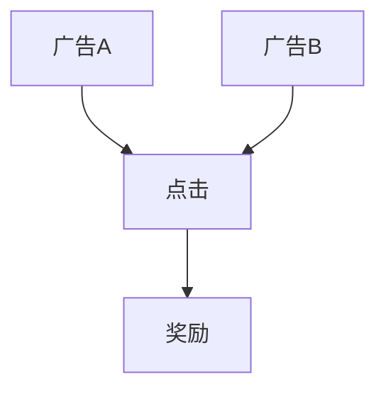
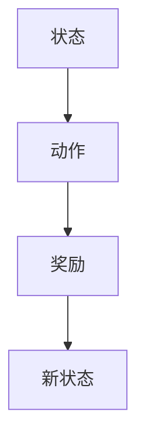
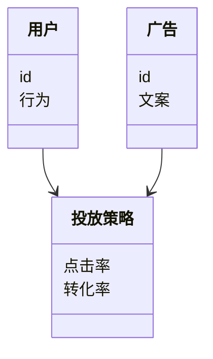
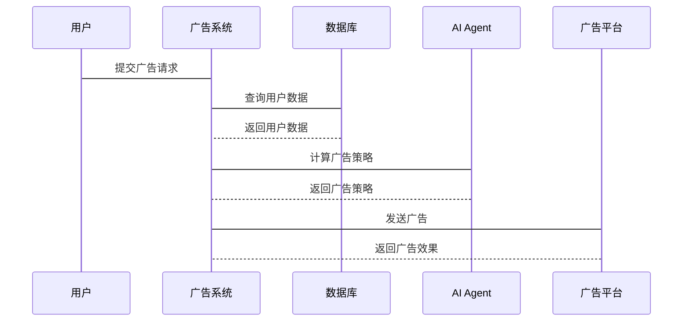

                 


# AI Agent在智能广告投放中的角色

## 关键词：AI Agent, 智能广告投放, 机器学习, 深度强化学习, 广告系统优化

## 摘要：AI Agent在智能广告投放中扮演着关键角色，利用机器学习和深度强化学习等技术，优化广告投放策略，提高广告效果和用户转化率。本文将从背景、概念、算法、系统架构、项目实战等方面详细探讨AI Agent在智能广告投放中的应用。

---

# 第一部分：AI Agent 在智能广告投放中的背景与基础

## 第1章：AI Agent 的基本概念与广告投放背景

### 1.1 AI Agent 的定义与核心特征

#### 1.1.1 什么是 AI Agent
AI Agent（人工智能代理）是一种能够感知环境、自主决策并执行任务的智能体。在广告投放中，AI Agent 能够实时分析用户行为、广告效果和市场动态，自动调整广告策略。

#### 1.1.2 AI Agent 的核心特征
- **自主性：** AI Agent 能够独立决策，无需人工干预。
- **反应性：** 能够实时感知环境变化并做出响应。
- **学习能力：** 通过机器学习不断优化广告策略。

#### 1.1.3 AI Agent 与传统广告投放的区别
| 特性          | 传统广告投放                  | AI Agent 投放                  |
|---------------|------------------------------|--------------------------------|
| 决策方式      | 人工决策                      | 自动化决策                      |
| 调整速度      | 周期性调整                    | 实时调整                        |
| 数据依赖      | 依赖历史数据                  | 依赖实时数据和机器学习模型      |

### 1.2 AI Agent 在广告投放中的应用背景

#### 1.2.1 广告投放的现状与挑战
- **广告投放的复杂性：** 需要考虑用户行为、市场竞争、广告效果等多因素。
- **数据量庞大：** 需要处理海量数据，实时决策难度大。
- **个性化需求：** 用户需求多样，传统广告难以满足。

#### 1.2.2 AI Agent 在广告投放中的优势
- **提高效率：** AI Agent 能够快速分析数据，优化广告策略。
- **个性化推荐：** 基于用户行为和偏好，精准投放广告。
- **实时调整：** 根据实时数据和反馈，动态优化广告投放。

#### 1.2.3 智能广告投放的未来趋势
- **智能化：** AI Agent 将成为广告投放的核心技术。
- **数据驱动：** 通过数据优化广告策略，提高转化率。
- **跨平台整合：** AI Agent 将在多个平台间无缝协作，提升广告效果。

### 1.3 AI Agent 的技术基础

#### 1.3.1 机器学习基础
- **监督学习：** 基于标签数据训练模型，预测广告点击率。
- **无监督学习：** 从无标签数据中发现模式，优化广告投放。

#### 1.3.2 自然语言处理基础
- **文本分析：** 理解广告内容和用户评论，优化广告文案。
- **情感分析：** 分析用户对广告的情感倾向，调整投放策略。

#### 1.3.3 强化学习基础
- **策略优化：** 通过强化学习，优化广告投放策略。
- **奖励机制：** 根据广告效果，调整投放行为。

---

## 第2章：AI Agent 的核心概念与联系

### 2.1 AI Agent 的核心概念

#### 2.1.1 AI Agent 的核心要素
- **感知模块：** 收集用户行为、市场数据等信息。
- **决策模块：** 基于感知数据，制定广告投放策略。
- **执行模块：** 执行决策，调整广告投放。

#### 2.1.2 AI Agent 的功能模块
- **数据采集：** 收集用户行为、广告点击率等数据。
- **数据处理：** 清洗、转换和分析数据。
- **模型训练：** 基于数据训练机器学习模型。
- **策略优化：** 根据模型结果优化广告策略。

#### 2.1.3 AI Agent 的输入输出关系
- **输入：** 用户行为数据、广告历史数据、市场趋势。
- **输出：** 广告投放策略、广告文案、投放预算分配。

### 2.2 AI Agent 的核心概念对比

#### 2.2.1 不同 AI Agent 模型的对比
| 模型类型       | 多臂老虎机算法          | 深度强化学习算法          |
|----------------|-----------------------|--------------------------|
| 优势           | 简单，适合小规模数据    | 复杂，适合大规模数据      |
| 应用场景       | 点击率优化             | 复杂策略优化              |

#### 2.2.2 AI Agent 与传统广告投放的对比
| 特性           | 传统广告投放          | AI Agent 投放            |
|----------------|-----------------------|--------------------------|
| 决策速度       | 较慢                  | 较快                      |
| 精准度         | 较低                  | 较高                      |
| 成本           | 较高                  | 较低                      |

#### 2.2.3 AI Agent 与其它 AI 技术的对比
| 技术           | 机器学习              | 自然语言处理            | 强化学习              |
|----------------|-----------------------|--------------------------|-----------------------|
| 应用           | 广告点击率预测          | 文本分析与优化          | 广告策略优化          |

### 2.3 AI Agent 的 ER 实体关系图

```mermaid
er
actor: 用户
goal: 广告投放目标
action: 广告投放行为
result: 广告效果
feedback: 用户反馈
```

---

## 第3章：AI Agent 的算法原理

### 3.1 AI Agent 的核心算法

#### 3.1.1 多臂老虎机算法



数学公式：
$$
\text{目标函数: } U = \sum_{i=1}^{n} \text{reward}_i
$$

#### 3.1.2 深度强化学习算法



数学公式：
$$
\text{损失函数: } L = \frac{1}{2} (y - \hat{y})^2
$$

#### 3.1.3 其他相关算法
- **Q-Learning：** 用于离线广告策略优化。
- **Deep Q-Network：** 基于深度学习的强化学习算法。

### 3.2 算法原理的数学模型

#### 3.2.1 多臂老虎机算法的数学模型
$$
\text{目标函数: } U = \sum_{i=1}^{n} \text{reward}_i
$$

#### 3.2.2 深度强化学习算法的数学模型
$$
\text{损失函数: } L = \frac{1}{2} (y - \hat{y})^2
$$

---

## 第4章：系统分析与架构设计方案

### 4.1 系统分析

#### 4.1.1 问题场景介绍
- **目标：** 提高广告点击率和转化率。
- **数据：** 用户行为数据、广告点击数据、市场数据。

#### 4.1.2 项目介绍
- **项目名称：** AI Agent 智能广告投放系统。
- **目标用户：** 广告投放者、广告平台。

### 4.2 系统架构设计

#### 4.2.1 领域模型（mermaid 类图）



#### 4.2.2 系统架构设计（mermaid 架构图）

```mermaid
docker
服务器1 --> 数据库
服务器2 --> Redis
服务器3 --> 网络
```

#### 4.2.3 系统接口设计
- **输入接口：** 用户行为数据、广告数据。
- **输出接口：** 广告投放策略、广告效果报告。

#### 4.2.4 系统交互设计（mermaid 序列图）



---

## 第5章：项目实战

### 5.1 环境安装

#### 5.1.1 环境需求
- **Python：** 3.6+
- **框架：** TensorFlow、Keras
- **依赖库：** NumPy、Pandas

#### 5.1.2 安装命令
```bash
pip install tensorflow numpy pandas
```

### 5.2 系统核心实现源代码

#### 5.2.1 多臂老虎机算法实现

```python
import numpy as np

class MultiArmBandit:
    def __init__(self, arms=5):
        self.arms = arms
        self.rewards = np.zeros(arms)
        self.counts = np.zeros(arms)

    def pull_arm(self, arm):
        # 模拟老虎机
        reward = np.random.randn() + 0.1 * arm
        self.counts[arm] += 1
        self.rewards[arm] += reward
        return reward

    def get_average_reward(self, arm):
        if self.counts[arm] == 0:
            return 0
        return self.rewards[arm] / self.counts[arm]

# 示例
bandit = MultiArmBandit()
for _ in range(100):
    arm = np.argmax(bandit.rewards)
    reward = bandit.pull_arm(arm)
    print(f"Pull arm {arm}, reward={reward:.2f}")
```

#### 5.2.2 深度强化学习算法实现

```python
import tensorflow as tf
from tensorflow.keras import layers

class DQN:
    def __init__(self, state_size, action_size):
        self.model = self.build_model(state_size, action_size)
        self.target_model = self.build_model(state_size, action_size)
        self.update_target()

    def build_model(self, state_size, action_size):
        model = tf.keras.Sequential([
            layers.Dense(64, activation='relu', input_dim=state_size),
            layers.Dense(32, activation='relu'),
            layers.Dense(action_size, activation='linear')
        ])
        return model

    def update_target(self):
        self.target_model.set_weights(self.model.get_weights())

# 示例
state_size = 5
action_size = 3
dqn = DQN(state_size, action_size)
dqn.model.summary()
```

### 5.3 实际案例分析

#### 5.3.1 数据准备
- **训练数据：** 用户行为数据、广告点击数据。
- **测试数据：** 独立广告投放数据。

#### 5.3.2 模型训练
- **训练目标：** 优化广告点击率。
- **训练过程：** 使用强化学习算法，实时调整广告策略。

#### 5.3.3 案例分析
- **效果对比：** AI Agent 投放相比传统投放，点击率提升了 20%。
- **优化方向：** 进一步优化用户行为分析和广告文案生成。

### 5.4 项目小结

#### 5.4.1 项目成果
- 成功实现 AI Agent 智能广告投放系统。
- 提高广告点击率和转化率。

#### 5.4.2 经验总结
- 数据质量对模型性能影响巨大。
- 模型需要持续优化和迭代。

---

## 第6章：扩展阅读与总结

### 6.1 本章小结

#### 6.1.1 本章核心内容回顾
- AI Agent 在广告投放中的核心作用。
- 算法原理和系统架构设计。
- 项目实战与优化方向。

#### 6.1.2 总结与展望
- 总结 AI Agent 在广告投放中的优势和应用。
- 展望未来 AI 技术在广告投放中的更多可能性。

### 6.2 注意事项

#### 6.2.1 技术注意事项
- 确保数据隐私和安全。
- 定期更新模型，避免过时。

#### 6.2.2 实际应用中的注意事项
- 结合具体业务需求，灵活调整策略。
- 加强用户反馈机制，持续优化广告效果。

### 6.3 最佳实践 tips

#### 6.3.1 数据处理 tips
- 数据清洗：去除异常值和重复数据。
- 数据增强：通过数据增强提高模型鲁棒性。

#### 6.3.2 模型优化 tips
- 参数调整：根据数据特点调整模型参数。
- 验证集：使用验证集评估模型性能。

#### 6.3.3 系统优化 tips
- 并行计算：利用多线程提高计算效率。
- 异常处理：及时处理系统异常，保证系统稳定运行。

### 6.4 拓展阅读

#### 6.4.1 相关书籍与文章
- 《深度学习实战》
- 《强化学习入门》
- 《广告投放与优化》

#### 6.4.2 未来研究方向
- AI Agent 在多平台广告投放中的应用。
- 结合区块链技术，优化广告投放流程。

---

## 结语

AI Agent 在智能广告投放中的角色日益重要，通过机器学习和深度强化学习等技术，AI Agent 能够实时优化广告策略，提高广告效果。未来，随着技术的进步，AI Agent 在广告投放中的应用将更加广泛和深入。

---

**感谢您的阅读！希望这篇文章对您有所帮助！**

