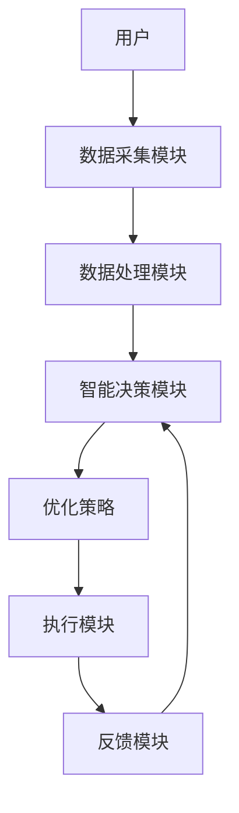

                 


# AI Agent在智能广告投放优化中的应用

## 关键词：AI Agent，智能广告投放，优化算法，强化学习，广告推荐，系统架构

## 摘要：本文深入探讨了AI Agent在智能广告投放优化中的应用，从核心概念、算法原理到系统架构，再到项目实战，全面分析了AI Agent如何通过强化学习、遗传算法等技术实现广告优化，提升投放效率和效果。

---

# 第一部分: AI Agent与智能广告投放优化的背景介绍

## 第1章: AI Agent的核心概念与广告投放优化的背景

### 1.1 AI Agent的定义与核心要素

#### 1.1.1 AI Agent的基本定义
AI Agent（智能体）是指能够感知环境、自主决策并采取行动以实现目标的智能系统。在广告投放优化中，AI Agent可以实时分析市场数据，调整广告策略。

#### 1.1.2 AI Agent的核心属性
| 属性 | 描述 |
|------|------|
| 感知能力 | 收集环境数据（用户行为、市场趋势） |
| 决策能力 | 基于数据做出优化决策 |
| 执行能力 | 执行决策（调整广告投放参数） |
| 学习能力 | 通过反馈优化策略 |

#### 1.1.3 AI Agent的分类与应用场景
AI Agent在广告优化中的应用可以分为实时竞价优化、精准投放推荐和效果预测优化。

### 1.2 智能广告投放优化的背景

#### 1.2.1 广告投放的传统方式与痛点
传统广告投放依赖人工经验，存在效率低、效果不佳的问题。主要痛点包括无法实时调整策略、难以应对市场变化等。

#### 1.2.2 智能优化的必要性与优势
智能优化能够实时分析数据，动态调整策略，显著提高广告效果。AI Agent的优势在于其自主学习能力和高效决策能力。

#### 1.2.3 AI Agent在广告优化中的角色
AI Agent作为智能优化的核心，负责数据处理、策略制定和实时调整，帮助广告投放实现自动化和智能化。

## 第2章: AI Agent与广告投放优化的核心概念联系

### 2.1 AI Agent的核心原理

#### 2.1.1 智能体的感知与决策机制
AI Agent通过感知环境数据，利用强化学习算法做出决策，指导执行模块调整广告策略。

#### 2.1.2 基于强化学习的优化策略
强化学习通过试错机制优化策略，AI Agent根据反馈调整行为，提升广告效果。

#### 2.1.3 多智能体协同优化的实现方式
多智能体协同优化通过分布式计算，提高广告投放的效率和准确性。

### 2.2 广告投放优化的关键指标与优化目标

#### 2.2.1 广告效果的核心评估指标
- 点击率（CTR）
- 转化率（CVR）
- 每点击成本（CPC）

#### 2.2.2 优化目标的设定与分解
优化目标可以分解为最大化点击率和转化率，同时控制成本。

#### 2.2.3 广告投放优化的数学模型
优化目标可以表示为：
$$ \text{最大化 } CTR \times CVR \text{，同时最小化 } CPC $$

## 第3章: 广告投放优化中的AI Agent系统架构

### 3.1 系统功能模块划分

#### 3.1.1 数据采集与处理模块
- 数据来源：用户行为数据、市场数据。
- 数据处理：清洗、特征提取。

#### 3.1.2 智能决策模块
- 输入：处理后的数据。
- 输出：优化策略。

#### 3.1.3 实时优化与反馈模块
- 输入：策略执行结果。
- 输出：反馈优化。

### 3.2 系统架构设计

#### 3.2.1 分层架构设计
- 数据层：数据采集与存储。
- 业务逻辑层：智能决策。
- 应用层：用户界面。

#### 3.2.2 微服务架构设计
- 各模块独立开发和部署，便于扩展和维护。

#### 3.2.3 高可用性与扩展性设计
- 采用负载均衡和容错机制，确保系统稳定。

### 3.3 系统架构图（Mermaid）



---

# 第二部分: AI Agent在广告投放优化中的算法原理

## 第4章: 基于强化学习的广告优化算法

### 4.1 强化学习的基本原理

#### 4.1.1 状态、动作、奖励的定义
- 状态：当前环境数据（用户行为、市场趋势）。
- 动作：调整广告参数（如出价、投放位置）。
- 奖励：广告效果评估指标（如CTR、CVR）。

#### 4.1.2 Q-learning算法的实现
Q-learning算法通过Q表记录状态-动作对的值，更新规则为：
$$ Q(s, a) = Q(s, a) + \alpha [r + \gamma \max Q(s', a') - Q(s, a)] $$

#### 4.1.3 策略梯度方法的原理
策略梯度方法通过优化策略参数，使期望奖励最大化：
$$ \nabla \theta J(\theta) = \mathbb{E}[\nabla \log \pi(a|s) Q(s,a)] $$

### 4.2 广告优化中的强化学习应用

#### 4.2.1 现实场景中的状态空间建模
状态空间包括用户特征、广告历史数据。

#### 4.2.2 动作空间的设计与实现
动作包括调整出价、选择投放位置。

#### 4.2.3 奖励机制的定义与优化
奖励由点击率和转化率组成，公式：
$$ R = \lambda_1 CTR + \lambda_2 CVR $$

## 第5章: 基于遗传算法的广告投放优化

### 5.1 遗传算法的基本原理

#### 5.1.1 初始化种群
生成初始策略集合。

#### 5.1.2 适应度函数的设计
评估策略的有效性。

#### 5.1.3 选择、交叉与变异操作
通过选择优秀策略，交叉重组，变异优化。

### 5.2 广告优化中的遗传算法应用

#### 5.2.1 广告投放策略的编码方式
将策略编码为二进制或十进制形式。

#### 5.2.2 适应度函数的优化设计
适应度函数反映策略的广告效果。

#### 5.2.3 遗传算法的收敛性分析
分析算法的收敛速度和稳定性。

## 第6章: 基于协同过滤的广告推荐算法

### 6.1 协同过滤的基本原理

#### 6.1.1 基于用户的协同过滤
基于用户行为相似性推荐广告。

#### 6.1.2 基于物品的协同过滤
基于广告内容相似性推荐。

### 6.2 广告推荐中的协同过滤应用

#### 6.2.1 用户-广告矩阵构建
构建用户对广告的偏好矩阵。

#### 6.2.2 相似度计算与推荐生成
计算相似度，生成推荐列表。

---

# 第三部分: AI Agent在广告投放优化中的项目实战

## 第7章: 项目环境与核心实现

### 7.1 环境安装

#### 7.1.1 安装Python和相关库
安装TensorFlow、Keras、Scikit-learn等库。

#### 7.1.2 安装广告数据分析工具
使用Google Analytics等工具。

### 7.2 核心代码实现

#### 7.2.1 强化学习算法实现

```python
import numpy as np

class AI-Agent:
    def __init__(self):
        self.states = []
        self.actions = []
        self.rewards = []
    
    def perceive(self):
        # 数据采集
        pass
    
    def decide(self):
        # 决策逻辑
        pass
    
    def learn(self):
        # 强化学习更新
        pass
```

#### 7.2.2 系统交互流程


### 7.3 代码解读与分析

#### 7.3.1 强化学习算法代码解读
AI-Agent类实现感知、决策和学习功能，通过强化学习优化广告策略。

#### 7.3.2 系统交互流程分析
用户数据经过采集和处理，输入智能决策模块，生成优化策略，执行并反馈优化。

## 第8章: 实际案例分析与优化效果评估

### 8.1 案例分析

#### 8.1.1 数据分析
分析用户行为数据和广告效果数据。

#### 8.1.2 策略优化
基于AI-Agent的决策优化广告策略。

### 8.2 优化效果评估

#### 8.2.1 点击率和转化率提升
评估优化前后的效果变化。

#### 8.2.2 成本控制
分析优化对广告成本的影响。

## 第9章: 项目小结与经验总结

### 9.1 项目总结

#### 9.1.1 核心技术总结
总结AI-Agent在广告优化中的核心技术。

#### 9.1.2 项目成果
展示优化效果，如点击率提升30%。

### 9.2 经验总结

#### 9.2.1 关键技术选择
选择合适的算法和工具。

#### 9.2.2 项目管理经验
分享项目管理和团队协作的经验。

---

# 第四部分: 最佳实践与未来展望

## 第10章: 最佳实践与小结

### 10.1 小结

#### 10.1.1 核心要点总结
总结AI-Agent在广告优化中的关键点。

### 10.2 最佳实践

#### 10.2.1 算法选择
根据场景选择合适的算法。

#### 10.2.2 数据处理
确保数据质量和实时性。

### 10.3 注意事项

#### 10.3.1 数据隐私
遵守数据隐私法规。

#### 10.3.2 系统稳定性
确保系统高可用性。

## 第11章: 未来展望与研究方向

### 11.1 未来展望

#### 11.1.1 新技术发展
探讨AI和大数据技术的最新发展。

#### 11.1.2 应用领域拓展
考虑AI-Agent在其他领域的应用潜力。

### 11.2 拓展阅读

#### 11.2.1 相关书籍
推荐AI和广告优化相关的书籍。

#### 11.2.2 技术博客
推荐技术博客和开源项目。

---

# 结语

AI-Agent在智能广告投放优化中的应用前景广阔，随着技术进步，AI-Agent将更加智能化，为广告行业带来更大价值。

