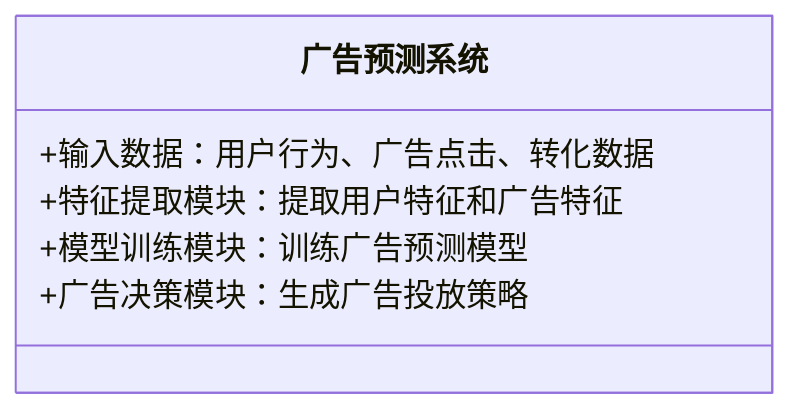
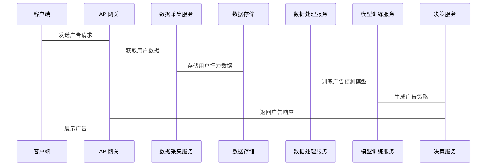

                 


# AI Agent在智能广告效果预测中的应用

## 关键词：AI Agent, 广告效果预测, 机器学习, 数据分析, 系统设计

## 摘要

AI Agent（人工智能代理）在智能广告效果预测中的应用，通过分析用户行为和广告数据，利用机器学习算法优化广告投放策略，提高广告效果和投资回报率。本文系统地介绍AI Agent的核心原理、算法实现、系统设计，以及在广告预测中的实际应用案例。

---

# 第一部分：AI Agent与广告效果预测的背景

## 第1章：AI Agent与广告效果预测的背景

### 1.1 问题背景

广告效果预测是优化广告投放的关键环节，直接影响广告的投资回报率。传统广告预测依赖统计方法，存在数据维度单一、预测精度不足的问题。AI Agent通过多模态数据处理和动态决策，显著提升了预测的准确性和实时性。

### 1.2 问题描述

广告效果预测涉及用户点击率、转化率等关键指标，传统方法难以应对用户行为的复杂性和多样性。AI Agent能够实时分析海量数据，动态调整广告策略，解决传统方法的局限性。

### 1.3 问题解决

AI Agent通过深度学习和强化学习，优化广告预测模型，实时调整广告投放策略，提高广告效果。其优势在于处理多模态数据和动态调整的能力，能够适应复杂的广告环境。

### 1.4 边界与外延

AI Agent的应用边界包括实时数据处理和动态决策，而广告预测的其他技术如传统统计方法和规则引擎则作为补充。AI Agent通过结合这些方法，提升广告预测的整体效果。

### 1.5 核心概念

AI Agent的基本概念和广告效果预测的核心要素，如数据源、模型选择和评估指标，是理解其应用的基础。AI Agent通过多模态数据和动态决策，优化广告效果预测。

---

# 第二部分：AI Agent与广告效果预测的核心概念与联系

## 第2章：AI Agent的核心原理

### 2.1 AI Agent的定义与特点

AI Agent是能够感知环境、执行任务的智能体，具备自主决策和学习优化的能力。在广告预测中，AI Agent通过实时数据分析优化广告策略，提升预测精度。

### 2.2 广告效果预测的基本原理

广告效果预测基于用户行为和广告数据，通过机器学习模型预测点击率和转化率。AI Agent通过动态调整模型参数和策略，提升预测的实时性和准确性。

### 2.3 AI Agent与广告效果预测的关系

AI Agent作为广告预测的核心工具，通过实时数据分析和动态决策优化广告策略。它解决了传统方法的局限性，显著提升了广告效果预测的准确性和效率。

---

# 第三部分：AI Agent在广告效果预测中的算法原理

## 第3章：基于AI Agent的广告预测算法

### 3.1 算法原理

AI Agent在广告预测中采用深度学习和强化学习算法，如神经网络和Q-Learning。这些算法通过处理多模态数据，动态调整广告策略，提升预测精度。

### 3.2 算法实现

使用Python实现基于神经网络的广告预测模型。模型结构包括输入层、隐藏层和输出层，采用反向传播算法进行训练。代码示例如下：

```python
import numpy as np
import tensorflow as tf

# 定义神经网络模型
model = tf.keras.Sequential([
    tf.keras.layers.Dense(64, activation='relu'),
    tf.keras.layers.Dense(1, activation='sigmoid')
])

# 编译模型
model.compile(optimizer='adam', loss='binary_crossentropy', metrics=['accuracy'])

# 训练模型
model.fit(X_train, y_train, epochs=10, batch_size=32)
```

### 3.3 数学模型

广告预测模型的数学公式如下：

$$
\hat{y} = \sigma(w_1x_1 + w_2x_2 + \dots + w_nx_n + b)
$$

其中，$\sigma$是sigmoid函数，$w_i$是权重，$x_i$是输入特征，$b$是偏置。

---

# 第四部分：系统分析与架构设计方案

## 第4章：广告效果预测系统的架构设计

### 4.1 问题场景介绍

广告效果预测系统需实时处理大量用户行为数据，动态调整广告策略。系统架构需支持高并发和实时数据处理，确保预测的准确性和效率。

### 4.2 系统功能设计

系统功能模块包括数据采集、特征提取、模型训练和广告决策。使用Mermaid类图展示领域模型：



### 4.3 系统架构设计

系统架构采用微服务架构，使用Mermaid架构图展示整体结构：


### 4.4 系统交互设计

使用Mermaid序列图展示系统交互流程：



---

# 第五部分：项目实战

## 第5章：AI Agent广告效果预测系统实战

### 5.1 环境安装

安装必要的Python库：

```bash
pip install numpy scikit-learn tensorflow pandas
```

### 5.2 系统核心实现

实现广告预测模型：

```python
import numpy as np
import pandas as pd
from sklearn.model_selection import train_test_split
from sklearn.metrics import accuracy_score
from tensorflow.keras.models import Sequential
from tensorflow.keras.layers import Dense

# 加载数据
data = pd.read_csv('ad_data.csv')
X = data.drop('click', axis=1).values
y = data['click'].values

# 数据分割
X_train, X_test, y_train, y_test = train_test_split(X, y, test_size=0.2)

# 定义模型
model = Sequential()
model.add(Dense(64, activation='relu', input_dim=X.shape[1]))
model.add(Dense(1, activation='sigmoid'))

# 编译模型
model.compile(optimizer='adam', loss='binary_crossentropy', metrics=['accuracy'])

# 训练模型
model.fit(X_train, y_train, epochs=10, batch_size=32, verbose=1)

# 评估模型
loss, accuracy = model.evaluate(X_test, y_test)
print(f"Loss: {loss}, Accuracy: {accuracy}")
```

### 5.3 实际案例分析

使用公开数据集（如Criteo广告数据）训练模型，分析广告点击率和转化率。调整模型参数，如神经网络层数和节点数，优化预测精度。

---

# 第六部分：总结与展望

## 6.1 最佳实践

- 数据预处理和特征工程是关键，需仔细处理数据。
- 使用交叉验证优化模型，防止过拟合。
- 结合实时数据流处理技术（如Kafka），提升预测的实时性。

## 6.2 小结

本文详细介绍了AI Agent在广告效果预测中的应用，从算法原理到系统设计，再到实际案例，全面展示了其优势和实现方法。AI Agent通过多模态数据处理和动态决策，显著提升了广告预测的精度和效率。

## 6.3 注意事项

- 数据隐私和安全问题需重视，确保合规性。
- 模型解释性需关注，便于分析和优化。
- 实际应用中，需结合业务场景调整模型参数。

## 6.4 拓展阅读

- 《广告数据分析与预测》
- 《强化学习在推荐系统中的应用》
- 《实时数据流处理技术》

---

通过以上目录结构，文章系统地探讨了AI Agent在智能广告效果预测中的应用，从理论到实践，全面覆盖了相关知识。

