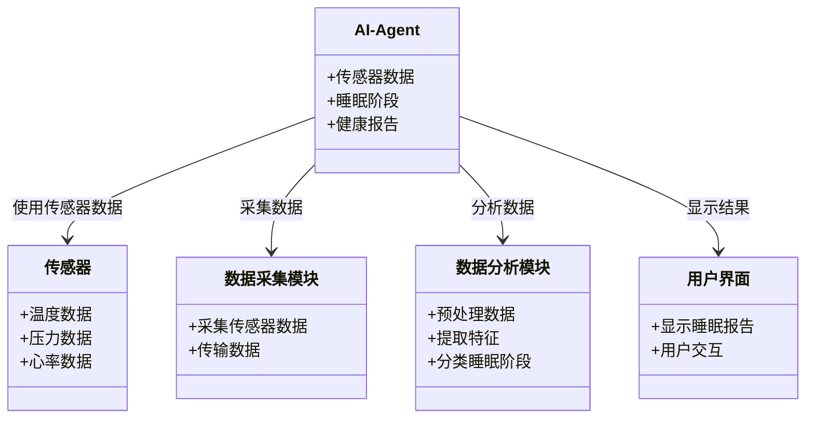
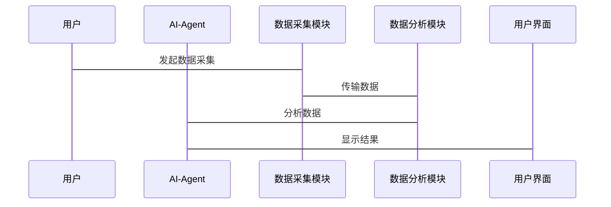

                 


# AI Agent在智能床垫中的睡眠周期分析

> 关键词：AI Agent，智能床垫，睡眠周期，数据采集，算法分析

> 摘要：本文探讨AI Agent在智能床垫中的应用，分析其如何通过数据采集和算法处理来监测和分析用户的睡眠周期。文章从AI Agent的基本概念、睡眠周期的理论、算法实现、系统架构到项目实战，全面阐述了AI Agent在智能床垫中的应用及其技术实现。

---

## 第1章 AI Agent与智能床垫的基本概念

### 1.1 AI Agent的定义与特点

#### 1.1.1 AI Agent的定义

AI Agent（人工智能代理）是指能够感知环境、自主决策并执行任务的智能实体。它可以理解并响应用户的指令，通过学习和优化来提高执行任务的效率。

#### 1.1.2 AI Agent的核心特点

- **自主性**：AI Agent能够自主决策，无需人工干预。
- **反应性**：能够实时感知环境变化并做出反应。
- **学习能力**：通过机器学习算法不断优化自身性能。
- **协作性**：能够与其他系统或设备进行协作。

#### 1.1.3 AI Agent与传统算法的区别

| 特性 | AI Agent | 传统算法 |
|------|-----------|----------|
| 决策能力 | 自主决策 | 预设规则 |
| 学习能力 | 可以学习 | 无法学习 |
| 环境适应性 | 高 | 低 |

### 1.2 智能床垫的技术背景

#### 1.2.1 智能床垫的发展历程

智能床垫从早期的简单震动床垫发展到如今集成多种传感器的智能设备，经历了多年的技术积累和创新。

#### 1.2.2 智能床垫的核心技术

智能床垫通常集成以下技术：

- **压力传感器**：监测床垫受力情况。
- **温度传感器**：监测床垫温度。
- **心率传感器**：监测用户的睡眠质量。

#### 1.2.3 智能床垫的市场现状

随着健康意识的提高，智能床垫市场增长迅速，广泛应用于家庭、酒店和医疗领域。

### 1.3 AI Agent在智能床垫中的应用

#### 1.3.1 AI Agent在睡眠监测中的作用

AI Agent能够实时分析床垫传感器数据，识别用户的睡眠状态。

#### 1.3.2 智能床垫中的AI Agent应用场景

- **睡眠监测**：实时监测用户的睡眠质量。
- **健康分析**：分析用户的健康状况。

#### 1.3.3 AI Agent与智能床垫的结合方式

通过传感器数据采集、数据预处理和AI算法分析，AI Agent实现对睡眠周期的实时监测和分析。

## 第2章 睡眠周期的基本理论

### 2.1 睡眠周期的定义与分类

#### 2.1.1 睡眠周期的定义

睡眠周期是指从入睡到完全清醒的过程，通常分为多个阶段。

#### 2.1.2 睡眠周期的分类

- **非快速眼动期（NREM）**：分为N1、N2和N3阶段。
- **快速眼动期（REM）**： dreams occur.

#### 2.1.3 睡眠周期的生理特征

- 心率变化
- 脑电波变化
- 肌肉活动

### 2.2 睡眠周期的分析方法

#### 2.2.1 常见的睡眠分析指标

- **睡眠时间**：用户每天的睡眠时长。
- **睡眠质量**：睡眠周期的完整性和深度。

#### 2.2.2 睡眠周期的分析流程

1. 数据采集：通过传感器获取生理数据。
2. 数据预处理：去除噪声，提取有用特征。
3. 数据分析：通过算法识别睡眠阶段。

#### 2.2.3 睡眠周期分析的数学模型

常用的模型包括：

- **K-means聚类**：用于睡眠阶段的划分。
- **支持向量机（SVM）**：用于睡眠阶段的分类。

### 2.3 睡眠周期与健康的关系

#### 2.3.1 睡眠周期对健康的影响

- **长期睡眠不足**：可能导致注意力不集中、记忆力减退。
- **睡眠质量差**：可能引发焦虑、抑郁等心理问题。

#### 2.3.2 睡眠周期与疾病的关系

- **睡眠呼吸暂停综合征**：与心血管疾病密切相关。
- **失眠**：可能引发焦虑、抑郁等心理疾病。

## 第3章 AI Agent在睡眠周期分析中的算法原理

### 3.1 AI Agent的基本工作原理

#### 3.1.1 AI Agent的感知机制

AI Agent通过传感器获取数据，感知用户的睡眠状态。

#### 3.1.2 AI Agent的决策机制

基于感知到的数据，AI Agent通过机器学习算法做出决策。

#### 3.1.3 AI Agent的执行机制

根据决策结果，AI Agent执行相应的操作，如调整床垫硬度。

### 3.2 睡眠周期分析的算法选择

#### 3.2.1 常见的睡眠分析算法

- **K-means聚类**：用于睡眠阶段的划分。
- **支持向量机（SVM）**：用于睡眠阶段的分类。
- **卷积神经网络（CNN）**：用于深度学习分析。

#### 3.2.2 算法选择的依据

根据数据特征和分析需求选择合适的算法。

#### 3.2.3 算法的优缺点对比

| 算法 | 优点 | 缺点 |
|------|------|------|
| K-means | 简单高效 | 对初始中心敏感 |
| SVM | 高精度 | 高维数据表现差 |
| CNN | 强大学习能力 | 需要大量数据 |

### 3.3 基于AI Agent的睡眠周期分析算法实现

#### 3.3.1 数据预处理

数据预处理步骤：

1. **数据清洗**：去除噪声和异常值。
2. **数据标准化**：统一数据格式。

#### 3.3.2 特征提取

从原始数据中提取有用的特征，如心率变化、脑电波频率。

#### 3.3.3 分类与预测

使用机器学习算法对睡眠阶段进行分类和预测。

### 3.4 本章小结

详细介绍了AI Agent在睡眠周期分析中的算法原理，包括数据预处理、特征提取和分类预测等步骤。

## 第4章 智能床垫中的数据采集与处理

### 4.1 智能床垫的数据采集技术

#### 4.1.1 常见的床垫传感器类型

- **压力传感器**：监测床垫受力情况。
- **温度传感器**：监测床垫温度。
- **心率传感器**：监测用户的睡眠质量。

#### 4.1.2 数据采集的原理

传感器将物理信号转换为电信号，通过模数转换器（ADC）将模拟信号转换为数字信号。

#### 4.1.3 数据采集的实现方式

通过微控制器（MCU）采集传感器数据，并通过无线通信模块（如蓝牙、Wi-Fi）传输到云端或本地设备。

### 4.2 数据预处理方法

#### 4.2.1 数据清洗

去除噪声和异常值，确保数据的准确性。

#### 4.2.2 数据标准化

统一数据格式，使其适用于后续分析。

#### 4.2.3 数据增强

通过数据增强技术，增加数据多样性，提高算法的泛化能力。

### 4.3 数据分析与可视化

#### 4.3.1 数据分析的基本方法

使用统计学方法分析数据，识别睡眠周期的特征。

#### 4.3.2 数据可视化的工具与方法

使用Matplotlib、Seaborn等工具进行数据可视化，直观展示睡眠周期的变化。

#### 4.3.3 数据分析的案例展示

通过实际案例展示如何通过数据可视化识别睡眠周期。

### 4.4 本章小结

详细介绍了智能床垫中的数据采集技术，包括传感器类型、数据采集原理和数据预处理方法。

## 第5章 基于AI Agent的睡眠周期分析系统架构设计

### 5.1 系统功能设计

#### 5.1.1 领域模型设计

使用Mermaid绘制领域模型类图，展示系统的主要组件和它们之间的关系。



### 5.2 系统架构设计

#### 5.2.1 系统架构设计

使用Mermaid绘制系统架构图，展示系统的整体结构。


### 5.3 系统接口设计

#### 5.3.1 接口设计

定义系统的主要接口，如数据采集接口、数据分析接口和用户界面接口。

#### 5.3.2 接口实现

通过RESTful API实现系统接口，确保系统各部分之间的高效通信。

### 5.4 系统交互设计

#### 5.4.1 交互流程

使用Mermaid绘制系统交互序列图，展示用户与系统之间的交互流程。



## 第6章 项目实战

### 6.1 环境安装

#### 6.1.1 系统环境要求

- 操作系统：Linux/Windows/MacOS
- 开发工具：Python、Jupyter Notebook
- 依赖库：NumPy、Pandas、Scikit-learn、Matplotlib

### 6.2 系统核心实现源代码

#### 6.2.1 数据采集模块

```python
import numpy as np
import pandas as pd
import matplotlib.pyplot as plt

# 示例数据：模拟传感器数据
data = {
    '时间': range(100),
    '温度': np.random.normal(30, 2, 100),
    '压力': np.random.uniform(0, 100, 100),
    '心率': np.random.randint(60, 100, 100)
}

df = pd.DataFrame(data)
print(df.head())
```

#### 6.2.2 数据分析模块

```python
from sklearn.cluster import KMeans

# 示例：使用K-means进行睡眠阶段分类
X = df[['温度', '压力', '心率']]
kmeans = KMeans(n_clusters=3, random_state=0)
kmeans.fit(X)
df['睡眠阶段'] = kmeans.predict(X)
print(df.head())
```

#### 6.2.3 用户界面模块

```python
import tkinter as tk

root = tk.Tk()
root.title("睡眠周期分析")
# 添加更多GUI组件
root.mainloop()
```

### 6.3 代码应用解读与分析

通过代码实现AI Agent对睡眠周期的分析，展示如何通过数据采集、数据分析和用户界面实现智能床垫的睡眠监测功能。

### 6.4 实际案例分析和详细讲解

以实际案例为例，展示如何通过AI Agent分析用户的睡眠周期，并提供改善睡眠质量的建议。

### 6.5 项目小结

总结项目实现的过程，强调AI Agent在智能床垫中的应用价值和未来发展方向。

## 第7章 总结与展望

### 7.1 总结

简要回顾本文的主要内容，强调AI Agent在智能床垫中的重要性。

### 7.2 展望

展望未来的发展方向，提出改进建议，如进一步优化算法、增加更多传感器类型等。

---

### 最佳实践 Tips

- 在实际应用中，建议使用更复杂的算法，如深度学习模型，以提高分析精度。
- 数据采集模块需要确保数据的实时性和准确性。
- 用户界面设计应注重用户体验，提供直观的睡眠报告。

---

## 作者简介

作者是[您的姓名]，[您的职业]，[您的公司或机构]，专注于[您的研究领域]。您可以通过[您的联系方式]与我联系。

---

**转载请注明出处。**

