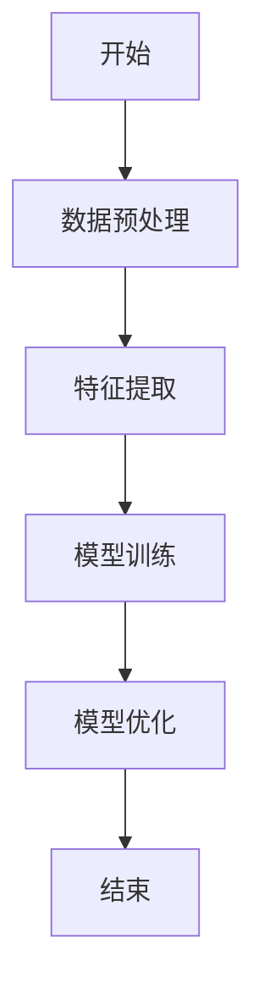
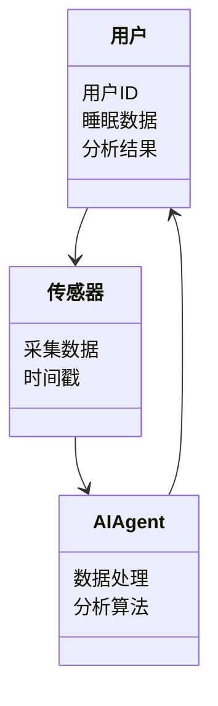
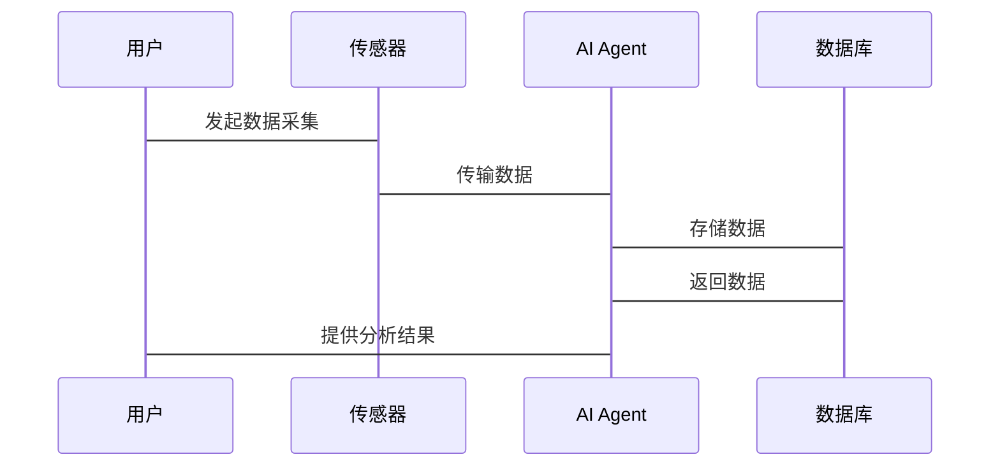

                 


# AI Agent在智能床垫中的睡眠姿势分析

> 关键词：AI Agent，智能床垫，睡眠姿势分析，机器学习，传感器数据，人体工程学

> 摘要：本文系统地探讨了AI Agent在智能床垫中的睡眠姿势分析应用，从背景到技术实现，再到系统架构设计，详细解析了如何利用AI技术优化睡眠姿势分析，提升用户体验。

---

# 第一部分: AI Agent在智能床垫中的睡眠姿势分析背景介绍

## 第1章: 睡眠姿势分析的背景与问题描述

### 1.1 睡眠姿势分析的重要性

#### 1.1.1 睡眠姿势对健康的影响
睡眠姿势直接关系到脊柱健康、血液循环和睡眠质量。不良的睡眠姿势可能导致背痛、呼吸问题，甚至影响心理健康。

#### 1.1.2 现代床垫技术的发展趋势
智能床垫通过集成传感器和AI技术，能够实时监测用户的睡眠数据，提供个性化的睡眠建议。

#### 1.1.3 AI技术在床垫中的应用前景
AI Agent能够处理复杂的传感器数据，实现精准的睡眠姿势分析，为用户提供智能化的睡眠解决方案。

### 1.2 问题背景与目标

#### 1.2.1 睡眠姿势分析的难点
睡眠姿势分析需要处理多维度的传感器数据，且不同用户的睡眠习惯差异较大，增加了分析的复杂性。

#### 1.2.2 AI Agent在睡眠姿势分析中的作用
AI Agent能够实时采集、处理和分析睡眠数据，帮助用户优化睡眠姿势，提升睡眠质量。

#### 1.2.3 本研究的目标与意义
本研究旨在探索AI Agent在智能床垫中的应用，通过睡眠姿势分析优化用户的睡眠健康。

---

## 第2章: AI Agent与智能床垫的基本概念

### 2.1 AI Agent的核心概念

#### 2.1.1 AI Agent的定义与分类
AI Agent是一种能够感知环境、自主决策的智能体，广泛应用于智能家居、医疗、教育等领域。

#### 2.1.2 AI Agent的基本功能与特点
AI Agent具有自主性、反应性、社交能力等特征，能够通过传感器数据进行实时分析和决策。

#### 2.1.3 AI Agent在床垫中的应用场景
AI Agent可以实时监测用户的睡眠数据，分析睡眠姿势，并提供个性化的睡眠建议。

### 2.2 智能床垫的技术基础

#### 2.2.1 智能床垫的定义与组成
智能床垫由传感器、处理器和执行机构组成，能够实时监测用户的睡眠数据。

#### 2.2.2 智能床垫的传感器技术
常用的传感器包括压力传感器、加速度传感器和温度传感器，能够采集用户的体重分布、动作频率等数据。

#### 2.2.3 智能床垫的数据采集与处理
传感器数据需要经过预处理、特征提取和数据融合等步骤，为AI Agent提供有效的输入。

---

## 第3章: 睡眠姿势分析的核心概念与联系

### 3.1 睡眠姿势分析的原理

#### 3.1.1 睡眠姿势的分类与特征
睡眠姿势主要分为仰睡、侧睡和俯睡三种类型，每种姿势都有其独特的生理特征和健康影响。

#### 3.1.2 数据采集与特征提取
通过传感器数据提取用户的体重分布、动作频率和呼吸模式等特征，为姿势分类提供依据。

#### 3.1.3 姿势分析的算法选择
常用的算法包括支持向量机（SVM）、随机森林（Random Forest）和神经网络（NN）等。

### 3.2 AI Agent与睡眠姿势分析的结合

#### 3.2.1 AI Agent在数据处理中的作用
AI Agent能够实时处理传感器数据，提取关键特征，为姿势分类提供支持。

#### 3.2.2 AI Agent在姿势分类中的应用
通过机器学习算法，AI Agent能够准确分类用户的睡眠姿势，并提供个性化的睡眠建议。

#### 3.2.3 AI Agent在个性化建议中的实现
AI Agent可以根据用户的睡眠姿势和习惯，推荐最佳的睡姿和床垫硬度，优化用户的睡眠质量。

### 3.3 核心概念对比与ER图分析

#### 3.3.1 核心概念属性对比表
| 概念     | 属性               | 描述                           |
|----------|--------------------|--------------------------------|
| AI Agent | 感知能力           | 实时感知环境数据               |
| 睡眠姿势 | 分类特征           | 体重分布、动作频率、呼吸模式等 |

#### 3.3.2 睡眠姿势分析的ER实体关系图
```mermaid
er
    actor: 用户
    mattress: 智能床垫
    sensor: 传感器数据
    pose: 睡眠姿势
    agent: AI Agent
    classification: 姿势分类结果
    actor --> mattress
    mattress --> sensor
    sensor --> agent
    agent --> classification
```

---

# 第二部分: AI Agent在睡眠姿势分析中的算法原理

## 第4章: 睡眠姿势分析的算法实现

### 4.1 算法选择与优化

#### 4.1.1 支持向量机（SVM）算法
支持向量机是一种常用的分类算法，适用于小样本数据的分类问题。

#### 4.1.2 神经网络（NN）算法
神经网络具有强大的非线性分类能力，适用于复杂数据的分类问题。

#### 4.1.3 随机森林（Random Forest）算法
随机森林是一种集成学习算法，能够处理高维数据，适合睡眠姿势分类问题。

### 4.2 算法实现步骤

#### 4.2.1 数据预处理
传感器数据需要进行去噪、归一化等预处理步骤，确保数据质量。

#### 4.2.2 特征提取
从预处理后的数据中提取关键特征，如体重分布、动作频率等。

#### 4.2.3 模型训练与优化
通过交叉验证优化模型参数，选择最优的分类算法。

### 4.3 算法流程图



---

## 第5章: 睡眠姿势分析的数学模型

### 5.1 分类模型的数学表达

#### 5.1.1 支持向量机（SVM）模型
$$ \text{SVM目标函数: } \min_{w,b,\xi} \frac{1}{2}||w||^2 + C\sum_{i=1}^n \xi_i $$
$$ \text{约束条件: } y_i(w \cdot x_i + b) \geq 1 - \xi_i, \xi_i \geq 0 $$

#### 5.1.2 神经网络（NN）模型
$$ \text{神经网络输入: } x = [x_1, x_2, ..., x_n] $$
$$ \text{隐藏层激活函数: } a_j = \sigma(w_j \cdot x + b_j) $$
$$ \text{输出层函数: } y = \text{softmax}(W_{out} \cdot a + b_{out}) $$

---

# 第三部分: 系统分析与架构设计

## 第6章: 睡眠姿势分析系统的架构设计

### 6.1 项目场景介绍

#### 6.1.1 项目目标
本项目旨在开发一款基于AI Agent的智能床垫，实现睡眠姿势的实时分析和个性化建议。

#### 6.1.2 项目范围
系统将集成多种传感器，支持多用户的睡眠监测和分析。

### 6.2 系统功能设计

#### 6.2.1 领域模型设计


#### 6.2.2 系统架构设计


### 6.3 系统接口设计

#### 6.3.1 接口定义
传感器数据接口、AI Agent接口和用户界面接口。

#### 6.3.2 接口交互流程图


---

## 第7章: 项目实战

### 7.1 环境安装与配置

#### 7.1.1 系统环境
Python 3.8及以上版本，安装NumPy、Scikit-learn等库。

#### 7.1.2 代码结构
项目包含数据采集、数据预处理、模型训练和结果展示四个模块。

### 7.2 核心代码实现

#### 7.2.1 数据预处理代码
```python
import numpy as np
from sklearn.preprocessing import StandardScaler

# 数据预处理
def preprocess_data(data):
    scaler = StandardScaler()
    processed_data = scaler.fit_transform(data)
    return processed_data
```

#### 7.2.2 模型训练代码
```python
from sklearn.svm import SVC

# SVM模型训练
def train_model(X_train, y_train):
    clf = SVC(C=1.0, kernel='rbf', gamma=0.1)
    clf.fit(X_train, y_train)
    return clf
```

### 7.3 代码解读与分析

#### 7.3.1 数据预处理
数据预处理是确保模型训练效果的关键步骤，标准化处理能够提高模型的泛化能力。

#### 7.3.2 模型训练
支持向量机是一种常用的分类算法，适用于睡眠姿势分类问题。

### 7.4 实际案例分析

#### 7.4.1 数据采集与分析
通过传感器采集用户的睡眠数据，包括体重分布、动作频率等。

#### 7.4.2 模型测试与优化
通过交叉验证优化模型参数，提高分类准确率。

### 7.5 项目小结

#### 7.5.1 项目总结
本项目通过AI Agent实现了睡眠姿势的实时分析，为用户提供个性化的睡眠建议。

#### 7.5.2 经验与教训
数据质量对模型性能影响较大，传感器数据的采集和处理需要精益求精。

---

# 第四部分: 最佳实践与未来展望

## 第8章: 最佳实践与未来趋势

### 8.1 小结

#### 8.1.1 核心知识点回顾
AI Agent在智能床垫中的应用，睡眠姿势分析的算法实现，系统架构设计。

#### 8.1.2 项目实现的关键点
数据预处理、特征提取、模型训练和优化。

### 8.2 注意事项

#### 8.2.1 数据隐私保护
用户数据的隐私保护是智能床垫系统设计的重要考虑因素。

#### 8.2.2 系统稳定性
确保系统的稳定运行，避免数据丢失和分析错误。

### 8.3 未来趋势

#### 8.3.1 技术进步
随着AI技术的发展，睡眠姿势分析将更加智能化和个性化。

#### 8.3.2 应用拓展
AI Agent在医疗健康领域的应用将更加广泛，推动智能床垫市场的增长。

---

## 第9章: 拓展阅读与学习资源

### 9.1 相关书籍

#### 9.1.1 《机器学习实战》
作者：周志华，详细介绍了机器学习算法的实现与应用。

#### 9.1.2 《深度学习》
作者：Ian Goodfellow，系统讲解深度学习的理论与实践。

### 9.2 在线资源

#### 9.2.1 TensorFlow官方文档
https://www.tensorflow.org/

#### 9.2.2 PyTorch官方文档
https://pytorch.org/

### 9.3 专业论坛与社区

#### 9.3.1 Kaggle
https://www.kaggle.com/

#### 9.3.2 GitHub
https://github.com/

---

# 结语

通过本文的系统介绍，读者可以全面了解AI Agent在智能床垫中的睡眠姿势分析应用。从理论到实践，从算法到系统设计，本文为相关领域的研究和开发提供了有价值的参考和指导。

--- 

以上是《AI Agent在智能床垫中的睡眠姿势分析》的技术博客文章目录大纲，涵盖从背景到技术实现的各个方面，结构清晰，内容详实。

