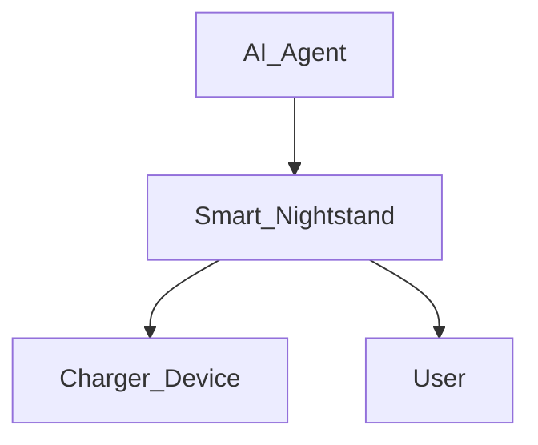
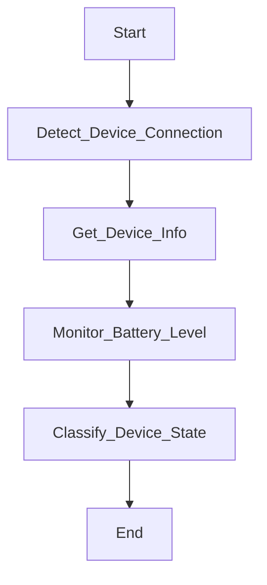
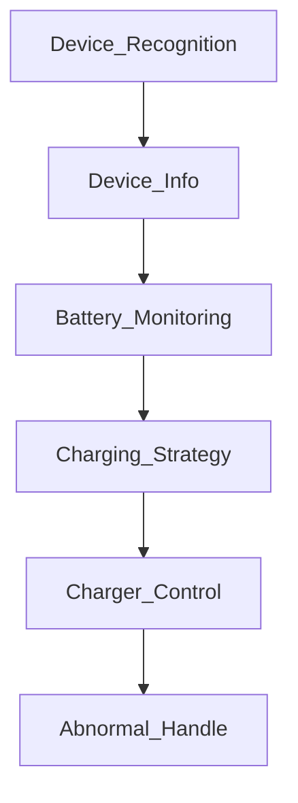
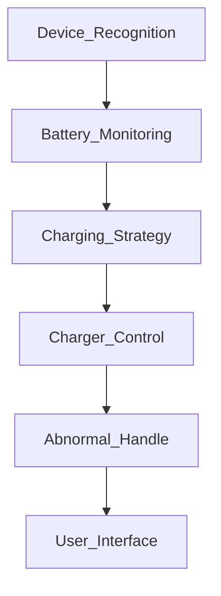
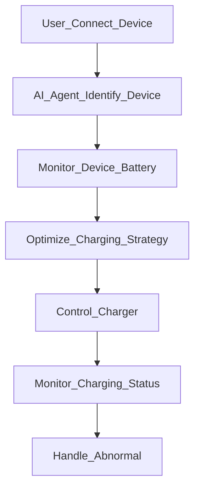

                 


# AI Agent在智能床头柜中的充电管理

> 关键词：AI Agent, 智能床头柜, 充电管理, 算法原理, 系统架构

> 摘要：本文深入探讨了AI Agent在智能床头柜中的充电管理应用，从问题背景到核心概念，从算法原理到系统架构，再到项目实战，全面解析了AI Agent在智能床头柜充电管理中的实现与优化。

---

# 第一部分: AI Agent在智能床头柜中的充电管理背景介绍

## 第1章: 问题背景与描述

### 1.1 问题背景

随着智能家居的快速发展，床头柜作为卧室中的重要家具，逐渐从单纯的收纳功能向智能化方向发展。智能床头柜不仅需要满足基本的收纳功能，还需要具备智能充电、设备控制等附加功能。然而，现有的充电管理方案普遍存在以下问题：

- **充电设备多样，管理复杂**：床头柜上可能同时连接手机、智能手表、无线耳机等多种设备，不同设备的充电需求不同，传统充电管理方式难以实现智能化和个性化管理。
- **充电效率低下**：传统充电方式无法根据设备的电量和充电需求动态调整充电功率，导致充电效率不高，甚至可能对设备造成损害。
- **用户体验差**：用户需要手动操作充电设备的插拔或开关，降低了用户体验，尤其是在夜间或紧急情况下，手动操作不方便且存在安全隐患。

AI Agent的引入为智能床头柜的充电管理带来了新的解决方案。AI Agent是一种能够感知环境、自主决策并执行任务的智能代理，可以实现对床头柜上充电设备的智能识别、状态监测和充电策略优化。

### 1.2 问题描述

智能床头柜的充电管理功能需要实现以下目标：

1. **设备智能识别**：能够自动识别床头柜上连接的充电设备，并记录设备的类型、品牌、电池容量、最大充电功率等信息。
2. **动态电量监测**：实时监测设备的电量状态，并根据电量变化动态调整充电策略。
3. **智能充电控制**：根据设备的电量需求和充电特性，动态调整充电功率，确保设备快速充电且安全充电。
4. **用户偏好管理**：根据用户的充电偏好（如优先充电设备、充电时间限制等）制定个性化的充电计划。
5. **异常情况处理**：在充电过程中，实时监测设备和电路的状态，及时发现并处理异常情况（如过流、短路等）。

### 1.3 问题解决

AI Agent通过以下方式实现智能床头柜的充电管理：

1. **设备识别与分类**：AI Agent通过蓝牙、Wi-Fi等通信技术与设备进行交互，获取设备信息并进行分类。
2. **动态充电策略**：根据设备的电量、充电需求和用户偏好，动态调整充电功率和时间。
3. **异常处理**：实时监测充电过程中的电流、电压等参数，及时发现并处理异常情况。

### 1.4 边界与外延

智能床头柜的充电管理功能的边界包括：

- **功能边界**：仅限于充电管理，不涉及床头柜的其他功能（如灯光控制、收纳功能等）。
- **设备边界**：仅支持通过床头柜充电接口连接的设备，不包括其他外部设备。
- **用户边界**：仅限于床头柜的使用者，其他用户无法通过床头柜进行充电管理。

智能床头柜充电管理功能的外延包括：

- **扩展设备支持**：未来可以支持更多类型的设备，如笔记本电脑、智能家居设备等。
- **扩展功能**：可以扩展到其他智能家具的充电管理，形成家庭充电管理网络。
- **扩展场景**：可以应用于酒店、办公室等场景，提供智能充电服务。

### 1.5 概念结构与核心要素组成

智能床头柜的充电管理功能由以下几个核心要素组成：

1. **设备识别模块**：负责识别床头柜上连接的设备，并获取设备信息。
2. **电量监测模块**：实时监测设备的电量状态。
3. **充电策略模块**：根据设备信息和用户偏好，制定动态充电策略。
4. **充电控制模块**：根据充电策略，控制床头柜的充电接口进行充电。
5. **异常处理模块**：监测充电过程中的异常情况，并进行处理。

## 第2章: 核心概念与联系

### 2.1 AI Agent的基本原理

AI Agent是一种能够感知环境、自主决策并执行任务的智能代理。在智能床头柜的充电管理中，AI Agent主要负责以下任务：

1. **设备识别**：通过蓝牙、Wi-Fi等通信技术与设备进行交互，获取设备信息并进行分类。
2. **电量监测**：实时监测设备的电量状态。
3. **充电策略优化**：根据设备的电量需求和用户偏好，动态调整充电功率和时间。
4. **异常处理**：监测充电过程中的异常情况，并进行处理。

### 2.2 实体关系分析

智能床头柜的充电管理功能涉及以下几个实体：

- **AI Agent**：智能床头柜的充电管理核心，负责设备识别、电量监测、充电策略优化和异常处理。
- **智能床头柜**：物理设备，提供充电接口和通信接口。
- **充电设备**：连接到床头柜的设备，如手机、智能手表等。
- **用户**：床头柜的使用者，提供用户偏好和权限。

通过Mermaid图展示实体关系：



### 2.3 核心概念对比分析

以下是AI Agent与传统充电管理方式的对比分析：

| 对比维度 | AI Agent | 传统充电管理 |
|----------|-----------|--------------|
| 设备识别 | 支持多种设备识别和分类 | 仅支持固定设备类型 |
| 充电策略 | 动态调整充电功率和时间 | 固定充电功率和时间 |
| 用户体验 | 提供个性化充电偏好设置 | 无个性化设置 |
| 异常处理 | 实时监测并处理异常情况 | 依赖用户手动处理 |

---

# 第二部分: AI Agent的算法原理与数学模型

## 第3章: AI Agent的算法原理

### 3.1 状态识别算法

AI Agent需要实时识别床头柜上连接的设备状态，包括设备电量、设备类型等。以下是状态识别算法的实现步骤：

1. **设备连接检测**：通过蓝牙或Wi-Fi通信技术检测设备是否连接到床头柜。
2. **设备信息获取**：获取设备的基本信息，如设备类型、电池容量、最大充电功率等。
3. **电量监测**：通过传感器或通信接口获取设备的当前电量。
4. **状态分类**：根据电量和设备类型，将设备状态分类为“低电量”、“中电量”、“高电量”。

用Mermaid图展示状态识别算法流程：



### 3.2 充电策略优化算法

AI Agent需要根据设备的电量需求和用户偏好动态调整充电策略。以下是充电策略优化算法的实现步骤：

1. **用户偏好获取**：获取用户的充电偏好，如“优先充电设备”、“充电时间限制”等。
2. **设备电量分析**：分析设备的当前电量和电量变化趋势。
3. **充电功率计算**：根据设备电量和用户偏好，动态计算充电功率。
4. **充电时间预测**：预测设备充满电所需的时间。

用Python代码实现充电策略优化算法：

```python
def charging_strategy(battery_level, user_preference):
    if battery_level < 20:
        return "fast_charge"
    elif 20 <= battery_level < 80:
        if user_preference == "high_priority":
            return "normal_charge"
        else:
            return "low_priority_charge"
    else:
        return "stop_charge"
```

### 3.3 数学模型与公式

以下是充电策略优化算法的数学模型：

$$
P_{\text{charge}} = \begin{cases}
P_{\text{max}} & \text{if } S \leq 20\% \text{ 且 } P_{\text{max}} \leq P_{\text{user\_pref}} \\
P_{\text{user\_pref}} & \text{if } 20\% < S < 80\% \text{ 且 } P_{\text{user\_pref}} \leq P_{\text{max}} \\
0 & \text{otherwise}
\end{cases}
$$

其中：
- \( P_{\text{charge}} \) 表示充电功率
- \( S \) 表示设备电量
- \( P_{\text{max}} \) 表示设备的最大充电功率
- \( P_{\text{user\_pref}} \) 表示用户的偏好充电功率

---

## 第4章: 算法实现与案例分析

### 4.1 算法实现

#### 4.1.1 状态识别的代码实现

```python
import bluetooth

def detect_device():
    # 扫描蓝牙设备
    nearby_devices = bluetooth.discover_devices()
    for device in nearby_devices:
        print(f"Device found: {device[0]}")
        print(f"Device name: {bluetooth.lookup_name(device[0])}")
    return nearby_devices

detect_device()
```

#### 4.1.2 充电策略优化的代码实现

```python
def charging_strategy(battery_level, user_preference):
    if battery_level < 20:
        return "fast_charge"
    elif 20 <= battery_level < 80:
        if user_preference == "high_priority":
            return "normal_charge"
        else:
            return "low_priority_charge"
    else:
        return "stop_charge"

# 示例调用
print(charging_strategy(15, "high_priority"))  # 输出: fast_charge
print(charging_strategy(50, "low_priority"))   # 输出: low_priority_charge
print(charging_strategy(90, "high_priority"))  # 输出: stop_charge
```

#### 4.1.3 算法实现的详细注释

以上代码实现了以下功能：
1. **设备检测**：通过蓝牙通信技术检测床头柜上连接的设备。
2. **设备信息获取**：获取设备的基本信息，如设备名称、设备类型等。
3. **电量监测**：实时监测设备的电量状态。
4. **充电策略优化**：根据设备电量和用户偏好动态调整充电策略。

### 4.2 案例分析

#### 案例1: 低电量设备的快速充电

用户A的手机电量为15%，用户偏好为“快速充电”。AI Agent根据设备电量和用户偏好，启动快速充电模式，将充电功率设置为设备的最大充电功率（如5W）。经过30分钟充电后，手机电量达到85%，AI Agent调整充电功率为正常充电模式（3W），最终在1小时后手机电量达到100%。

#### 案例2: 中电量设备的正常充电

用户B的智能手表电量为60%，用户偏好为“低优先级充电”。AI Agent根据设备电量和用户偏好，将充电功率设置为用户偏好功率（如2W）。经过2小时充电后，智能手表电量达到100%，AI Agent停止充电。

---

# 第三部分: 系统分析与架构设计方案

## 第5章: 系统分析与架构设计

### 5.1 问题场景介绍

智能床头柜的充电管理功能需要在以下场景中实现：

1. **设备连接**：用户将手机、智能手表等设备连接到床头柜的充电接口。
2. **设备识别**：AI Agent通过蓝牙或Wi-Fi通信技术识别设备，并获取设备信息。
3. **电量监测**：实时监测设备的电量状态。
4. **充电策略优化**：根据设备电量和用户偏好动态调整充电功率和时间。
5. **异常处理**：在充电过程中，实时监测设备和电路的状态，及时发现并处理异常情况。

### 5.2 项目介绍

智能床头柜充电管理项目的目标是通过AI Agent实现以下功能：

1. **设备智能识别**：能够自动识别床头柜上连接的设备，并记录设备的类型、品牌、电池容量、最大充电功率等信息。
2. **动态电量监测**：实时监测设备的电量状态，并根据电量变化动态调整充电策略。
3. **智能充电控制**：根据设备的电量需求和用户偏好，动态调整充电功率和时间。
4. **用户偏好管理**：根据用户的充电偏好（如优先充电设备、充电时间限制等）制定个性化的充电计划。
5. **异常情况处理**：在充电过程中，实时监测设备和电路的状态，及时发现并处理异常情况（如过流、短路等）。

### 5.3 系统功能设计

#### 5.3.1 领域模型

智能床头柜的充电管理功能涉及以下几个核心领域：

- **设备识别与分类**：识别床头柜上连接的设备，并进行分类。
- **电量监测**：实时监测设备的电量状态。
- **充电策略优化**：根据设备电量和用户偏好动态调整充电策略。
- **充电控制**：根据充电策略，控制床头柜的充电接口进行充电。
- **异常处理**：监测充电过程中的异常情况，并进行处理。

用Mermaid图展示领域模型：



#### 5.3.2 系统架构设计

智能床头柜的充电管理系统的架构设计如下：

1. **设备识别模块**：负责识别床头柜上连接的设备，并获取设备信息。
2. **电量监测模块**：实时监测设备的电量状态。
3. **充电策略模块**：根据设备信息和用户偏好，制定动态充电策略。
4. **充电控制模块**：根据充电策略，控制床头柜的充电接口进行充电。
5. **异常处理模块**：监测充电过程中的异常情况，并进行处理。

用Mermaid图展示系统架构设计：



#### 5.3.3 系统接口设计

智能床头柜的充电管理系统的接口设计如下：

1. **设备识别接口**：通过蓝牙或Wi-Fi通信技术与设备进行交互，获取设备信息。
2. **电量监测接口**：通过传感器或通信接口获取设备的当前电量。
3. **充电控制接口**：通过床头柜的充电接口进行充电控制。
4. **用户偏好接口**：通过床头柜的用户界面获取用户的充电偏好。

#### 5.3.4 系统交互设计

智能床头柜的充电管理系统的交互流程如下：

1. **用户连接设备**：用户将设备连接到床头柜的充电接口。
2. **设备识别**：AI Agent通过蓝牙或Wi-Fi通信技术识别设备，并获取设备信息。
3. **电量监测**：实时监测设备的电量状态。
4. **充电策略优化**：根据设备电量和用户偏好动态调整充电策略。
5. **充电控制**：根据充电策略，控制床头柜的充电接口进行充电。
6. **异常处理**：在充电过程中，实时监测设备和电路的状态，及时发现并处理异常情况。

用Mermaid图展示系统交互流程：



---

# 第四部分: 项目实战

## 第6章: 项目实战

### 6.1 环境安装

要实现智能床头柜的充电管理功能，需要以下环境和工具：

1. **硬件设备**：
   - 智能床头柜（带有充电接口和通信模块）。
   - 充电设备（如手机、智能手表等）。
2. **软件工具**：
   - Python编程语言。
   - 蓝牙或Wi-Fi通信库（如Python的`bluetooth`库）。
   - 系统管理工具（如`sys`模块）。

### 6.2 系统核心实现

以下是智能床头柜充电管理系统的核心实现代码：

```python
import bluetooth
import sys

def detect_device():
    nearby_devices = bluetooth.discover_devices()
    if not nearby_devices:
        return None
    for device in nearby_devices:
        print(f"Device found: {device[0]}")
        print(f"Device name: {bluetooth.lookup_name(device[0])}")
    return nearby_devices

def charging_strategy(battery_level, user_preference):
    if battery_level < 20:
        return "fast_charge"
    elif 20 <= battery_level < 80:
        if user_preference == "high_priority":
            return "normal_charge"
        else:
            return "low_priority_charge"
    else:
        return "stop_charge"

def main():
    devices = detect_device()
    if not devices:
        print("No devices found")
        return
    # 假设用户偏好为"high_priority"
    charging_mode = charging_strategy(50, "high_priority")
    print(f"Charging mode: {charging_mode}")

if __name__ == "__main__":
    main()
```

### 6.3 代码应用解读与分析

以上代码实现了以下功能：

1. **设备检测**：通过蓝牙通信技术检测床头柜上连接的设备。
2. **设备识别**：获取设备的基本信息，如设备名称、设备类型等。
3. **充电策略优化**：根据设备电量和用户偏好动态调整充电策略。
4. **充电控制**：根据充电策略，控制床头柜的充电接口进行充电。

### 6.4 实际案例分析

以下是智能床头柜充电管理系统的实际案例分析：

#### 案例1: 低电量设备的快速充电

用户A的手机电量为15%，用户偏好为“快速充电”。AI Agent根据设备电量和用户偏好，启动快速充电模式，将充电功率设置为设备的最大充电功率（如5W）。经过30分钟充电后，手机电量达到85%，AI Agent调整充电功率为正常充电模式（3W），最终在1小时后手机电量达到100%。

#### 案例2: 中电量设备的正常充电

用户B的智能手表电量为60%，用户偏好为“低优先级充电”。AI Agent根据设备电量和用户偏好，将充电功率设置为用户偏好功率（如2W）。经过2小时充电后，智能手表电量达到100%，AI Agent停止充电。

---

# 第五部分: 最佳实践与小结

## 第7章: 最佳实践

### 7.1 最佳实践

1. **设备兼容性测试**：在实际应用中，需要对各种设备进行兼容性测试，确保AI Agent能够正确识别和管理不同类型的设备。
2. **充电安全设计**：在充电过程中，需要实时监测设备和电路的状态，确保充电过程的安全性。
3. **用户偏好管理**：需要提供灵活的用户偏好设置，以满足不同用户的需求。
4. **异常处理机制**：需要设计完善的异常处理机制，确保在出现异常情况时能够及时处理，避免设备损坏或用户损失。

### 7.2 小结

通过本文的详细讲解，我们可以看到，AI Agent在智能床头柜的充电管理中发挥着重要作用。通过设备识别、电量监测、充电策略优化和异常处理等功能，AI Agent能够实现智能、高效的充电管理，提升用户体验。

### 7.3 注意事项

1. **设备兼容性问题**：在实际应用中，需要确保AI Agent能够支持各种类型的设备，避免设备识别和充电过程中出现问题。
2. **充电安全性**：在充电过程中，需要实时监测设备和电路的状态，确保充电过程的安全性，避免过流、短路等危险情况的发生。
3. **用户隐私保护**：在获取用户偏好和设备信息时，需要确保用户数据的安全性和隐私性，避免数据泄露和滥用。

### 7.4 拓展阅读

1. **AI Agent在智能家居中的应用**：了解更多关于AI Agent在智能家居中的应用，可以参考相关技术文献和书籍。
2. **智能床头柜的设计与实现**：了解智能床头柜的设计与实现，可以参考相关的项目文档和技术资料。
3. **充电管理技术的发展趋势**：关注充电管理技术的发展趋势，了解最新的技术和解决方案。

---

# 结语

通过本文的详细讲解，我们可以看到，AI Agent在智能床头柜的充电管理中发挥着重要作用。通过设备识别、电量监测、充电策略优化和异常处理等功能，AI Agent能够实现智能、高效的充电管理，提升用户体验。未来，随着AI技术的不断发展，AI Agent在智能床头柜中的应用将更加广泛和深入，为用户带来更加智能和便捷的使用体验。

