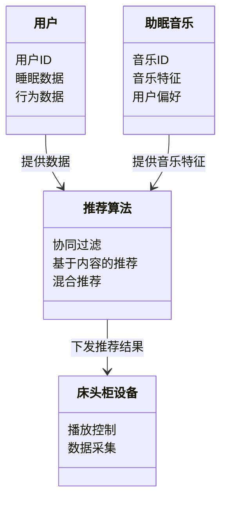
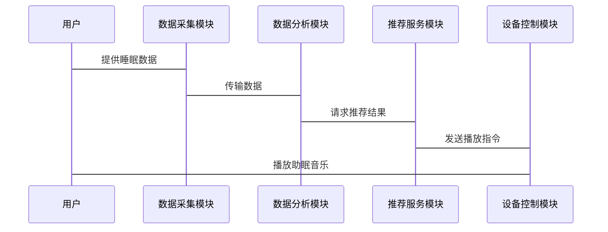

                 


# AI Agent在智能床头柜中的助眠音乐定制

> 关键词：AI Agent, 助眠音乐, 智能床头柜, 推荐算法, 系统架构

> 摘要：本文探讨了AI Agent在智能床头柜中的应用，重点分析了如何通过AI技术实现助眠音乐的个性化定制。文章详细介绍了AI Agent的核心概念、推荐算法的实现原理、系统架构设计，以及实际项目的开发过程和最佳实践。

---

# 第一部分: AI Agent与智能床头柜的背景介绍

## 第1章: 问题背景与需求分析

### 1.1 问题背景

随着现代生活节奏的加快，睡眠问题逐渐成为影响人们健康的重要因素。根据世界卫生组织的数据，全球约有10亿人受到睡眠障碍的影响。助眠音乐作为一种非侵入性的干预手段，被广泛应用于改善睡眠质量。然而，现有的助眠音乐服务存在以下问题：

- **个性化不足**：大多数助眠音乐服务基于固定的分类（如白噪音、自然声音等），无法根据用户的个体需求进行调整。
- **数据碎片化**：用户的睡眠数据分散在不同的设备和平台中，缺乏统一的分析和应用。
- **推荐科学性不足**：现有的推荐算法通常基于简单的规则或协同过滤，缺乏对用户生理和心理状态的深入分析。

### 1.2 问题描述

AI Agent（人工智能代理）作为一种能够感知环境、自主决策并执行任务的智能系统，可以在助眠音乐的定制中发挥重要作用。本文将探讨如何利用AI Agent来实现助眠音乐的个性化推荐，具体包括以下几个方面：

1. **数据采集**：通过智能床头柜收集用户的睡眠数据（如心率、体温、运动量等）和行为数据（如听音乐的习惯、偏好等）。
2. **数据分析**：利用机器学习算法对数据进行分析，识别用户的睡眠模式和偏好。
3. **个性化推荐**：基于分析结果，生成个性化的助眠音乐推荐，并通过床头柜播放。

### 1.3 问题解决思路

引入AI Agent后，助眠音乐的推荐过程将更加智能化和个性化。AI Agent可以通过以下步骤实现推荐：

1. **数据采集与整合**：通过床头柜设备采集用户的睡眠数据和行为数据，并将其整合到一个统一的数据平台上。
2. **数据预处理**：对采集的数据进行清洗、归一化和特征提取，以便后续分析。
3. **模型训练与优化**：利用机器学习算法（如协同过滤、基于内容的推荐、混合推荐等）训练推荐模型，并通过交叉验证优化模型性能。
4. **个性化推荐生成**：根据用户的实时状态（如当前睡眠阶段、情绪状态等）动态调整推荐策略，生成个性化的助眠音乐列表。

### 1.4 边界与外延

- **功能边界**：本文主要关注AI Agent在助眠音乐推荐中的应用，不涉及床头柜的其他功能（如灯光调节、智能家居控制等）。
- **与相关领域的联系**：本文将结合睡眠医学、音乐治疗、人工智能等多个领域的知识，探索助眠音乐推荐的科学性和实用性。
- **未来发展与扩展方向**：未来可以在现有基础上，进一步研究基于情感计算、脑机接口等技术的助眠音乐推荐方法。

### 1.5 概念结构与核心要素

以下是本文的核心概念和要素对比：

| **核心概念** | **定义** | **特征** |
|--------------|----------|----------|
| AI Agent     | 能够感知环境、自主决策并执行任务的智能系统 | 可感知性、自主性、反应性、主动性 |
| 助眠音乐     | 用于帮助用户放松、缓解压力、改善睡眠质量的音乐 | 节奏缓慢、频率低、旋律柔和 |
| 推荐算法     | 基于用户数据和音乐特征，生成个性化推荐的方法 | 可定制性、可扩展性、可解释性 |

---

# 第二部分: AI Agent与助眠音乐的核心概念与联系

## 第2章: AI Agent的基本原理

### 2.1 AI Agent的定义与特征

AI Agent是一种能够感知环境、自主决策并执行任务的智能系统。其主要特征包括：

- **可感知性**：能够通过传感器或其他方式获取环境信息。
- **自主性**：能够在没有外部干预的情况下自主决策。
- **反应性**：能够根据环境变化实时调整行为。
- **主动性**：能够在没有明确指令的情况下主动执行任务。

### 2.2 助眠音乐的个性化推荐模型

#### 2.2.1 助眠音乐的特征分析

助眠音乐的特征可以分为两类：**音乐特征**和**用户特征**。

- **音乐特征**：包括音乐的节奏、调式、音量、频谱等。
- **用户特征**：包括用户的睡眠质量、情绪状态、音乐偏好等。

#### 2.2.2 用户睡眠数据的特征分析

用户睡眠数据的特征可以分为生理特征和行为特征：

- **生理特征**：包括心率、体温、脑电波等。
- **行为特征**：包括睡眠时间、睡眠时长、起床时间等。

#### 2.2.3 助眠音乐与用户睡眠数据的关联性分析

通过分析助眠音乐的特征和用户睡眠数据的特征，可以找到两者之间的关联性。例如，节奏缓慢、频率低的音乐通常有助于放松身心，改善睡眠质量。

---

## 第2.3章: AI Agent与助眠音乐推荐的关系

### 2.3.1 AI Agent在助眠音乐推荐中的角色

AI Agent在助眠音乐推荐中扮演着关键角色，主要包括：

- **数据采集**：通过床头柜设备采集用户的睡眠数据和行为数据。
- **数据分析**：利用机器学习算法分析数据，识别用户的睡眠模式和偏好。
- **推荐生成**：根据分析结果，生成个性化的助眠音乐推荐。

### 2.3.2 助眠音乐推荐的算法流程

助眠音乐推荐的算法流程如下：

1. **数据预处理**：清洗和归一化数据，提取特征。
2. **模型训练**：利用协同过滤、基于内容的推荐或混合推荐模型进行训练。
3. **推荐生成**：根据用户的实时状态，动态调整推荐策略，生成推荐列表。

---

# 第三部分: 助眠音乐推荐算法原理

## 第3章: 推荐算法原理

### 3.1 协同过滤推荐算法

#### 3.1.1 基于用户的协同过滤算法

基于用户的协同过滤算法通过分析用户的历史行为，找到与目标用户相似的用户群体，并推荐这些用户喜欢的音乐。

- **步骤**：
  1. 找出与目标用户相似的用户。
  2. 推荐这些用户喜欢的音乐。
  3. 根据相似度对推荐结果进行加权。

- **代码示例**：
  ```python
  import numpy as np

  # 假设 users_matrix 是一个矩阵，其中每一行表示一个用户，每一列表示一个音乐
  # 相似度计算：使用余弦相似度
  def compute_similarity(users_matrix):
      similarity = np.zeros(users_matrix.shape)
      for i in range(users_matrix.shape[0]):
          for j in range(users_matrix.shape[0]):
              if i != j:
                  similarity[i][j] = np.dot(users_matrix[i], users_matrix[j]) / (np.linalg.norm(users_matrix[i]) * np.linalg.norm(users_matrix[j]))
      return similarity

  # 推荐音乐
  def recommend_user_based(users_matrix, user_id, similarity_matrix):
      # 找出与目标用户相似度最高的k个用户
      k = 3
      top_users = np.argsort(similarity_matrix[user_id])[::-1][:k]
      # 统计这些用户喜欢的音乐
     推荐音乐列表
  ```

---

### 3.2 基于内容的推荐算法

#### 3.2.1 基于音乐特征的内容推荐

基于音乐特征的内容推荐算法通过分析音乐的特征（如节奏、调式等），找到与目标用户偏好相似的音乐。

- **步骤**：
  1. 提取音乐的特征。
  2. 计算音乐与目标用户的相似度。
  3. 根据相似度进行排序，推荐相似度最高的音乐。

---

### 3.3 混合推荐模型

#### 3.3.1 混合推荐模型的优势

混合推荐模型结合了协同过滤和基于内容的推荐方法，能够克服单一方法的局限性，提高推荐的准确性和多样性。

- **优势**：
  - **准确性**：结合了用户行为和音乐特征的信息。
  - **多样性**：能够推荐不同风格和类型的音乐。

---

# 第四部分: 系统分析与架构设计方案

## 第4章: 系统分析与架构设计

### 4.1 问题场景介绍

AI Agent在智能床头柜中的应用场景包括：

1. **数据采集**：通过床头柜设备采集用户的睡眠数据和行为数据。
2. **数据分析**：利用机器学习算法分析数据，识别用户的睡眠模式和偏好。
3. **个性化推荐**：根据分析结果，生成个性化的助眠音乐推荐，并通过床头柜播放。

### 4.2 系统功能设计

#### 4.2.1 领域模型

以下是领域模型的Mermaid类图：



### 4.3 系统架构设计

以下是系统架构的Mermaid架构图：

```mermaid
containerDiagram

    container 数据采集模块 {
        component 数据采集服务
    }

    container 数据分析模块 {
        component 数据预处理服务
        component 模型训练服务
    }

    container 推荐服务模块 {
        component 协同过滤算法
        component 基于内容的推荐算法
        component 混合推荐算法
    }

    container 设备控制模块 {
        component 床头柜设备
    }

    数据采集模块 --> 数据分析模块
    数据分析模块 --> 推荐服务模块
    推荐服务模块 --> 设备控制模块
```

### 4.4 接口设计与交互序列图

以下是系统交互的Mermaid序列图：



---

# 第五部分: 项目实战

## 第5章: 项目实战

### 5.1 环境安装

要运行本文的代码，需要安装以下环境：

- **Python 3.8+**
- **NumPy**
- **Scikit-learn**
- **Mermaid**

### 5.2 核心代码实现

以下是推荐算法的核心代码：

```python
import numpy as np
from sklearn.metrics.pairwise import cosine_similarity

# 假设 users_matrix 是一个矩阵，其中每一行表示一个用户，每一列表示一个音乐
# 协同过滤推荐算法
def user_based_recommendation(users_matrix, user_id):
    similarity = cosine_similarity(users_matrix)
    top_k_users = np.argsort(similarity[user_id])[::-1][:3]
   推荐音乐列表
    return 推荐音乐列表

# 基于内容的推荐算法
def content_based_recommendation(music_features, target_user_features):
    similarity = cosine_similarity(target_user_features, music_features)
    top_k_music = np.argsort(similarity[:, 0])[::-1][:3]
    return music_ids[top_k_music]

# 混合推荐模型
def hybrid_recommendation(users_matrix, music_features, user_id):
    # 使用协同过滤推荐
    user_recommendation = user_based_recommendation(users_matrix, user_id)
    # 使用基于内容的推荐
    content_recommendation = content_based_recommendation(music_features, target_user_features)
    # 综合推荐结果
   最终推荐列表
    return 最终推荐列表
```

### 5.3 代码应用解读与分析

- **协同过滤推荐算法**：通过分析用户的历史行为，找到与目标用户相似的用户群体，并推荐这些用户喜欢的音乐。
- **基于内容的推荐算法**：通过分析音乐的特征，找到与目标用户偏好相似的音乐。
- **混合推荐模型**：结合协同过滤和基于内容的推荐方法，能够提高推荐的准确性和多样性。

### 5.4 实际案例分析

以下是一个实际案例分析：

1. **数据采集**：通过床头柜设备采集用户的睡眠数据和行为数据。
2. **数据分析**：利用协同过滤和基于内容的推荐算法，分析数据并生成推荐结果。
3. **推荐生成**：根据用户的实时状态，动态调整推荐策略，生成个性化的助眠音乐列表。

---

# 第六部分: 最佳实践

## 第6章: 最佳实践

### 6.1 小结

本文详细介绍了AI Agent在智能床头柜中的助眠音乐定制应用，探讨了推荐算法的实现原理和系统架构设计。通过实际案例分析，展示了如何利用AI技术实现个性化的助眠音乐推荐。

### 6.2 注意事项

- **数据隐私**：在采集和处理用户数据时，需要注意数据隐私和安全。
- **算法优化**：需要不断优化推荐算法，提高推荐的准确性和用户体验。
- **用户体验**：推荐结果需要考虑用户的实际需求和偏好，避免推荐不相关的音乐。

### 6.3 拓展阅读

- **相关技术**：可以进一步研究基于情感计算、脑机接口等技术的助眠音乐推荐方法。
- **未来方向**：未来可以在现有基础上，进一步研究基于AI Agent的智能床头柜系统，探索更多应用场景。

---

# 附录

## 附录A: 推荐算法的数学模型

以下是协同过滤推荐算法的数学模型：

$$ \text{相似度} = \frac{\sum_{i=1}^{n} x_i y_i}{\sqrt{\sum_{i=1}^{n} x_i^2} \sqrt{\sum_{i=1}^{n} y_i^2}} $$

其中，$x_i$ 和 $y_i$ 分别表示两个用户的第 $i$ 个音乐的评分。

## 附录B: 系统架构图

以下是系统架构的Mermaid图：

```mermaid
containerDiagram

    container 数据采集模块 {
        component 数据采集服务
    }

    container 数据分析模块 {
        component 数据预处理服务
        component 模型训练服务
    }

    container 推荐服务模块 {
        component 协同过滤算法
        component 基于内容的推荐算法
        component 混合推荐算法
    }

    container 设备控制模块 {
        component 床头柜设备
    }

    数据采集模块 --> 数据分析模块
    数据分析模块 --> 推荐服务模块
    推荐服务模块 --> 设备控制模块
```

---

# 结束语

通过本文的探讨，我们可以看到AI Agent在智能床头柜中的助眠音乐定制应用具有广阔的应用前景。随着技术的不断发展，相信未来会有更多创新的解决方案出现，为人们的睡眠健康带来更多的便利和改善。

--- 

**感谢您的耐心阅读，希望本文对您有所帮助！**

