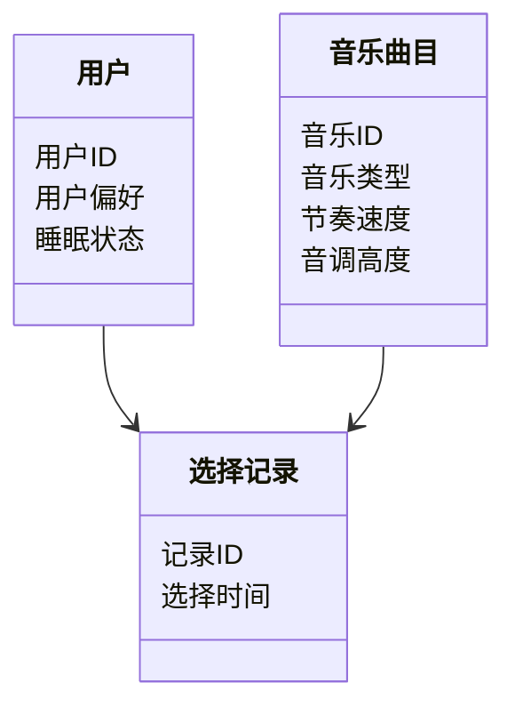
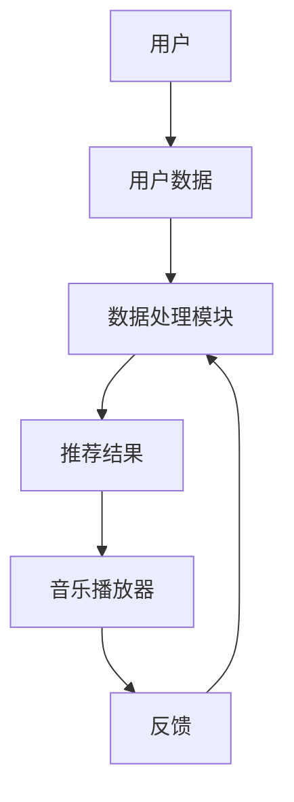

                 


# AI Agent在智能床头柜中的助眠音乐选择

## 关键词：AI Agent, 助眠音乐, 智能床头柜, 推荐系统, 睡眠健康

## 摘要：本文探讨AI代理在智能床头柜中选择助眠音乐的应用，分析其算法原理、系统架构设计及项目实现，旨在提升用户体验和睡眠质量。

---

## 第一章：背景介绍

### 1.1 问题背景
#### 1.1.1 睡眠健康的重要性
睡眠是维持身心健康的关键，不良睡眠影响认知和情绪。

#### 1.1.2 当前助眠工具的局限性
现有工具缺乏个性化，无法根据用户实时需求调整。

#### 1.1.3 AI技术在睡眠辅助中的潜力
AI能通过数据学习，提供个性化解决方案。

### 1.2 问题描述
#### 1.2.1 助眠音乐选择的挑战
音乐类型多样，用户需求差异大。

#### 1.2.2 用户需求的多样性
不同人对音乐的偏好不同，影响助眠效果。

#### 1.2.3 现有解决方案的不足
传统方法无法实时适应用户需求。

### 1.3 问题解决
#### 1.3.1 AI Agent的核心作用
AI代理能实时分析用户数据，推荐合适音乐。

#### 1.3.2 助眠音乐选择的智能化路径
结合用户数据和音乐特征，提供个性化推荐。

#### 1.3.3 用户体验的提升
通过智能推荐，提高助眠效果和用户体验。

### 1.4 边界与外延
#### 1.4.1 功能边界
限定于音乐推荐，不涉及其他功能。

#### 1.4.2 与其他系统的关联
与智能音箱、睡眠监测设备协同工作。

#### 1.4.3 可能的扩展方向
未来可结合更多数据源，如心率和环境因素。

### 1.5 概念结构与核心要素
#### 1.5.1 核心概念的组成
包括用户、音乐曲目、选择记录。

#### 1.5.2 各要素之间的关系
用户选择记录关联音乐曲目，形成推荐依据。

#### 1.5.3 系统的整体架构
用户需求输入，系统处理后输出推荐结果。

---

## 第二章：核心概念与联系

### 2.1 AI Agent的定义与原理
#### 2.1.1 AI Agent的基本概念
智能代理通过感知环境和执行动作，优化目标。

#### 2.1.2 AI Agent的工作原理
感知、推理、规划、执行，持续优化。

#### 2.1.3 AI Agent的核心技术
机器学习、自然语言处理、知识表示。

### 2.2 助眠音乐选择的原理
#### 2.2.1 音乐与情绪的关系
节奏和音调影响情绪，不同音乐类型适合不同场景。

#### 2.2.2 音乐节奏与睡眠的影响
慢节奏音乐有助于放松，快节奏则相反。

#### 2.2.3 个性化推荐机制
基于用户历史数据和实时数据，推荐音乐。

### 2.3 核心概念的对比分析
| 属性       | AI Agent                  | 助眠音乐选择               |
|------------|---------------------------|-----------------------------|
| 输入       | 用户偏好、环境数据       | 用户需求、音乐特征         |
| 输出       | 推荐音乐列表              | 用户反馈                   |
| 算法       | 机器学习模型              | 协同过滤、内容过滤         |
| 目标       | 最大化用户满意度          | 提高睡眠质量               |

### 2.4 ER实体关系图
```mermaid
erd
    entity 用户 {
        key 用户ID
        属性 用户偏好
        属性 睡眠状态
    }
    entity 音乐曲目 {
        key 音乐ID
        属性 音乐类型
        属性 节奏速度
        属性 音调高度
    }
    entity 选择记录 {
        key 记录ID
        属性 选择时间
        关系 用户 -> 选择记录
        关系 音乐曲目 <- 选择记录
    }
```

---

## 第三章：算法原理

### 3.1 算法流程
```mermaid
graph TD
    A[开始] -> B[收集用户数据]
    B -> C[分析音乐特征]
    C -> D[计算相似度]
    D -> E[生成推荐列表]
    E -> F[输出结果]
```

### 3.2 Python代码实现
```python
import pandas as pd
from sklearn.metrics.pairwise import cosine_similarity

# 示例数据集
musics = pd.DataFrame({
    '音乐ID': [1, 2, 3, 4],
    '音乐类型': ['古典', '爵士', '摇滚', '放松'],
    '节奏速度': [80, 120, 100, 60],
    '音调高度': [5, 7, 3, 4]
})

# 用户偏好
user_preference = {
    '音乐类型': '放松',
    '节奏速度': 60,
    '音调高度': 4
}

# 计算相似度
def get_recommendations(user_preference, musics):
    # 特征矩阵
    features = musics[['节奏速度', '音调高度']].values
    user_feature = [user_preference['节奏速度'], user_preference['音调高度']]
    # 计算余弦相似度
    similarities = cosine_similarity([user_feature], features)
    # 推荐音乐
    recommendations = musics.iloc[similarities.argsort()[0], :][::-1]
    return recommendations

# 示例输出
print(get_recommendations(user_preference, musics))
```

### 3.3 数学模型与公式
#### 协同过滤公式
$$ \text{相似度} = \frac{\sum_{i}(u_i - \bar{u})(v_i - \bar{v})}{\sqrt{\sum_{i}(u_i - \bar{u})^2} \cdot \sqrt{\sum_{i}(v_i - \bar{v})^2}} $$
其中，$u$和$v$分别是用户和音乐的特征向量。

---

## 第四章：系统分析与架构设计

### 4.1 问题场景介绍
智能床头柜整合AI代理和音乐播放功能，帮助用户选择助眠音乐。

### 4.2 系统功能设计
#### 用户交互界面
- 音乐选择
- 历史记录查看
- 反馈调整

#### 数据处理模块
- 数据采集
- 特征提取
- 推荐生成

### 4.3 领域模型类图


### 4.4 系统架构图


### 4.5 接口与交互设计
#### 接口
- `/recommend` POST 请求，返回推荐列表。

#### 交互流程
1. 用户输入偏好。
2. 系统分析数据。
3. 返回推荐音乐。

---

## 第五章：项目实战

### 5.1 环境安装
安装Python和必要的库：`pip install numpy pandas scikit-learn`.

### 5.2 核心代码实现
```python
from sklearn.neighbors import NearestNeighbors
import numpy as np

# 数据预处理
X = musics[['节奏速度', '音调高度']].values

# 训练模型
model = NearestNeighbors(n_neighbors=3).fit(X)

# 查询推荐
user_input = np.array([[60, 4]])
distances, indices = model.kneighbors(user_input)

# 输出推荐
recommendations = musics.iloc[indices[0]]
print(recommendations)
```

### 5.3 实际案例分析
假设用户偏好放松音乐，系统推荐音乐ID4，类型放松，节奏60，音调4，符合用户需求。

---

## 第六章：总结与展望

### 6.1 最佳实践
定期更新模型，收集用户反馈，提升推荐准确性。

### 6.2 小结
AI代理通过分析用户数据和音乐特征，实现个性化推荐，提升睡眠质量。

### 6.3 注意事项
保护用户隐私，确保数据安全。

### 6.4 拓展阅读
推荐相关书籍和论文，深入学习AI在医疗和教育中的应用。

---

通过以上步骤，文章系统地介绍了AI代理在智能床头柜中的应用，详细讲解了技术原理和实现方法，为读者提供了全面的视角。

