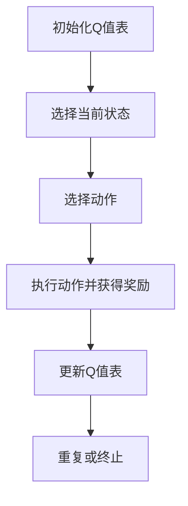
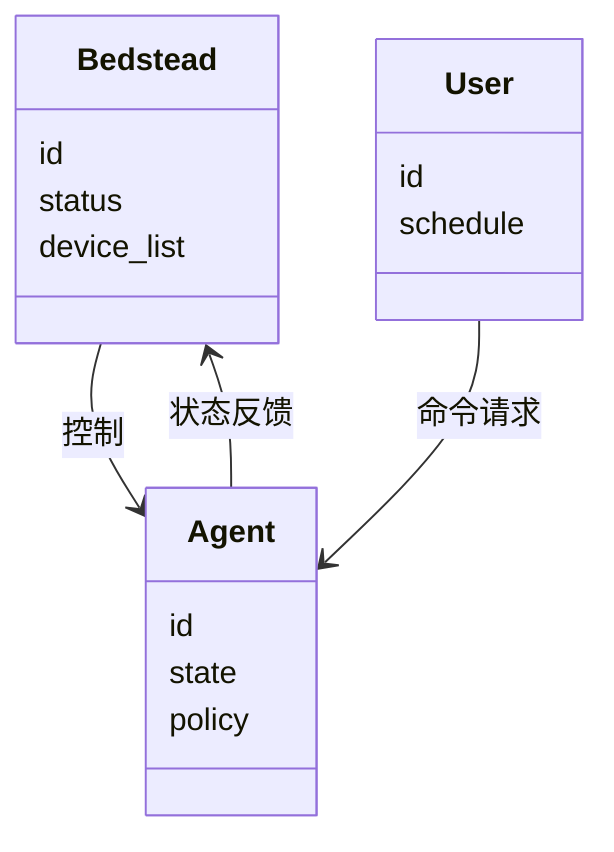
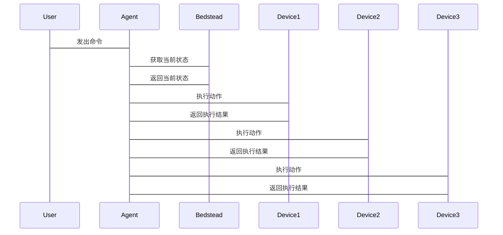

                 


# AI Agent在智能床头柜中的晨间仪式规划

## 关键词：AI Agent, 智能床头柜, 晨间仪式, 状态空间, 强化学习, 系统架构, 项目实战

## 摘要：  
本文详细探讨了AI Agent在智能床头柜中的应用，特别是在优化晨间仪式流程方面。文章从AI Agent的基本概念入手，分析其在智能床头柜中的核心功能，包括感知、决策和执行。通过数学建模和算法实现，本文详细阐述了如何利用强化学习算法（如Q-learning）来优化AI Agent的行为策略。最后，文章通过系统架构设计和项目实战，展示了AI Agent在智能床头柜中的实际应用场景，并提供了可参考的代码实现和案例分析。

---

## 第一部分：引言与背景

### 第1章：AI Agent与智能床头柜的背景介绍

#### 1.1 问题背景与需求分析

现代智能家居设备的普及使得传统床头柜的功能得到了极大的扩展。智能床头柜不再只是一个简单的家具，而是集成了多种智能功能的交互平台。晨间仪式作为人们日常生活中的重要环节，包括起床、洗漱、用餐、出门等步骤，通常涉及多个设备和任务的协调。然而，传统的手动操作流程复杂且效率低下，用户需求多样化的痛点日益明显。

通过引入AI Agent（人工智能代理），智能床头柜可以实现对晨间仪式的智能化管理。AI Agent能够根据用户的习惯和偏好，自动优化任务流程，提升用户体验。这种智能化的解决方案不仅能够提高效率，还能够为用户提供个性化的服务。

#### 1.2 AI Agent的核心概念

AI Agent是一种能够感知环境、做出决策并执行操作的智能实体。在智能床头柜中，AI Agent负责接收用户的输入、处理数据并触发相应的设备动作。其核心功能包括：

1. **感知**：通过传感器或API接口获取环境信息，例如时间、用户的生物数据（心率、体温）等。
2. **决策**：基于感知到的信息，结合预设的规则或学习得到的策略，生成最优的操作方案。
3. **执行**：通过与智能家居设备的通信，执行决策结果，例如调节灯光、启动咖啡机等。

AI Agent的优势在于其能够通过不断的学习和优化，逐步适应用户的习惯和偏好。例如，通过强化学习算法，AI Agent可以在实际使用中不断调整其行为策略，以达到更优的任务执行效果。

#### 1.3 智能床头柜的晨间仪式规划

晨间仪式的典型流程包括以下步骤：

1. **闹钟响起**：AI Agent根据用户的作息习惯触发闹钟。
2. **灯光调节**：根据用户的起床时间，智能调节室内的光线亮度。
3. **温度控制**：联动空调或地暖设备，将室内温度调节到舒适范围。
4. **设备启动**：启动咖啡机、电水壶等设备，准备早餐。
5. **健康监测**：通过智能穿戴设备获取用户的健康数据，提醒用户进行必要的健康检查。
6. **任务提醒**：根据用户的日程安排，提醒重要的事项或待办任务。

AI Agent在这一过程中起到了中枢作用，它不仅需要协调多个设备的联动，还需要根据用户的实时反馈不断优化执行策略。例如，如果用户某天起床较晚，AI Agent可以通过调整灯光亮度和设备启动顺序，来优化后续的操作流程。

#### 1.4 本章小结

本章主要介绍了AI Agent在智能床头柜中的应用背景及其核心功能。通过分析晨间仪式的典型流程，我们明确了AI Agent在优化用户体验方面的重要作用。接下来，我们将深入探讨AI Agent的核心概念与原理，为后续的算法实现奠定理论基础。

---

## 第二部分：AI Agent的核心概念与原理

### 第2章：AI Agent的核心概念与联系

#### 2.1 AI Agent的核心原理

AI Agent的工作原理可以概括为感知、决策和执行三个主要环节：

1. **感知**：AI Agent通过传感器、API接口或其他数据源获取环境信息。例如，智能床头柜可以通过内置的光线传感器感知室内的亮度，或者通过与智能手表的API接口获取用户的睡眠数据。
2. **决策**：基于感知到的信息，AI Agent需要做出最优的决策。这通常涉及到状态空间、动作空间和奖励机制的定义。例如，状态空间可以包括“时间”、“用户状态”等变量，动作空间则包括“调节灯光”、“启动设备”等操作。
3. **执行**：AI Agent根据决策结果，通过与智能家居设备的通信，执行相应的操作。例如，通过发送HTTP请求或调用本地API，触发咖啡机的启动。

AI Agent的核心优势在于其能够通过不断的学习和优化，逐步适应用户的习惯和偏好。例如，通过强化学习算法，AI Agent可以在实际使用中不断调整其行为策略，以达到更优的任务执行效果。

#### 2.2 AI Agent的属性特征对比

以下是几种常见的AI Agent类型及其特点对比：

| **AI Agent类型** | **特点** |
|-------------------|----------|
| **基于规则的AI Agent** | 基于预设的规则和条件进行决策，适用于任务简单、规则明确的场景。 |
| **基于模型的AI Agent** | 基于数学模型进行预测和优化，适用于任务复杂、需要动态调整的场景。 |
| **基于强化学习的AI Agent** | 通过与环境的交互，学习最优策略，适用于需要长期适应和优化的场景。 |

通过对比可以看出，基于强化学习的AI Agent在灵活性和适应性方面具有明显优势，特别适合应用于像智能床头柜这样的动态环境。

#### 2.3 AI Agent的实体关系图

以下是智能床头柜中AI Agent与床头柜、用户之间的实体关系图：

```mermaid
erDiagram
    user {
        id
        name
        schedule
    }
    bedstead {
        id
        status
        device_list
    }
    agent {
        id
        state
        policy
    }
    user -> agent : 命令请求
    agent -> bedstead : 设备控制
    bedstead -> agent : 状态反馈
```

---

## 第三部分：算法原理讲解

### 第3章：AI Agent的算法实现

#### 3.1 算法原理

在智能床头柜中，AI Agent的核心算法可以采用强化学习中的Q-learning算法。其基本原理如下：

1. **状态空间**：AI Agent需要感知的环境状态，例如时间、用户的健康数据等。
2. **动作空间**：AI Agent可以执行的动作，例如调节灯光、启动咖啡机等。
3. **奖励机制**：用户对AI Agent操作的反馈，例如用户满意度评分。

Q-learning算法的目标是通过不断的学习，找到最优的行为策略（Q值），使得在长期的累计奖励中达到最大。

数学模型如下：

$$ Q(s, a) = Q(s, a) + \alpha \cdot [r + \gamma \cdot \max Q(s', a') - Q(s, a)] $$

其中：
- \( s \) 表示当前状态
- \( a \) 表示当前动作
- \( r \) 表示奖励值
- \( \alpha \) 表示学习率
- \( \gamma \) 表示折扣率

#### 3.2 算法实现

以下是基于Q-learning算法的Python代码示例：

```python
import numpy as np

# 定义状态空间和动作空间
state_space = ['time', 'health']
action_space = ['adjust_light', 'start_machine']

# 初始化Q值表
Q = np.zeros(len(state_space), len(action_space))

# 定义学习参数
alpha = 0.1
gamma = 0.9

# 定义奖励机制
def get_reward(current_state, action):
    if action == 'adjust_light' and current_state == 'time':
        return 1
    elif action == 'start_machine' and current_state == 'health':
        return 1
    else:
        return 0

# Q-learning算法实现
for episode in range(1000):
    current_state = np.random.choice(state_space)
    action = np.random.choice(action_space)
    next_state = np.random.choice(state_space)
    reward = get_reward(current_state, action)
    
    Q[current_state][action] = Q[current_state][action] + alpha * (reward + gamma * np.max(Q[next_state]) - Q[current_state][action])

print(Q)
```

#### 3.3 算法流程图

以下是Q-learning算法的流程图：



---

## 第四部分：系统分析与架构设计方案

### 第4章：智能床头柜系统的架构设计

#### 4.1 项目介绍

智能床头柜系统是一个典型的智能家居应用场景，其核心功能是通过AI Agent优化用户的晨间仪式流程。系统需要实现以下功能：

- **设备联动**：通过物联网协议（如MQTT）实现设备间的联动。
- **用户交互**：支持语音或触控交互方式。
- **数据存储**：记录用户的使用习惯和偏好。

#### 4.2 系统功能设计

以下是系统的领域模型：



#### 4.3 系统架构设计

以下是系统的架构图：


#### 4.4 系统接口设计

以下是系统的接口设计：



---

## 第五部分：项目实战

### 第5章：环境搭建与系统实现

#### 5.1 环境搭建

以下是Python环境搭建步骤：

1. 安装Python 3.8或更高版本。
2. 安装必要的库：`numpy`、`pandas`、`matplotlib`。
3. 配置MQTT协议的物联网平台（如HiveMQ）。

#### 5.2 系统核心代码实现

以下是AI Agent的核心代码实现：

```python
import paho.mqtt.client as mqtt

# MQTT配置
broker = 'localhost'
port = 1883

# 定义回调函数
def on_connect(client, userdata, flags, rc):
    print("连接到服务器，返回码：", rc)

def on_message(client, userdata, message):
    print("接收到来自主题：", message.topic, "的消息：", message.payload.decode())

# 创建客户端实例
client = mqtt.Client()
client.on_connect = on_connect
client.on_message = on_message

# 连接服务器
client.connect(broker, port)

# 定义发布消息的函数
def publish(topic, message):
    client.publish(topic, message)

# 启动循环
client.loop_start()

# 发布消息
publish('bedstead/agent', 'init')
```

---

## 第六部分：总结与注意事项

### 第6章：总结与注意事项

#### 6.1 项目小结

通过本文的详细讲解，我们了解了AI Agent在智能床头柜中的应用，特别是其在优化晨间仪式流程方面的潜力。我们从AI Agent的基本概念入手，分析了其在智能床头柜中的核心功能，包括感知、决策和执行。通过数学建模和算法实现，我们详细阐述了如何利用强化学习算法（如Q-learning）来优化AI Agent的行为策略。最后，我们通过系统架构设计和项目实战，展示了AI Agent在智能床头柜中的实际应用场景，并提供了可参考的代码实现和案例分析。

#### 6.2 最佳实践 tips

- 在实际应用中，建议结合用户的实际需求，灵活调整AI Agent的行为策略。
- 定期更新AI Agent的模型参数，以适应用户习惯的变化。
- 注意数据隐私保护，确保用户数据的安全性。

#### 6.3 注意事项

- 在系统设计中，建议充分考虑设备的兼容性和扩展性。
- 在实际部署中，需要确保网络通信的稳定性，避免因网络问题导致系统崩溃。
- 在用户交互设计中，建议提供多种交互方式（如语音和触控），以满足不同用户的需求。

#### 6.4 拓展阅读

- 推荐阅读《强化学习导论》（Introduction to Reinforcement Learning）。
- 推荐学习MQTT协议和物联网设备的通信机制。

---

## 结语

通过本文的详细讲解，我们展示了AI Agent在智能床头柜中的晨间仪式规划中的巨大潜力。随着人工智能技术的不断发展，AI Agent在智能家居中的应用将越来越广泛。未来，我们可以进一步研究如何结合更多的传感器数据和用户行为分析，以实现更加智能化和个性化的服务。

