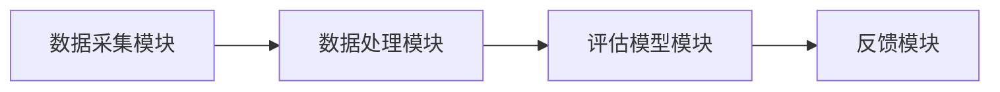
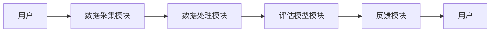

                 


# AI Agent在智能床头柜中的清醒度评估

> 关键词：AI Agent, 智能床头柜, 清醒度评估, 数据分析, 算法原理, 系统架构

> 摘要：本文深入探讨了AI Agent在智能床头柜中的清醒度评估技术。通过分析清醒度评估的核心概念、算法原理和系统架构，结合实际项目案例，详细阐述了如何利用AI技术实现智能床头柜的清醒度评估。文章内容涵盖背景介绍、核心概念、算法实现、系统设计、项目实战和最佳实践，旨在为相关领域的技术从业者提供理论支持和实践指导。

---

## 第一部分: 背景介绍

### 第1章: 清醒度评估的基本概念

#### 1.1 问题背景与问题描述
- 1.1.1 清醒度评估的定义
  - 清醒度评估是指通过多种数据源（如生理数据、行为数据、环境数据等）来判断用户是否处于清醒状态的技术。
- 1.1.2 清醒度评估的必要性
  - 在智能床头柜中，清醒度评估可以用于个性化服务推荐、健康监测和用户行为分析。
- 1.1.3 清醒度评估的应用场景
  - 健康监测：实时监测用户的生理状态。
  - 行为分析：分析用户的日常行为模式。
  - 个性化服务：根据用户的清醒状态提供定制化服务。

#### 1.2 AI Agent的基本概念
- 1.2.1 AI Agent的定义
  - AI Agent是一种能够感知环境、自主决策并执行任务的智能实体。
- 1.2.2 AI Agent的核心特征
  - 感知能力：通过传感器和数据源获取信息。
  - 决策能力：基于获取的信息做出最优决策。
  - 执行能力：通过执行模块完成任务。
- 1.2.3 AI Agent与传统软件的区别
  - AI Agent具备自主性和智能性，能够适应复杂环境的变化。

### 第2章: 智能床头柜的应用背景

#### 2.1 智能床头柜的功能概述
- 2.1.1 智能床头柜的基本功能
  - 睡眠监测：监测用户的睡眠质量。
  - 健康管理：记录用户的健康数据。
  - 智能控制：通过AI Agent实现设备的智能控制。
- 2.1.2 智能床头柜的智能化特征
  - 数据采集：集成多种传感器（如心率、体温、光线传感器等）。
  - 智能分析：通过AI算法对数据进行分析和处理。
  - 人机交互：提供友好的用户界面和交互方式。
- 2.1.3 智能床头柜的用户群体
  - 主要面向需要健康监测的用户，如老年人、失眠患者等。

#### 2.2 清醒度评估在智能床头柜中的应用
- 2.2.1 清醒度评估的必要性
  - 帮助用户了解自身的清醒状态，提供个性化的健康建议。
- 2.2.2 清醒度评估的技术实现
  - 通过AI Agent整合多种数据源，实现对用户清醒度的实时评估。
- 2.2.3 清醒度评估的用户价值
  - 提供健康监测服务，改善用户的睡眠质量。
  - 优化用户的日常行为模式，提升生活品质。

---

## 第二部分: 清醒度评估的核心概念与联系

### 第3章: 清醒度评估的核心原理

#### 3.1 清醒度评估的主要方法
- 3.1.1 基于生理数据的评估方法
  - 心率：心率的变化可以反映用户的生理状态。
  - 体温：体温的变化与用户的清醒度密切相关。
- 3.1.2 基于行为数据的评估方法
  - 睡眠周期：通过分析用户的睡眠周期判断清醒度。
  - 活动模式：通过用户的日常活动模式判断清醒度。
- 3.1.3 基于环境数据的评估方法
  - 光线强度：光线强度的变化可能影响用户的清醒度。
  - 噪音水平：噪音水平的变化可能影响用户的睡眠质量。

#### 3.2 清醒度评估的关键指标
- 3.2.1 生理指标
  - 心率、体温、血压等。
- 3.2.2 行为指标
  - 睡眠周期、活动频率等。
- 3.2.3 环境指标
  - 光线强度、噪音水平等。

### 第4章: 清醒度评估与AI Agent的关系

#### 4.1 AI Agent在清醒度评估中的作用
- 4.1.1 数据采集与整合
  - AI Agent通过集成多种传感器，实时采集用户的生理数据、行为数据和环境数据。
- 4.1.2 数据分析与处理
  - AI Agent利用机器学习算法对数据进行分析和处理，判断用户的清醒度。
- 4.1.3 决策与反馈
  - AI Agent根据分析结果，提供相应的反馈和建议，优化用户的清醒状态。

#### 4.2 清醒度评估与AI Agent的协同工作
- 4.2.1 数据流图（Mermaid）
  ```mermaid
  graph LR
    A[用户] --> B[传感器]
    B --> C[数据采集模块]
    C --> D[数据处理模块]
    D --> E[评估模型]
    E --> F[清醒度评估结果]
    F --> G[反馈模块]
  ```

---

## 第三部分: 清醒度评估的算法原理

### 第5章: 算法原理的详细讲解

#### 5.1 清醒度评估的算法流程
- 5.1.1 数据采集
  - 通过传感器采集用户的生理数据、行为数据和环境数据。
- 5.1.2 数据预处理
  - 对采集到的数据进行清洗、归一化和特征提取。
- 5.1.3 模型训练
  - 使用机器学习算法（如支持向量机、随机森林等）训练清醒度评估模型。
- 5.1.4 模型推理
  - 使用训练好的模型对新数据进行预测，输出清醒度评估结果。

#### 5.2 算法实现的代码示例
```python
import numpy as np
from sklearn.svm import SVC

# 示例数据
X_train = np.array([[70, 20, 50], [65, 25, 60], [75, 18, 45]])
y_train = np.array([1, 0, 1])

# 训练模型
model = SVC()
model.fit(X_train, y_train)

# 推理
X_test = np.array([[72, 22, 55]])
y_pred = model.predict(X_test)
print("清醒度评估结果:", y_pred)
```

#### 5.3 算法的数学模型
- 清醒度评估的数学模型可以用以下公式表示：
  $$ P(\text{清醒}) = \frac{\sum_{i=1}^{n} w_i x_i}{\sum_{i=1}^{n} w_i} $$
  其中，$w_i$ 是特征 $x_i$ 的权重，表示该特征对清醒度的影响程度。

---

## 第四部分: 清醒度评估的系统架构设计

### 第6章: 系统架构与功能设计

#### 6.1 系统功能设计
- 6.1.1 数据采集模块
  - 负责采集用户的生理数据、行为数据和环境数据。
- 6.1.2 数据处理模块
  - 对采集到的数据进行预处理和特征提取。
- 6.1.3 评估模型模块
  - 使用机器学习算法对数据进行分析和评估，输出清醒度评估结果。
- 6.1.4 反馈模块
  - 根据评估结果，提供相应的反馈和建议。

#### 6.2 系统架构图（Mermaid）


#### 6.3 系统交互流程图（Mermaid）


---

## 第五部分: 项目实战

### 第7章: 项目实现与案例分析

#### 7.1 项目环境搭建
- 安装必要的库：
  ```bash
  pip install numpy scikit-learn
  ```

#### 7.2 核心代码实现
```python
import numpy as np
from sklearn.svm import SVC

# 数据采集模块
def collect_data():
    # 示例数据
    return np.array([[70, 20, 50], [65, 25, 60], [75, 18, 45]])

# 数据处理模块
def preprocess_data(data):
    return data

# 评估模型模块
def train_model(X, y):
    model = SVC()
    model.fit(X, y)
    return model

# 反馈模块
def provide_feedback(result):
    print("清醒度评估结果:", result)

# 主函数
def main():
    data = collect_data()
    processed_data = preprocess_data(data)
    X = processed_data[:, :-1]
    y = processed_data[:, -1]
    model = train_model(X, y)
    test_data = np.array([[72, 22, 55]])
    result = model.predict(test_data)
    provide_feedback(result)

if __name__ == "__main__":
    main()
```

#### 7.3 案例分析
- 通过实际案例分析，展示如何利用AI Agent实现清醒度评估，并优化用户的清醒状态。

---

## 第六部分: 最佳实践与总结

### 第8章: 小结与注意事项

#### 8.1 小结
- 清醒度评估是智能床头柜的重要功能，通过AI Agent可以实现高效、智能的评估。
- 在实际应用中，需要结合多种数据源，优化算法模型，提升评估的准确性。

#### 8.2 注意事项
- 数据隐私保护：确保用户数据的安全性和隐私性。
- 算法优化：不断优化算法模型，提升评估的准确性和实时性。
- 用户体验：设计友好的用户界面，提升用户的使用体验。

### 第9章: 拓展阅读与未来展望

#### 9.1 拓展阅读
- 推荐相关书籍和论文，进一步深入学习清醒度评估和AI Agent的相关知识。

#### 9.2 未来展望
- 探讨清醒度评估在智能床头柜中的未来发展方向，如结合更多的数据源、优化算法模型、提升用户体验等。

---

通过以上目录结构，我们可以系统地学习和实现AI Agent在智能床头柜中的清醒度评估技术。从理论到实践，从算法到系统架构，逐步深入，为相关领域的技术从业者提供全面的技术指导。

