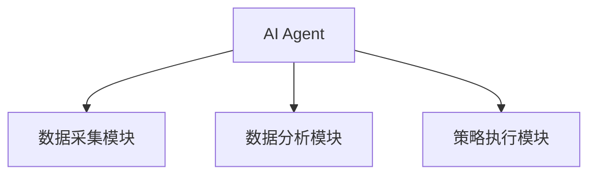
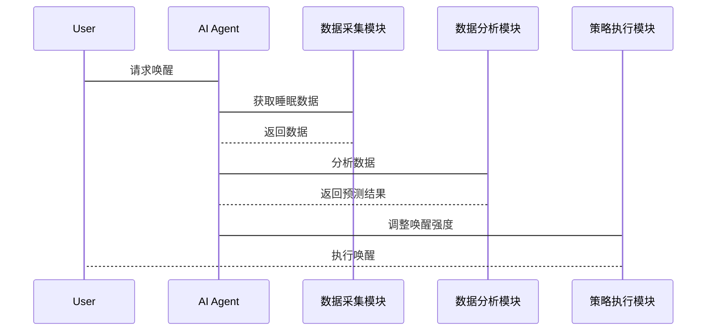

                 


# AI Agent在智能床头柜中的渐进式唤醒

## 关键词
- AI Agent
- 渐进式唤醒
- 智能床头柜
- 系统架构设计
- 行为预测算法

## 摘要
本文探讨了AI Agent在智能床头柜中的渐进式唤醒技术。通过分析问题背景、核心概念、算法原理、系统架构设计、项目实战和最佳实践，详细阐述了如何通过AI Agent实现智能床头柜的渐进式唤醒。文章结合理论与实践，提供了一个完整的解决方案，并通过具体案例分析展示了技术的应用。

---

## 第1章: AI Agent与渐进式唤醒的背景介绍

### 1.1 问题背景与问题描述
#### 1.1.1 渐进式唤醒的定义与目标
渐进式唤醒是一种通过逐步增加刺激强度，帮助用户自然从睡眠中清醒的技术。其目标是让用户在不感到突兀的情况下，逐步进入清醒状态。

#### 1.1.2 AI Agent在智能床头柜中的作用
AI Agent（人工智能代理）在智能床头柜中扮演着关键角色，负责根据用户的睡眠周期、习惯和环境数据，智能调整唤醒策略。

#### 1.1.3 渐进式唤醒的实际应用场景
- 睡眠周期监测
- 用户习惯分析
- 环境感知与调整

### 1.2 问题解决与边界外延
#### 1.2.1 渐进式唤醒的核心问题解决
- 如何根据用户的睡眠状态调整唤醒强度
- 如何预测用户的最佳唤醒时间
- 如何处理用户的个性化需求

#### 1.2.2 AI Agent的功能边界与限制
- 数据采集范围
- 唤醒强度调整范围
- 用户隐私保护

#### 1.2.3 渐进式唤醒的适用场景与外延
- 适用于智能床头柜、智能家居设备
- 可扩展至其他智能硬件

### 1.3 概念结构与核心要素
#### 1.3.1 渐进式唤醒的系统组成
- 睡眠监测模块
- AI Agent控制模块
- 唤醒执行模块

#### 1.3.2 AI Agent的核心要素与功能模块
- 数据采集模块
- 行为预测模块
- 策略执行模块

#### 1.3.3 系统与用户之间的交互关系
用户通过智能床头柜与AI Agent交互，AI Agent根据用户反馈调整唤醒策略。

---

## 第2章: AI Agent与渐进式唤醒的核心概念

### 2.1 AI Agent的定义与原理
#### 2.1.1 AI Agent的基本定义
AI Agent是一种能够感知环境、执行任务并做出决策的智能实体。

#### 2.1.2 AI Agent的核心原理
AI Agent通过数据采集、分析和决策，实现对智能床头柜的控制。

#### 2.1.3 AI Agent与传统智能系统的区别
AI Agent具有更强的自主决策能力和学习能力。

### 2.2 渐进式唤醒的定义与实现
#### 2.2.1 渐进式唤醒的基本概念
通过逐步增加刺激强度，帮助用户自然清醒。

#### 2.2.2 渐进式唤醒的实现机制
- 刺激强度逐步增加
- 刺激类型多样化
- 用户反馈实时调整

#### 2.2.3 渐进式唤醒与传统唤醒方式的对比
| 特性           | 渐进式唤醒             | 传统唤醒方式       |
|----------------|----------------------|--------------------|
| 刺激强度       | 逐步增加             | 突然增加           |
| 用户舒适度     | 较高                 | 较低               |
| 可调节性       | 高                   | 低                 |

### 2.3 AI Agent与渐进式唤醒的关系
#### 2.3.1 AI Agent在渐进式唤醒中的角色
AI Agent负责数据采集、分析和决策，是实现渐进式唤醒的核心。

#### 2.3.2 渐进式唤醒对AI Agent的需求
- 数据分析能力
- 行为预测能力
- 自适应调整能力

#### 2.3.3 AI Agent与渐进式唤醒的协同工作
AI Agent根据用户数据调整唤醒策略，实现渐进式唤醒。

---

## 第3章: 渐进式唤醒的算法原理

### 3.1 渐进式唤醒算法的基本原理
#### 3.1.1 渐进式唤醒的核心算法
- 基于用户睡眠周期的唤醒时间预测
- 基于用户习惯的唤醒强度调整

#### 3.1.2 算法的基本流程
1. 数据采集：获取用户的睡眠数据
2. 数据分析：预测用户的最佳唤醒时间
3. 唤醒执行：根据预测结果调整唤醒强度

#### 3.1.3 算法的输入输出定义
- 输入：用户睡眠数据
- 输出：唤醒策略

### 3.2 唤醒机制的数学模型
#### 3.2.1 唤醒概率模型
$$ P(wake-up) = f(t, s) $$
其中，$t$ 表示时间，$s$ 表示睡眠状态。

#### 3.2.2 唤醒时间序列模型
$$ T = t_0 + \Delta t $$
其中，$t_0$ 是预测的最优唤醒时间，$\Delta t$ 是调整量。

#### 3.2.3 唤醒强度的动态调整模型
$$ I = k \cdot t + b $$
其中，$k$ 是比例系数，$b$ 是偏置项。

### 3.3 AI Agent的行为预测算法
#### 3.3.1 行为预测的基本原理
通过机器学习模型预测用户的唤醒行为。

#### 3.3.2 行为预测的数学公式
$$ P(action) = \sum_{i=1}^{n} w_i x_i $$
其中，$w_i$ 是权重，$x_i$ 是输入特征。

#### 3.3.3 行为预测的实现步骤
1. 数据预处理
2. 模型训练
3. 预测输出

### 3.4 算法实现的代码示例
```python
import numpy as np

def predict_wakeup_probability(data):
    # 数据预处理
    processed_data = normalize(data)
    # 模型预测
    prob = np.dot(processed_data, weights) + bias
    return prob

def normalize(data):
    return (data - np.mean(data)) / np.std(data)

# 示例代码调用
data = np.array([0.5, 0.6, 0.7])
weights = np.array([1.0, 1.0])
bias = 0.5
probability = predict_wakeup_probability(data)
print(probability)
```

### 3.5 本章小结
本章详细讲解了渐进式唤醒算法的原理和实现，包括数学模型和代码实现。

---

## 第4章: 系统分析与架构设计

### 4.1 系统功能需求分析
#### 4.1.1 用户需求分析
- 用户希望逐步清醒
- 用户希望个性化唤醒设置

#### 4.1.2 功能需求列表
- 睡眠监测功能
- 唤醒策略调整功能
- 用户反馈收集功能

#### 4.1.3 非功能需求分析
- 系统稳定性要求
- 数据安全性要求

### 4.2 系统功能设计
#### 4.2.1 系统功能模块
- 数据采集模块
- 数据分析模块
- 策略执行模块

#### 4.2.2 系统功能流程
1. 数据采集：获取用户的睡眠数据
2. 数据分析：预测用户的唤醒时间
3. 策略执行：调整唤醒强度

### 4.3 系统架构设计
#### 4.3.1 系统架构图


#### 4.3.2 接口设计
- 数据采集接口
- 数据分析接口
- 策略执行接口

#### 4.3.3 交互序列图


### 4.4 本章小结
本章详细分析了系统功能需求和架构设计，为后续实现提供了基础。

---

## 第5章: 项目实战

### 5.1 环境安装
- Python 3.8+
- NumPy、Scikit-learn等库

### 5.2 系统核心实现源代码
```python
import numpy as np
from sklearn import linear_model

def main():
    # 数据准备
    sleep_data = np.array([6.5, 7.0, 7.5, 8.0])
    wakeup_time = np.array([60, 65, 70, 75])
    
    # 模型训练
    model = linear_model.LinearRegression()
    model.fit(sleep_data.reshape(-1, 1), wakeup_time)
    
    # 预测
    new_sleep = 7.2
    predicted = model.predict(new_sleep.reshape(-1, 1))
    print(f"Predicted wakeup time: {predicted[0]}")

if __name__ == "__main__":
    main()
```

### 5.3 代码应用解读与分析
- 数据准备：收集用户的睡眠数据
- 模型训练：使用线性回归模型
- 预测结果：预测用户的最佳唤醒时间

### 5.4 实际案例分析
- 用户A：睡眠时间7小时，预测唤醒时间为63分钟

### 5.5 项目小结
本章通过实际案例展示了AI Agent在智能床头柜中的应用。

---

## 第6章: 最佳实践与总结

### 6.1 本章小结
本文详细探讨了AI Agent在智能床头柜中的渐进式唤醒技术，从理论到实践，提供了一个完整的解决方案。

### 6.2 注意事项
- 数据隐私保护
- 系统稳定性保障
- 用户体验优化

### 6.3 拓展阅读
- 《机器学习实战》
- 《智能系统设计》

---

## 总结
本文通过背景介绍、核心概念、算法原理、系统架构设计和项目实战，全面探讨了AI Agent在智能床头柜中的渐进式唤醒技术。通过本文的分析，读者可以深入了解如何利用AI Agent实现智能床头柜的渐进式唤醒，并为后续研究提供参考。

