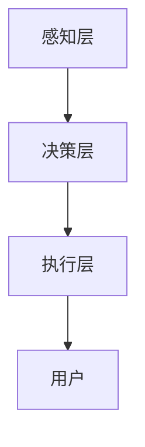
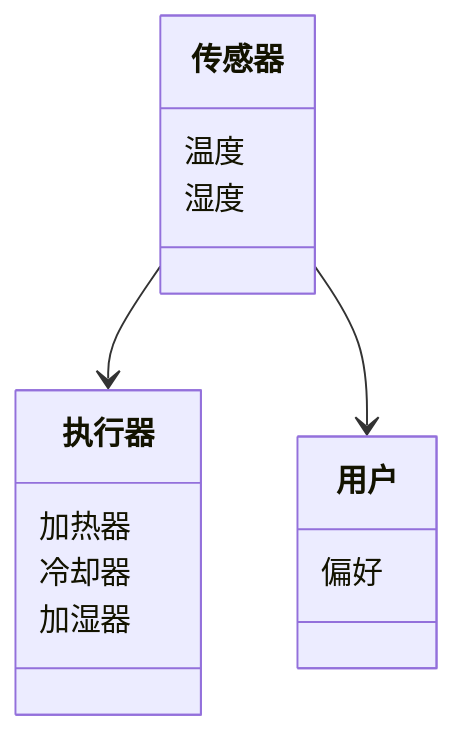
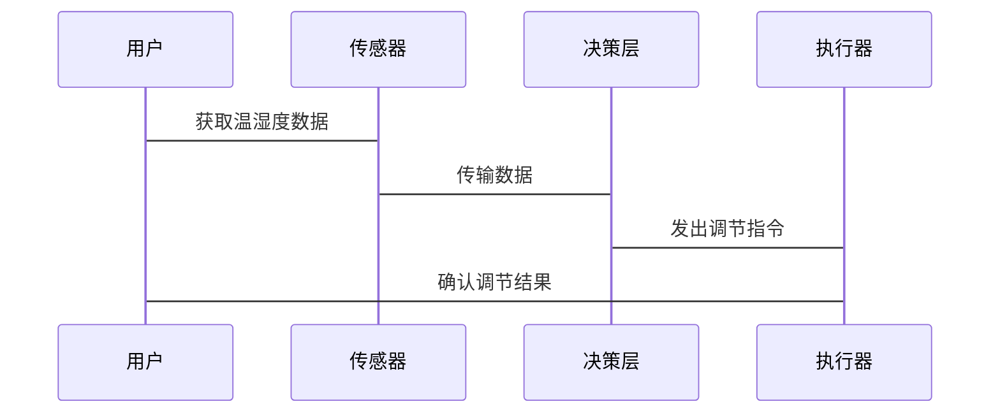

                 


# AI Agent在智能床头柜中的温湿度调节

## 关键词：AI Agent, 智能床头柜, 温湿度调节, 模糊控制, 物联网, 智能家居

## 摘要：  
本文探讨了AI Agent在智能床头柜中的温湿度调节应用。通过分析温湿度调节的背景与重要性，详细讲解了AI Agent的基本原理、核心概念与联系、算法原理、系统架构设计、项目实战及最佳实践。文章内容涵盖从理论到实践的全过程，旨在帮助读者全面理解AI Agent在智能床头柜中的实现与应用。

---

## 第1章: AI Agent与智能床头柜的基本概念

### 1.1 问题背景与描述

#### 1.1.1 温湿度调节的背景与重要性  
温湿度调节是智能家居中不可或缺的功能，直接影响用户的舒适度和健康。传统温湿度调节设备通常依赖于固定的预设值，无法根据环境变化和用户需求动态调整。通过引入AI Agent，可以实现智能化的温湿度调节，提高用户体验。

#### 1.1.2 智能床头柜的功能需求  
智能床头柜需要具备以下功能：  
1. 实时监测环境温湿度。  
2. 根据用户需求和环境变化智能调节温湿度。  
3. 提供用户友好的交互界面。  

#### 1.1.3 AI Agent在温湿度调节中的作用  
AI Agent作为智能床头柜的核心，负责感知环境、分析数据并做出决策，从而实现智能化的温湿度调节。

---

### 1.2 AI Agent的基本原理

#### 1.2.1 AI Agent的定义与特点  
AI Agent是一种能够感知环境、自主决策并执行任务的智能体。其特点包括：  
1. **自主性**：无需外部干预，自主完成任务。  
2. **反应性**：能够实时感知环境变化并做出反应。  
3. **学习能力**：通过数据学习优化决策策略。  

#### 1.2.2 AI Agent的核心功能模块  
1. **感知层**：通过传感器获取环境数据。  
2. **决策层**：基于感知数据做出调节决策。  
3. **执行层**：通过执行器实现决策。  

#### 1.2.3 AI Agent与智能床头柜的结合  
AI Agent通过与床头柜的硬件（如传感器和执行器）结合，实现对温湿度的智能调节。

---

### 1.3 温湿度调节的实现机制

#### 1.3.1 温湿度传感器的工作原理  
温湿度传感器通过测量环境中的温度和湿度值，将数据传输给AI Agent。  

#### 1.3.2 执行器的控制方式  
执行器根据AI Agent的决策指令，调节温湿度。例如，通过风扇、加湿器或加热器实现温湿度控制。  

#### 1.3.3 AI Agent的决策逻辑  
AI Agent根据当前温湿度值和用户需求，结合历史数据，做出调节决策。  

---

## 第2章: AI Agent的核心概念与原理

### 2.1 AI Agent的核心概念

#### 2.1.1 感知层: 温湿度数据的采集与处理  
感知层通过传感器采集环境数据，并对数据进行预处理。  

#### 2.1.2 决策层: 基于数据的智能决策  
决策层基于感知数据和用户需求，利用算法做出调节决策。  

#### 2.1.3 执行层: 决策的最终执行  
执行层根据决策层的指令，通过执行器实现温湿度调节。  

#### 2.1.4 实体关系图  
```mermaid
er
  actor 用户
  actor 环境
  actor 执行器
  actor 传感器
  database 系统数据
  user 用户偏好
  function 模糊控制算法
  function 机器学习算法
  link 用户 --> 用户偏好
  link 传感器 --> 系统数据
  link 系统数据 --> 模糊控制算法
  link 系统数据 --> 机器学习算法
  link 模糊控制算法 --> 执行器
  link 机器学习算法 --> 执行器
```

---

### 2.2 AI Agent的决策算法

#### 2.2.1 常见的温湿度调节算法  
1. **模糊控制算法**：适合处理非线性问题，如温湿度调节。  
2. **机器学习算法**：如随机森林、支持向量机等，适合复杂场景。  

#### 2.2.2 模糊控制算法的原理与应用  
模糊控制算法通过模糊规则将输入数据映射到输出控制量。  

#### 2.2.3 机器学习算法的适用性分析  
机器学习算法适用于需要处理大量历史数据和复杂场景的情况。  

---

### 2.3 AI Agent的系统架构

#### 2.3.1 系统的整体架构设计  
系统采用分层架构，包括感知层、决策层和执行层。  

#### 2.3.2 各模块之间的关系与协作  


#### 2.3.3 系统的可扩展性与灵活性  
系统设计注重模块化，便于功能扩展和优化。

---

## 第3章: AI Agent的算法原理与实现

### 3.1 模糊控制算法的原理与实现

#### 3.1.1 模糊规则的建立  
模糊规则是模糊控制算法的核心，例如：  
- 如果温度过高，湿度适宜，则降低温度。  

#### 3.1.2 模糊推理的过程  
模糊推理通过模糊规则将输入数据转换为输出控制量。  

#### 3.1.3 模糊控制算法的数学模型  
模糊控制算法的数学模型如下：  
$$ y = f(x) $$  
其中，$x$ 是输入数据，$y$ 是输出控制量。  

#### 3.1.4 代码实现  
```python
# 模糊控制算法实现
def fuzzy_control(temperature, humidity):
    # 定义模糊规则
    if temperature > 25 and humidity < 50:
        return 'increase humidity'
    elif temperature < 20 and humidity > 70:
        return 'decrease humidity'
    else:
        return 'no change'
```

---

### 3.2 机器学习算法的原理与实现

#### 3.2.1 机器学习算法的数学模型  
机器学习算法的数学模型如下：  
$$ y = \sum_{i=1}^{n} w_i x_i + b $$  
其中，$w_i$ 是权重，$x_i$ 是输入特征，$b$ 是偏置。  

#### 3.2.2 机器学习算法的训练过程  
通过历史数据训练模型，得到最优权重和偏置。  

#### 3.2.3 代码实现  
```python
# 机器学习算法实现
from sklearn import linear_model

# 训练模型
model = linear_model.LinearRegression()
model.fit(X, y)
```

---

## 第4章: 系统分析与架构设计方案

### 4.1 问题场景介绍  
智能床头柜需要在不同环境下智能调节温湿度，满足用户的舒适需求。

### 4.2 系统功能设计

#### 4.2.1 领域模型  


#### 4.2.2 系统架构设计  


#### 4.2.3 系统接口设计  
- 传感器接口：提供温湿度数据。  
- 执行器接口：接收控制指令。  
- 用户接口：提供用户偏好设置。  

#### 4.2.4 系统交互流程  


---

## 第5章: 项目实战

### 5.1 环境安装

#### 5.1.1 安装Python与必要库  
安装Python和以下库：  
- `numpy`  
- `scipy`  
- `sklearn`  

#### 5.1.2 开发工具安装  
安装`Jupyter Notebook`用于开发和调试。

---

### 5.2 系统核心实现

#### 5.2.1 传感器模拟  
```python
import random

def get_temperature():
    return random.uniform(20, 30)

def get_humidity():
    return random.uniform(30, 90)
```

#### 5.2.2 模糊控制算法实现  
```python
def fuzzy_control(temperature, humidity):
    if temperature > 25 and humidity < 50:
        return 'increase humidity'
    elif temperature < 20 and humidity > 70:
        return 'decrease humidity'
    else:
        return 'no change'
```

#### 5.2.3 系统集成  
```python
# 系统集成
from sensors import get_temperature, get_humidity
from controllers import fuzzy_control

temperature = get_temperature()
humidity = get_humidity()
action = fuzzy_control(temperature, humidity)
print(f"Action: {action}")
```

---

### 5.3 代码解读与分析

#### 5.3.1 传感器模拟代码解读  
传感器模拟代码通过随机函数生成温湿度数据，供系统调用。  

#### 5.3.2 模糊控制算法代码解读  
模糊控制算法根据温湿度数据，返回调节指令。  

---

### 5.4 案例分析与详细讲解

#### 5.4.1 案例分析  
假设环境温度为28℃，湿度为45%。根据模糊控制算法，系统将执行“降低湿度”的指令。  

#### 5.4.2 实际应用中的注意事项  
- 确保传感器精度。  
- 定期校准系统。  

---

## 第6章: 最佳实践与总结

### 6.1 最佳实践 tips

#### 6.1.1 传感器校准  
定期校准传感器，确保数据准确性。  

#### 6.1.2 算法优化  
根据实际需求优化模糊控制算法或引入机器学习算法。  

#### 6.1.3 用户隐私保护  
确保用户偏好的隐私性。  

---

### 6.2 小结

本文详细讲解了AI Agent在智能床头柜中的温湿度调节应用，从理论到实践，帮助读者全面理解实现过程。

---

### 6.3 注意事项

- 确保硬件设备的稳定性。  
- 定期更新系统软件。  

---

### 6.4 拓展阅读

- 《模糊控制原理与应用》  
- 《机器学习实战》  
- 《物联网技术入门与实践》  

--- 

以上是《AI Agent在智能床头柜中的温湿度调节》的技术博客文章的完整内容，涵盖了从理论到实践的全过程，希望对您有所帮助！

