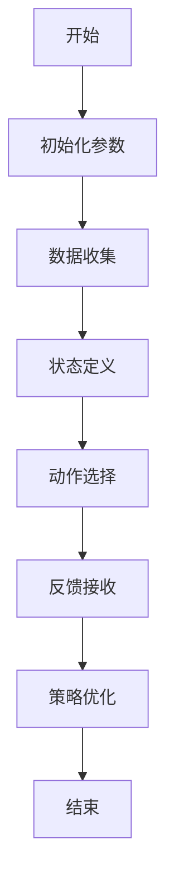

                 


**# AI Agent在智能床头柜中的生物钟调节**

**关键词**：AI Agent, 生物钟调节, 智能床头柜, 算法原理, 系统架构

**摘要**：本文探讨了AI Agent在智能床头柜中的应用，重点分析了生物钟调节的核心问题、AI Agent的算法原理、系统架构设计以及实际应用场景。通过逐步分析，本文提出了基于强化学习的生物钟调节算法，并结合实际案例，展示了如何通过AI技术优化生物钟调节过程，为用户提供个性化的健康解决方案。

---

## 第一部分: AI Agent与生物钟调节概述

### 第1章: AI Agent与生物钟调节的背景介绍

#### 1.1 问题背景与描述
- **生物钟的基本概念与功能**  
  生物钟是指人体内的一种生理节律，控制着我们的睡眠、觉醒、激素分泌等生理活动。正常的生物钟能够帮助我们保持良好的作息习惯，而生物钟紊乱可能导致失眠、疲劳、注意力不集中等问题。

- **现代生活方式对生物钟的影响**  
  现代人由于工作压力、电子设备的普及等因素，常常面临生物钟紊乱的问题。尤其是在快节奏的生活中，不规律的作息时间已成为一种普遍现象。

- **生物钟紊乱的健康问题**  
  生物钟紊乱可能导致多种健康问题，包括失眠、焦虑、抑郁、免疫力下降等。长期的生物钟紊乱还可能增加患慢性病的风险。

#### 1.2 AI Agent在生物钟调节中的应用
- **AI Agent的基本概念与特点**  
  AI Agent是一种能够感知环境、自主决策并执行任务的智能实体。它能够通过学习和优化，不断调整策略以适应用户的需求。

- **智能床头柜的功能与应用场景**  
  智能床头柜是一种集成AI技术的家居设备，能够通过传感器和AI算法，实时监测用户的睡眠状态，并根据数据调整环境参数（如光线、温度、声音等）以优化用户的生物钟调节。

- **生物钟调节的智能化需求**  
  传统的生物钟调节方法依赖于固定的作息表，缺乏灵活性和个性化。而AI Agent可以通过实时数据反馈和自适应学习，为用户提供个性化的生物钟调节方案。

#### 1.3 问题解决与边界定义
- **生物钟调节的核心问题**  
  如何通过AI技术实现个性化的生物钟调节，以改善用户的睡眠质量和整体健康状态。

- **AI Agent的作用边界**  
  AI Agent在生物钟调节中的作用主要集中在数据采集、分析和策略生成，而具体的执行（如调节灯光、播放音乐等）则由智能床头柜完成。

- **系统的架构与功能外延**  
  智能床头柜系统由硬件部分（传感器、执行器）和软件部分（AI算法、数据处理）组成。AI Agent负责数据的分析与策略生成，而硬件部分负责执行具体的调节动作。

---

### 第2章: AI Agent的核心概念与原理

#### 2.1 AI Agent的原理与机制
- **AI Agent的基本工作原理**  
  AI Agent通过传感器采集用户的行为数据（如睡眠周期、心率、体温等），结合历史数据和实时反馈，利用机器学习算法生成个性化的调节策略。

- **基于反馈机制的生物钟调节算法**  
  该算法通过实时监测用户的生理数据和环境数据，动态调整调节策略。例如，当用户在深夜频繁翻身时，AI Agent可能会降低房间的光线亮度以促进深度睡眠。

- **AI Agent的自适应学习能力**  
  AI Agent能够通过强化学习不断优化调节策略。例如，当用户的睡眠质量提升时，系统会记录并强化成功的调节策略。

#### 2.2 核心概念属性对比
- **生物钟调节与传统定时器的对比分析**  
  传统定时器只能按照固定的时间表执行任务，而AI Agent可以根据用户的实时状态动态调整。

- **AI Agent与传统硬件控制的对比**  
  AI Agent不仅能够执行任务，还能够通过学习不断优化任务执行策略。

- **系统功能与性能指标的对比**  
  AI Agent的调节策略能够根据用户的个性化需求进行调整，而传统方法则缺乏灵活性。

#### 2.3 实体关系与架构设计
- **ER实体关系图**  
  ```mermaid
  er
    actor: 用户
    smart_bedside: 智能床头柜
    agent: AI Agent
    action: 动作
    time_schedule: 时间表
    relation: 关系
    actor --> action: 发出调节指令
    action --> smart_bedside: 控制床头柜功能
    smart_bedside --> agent: 提供反馈数据
    agent --> time_schedule: 生成时间表
    time_schedule --> action: 执行调节动作
  ```

---

## 第二部分: AI Agent的算法原理与实现

### 第3章: AI Agent的算法原理与实现

#### 3.1 算法原理概述
- **基于强化学习的调节算法**  
  强化学习是一种通过试错机制优化策略的算法。AI Agent通过与环境的交互，不断调整动作以最大化奖励函数的值。

- **基于反馈机制的自适应调节**  
  AI Agent根据用户的反馈数据（如睡眠质量评分）调整调节策略。

- **算法的核心思想与流程**  
  1. 数据采集：通过传感器采集用户的生理数据和环境数据。  
  2. 状态定义：将用户的生理状态和环境状态定义为状态空间。  
  3. 动作选择：根据当前状态选择最优动作。  
  4. 反馈接收：根据用户的反馈调整策略。  
  5. 策略优化：通过强化学习不断优化策略。

#### 3.2 算法实现步骤
- **数据收集与预处理**  
  从智能床头柜收集用户的生理数据和环境数据，并进行归一化处理。

- **状态空间与动作空间定义**  
  状态空间包括用户的睡眠阶段、心率、体温等，动作空间包括调节光线亮度、播放音乐、调整温度等。

- **策略网络与价值网络的构建**  
  使用深度神经网络构建策略网络和价值网络。策略网络负责生成动作，价值网络负责评估状态的价值。

- **算法的训练与优化**  
  使用强化学习算法（如DQN）训练策略网络，并通过经验回放和目标网络优化算法。

#### 3.3 算法流程图


#### 3.4 算法的数学模型
- **状态转移矩阵**  
  状态空间的转移概率可以用矩阵表示。例如，状态i转移到状态j的概率为$P_{ij}$。

- **奖励函数**  
  奖励函数定义了每种动作的价值。例如，当用户的睡眠质量提升时，系统给予正向奖励。

- **策略优化**  
  通过最大化期望奖励，优化策略网络的参数。数学表达式为：
  $$ \theta_{t+1} = \theta_t + \alpha \nabla_{\theta} J(\theta) $$
  其中，$\alpha$是学习率，$J(\theta)$是目标函数。

---

## 第三部分: 系统分析与架构设计

### 第4章: 系统分析与架构设计

#### 4.1 问题场景介绍
- **用户需求分析**  
  用户希望智能床头柜能够根据自己的睡眠状态动态调整环境参数，帮助自己改善睡眠质量。

- **系统功能介绍**  
  智能床头柜需要具备数据采集、数据处理、策略生成和执行功能。

#### 4.2 系统功能设计
- **领域模型图**  
  ```mermaid
  classDiagram
    class 用户 {
        睡眠阶段
        心率
        体温
    }
    class 环境 {
        光线亮度
        噪声水平
        温度
    }
    class AI Agent {
        状态空间
        动作空间
        策略网络
    }
    用户 --> AI Agent: 提供生理数据
    环境 --> AI Agent: 提供环境数据
    AI Agent --> 环境: 执行调节动作
  ```

#### 4.3 系统架构设计
- **系统架构图**  
  ```mermaid
  architecture
    UserInterface: 用户界面
    Sensor: 传感器
    Agent: AI Agent
    Actuator: 执行器
    Database: 数据库
    Communication: 通信模块
    UserInterface --> Sensor: 发送采集指令
    Sensor --> Database: 存储数据
    Database --> Agent: 提供数据
    Agent --> Actuator: 发送调节指令
    Actuator --> UserInterface: 提供反馈
  ```

#### 4.4 系统接口设计
- **接口设计**  
  - 用户与床头柜的交互接口：如触摸屏或手机APP。  
  - 传感器与AI Agent的通信接口：如I2C或蓝牙。  
  - 执行器与AI Agent的通信接口：如PWM控制或GPIO控制。

- **交互序列图**  
  ```mermaid
  sequenceDiagram
    用户 ->> 床头柜: 请求调节光线亮度
    床头柜 ->> 传感器: 采集环境数据
    传感器 --> 数据库: 存储数据
    数据库 --> AI Agent: 提供数据
    AI Agent ->> 执行器: 发送调节指令
    执行器 --> 用户: 调节光线亮度
  ```

---

## 第四部分: 项目实战

### 第5章: 项目实战

#### 5.1 环境安装与配置
- **安装Python与相关库**  
  安装Python 3.8以上版本，安装深度学习框架（如TensorFlow或PyTorch），安装强化学习库（如OpenAI Gym）。

#### 5.2 系统核心实现
- **核心代码实现**  
  ```python
  import numpy as np
  import gym

  class AI_Agent:
      def __init__(self, state_space, action_space):
          self.state_space = state_space
          self.action_space = action_space
          self.model = self.build_model()

      def build_model(self):
          # 构建深度神经网络模型
          pass

      def act(self, state):
          # 根据当前状态选择动作
          pass

      def update(self, state, action, reward):
          # 更新策略网络
          pass

  # 初始化环境
  env = gym.make('SleepRegulation-v0')
  agent = AI_Agent(env.observation_space, env.action_space)

  # 训练过程
  for episode in range(1000):
      state = env.reset()
      while not done:
          action = agent.act(state)
          next_state, reward, done, info = env.step(action)
          agent.update(state, action, reward)
          state = next_state
  ```

#### 5.3 实际案例分析
- **案例分析**  
  以一名长期失眠的用户为例，AI Agent根据用户的睡眠数据和环境数据，动态调整床头柜的光线亮度和播放音乐的节奏，帮助用户逐步恢复正常的生物钟。

#### 5.4 项目小结
- **项目成果**  
  通过AI Agent实现个性化的生物钟调节，显著提升用户的睡眠质量。  
- **经验总结**  
  强化学习算法在动态环境中表现出色，但需要大量的数据和计算资源支持。

---

## 第五部分: 总结与展望

### 第6章: 总结与展望

#### 6.1 最佳实践 tips
- **数据采集**：确保数据的准确性和完整性。  
- **算法优化**：根据实际需求调整算法参数，优化计算效率。  
- **用户体验**：注重用户界面设计，提升用户体验。

#### 6.2 小结
本文详细探讨了AI Agent在智能床头柜中的应用，提出了基于强化学习的生物钟调节算法，并通过实际案例展示了算法的可行性。

#### 6.3 注意事项
- **数据隐私**：确保用户的生理数据不会被滥用。  
- **系统稳定性**：确保系统的稳定运行，避免因技术故障影响用户体验。  
- **用户教育**：加强对用户的教育，帮助用户理解生物钟调节的重要性。

#### 6.4 拓展阅读
- 推荐阅读《强化学习入门》、《人工智能在智能家居中的应用》等书籍。  
- 关注最新的AI技术进展，了解如何将AI技术应用于更多领域。

---

**# 结语**

通过本文的分析与实践，我们可以看到AI技术在生物钟调节中的巨大潜力。未来，随着AI技术的不断发展，智能床头柜将能够为用户提供更加个性化的健康解决方案，帮助用户更好地管理自己的生物钟，提升生活质量。

