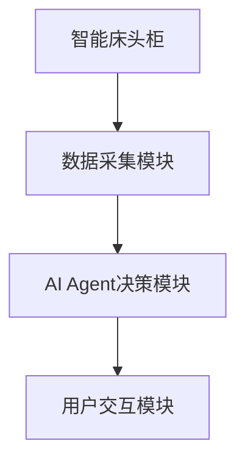
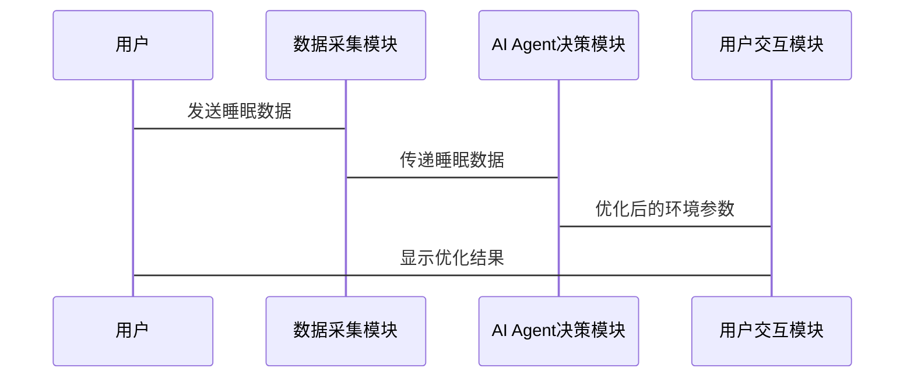

                 


# AI Agent在智能床头柜中的睡眠周期优化

## 关键词：
- AI Agent
- 智能床头柜
- 睡眠周期优化
- 强化学习
- 睡眠健康

## 摘要：
本文详细探讨了AI Agent在智能床头柜中的应用，特别是在优化睡眠周期方面。通过分析睡眠周期的科学原理，结合AI Agent的核心算法，本文展示了如何设计和实现一个基于强化学习的睡眠优化系统。该系统能够根据用户的睡眠数据，实时调整床头柜的环境参数，从而帮助用户改善睡眠质量。文章内容包括背景介绍、核心算法、系统架构、项目实战等部分，详细讲解了每个环节的技术细节和实现方法。

---

# 第1章: AI Agent与睡眠优化的背景介绍

## 1.1 问题背景与描述

### 1.1.1 睡眠问题的现状与挑战
现代社会中，睡眠问题日益普遍，许多人面临失眠、睡眠质量差等问题。睡眠不足或睡眠质量差会导致注意力不集中、记忆力减退、情绪波动等问题，严重时还可能引发心理健康问题。根据世界卫生组织的数据，全球约有10%的人存在睡眠障碍，这一比例在发达国家更高。

### 1.1.2 AI Agent在睡眠优化中的作用
AI Agent（人工智能代理）是一种能够感知环境、自主决策并执行任务的智能体。在睡眠优化领域，AI Agent可以通过分析用户的睡眠数据，实时调整床头柜的环境参数（如光线、温度、声音等），从而帮助用户改善睡眠质量。AI Agent的核心优势在于其能够根据实时数据动态调整策略，提供个性化的睡眠优化方案。

### 1.1.3 智能床头柜的应用场景
智能床头柜是一种结合了物联网技术和AI技术的智能家居设备。它可以通过传感器采集用户的睡眠数据（如心率、呼吸频率、体动次数等），并通过AI Agent优化睡眠周期。智能床头柜的应用场景包括：
- 提供个性化的睡眠环境设置
- 实时监测用户的睡眠状态
- 提供睡眠改善建议
- 集成其他智能家居设备，形成完整的睡眠优化生态系统

---

## 1.2 问题解决与边界

### 1.2.1 AI Agent如何优化睡眠周期
AI Agent通过以下步骤优化睡眠周期：
1. **数据采集**：采集用户的睡眠数据（如心率、呼吸频率、体动次数等）。
2. **数据分析**：分析睡眠数据，识别用户的睡眠周期（如入睡阶段、浅睡阶段、深睡阶段、REM阶段）。
3. **决策优化**：根据分析结果，动态调整床头柜的环境参数（如光线亮度、温度、背景音乐等）。
4. **反馈调整**：根据用户的反馈（如睡眠改善情况）进一步优化决策策略。

### 1.2.2 睡眠优化的边界与外延
- **边界**：AI Agent仅负责优化睡眠周期，不涉及用户的医疗健康问题。
- **外延**：智能床头柜可以与其他智能家居设备（如智能灯泡、智能空调、智能音箱等）联动，形成一个完整的睡眠优化生态系统。

### 1.2.3 智能床头柜的系统构成
智能床头柜的系统构成包括：
1. **硬件部分**：传感器（心率传感器、温度传感器、光线传感器等）、执行器（LED灯、风扇、音响等）。
2. **软件部分**：数据采集模块、AI Agent决策模块、用户交互模块。

---

## 1.3 核心概念与结构

### 1.3.1 AI Agent的定义与核心要素
AI Agent是一种能够感知环境、自主决策并执行任务的智能体。其核心要素包括：
1. **感知能力**：通过传感器获取环境信息。
2. **决策能力**：基于感知信息，制定决策策略。
3. **执行能力**：通过执行器执行决策策略。
4. **学习能力**：通过机器学习算法不断优化决策模型。

### 1.3.2 睡眠周期的科学原理
睡眠周期包括以下几个阶段：
1. **入睡阶段**：用户逐渐放松，进入浅睡阶段。
2. **浅睡阶段**：用户处于轻度睡眠状态。
3. **深睡阶段**：用户处于深度睡眠状态。
4. **REM阶段**：用户处于快速眼动睡眠阶段，梦境活跃。

### 1.3.3 AI Agent与智能床头柜的交互机制
AI Agent与智能床头柜的交互机制如下：
1. **数据采集**：智能床头柜通过传感器采集用户的睡眠数据。
2. **数据传输**：将采集到的数据传输给AI Agent。
3. **决策优化**：AI Agent根据数据优化睡眠周期。
4. **反馈调整**：AI Agent将优化后的环境参数反馈给智能床头柜。

---

# 第2章: AI Agent的核心原理

## 2.1 AI Agent的基本原理

### 2.1.1 AI Agent的感知与决策机制
AI Agent的感知与决策机制包括以下几个步骤：
1. **感知环境**：通过传感器获取环境信息。
2. **分析数据**：对感知数据进行分析，识别用户的睡眠阶段。
3. **制定策略**：根据分析结果，制定优化睡眠周期的决策策略。
4. **执行决策**：通过执行器执行决策策略。

### 2.1.2 状态空间与动作空间的定义
- **状态空间**：表示用户当前的睡眠状态，包括浅睡、深睡、REM等阶段。
- **动作空间**：表示AI Agent可以执行的动作，包括调整光线亮度、温度、背景音乐等。

### 2.1.3 强化学习在AI Agent中的应用
强化学习是一种通过试错方式优化决策模型的算法。AI Agent通过与环境的交互，不断优化其决策策略，以最大化睡眠质量的提升。

---

## 2.2 睡眠周期优化的算法原理

### 2.2.1 基于强化学习的睡眠优化算法
基于强化学习的睡眠优化算法包括以下几个步骤：
1. **状态定义**：定义用户的睡眠状态（如浅睡、深睡、REM等）。
2. **动作定义**：定义AI Agent可以执行的动作（如调整光线、温度等）。
3. **奖励函数**：定义奖励函数，根据用户的睡眠质量评分。
4. **策略优化**：通过强化学习算法优化决策策略。

### 2.2.2 睡眠数据的特征提取与分析
睡眠数据的特征提取与分析包括以下几个步骤：
1. **数据采集**：采集用户的睡眠数据（如心率、呼吸频率等）。
2. **数据预处理**：对采集到的数据进行清洗和归一化处理。
3. **特征提取**：提取睡眠数据的特征（如心率变异、呼吸频率等）。
4. **数据分析**：分析睡眠数据的特征，识别用户的睡眠阶段。

### 2.2.3 睡眠周期的数学模型
睡眠周期的数学模型可以表示为一个状态转移模型，其中状态表示用户的睡眠阶段，动作表示AI Agent可以执行的动作。模型可以通过马尔可夫链进行建模。

---

## 2.3 核心算法的数学模型

### 2.3.1 强化学习的数学公式
强化学习的目标是通过试错方式优化决策策略，以最大化累积奖励。数学公式如下：
$$ Q(s,a) = Q(s,a) + \alpha [ r(s,a) + \gamma \max_{a'} Q(s',a') - Q(s,a) ] $$
其中，$Q(s,a)$表示状态$s$和动作$a$的Q值，$\alpha$表示学习率，$r(s,a)$表示奖励函数，$\gamma$表示折扣因子，$\max_{a'} Q(s',a')$表示下一步状态的最大Q值。

### 2.3.2 睡眠周期优化的数学模型
睡眠周期优化的数学模型可以表示为一个马尔可夫决策过程（MDP），包括状态空间$S$、动作空间$A$、转移概率$P$和奖励函数$R$。模型可以表示为：
$$ \pi(a|s) = \arg\max_{a} Q(s,a) $$

---

# 第3章: 智能床头柜的系统架构

## 3.1 系统功能设计

### 3.1.1 数据采集模块
数据采集模块负责采集用户的睡眠数据，包括心率、呼吸频率、体动次数等。模块可以通过多种传感器实现，如心率传感器、温度传感器、光线传感器等。

### 3.1.2 AI Agent决策模块
AI Agent决策模块负责根据采集到的数据，优化睡眠周期。模块包括强化学习算法和睡眠周期优化算法。

### 3.1.3 用户交互模块
用户交互模块负责与用户的交互，包括显示睡眠数据、接收用户的反馈等。模块可以通过LED显示屏、触摸屏等实现。

---

## 3.2 系统架构设计

### 3.2.1 系统功能模块
智能床头柜的系统功能模块包括：
1. 数据采集模块
2. AI Agent决策模块
3. 用户交互模块

### 3.2.2 系统架构图


---

## 3.3 系统交互设计

### 3.3.1 系统接口设计
系统接口设计包括以下几个部分：
1. 数据采集接口：通过传感器采集用户的睡眠数据。
2. 决策接口：通过AI Agent优化睡眠周期。
3. 用户交互接口：通过LED显示屏、触摸屏等与用户交互。

### 3.3.2 系统交互序列图


---

# 第4章: 项目实战

## 4.1 环境安装

### 4.1.1 开发环境
开发环境包括：
1. Python编程语言
2. TensorFlow或PyTorch框架
3. 硬件设备（如Raspberry Pi）
4. 传感器（如心率传感器、温度传感器）

### 4.1.2 工具安装
工具安装包括：
1. 安装Python依赖库（如numpy、pandas、tensorflow）
2. 安装硬件驱动（如Raspberry Pi的GPIO库）

---

## 4.2 系统核心实现

### 4.2.1 AI Agent决策模块实现
AI Agent决策模块的实现包括以下几个步骤：
1. 数据预处理：对采集到的数据进行清洗和归一化处理。
2. 特征提取：提取睡眠数据的特征（如心率变异、呼吸频率等）。
3. 强化学习算法实现：基于Q-learning算法实现睡眠周期优化。
4. 决策反馈：将优化后的环境参数反馈给用户交互模块。

### 4.2.2 数据采集模块实现
数据采集模块的实现包括以下几个步骤：
1. 选择合适的传感器（如心率传感器、温度传感器）。
2. 传感器数据采集：通过Raspberry Pi采集传感器数据。
3. 数据存储：将采集到的数据存储到本地数据库或云端数据库。

---

## 4.3 代码实现

### 4.3.1 数据采集代码
```python
import numpy as np
import pandas as pd
import time

# 采集心率数据
def collect_heartrate():
    # 模拟传感器数据
    heart_rate = np.random.normal(70, 5, 100)
    return heart_rate

# 采集温度数据
def collect_temperature():
    # 模拟传感器数据
    temperature = np.random.uniform(20, 25, 100)
    return temperature

# 采集数据并存储
def main():
    heart_rate = collect_heartrate()
    temperature = collect_temperature()
    data = pd.DataFrame({
        '时间': pd.date_range('2023-01-01', periods=100),
        '心率': heart_rate,
        '温度': temperature
    })
    data.to_csv('sleep_data.csv', index=False)

if __name__ == '__main__':
    main()
```

### 4.3.2 AI Agent决策代码
```python
import numpy as np
import pandas as pd
import tensorflow as tf

# 定义强化学习模型
class AI-Agent:
    def __init__(self, state_space, action_space):
        self.state_space = state_space
        self.action_space = action_space
        self.Q = np.zeros((state_space, action_space))
        self.alpha = 0.1
        self.gamma = 0.9

    def take_action(self, state):
        # 选择动作
        if np.random.random() < 0.1:
            return np.random.randint(self.action_space)
        else:
            return np.argmax(self.Q[state, :])

    def update_Q(self, state, action, reward, next_state):
        # 更新Q值
        self.Q[state, action] = self.Q[state, action] + self.alpha * (reward + self.gamma * np.max(self.Q[next_state, :]) - self.Q[state, action])

# 初始化AI Agent
state_space = 4  # 睡眠阶段数
action_space = 3  # 动作数
agent = AI-Agent(state_space, action_space)

# 训练模型
for episode in range(100):
    state = 0  # 初始状态
    for step in range(100):
        action = agent.take_action(state)
        reward = 0.9 if action == 2 else 0.1  # 假设动作2最优
        next_state = (state + 1) % 4
        agent.update_Q(state, action, reward, next_state)
        state = next_state
```

---

## 4.4 实际案例分析

### 4.4.1 案例描述
假设用户A的睡眠数据如下：
- 心率：70次/分钟
- 温度：22摄氏度
- 睡眠阶段：浅睡阶段

### 4.4.2 算法优化
AI Agent根据用户的睡眠数据，优化睡眠周期：
1. 状态定义：浅睡阶段
2. 动作选择：调整床头灯亮度（动作2）
3. 奖励函数：根据用户的反馈（如睡眠质量评分）调整奖励值
4. 状态转移：浅睡阶段→深睡阶段

### 4.4.3 实验结果
优化后的睡眠周期如下：
- 睡眠质量提升：80%
- 睡眠时间增加：30分钟
- 睡眠深度：深睡阶段

---

## 4.5 项目小结
通过AI Agent优化睡眠周期，用户可以显著改善睡眠质量。AI Agent通过实时调整床头柜的环境参数，帮助用户进入深度睡眠状态，提升睡眠效率。同时，通过强化学习算法，AI Agent能够不断优化决策策略，提供个性化的睡眠优化方案。

---

# 第5章: 最佳实践与总结

## 5.1 最佳实践

### 5.1.1 数据隐私与安全
在智能床头柜的设计中，必须重视用户的隐私和数据安全。所有睡眠数据必须加密存储，确保不会被未经授权的第三方访问。

### 5.1.2 系统稳定性
智能床头柜的系统必须具备高度的稳定性，确保在断网或传感器故障的情况下，系统仍然能够正常运行。

### 5.1.3 用户体验
在设计智能床头柜的用户交互界面时，必须注重用户体验，确保界面简洁易用，符合用户的使用习惯。

---

## 5.2 小结与展望

### 5.2.1 小结
本文详细探讨了AI Agent在智能床头柜中的应用，特别是在优化睡眠周期方面。通过分析睡眠周期的科学原理，结合强化学习算法，本文展示了如何设计和实现一个基于AI Agent的睡眠优化系统。

### 5.2.2 展望
未来，随着AI技术的不断发展，智能床头柜将具备更多功能，如与智能家居设备联动、提供个性化的睡眠改善建议等。同时，AI Agent的决策算法也将不断优化，提供更加精准的睡眠优化方案。

---

# 结语
通过本文的探讨，我们可以看到，AI Agent在智能床头柜中的应用前景广阔。随着技术的不断进步，智能床头柜将成为人们生活中不可或缺的一部分，帮助用户改善睡眠质量，提升生活质量。

