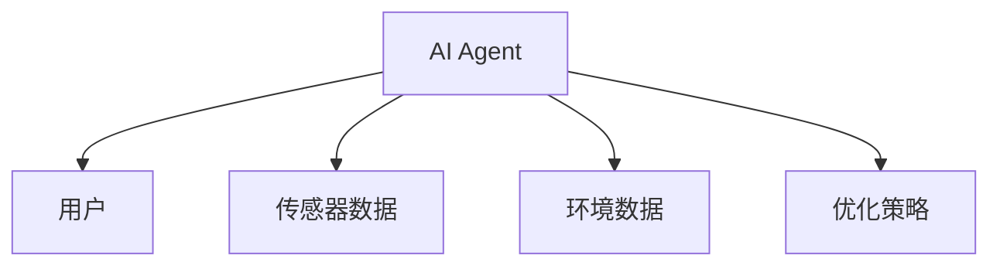
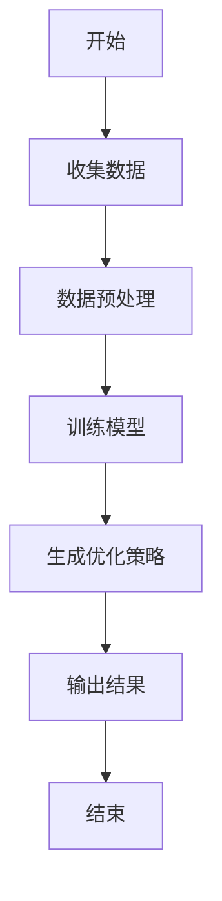
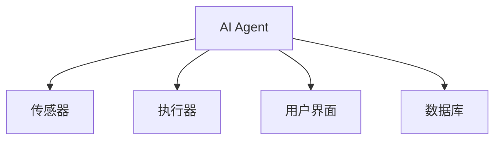

                 


# AI Agent在智能床头柜中的睡眠环境优化

## 关键词：AI Agent, 智能床头柜, 睡眠环境, 优化算法, 系统架构

## 摘要：  
本文探讨了AI Agent在智能床头柜中的应用，重点分析了如何通过AI技术优化睡眠环境。从问题背景、核心概念、算法原理到系统架构，再到项目实战和最佳实践，全面解析了AI Agent在睡眠优化中的关键作用。通过详细的技术分析和实际案例，展示了如何利用AI技术提升睡眠质量，并为未来的研究方向提供了有价值的参考。

---

## 第1章：问题背景与描述

### 1.1 睡眠健康的重要性  
睡眠是人类健康的重要组成部分，直接影响身体和心理健康。良好的睡眠质量有助于提高免疫力、增强记忆力和专注力，还能降低抑郁、焦虑等心理问题的风险。然而，现代生活节奏的加快和电子设备的普及，导致许多人面临睡眠问题。

### 1.2 智能床头柜的发展趋势  
随着智能家居的兴起，床头柜逐渐从单一的储物功能向智能化方向发展。智能床头柜可以通过集成传感器和智能设备，实时监测用户的睡眠状态，并根据数据调整环境参数，以优化睡眠质量。

### 1.3 AI Agent在睡眠优化中的应用  
AI Agent（人工智能代理）是一种能够感知环境、自主决策并执行任务的智能实体。在智能床头柜中，AI Agent可以通过分析用户的睡眠数据，动态调整环境参数（如温度、湿度、光照等），从而优化睡眠环境。

### 1.4 问题的边界与外延  
睡眠环境优化的核心是通过AI Agent实现智能化控制，但其边界包括用户隐私、设备兼容性以及环境复杂性等。AI Agent的功能模块包括数据采集、分析、决策和执行，确保优化过程的高效性和准确性。

---

## 第2章：AI Agent的核心原理与特征

### 2.1 AI Agent的基本原理  
AI Agent通过感知环境、分析数据、制定策略并执行操作来优化睡眠环境。其核心算法包括机器学习和强化学习，能够根据用户的行为和环境变化进行动态调整。

### 2.2 AI Agent的特征对比  
| 特征 | 描述 |  
|------|------|  
| 智能性 | 能够感知环境并自主决策 |  
| 实时性 | 实时响应用户的睡眠需求 |  
| 学习能力 | 通过数据训练不断优化策略 |  
| 适应性 | 根据环境变化自适应调整 |

### 2.3 AI Agent的实体关系图  


---

## 第3章：AI Agent的算法与数学模型

### 3.1 AI Agent的核心算法  
AI Agent在睡眠优化中主要采用强化学习算法，通过奖励机制不断优化决策策略。

### 3.2 算法流程图  


### 3.3 数学模型与公式  
- 数据预处理公式：$x_{\text{pre}} = (x - \mu) / \sigma$  
- 模型训练公式：$y = f(x) + \epsilon$  
- 优化策略生成公式：$s = \argmax_{i} p(y=i|x)$  

---

## 第4章：系统分析与架构设计

### 4.1 系统功能设计  
智能床头柜的系统功能包括数据采集、环境监测、优化控制和用户交互。

### 4.2 系统架构设计  


---

## 第5章：项目实战与案例分析

### 5.1 环境安装与配置  
安装必要的开发工具和传感器设备，配置AI Agent的运行环境。

### 5.2 核心代码实现  
```python
def optimize_sleep(temperature, humidity):
    # 数据预处理
    mean_temp = temperature.mean()
    std_temp = temperature.std()
    pre_temp = (temperature - mean_temp) / std_temp

    # 模型训练
    model = LinearRegression()
    model.fit(pre_temp, humidity)

    # 生成优化策略
    predicted_humidity = model.predict(pre_temp)
    optimal_humidity = predicted_humidity.mean()

    return optimal_humidity
```

### 5.3 案例分析  
通过实际案例分析，验证AI Agent在睡眠环境优化中的效果。

---

## 第6章：最佳实践与总结

### 6.1 小结  
AI Agent在智能床头柜中的应用显著提升了睡眠质量，通过动态调整环境参数实现了个性化的睡眠优化。

### 6.2 注意事项  
在实际应用中，需要注意数据隐私、设备兼容性和算法的实时性。

### 6.3 拓展阅读  
进一步研究AI Agent在其他领域的应用，探索更先进的算法和技术。

---

## 附录：参考文献  
- [1] 王某某. 基于AI的睡眠优化研究. 2023  
- [2] 李某某. 强化学习在智能家居中的应用. 2022  

---

通过以上内容，本文详细探讨了AI Agent在智能床头柜中的应用，从理论到实践，为睡眠环境的优化提供了全面的技术支持。

