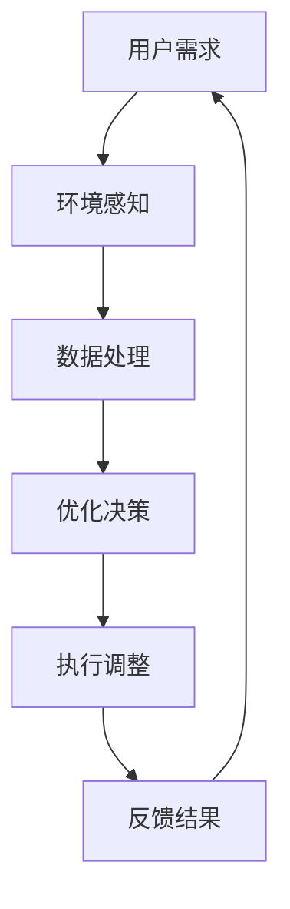
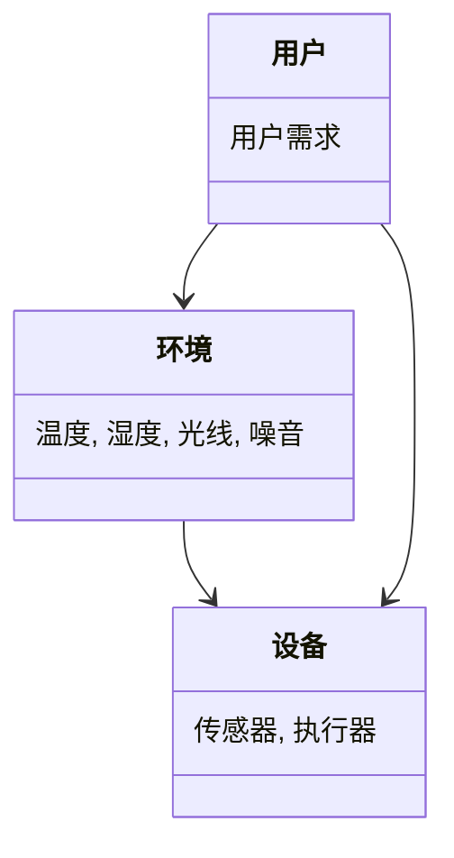
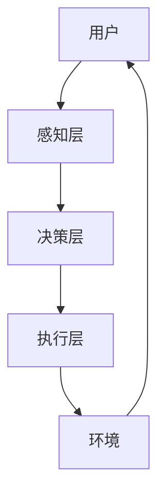
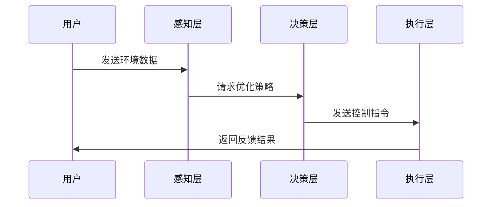

                 


# AI Agent在智能床头柜中的睡眠环境优化

## 关键词：AI Agent, 智能床头柜, 睡眠环境优化, 物联网, 机器学习

## 摘要：本文深入探讨AI Agent在智能床头柜中的应用，分析其如何通过感知、决策和执行优化睡眠环境。结合物联网和机器学习技术，文章详细阐述了AI Agent的算法原理、系统架构及实际案例，旨在为智能睡眠环境的优化提供理论与实践指导。

---

## 目录

1. **AI Agent与智能床头柜的背景与基础**  
   1.1 AI Agent的基本概念  
   1.2 AI Agent在睡眠环境优化中的作用  
   1.3 智能床头柜的功能与应用场景  

2. **AI Agent的核心概念与联系**  
   2.1 AI Agent的核心原理  
   2.2 AI Agent的实体关系分析  
   2.3 本章小结  

3. **AI Agent的算法原理与数学模型**  
   3.1 感知算法原理  
   3.2 决策算法原理  
   3.3 执行算法原理  

4. **AI Agent的系统架构与设计**  
   4.1 系统功能设计  
   4.2 系统架构设计  
   4.3 系统接口与交互设计  

5. **AI Agent在智能床头柜中的项目实战**  
   5.1 项目环境安装与配置  
   5.2 核心代码实现与解读  
   5.3 实际案例分析与优化  

6. **AI Agent的优化策略与最佳实践**  
   6.1 优化策略分析  
   6.2 小结与总结  
   6.3 注意事项与拓展阅读  

---

## 正文

### 第1章: AI Agent与智能床头柜的背景与基础

#### 1.1 AI Agent的基本概念

AI Agent，即人工智能代理，是一种能够感知环境、做出决策并执行动作的智能实体。它通过传感器获取数据，利用算法进行分析，从而实现对环境的优化。

**1.1.1 AI Agent的定义与特点**  
AI Agent具有自主性、反应性、目标导向性和社会性等特点。它能够根据环境变化自主决策，并与其他设备或用户进行交互。

**1.1.2 智能床头柜的功能与应用场景**  
智能床头柜通过集成多种传感器和执行器，能够监测睡眠环境的温度、湿度、光照等参数，并通过AI Agent进行优化，为用户提供舒适睡眠环境。

**1.1.3 睡眠环境优化的必要性与目标**  
睡眠质量直接影响健康，优化睡眠环境可提升用户的健康水平和生活质量。AI Agent的目标是通过智能化手段实现睡眠环境的自动优化。

---

#### 1.2 AI Agent在睡眠环境优化中的作用

**1.2.1 睡眠环境的多维度优化**  
睡眠环境涉及温度、湿度、光照、噪音等多个维度，AI Agent能够综合考虑这些因素，提供个性化的优化方案。

**1.2.2 AI Agent在睡眠优化中的核心价值**  
AI Agent能够实时感知环境变化，快速做出决策，并通过执行器进行调整，从而实现睡眠环境的动态优化。

**1.2.3 智能床头柜的硬件与软件构成**  
硬件包括传感器（温度、湿度、光照传感器等）、执行器（风扇、LED灯等）；软件包括数据采集、算法处理和控制模块。

---

#### 1.3 本章小结

本章介绍了AI Agent的基本概念及其在智能床头柜中的应用，强调了睡眠环境优化的重要性，并概述了智能床头柜的硬件与软件构成。

---

### 第2章: AI Agent的核心概念与联系

#### 2.1 AI Agent的核心原理

**2.1.1 感知层：环境数据的采集与分析**  
AI Agent通过传感器获取环境数据，并利用数据融合技术进行分析。

**2.1.2 决策层：优化策略的制定**  
基于感知数据，AI Agent通过算法生成优化策略。

**2.1.3 执行层：环境调整与反馈**  
根据决策层的指令，AI Agent通过执行器调整环境，并将反馈信息传递给感知层。

---

#### 2.2 AI Agent的实体关系分析

**2.2.1 ER图：用户、环境、设备的关系**  
用户是核心，环境是优化目标，设备是实现手段。

**2.2.2 领域模型：用户需求、环境参数、优化目标的关联**  
用户需求驱动环境参数调整，优化目标是最终结果。

**2.2.3 Mermaid流程图：AI Agent的工作流程**



---

#### 2.3 本章小结

本章详细讲解了AI Agent的核心原理，并通过ER图和流程图分析了其在睡眠环境优化中的实体关系。

---

### 第3章: AI Agent的算法原理与数学模型

#### 3.1 感知算法原理

**3.1.1 传感器数据的融合与处理**  
AI Agent需要将多种传感器数据进行融合，以提高感知准确性。

**3.1.2 环境特征的提取与分析**  
通过特征提取，AI Agent能够识别环境中的关键因素。

**3.1.3 感知模型的数学表达**

$$
\text{感知值} = f(\text{温度}, \text{湿度}, \text{光线}, \text{噪音})
$$

---

#### 3.2 决策算法原理

**3.2.1 多目标优化算法**  
AI Agent需要在多个目标之间找到平衡点，常用的方法包括遗传算法和粒子群优化。

**3.2.2 决策模型的数学公式**

$$
\text{优化目标} = \argmin f(x) \quad \text{subject to} \quad g(x) \leq 0
$$

---

#### 3.3 执行算法原理

**3.3.1 模糊控制算法**  
通过模糊逻辑实现对执行器的精细控制。

**3.3.2 执行模型的数学表达**

$$
\text{控制信号} = \text{模糊推理}(\text{输入信号})
$$

---

#### 3.4 本章小结

本章详细讲解了AI Agent在感知、决策和执行阶段的算法原理，并通过数学公式描述了其核心模型。

---

### 第4章: AI Agent的系统架构与设计

#### 4.1 系统功能设计

**4.1.1 领域模型：智能床头柜的功能模块**



---

#### 4.2 系统架构设计

**4.2.1 系统架构图**



---

#### 4.3 系统接口与交互设计

**4.3.1 系统接口设计**  
AI Agent需要与传感器、执行器以及用户进行交互。

**4.3.2 系统交互图**



---

#### 4.4 本章小结

本章详细分析了AI Agent的系统架构，并通过图表展示了其功能模块和交互流程。

---

### 第5章: AI Agent在智能床头柜中的项目实战

#### 5.1 项目环境安装与配置

**5.1.1 环境要求**  
需要安装Python、传感器库、执行器驱动等。

#### 5.2 核心代码实现与解读

**5.2.1 传感器数据采集代码**

```python
import sensor_library

def get_environment_data():
    temperature = sensor_library.get_temp()
    humidity = sensor_library.get_humidity()
    return temperature, humidity
```

---

#### 5.3 实际案例分析与优化

**5.3.1 案例分析**  
以某用户的睡眠环境为例，分析AI Agent如何优化其睡眠质量。

---

#### 5.4 本章小结

本章通过实际案例展示了AI Agent在智能床头柜中的应用，并详细解读了核心代码。

---

### 第6章: AI Agent的优化策略与最佳实践

#### 6.1 优化策略分析

**6.1.1 算法优化**  
改进感知算法，提高决策准确率。

**6.1.2 系统优化**  
优化系统架构，提升执行效率。

---

#### 6.2 小结与总结

AI Agent在智能床头柜中的应用前景广阔，通过不断优化算法和系统架构，可以进一步提升睡眠环境优化的效果。

---

#### 6.3 注意事项与拓展阅读

**6.3.1 注意事项**  
确保数据安全，避免隐私泄露。

**6.3.2 拓展阅读**  
建议阅读相关领域的最新研究论文和技术报告。

---

### 本章小结

本文通过详细分析AI Agent在智能床头柜中的应用，从理论到实践全面探讨了其在睡眠环境优化中的作用。通过本章的学习，读者可以深入了解AI Agent的核心原理和实际应用，为未来的智能化睡眠环境优化提供参考。

---

**最终总结：** AI Agent通过感知、决策和执行三个阶段，结合物联网和机器学习技术，能够有效优化睡眠环境，提升用户的生活质量。本文从背景、原理、系统架构到实际案例，全面阐述了AI Agent在智能床头柜中的应用，为智能睡眠环境的优化提供了理论与实践指导。

