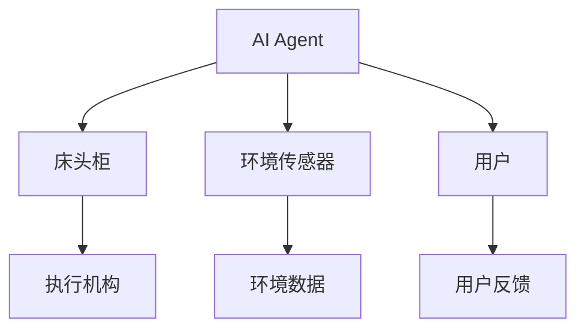
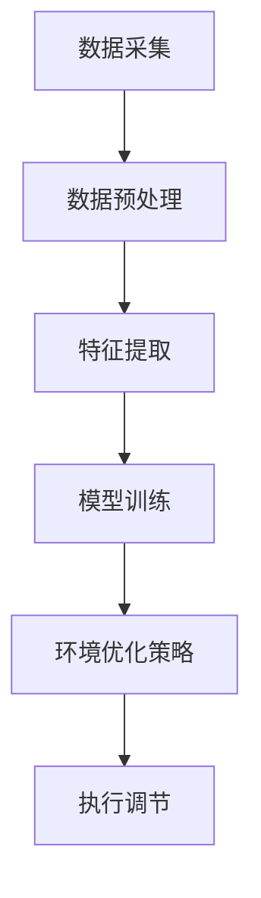
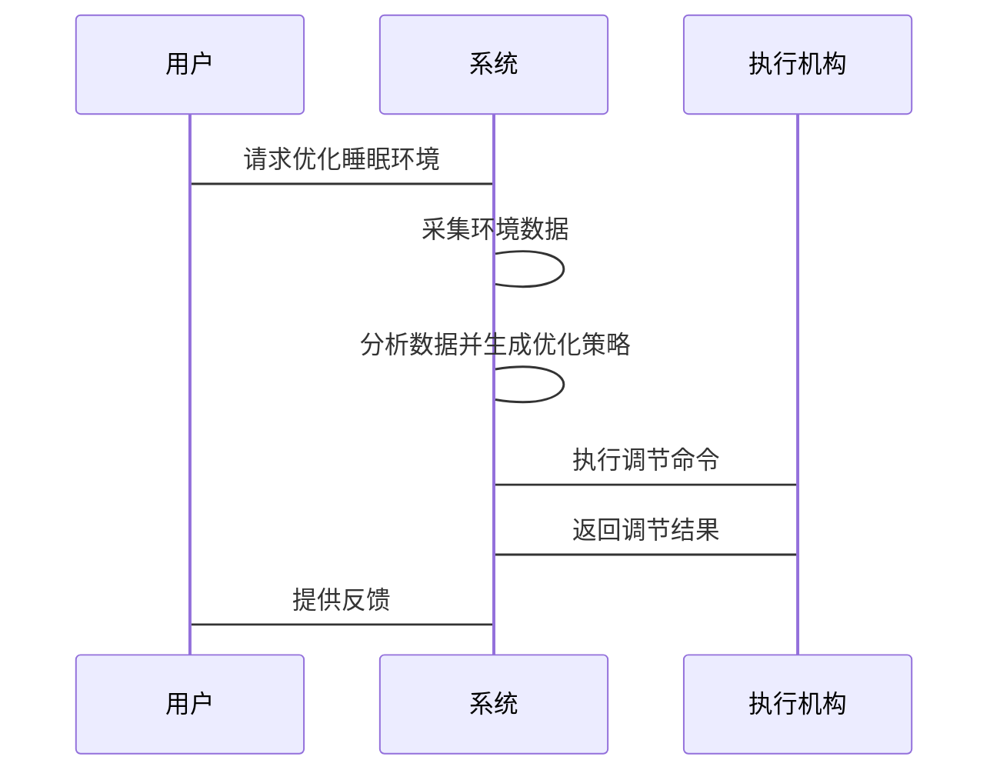

                 


# AI Agent在智能床头柜中的睡眠环境调节

> 关键词：AI Agent，智能床头柜，睡眠环境调节，算法原理，系统设计

> 摘要：本文详细探讨了AI Agent在智能床头柜中的应用，特别是如何通过AI技术优化睡眠环境。文章从AI Agent的基本概念出发，分析了其在睡眠环境调节中的核心作用，并详细介绍了算法原理、系统设计和实际应用。通过案例分析和代码实现，展示了AI Agent在智能床头柜中的实际价值。

---

## 第1章: AI Agent与智能床头柜的背景介绍

### 1.1 AI Agent的基本概念

#### 1.1.1 AI Agent的定义
AI Agent（人工智能代理）是指能够感知环境、自主决策并执行任务的智能实体。它通过传感器获取信息，利用算法进行分析，并通过执行器与环境交互。AI Agent的核心目标是通过智能化手段优化用户的生活体验。

#### 1.1.2 AI Agent的核心特征
- **自主性**：能够自主决策和行动。
- **反应性**：能够实时感知环境变化并做出反应。
- **学习能力**：通过数据和反馈不断优化自身的算法。
- **交互性**：能够与用户和其他系统进行高效交互。

#### 1.1.3 AI Agent与传统自动化的区别

| 特性            | AI Agent                     | 传统自动化                 |
|-----------------|------------------------------|---------------------------|
| 决策能力        | 基于机器学习和大数据          | 预设规则和程序             |
| 环境适应性       | 能够动态调整策略              | 固定模式，适应性有限        |
| 学习能力        | 具备自适应学习能力            | 无法自主学习               |
| 交互方式        | 支持自然语言交互              | 仅限于固定输入输出方式       |

### 1.2 智能床头柜的发展现状

#### 1.2.1 智能床头柜的功能特点
智能床头柜通常集成了多种智能设备，包括温度调节、湿度控制、光照调节和噪音控制等功能。它能够通过传感器实时监测环境数据，并通过AI Agent进行优化。

#### 1.2.2 当前市场上的主流产品
目前市场上的智能床头柜主要分为两类：一类是传统床头柜的智能化改造，另一类是全新的智能设计。主流产品包括：
1. 带有智能温控系统的床头柜。
2. 带有环境监测传感器的床头柜。
3. 集成AI语音助手的床头柜。

#### 1.2.3 智能床头柜的未来趋势
未来的智能床头柜将更加注重用户体验，功能更加智能化和个性化。例如，通过AI Agent实现睡眠质量监测、健康数据采集等功能。

### 1.3 睡眠环境调节的重要性

#### 1.3.1 睡眠对健康的影响
良好的睡眠对身体健康至关重要。睡眠不足会导致免疫力下降、注意力不集中等问题。

#### 1.3.2 睡眠环境调节的必要性
睡眠环境的调节能够显著提高睡眠质量，尤其是在温度、湿度、光照和噪音等方面进行优化。

#### 1.3.3 AI技术在睡眠调节中的优势
AI Agent能够通过学习用户的睡眠习惯和环境数据，提供个性化的睡眠环境调节方案。

---

## 第2章: AI Agent在睡眠环境调节中的核心概念

### 2.1 AI Agent的基本原理

#### 2.1.1 感知层：环境数据的采集
AI Agent通过传感器获取环境数据，包括温度、湿度、光照和噪音等。

#### 2.1.2 决策层：环境优化策略
AI Agent利用机器学习算法分析环境数据，并生成优化策略。

#### 2.1.3 执行层：调节床头柜功能
AI Agent通过床头柜的执行机构（如风扇、加湿器等）实现环境调节。

### 2.2 智能床头柜的环境调节机制

#### 2.2.1 温度调节
AI Agent通过实时监测室内温度，动态调整床头柜的风扇或加热设备。

#### 2.2.2 湿度调节
通过湿度传感器监测空气湿度，并通过加湿器或除湿器进行调节。

#### 2.2.3 光照调节
AI Agent可以根据用户的睡眠周期调节床头柜的LED灯光。

#### 2.2.4 噪音控制
通过噪音传感器监测环境噪音，并通过床头柜的白噪音机进行干扰。

### 2.3 AI Agent与床头柜交互的实体关系图



---

## 第3章: AI Agent的算法原理与实现

### 3.1 睡眠环境数据的采集与处理

#### 3.1.1 数据采集模块的功能
- **传感器数据采集**：通过温度、湿度、光照和噪音传感器获取环境数据。
- **数据预处理**：对采集的数据进行去噪和标准化处理。

#### 3.1.2 数据特征提取
- **特征选择**：提取对睡眠影响最大的环境特征，如温度、湿度和噪音。
- **数据变换**：对数据进行归一化处理，以便后续分析。

### 3.2 睡眠环境优化算法

#### 3.2.1 基于机器学习的环境优化模型
- **模型选择**：使用回归算法（如线性回归）或分类算法（如随机森林）进行预测。
- **训练数据**：通过历史数据训练模型，优化睡眠环境参数。

#### 3.2.2 算法实现流程



#### 3.2.3 算法优化策略
- **动态调整**：根据用户的实时反馈动态优化模型参数。
- **在线学习**：通过在线学习不断更新模型。

### 3.3 算法实现的Python代码示例

#### 3.3.1 数据采集与处理代码

```python
import numpy as np
import pandas as pd

# 读取环境数据
data = pd.read_csv('sleep_environment.csv')

# 数据预处理
data_processed = data.dropna()
data_processed = (data_processed - data_processed.mean()) / data_processed.std()
```

#### 3.3.2 环境优化算法代码

```python
from sklearn.linear_model import LinearRegression

# 训练模型
model = LinearRegression()
model.fit(X_train, y_train)

# 预测环境参数
y_pred = model.predict(X_test)
```

#### 3.3.3 算法测试与结果分析
通过测试数据验证模型的预测精度，并根据实际反馈不断优化模型参数。

---

## 第4章: 系统分析与架构设计

### 4.1 系统功能分析

#### 4.1.1 系统目标
通过AI Agent优化睡眠环境，提高用户的睡眠质量。

#### 4.1.2 系统功能模块划分
- **环境监测模块**：负责采集和处理环境数据。
- **AI决策模块**：负责生成环境优化策略。
- **执行控制模块**：负责调节床头柜的功能。

#### 4.1.3 功能模块之间的关系
环境监测模块提供数据，AI决策模块生成优化策略，执行控制模块根据策略调节床头柜功能。

### 4.2 系统架构设计

#### 4.2.1 模块化设计原则
采用模块化设计，确保系统的可扩展性和可维护性。

#### 4.2.2 系统架构的层次划分
- **数据层**：负责数据的采集和存储。
- **算法层**：负责环境数据的分析和优化。
- **控制层**：负责床头柜功能的执行。

#### 4.2.3 每个层次的功能实现
- 数据层：通过传感器采集环境数据。
- 算法层：通过机器学习算法优化睡眠环境。
- 控制层：通过床头柜的执行机构实现环境调节。

### 4.3 系统接口设计

#### 4.3.1 系统接口设计
- **数据接口**：传感器数据的输入接口。
- **控制接口**：床头柜执行机构的控制接口。

#### 4.3.2 系统交互流程
- 用户触发床头柜功能。
- 系统采集环境数据。
- AI Agent生成优化策略。
- 执行机构调节床头柜功能。

### 4.4 系统交互mermaid序列图



---

## 第5章: 项目实战

### 5.1 环境安装

#### 5.1.1 系统要求
- Python 3.8+
- 环境监测传感器（如DHT11）
- 床头柜执行机构（如风扇、加湿器）

#### 5.1.2 安装依赖
```bash
pip install numpy pandas scikit-learn
```

### 5.2 系统核心实现源代码

#### 5.2.1 数据采集代码

```python
import time
import serial

# 连接传感器
ser = serial.Serial('COM3', 9600)

while True:
    data = ser.readline().decode()
    print(data)
    time.sleep(1)
```

#### 5.2.2 环境优化算法代码

```python
from sklearn import linear_model

# 训练模型
model = linear_model.LinearRegression()
model.fit(X_train, y_train)

# 预测环境参数
y_pred = model.predict(X_test)
```

### 5.3 代码应用解读与分析

#### 5.3.1 数据采集模块
通过传感器采集环境数据，并通过Python脚本进行处理。

#### 5.3.2 环境优化算法模块
通过机器学习算法优化睡眠环境参数，确保用户的舒适度。

### 5.4 实际案例分析

#### 5.4.1 案例背景
某用户反映睡眠质量较差，主要原因是室温过高和噪音较大。

#### 5.4.2 数据采集与分析
通过传感器采集用户的睡眠环境数据，分析发现温度和噪音是主要影响因素。

#### 5.4.3 算法优化与执行
AI Agent通过算法优化，建议降低室内温度并启动白噪音机，最终改善了用户的睡眠质量。

### 5.5 项目小结
通过实际案例分析，展示了AI Agent在智能床头柜中的实际应用价值。

---

## 第6章: 最佳实践

### 6.1 小结
AI Agent在智能床头柜中的应用显著提升了睡眠质量，为用户带来了更好的生活体验。

### 6.2 注意事项
- 数据采集的准确性对算法优化至关重要。
- 系统的安全性和稳定性需要重点关注。

### 6.3 拓展阅读
- 《机器学习实战》
- 《人工智能：一种现代方法》

---

# 附录: AI Agent在智能床头柜中的睡眠环境调节相关代码

## 附录1: 数据采集代码

```python
import serial
import time

ser = serial.Serial('COM3', 9600)

while True:
    data = ser.readline().decode()
    print(data)
    time.sleep(1)
```

## 附录2: 环境优化算法代码

```python
from sklearn import linear_model

model = linear_model.LinearRegression()
model.fit(X_train, y_train)
y_pred = model.predict(X_test)
```

## 附录3: 系统交互序列图


---

# 结语

AI Agent在智能床头柜中的睡眠环境调节展现了人工智能技术在智能家居领域的巨大潜力。通过本文的详细分析，读者可以全面了解AI Agent的核心原理、算法实现和系统设计。未来，随着技术的不断进步，AI Agent将在更多领域发挥重要作用。

