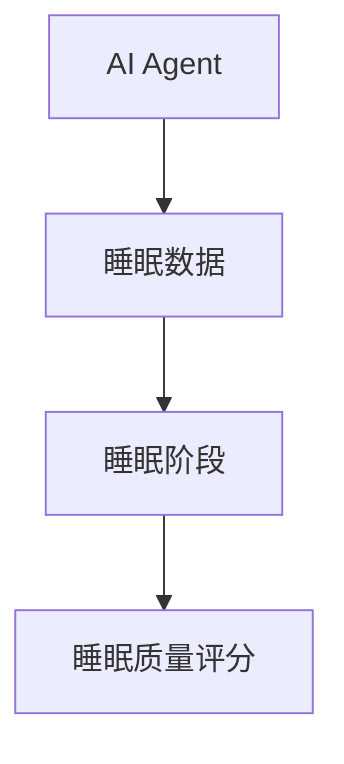
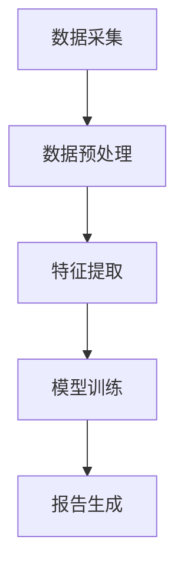
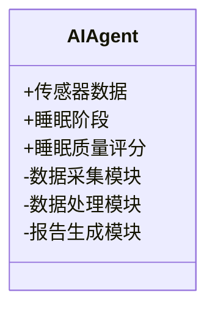
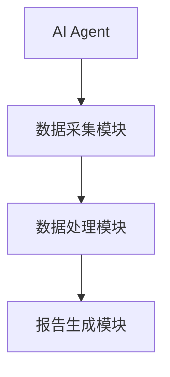
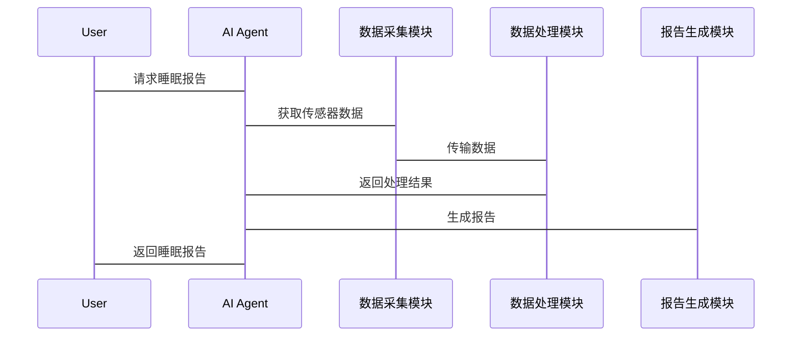

                 


# AI Agent在智能床头柜中的睡眠质量报告

## 关键词：AI Agent、智能床头柜、睡眠质量报告、数据采集、数据分析、算法实现、系统设计

## 摘要：本文探讨了AI Agent在智能床头柜中的应用，重点分析了如何通过数据采集、算法实现和系统设计来生成睡眠质量报告。文章详细介绍了AI Agent的基本概念、睡眠监测技术、算法原理、系统架构以及项目实战，旨在为读者提供一个全面的技术视角。

---

# 第1章: AI Agent与睡眠质量报告的概述

## 1.1 AI Agent的基本概念

### 1.1.1 AI Agent的定义
AI Agent（人工智能代理）是一种能够感知环境、做出决策并采取行动的智能实体。它能够通过传感器或其他输入源获取信息，并根据预设的目标和规则执行任务。

### 1.1.2 AI Agent的核心特征
- **自主性**：能够在没有外部干预的情况下独立运行。
- **反应性**：能够根据环境变化实时调整行为。
- **目标导向性**：所有行为都围绕特定目标展开。
- **学习能力**：能够通过数据和经验不断优化性能。

### 1.1.3 AI Agent与传统软件的区别
| 特性        | AI Agent                     | 传统软件                   |
|-------------|------------------------------|-----------------------------|
| 智能性      | 高                           | 低                         |
| 自主性      | 高                           | 低                         |
| 学习能力    | 高                           | 无                         |
| 适应性      | 高                           | 低                         |

## 1.2 睡眠质量报告的定义与意义

### 1.2.1 睡眠质量的定义
睡眠质量是指睡眠的深度、持续时间以及是否中断等因素的综合评估。良好的睡眠质量对身体健康至关重要。

### 1.2.2 睡眠质量报告的目的
睡眠质量报告通过分析用户的睡眠数据，提供个性化的建议，帮助用户改善睡眠质量。

### 1.2.3 睡眠质量报告的应用场景
- **家庭健康监测**：用户可以在家中通过智能床头柜了解自己的睡眠状况。
- **医疗辅助**：医生可以通过报告为患者提供专业建议。
- **睡眠改善产品**：企业可以根据报告优化睡眠辅助设备。

## 1.3 AI Agent在智能床头柜中的应用

### 1.3.1 智能床头柜的功能概述
智能床头柜通过集成多种传感器和AI技术，能够监测用户的睡眠状态，并生成相应的报告。

### 1.3.2 AI Agent在智能床头柜中的角色
- **数据采集**：AI Agent通过传感器收集用户的睡眠数据。
- **数据处理**：AI Agent对数据进行分析，生成睡眠质量报告。
- **反馈优化**：AI Agent根据报告结果提出改善建议。

### 1.3.3 睡眠质量报告的实现方式
1. 数据采集：通过传感器获取心率、呼吸频率等数据。
2. 数据分析：利用AI算法对数据进行处理和评估。
3. 报告生成：将分析结果以可视化形式呈现给用户。

## 1.4 本章小结
本章介绍了AI Agent的基本概念、睡眠质量报告的定义与意义，以及AI Agent在智能床头柜中的具体应用。通过这些内容，读者可以理解AI Agent在睡眠质量监测中的重要性。

---

# 第2章: AI Agent与睡眠监测技术

## 2.1 睡眠监测的主要技术

### 2.1.1 基于传感器的睡眠监测
- **心率监测**：通过心率变化判断睡眠状态。
- **呼吸频率监测**：通过呼吸频率判断睡眠深度。
- **体动监测**：通过体动次数评估睡眠质量。

### 2.1.2 基于AI的睡眠分析
- **机器学习算法**：用于睡眠阶段的分类和质量评估。
- **深度学习模型**：用于更复杂的睡眠数据分析。

### 2.1.3 其他辅助技术
- **环境监测**：监测睡眠环境的光线、温度等参数。
- **用户反馈**：结合用户的主观感受进行调整。

## 2.2 AI Agent在睡眠监测中的作用

### 2.2.1 数据采集与处理
AI Agent通过传感器获取数据，并进行预处理，确保数据的准确性和完整性。

### 2.2.2 数据分析与报告生成
AI Agent利用机器学习算法对数据进行分析，并生成睡眠质量报告。

### 2.2.3 个性化睡眠建议
AI Agent根据分析结果，为用户提供个性化的睡眠改善建议。

## 2.3 睡眠质量报告的生成流程

### 2.3.1 数据采集阶段
1. 传感器采集用户的睡眠数据。
2. 数据传输到AI Agent进行处理。

### 2.3.2 数据分析阶段
1. 数据预处理：去除噪声，提取特征。
2. 数据分析：利用算法进行睡眠阶段分类和质量评估。

### 2.3.3 报告生成阶段
1. 生成报告：包括睡眠质量评分、睡眠阶段分析等。
2. 提供建议：根据报告结果提出改善建议。

## 2.4 本章小结
本章详细介绍了睡眠监测的主要技术以及AI Agent在其中的作用，重点分析了数据采集、处理和报告生成的流程。

---

# 第3章: AI Agent与睡眠质量报告的核心概念

## 3.1 AI Agent的感知与推理机制

### 3.1.1 数据感知模块
AI Agent通过传感器获取睡眠数据，包括心率、呼吸频率等。

### 3.1.2 数据推理模块
AI Agent利用算法对数据进行分析和推理，判断睡眠状态。

### 3.1.3 决策与反馈机制
AI Agent根据分析结果做出决策，并通过反馈机制优化后续行为。

## 3.2 睡眠质量评估的数学模型

### 3.2.1 数据特征提取
提取心率变异性（HRV）、呼吸频率等特征。

### 3.2.2 睡眠阶段划分
使用K-means算法对睡眠数据进行聚类分析，划分睡眠阶段。

### 3.2.3 睡眠质量评分公式
$$ \text{睡眠质量评分} = \alpha \times \text{深度睡眠时间} + \beta \times \text{睡眠连续性} $$

其中，$\alpha$ 和 $\beta$ 是权重系数，取值范围为$0 \leq \alpha, \beta \leq 1$。

## 3.3 AI Agent与睡眠质量报告的实体关系



## 3.4 本章小结
本章详细介绍了AI Agent的感知与推理机制，以及睡眠质量评估的数学模型和实体关系。

---

# 第4章: AI Agent的算法原理与实现

## 4.1 睡眠质量评估的算法流程



## 4.2 睡眠质量评估的数学模型

### 4.2.1 时间序列分析模型
使用ARIMA模型对睡眠数据进行预测和分析。

### 4.2.2 机器学习分类模型
使用随机森林算法对睡眠阶段进行分类。

### 4.2.3 睡眠质量评分公式
$$ \text{评分} = \sum_{i=1}^{n} w_i \times x_i $$

其中，$w_i$ 是第$i$个特征的权重，$x_i$ 是第$i$个特征的值。

---

# 第5章: 系统分析与架构设计方案

## 5.1 问题场景介绍
智能床头柜需要实时监测用户的睡眠状态，并生成睡眠质量报告。

## 5.2 项目介绍
本项目旨在通过AI Agent实现智能床头柜的睡眠质量监测功能。

## 5.3 系统功能设计

### 5.3.1 领域模型


### 5.3.2 系统架构设计


### 5.3.3 系统接口设计
- 数据采集模块：提供API接口，接收传感器数据。
- 数据处理模块：提供API接口，接收数据并进行处理。
- 报告生成模块：提供API接口，输出睡眠质量报告。

## 5.4 系统交互设计


---

# 第6章: 项目实战

## 6.1 环境配置
- 操作系统：Linux
- 开发工具：Python、TensorFlow、Matplotlib
- 传感器：心率传感器、呼吸传感器

## 6.2 核心代码实现

### 6.2.1 数据采集模块
```python
import numpy as np

def collect_data():
    # 模拟传感器数据采集
    heart_rate = np.random.normal(70, 5, 100)
    return heart_rate
```

### 6.2.2 数据处理模块
```python
from sklearn.cluster import KMeans

def process_data(data):
    # 数据预处理
    features = data.reshape(-1, 1)
    model = KMeans(n_clusters=3, random_state=0)
    model.fit(features)
    return model.labels_
```

### 6.2.3 报告生成模块
```python
def generate_report(labels):
    # 生成睡眠质量评分
    deep_sleep = sum(labels == 2)
    sleep_quality = (deep_sleep / len(labels)) * 100
    return f"睡眠质量评分：{sleep_quality}%"
```

## 6.3 案例分析
假设传感器采集了100个心率数据点，经过数据处理模块处理后，生成了睡眠阶段标签。报告生成模块根据这些标签生成了睡眠质量报告。

## 6.4 本章小结
本章通过实际案例展示了AI Agent在智能床头柜中的实现过程，包括环境配置、核心代码实现和案例分析。

---

# 第7章: 最佳实践与总结

## 7.1 最佳实践 tips
- 数据采集模块应确保数据的准确性和实时性。
- 数据处理模块应优化算法，提高处理效率。
- 报告生成模块应提供清晰易懂的报告，方便用户理解。

## 7.2 本章小结
通过本文的介绍，读者可以全面了解AI Agent在智能床头柜中的应用，包括算法原理、系统设计和项目实现等内容。

---

# 结语

AI Agent在智能床头柜中的应用为睡眠质量监测提供了新的思路。通过本文的介绍，读者可以深入了解AI Agent的基本概念、算法原理和系统设计，为未来的相关研究和实践提供参考。

