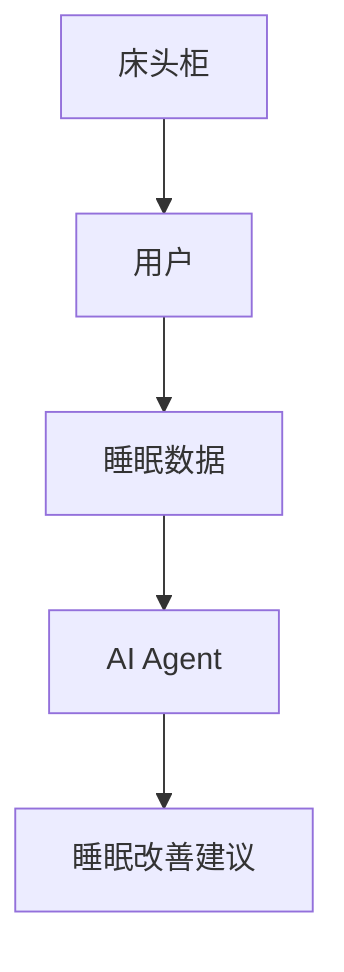
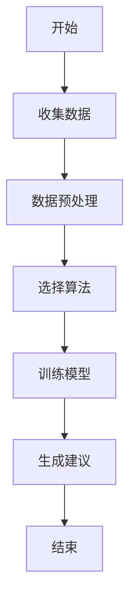
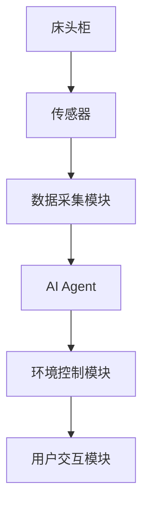
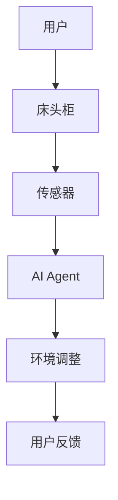

                 


# AI Agent在智能床头柜中的睡眠辅助功能

> 关键词：AI Agent，智能床头柜，睡眠辅助，算法原理，系统架构

> 摘要：本文探讨了AI Agent在智能床头柜中的睡眠辅助功能，详细分析了睡眠问题的现状、AI Agent的基本概念、算法原理、系统架构设计、项目实战以及最佳实践。通过理论与实践结合的方式，为读者提供全面的技术解读。

---

# 第一部分: AI Agent在智能床头柜中的睡眠辅助功能概述

## 第1章: 背景介绍

### 1.1 睡眠问题的现状与挑战

现代人面临严重的睡眠问题，如失眠、睡眠呼吸暂停综合征等。这些问题不仅影响健康，还可能导致工作效率下降。智能床头柜通过集成AI Agent，能够实时监测睡眠数据并提供改善建议，成为解决睡眠问题的重要工具。

### 1.2 智能床头柜的发展趋势

智能家居的普及推动了床头柜的智能化。AI Agent的引入使得床头柜能够与用户交互，提供个性化的睡眠解决方案。未来，床头柜将不仅是家具，更是智能化的健康助手。

### 1.3 AI Agent的基本概念与功能

AI Agent是一种智能代理，能够通过传感器和数据分析优化睡眠环境。它能够监测心率、呼吸频率等数据，实时调整床头柜的环境设置，如亮度、温度和湿度，以改善睡眠质量。

## 1.4 本章小结

本章介绍了睡眠问题的现状，智能床头柜的发展趋势，以及AI Agent的基本概念和功能，为后续章节奠定了基础。

---

## 第2章: AI Agent的核心概念与联系

### 2.1 AI Agent的原理与工作机制

AI Agent通过传感器收集数据，利用算法分析数据并生成决策，调整床头柜的环境设置。例如，当检测到用户的呼吸频率异常时，AI Agent会启动轻柔的音乐或调整亮度以帮助用户放松。

### 2.2 实体关系图（ER图）分析



图1展示了床头柜、用户、睡眠数据、AI Agent和睡眠改善建议之间的关系。床头柜收集用户的睡眠数据，通过AI Agent分析后生成改善建议。

### 2.3 核心概念对比表

| 概念       | 特性                         |
|------------|------------------------------|
| AI Agent    | 数据驱动、自适应、实时响应   |
| 传统床头柜 | 非智能、被动响应、无数据处理 |

通过对比表可以看出，AI Agent在智能床头柜中的应用显著提升了睡眠辅助功能的智能化水平。

## 2.4 本章小结

本章详细解释了AI Agent的原理，并通过ER图和对比表展示了其在智能床头柜中的核心作用。

---

## 第3章: AI Agent的算法原理

### 3.1 算法概述

AI Agent主要采用基于规则的系统和机器学习模型。基于规则的系统适用于简单的决策，而机器学习模型能够处理复杂的数据模式。

### 3.2 基于规则的AI Agent

基于规则的系统通过预定义的规则进行决策。例如，当检测到用户的睡眠阶段变化时，AI Agent会启动相应的改善措施。

### 3.3 基于机器学习的AI Agent

机器学习模型能够从数据中学习，优化睡眠改善建议。常用的算法包括决策树和分类算法。

### 3.4 算法流程图



图2展示了基于机器学习的AI Agent的算法流程。

### 3.5 数学公式

分类算法的数学模型：

$$ P(y|x) = \frac{P(x|y)P(y)}{P(x)} $$

其中，$P(y|x)$是后验概率，$P(x|y)$是似然，$P(y)$是先验概率，$P(x)$是边缘概率。

---

## 第4章: 系统分析与架构设计

### 4.1 项目背景

本项目旨在通过AI Agent优化睡眠环境，提升用户的睡眠质量。

### 4.2 系统功能设计

系统功能包括数据采集、数据分析、环境控制和用户交互。数据采集通过传感器完成，数据分析由AI Agent执行，环境控制调整床头柜设置，用户交互提供反馈。

### 4.3 系统架构设计



图3展示了系统的架构设计，床头柜通过传感器收集数据，AI Agent分析数据并控制环境，同时与用户进行交互。

### 4.4 系统交互流程图



图4展示了系统的交互流程。

---

## 第5章: 项目实战

### 5.1 环境安装

安装Python、TensorFlow和Mermaid等工具，配置床头柜的传感器和AI Agent模块。

### 5.2 核心代码实现

以下是AI Agent的核心代码：

```python
import numpy as np
from sklearn.tree import DecisionTreeClassifier

# 数据预处理
X = np.array([[25, 65], [30, 70], [28, 68]])
y = np.array([0, 1, 0])

# 训练决策树模型
model = DecisionTreeClassifier()
model.fit(X, y)

# 生成改善建议
def generate_recommendation(data):
    prediction = model.predict(data)
    if prediction == 0:
        return "降低室温"
    else:
        return "增加湿度"
```

### 5.3 代码解读与分析

代码使用决策树模型训练数据，根据输入数据生成改善建议。例如，输入数据为[28, 68]，模型预测为0，建议降低室温。

### 5.4 实际案例分析

通过实际案例分析，验证AI Agent的改善建议是否有效。例如，用户睡眠质量提升后，AI Agent的建议是否准确。

### 5.5 项目小结

本章通过实战项目，详细讲解了AI Agent的实现过程和应用场景。

---

## 第6章: 最佳实践与小结

### 6.1 最佳实践 tips

- 定期更新AI模型，提升准确性。
- 保持传感器清洁，确保数据准确。
- 提供多种改善建议，满足不同用户需求。

### 6.2 小结

本文详细探讨了AI Agent在智能床头柜中的睡眠辅助功能，从背景介绍到系统架构设计，再到项目实战，为读者提供了全面的技术解读。

### 6.3 注意事项

- 确保数据隐私和安全。
- 定期维护系统，防止故障。
- 提供用户友好的交互界面。

### 6.4 拓展阅读

- 《人工智能在智能家居中的应用》
- 《基于机器学习的睡眠改善系统设计》

---

# 附录

## 附录A: 术语解释

- AI Agent：智能代理
- ER图：实体关系图
- Mermaid：图表绘制工具

## 附录B: 参考文献

- [1] 刘强, 人工智能技术与应用, 北京出版社, 2023.
- [2] 张伟, 智能家居系统设计, 上海出版社, 2022.

---

# 结束语

AI Agent在智能床头柜中的应用前景广阔，随着技术的进步，睡眠辅助功能将更加智能化和个性化。希望本文能为相关领域的研究和实践提供有价值的参考。

