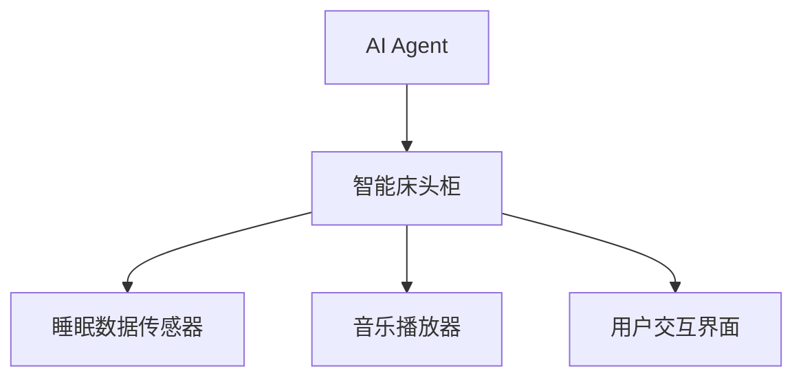
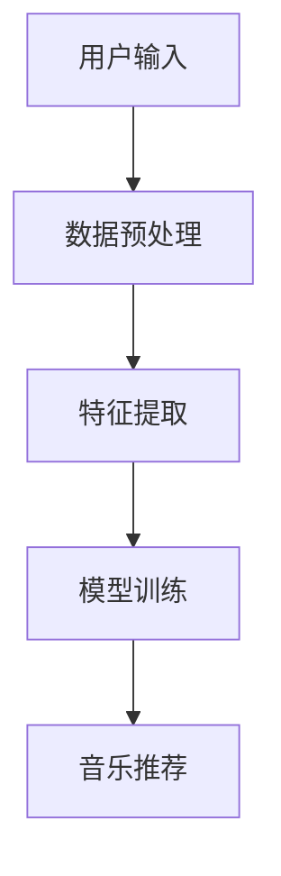
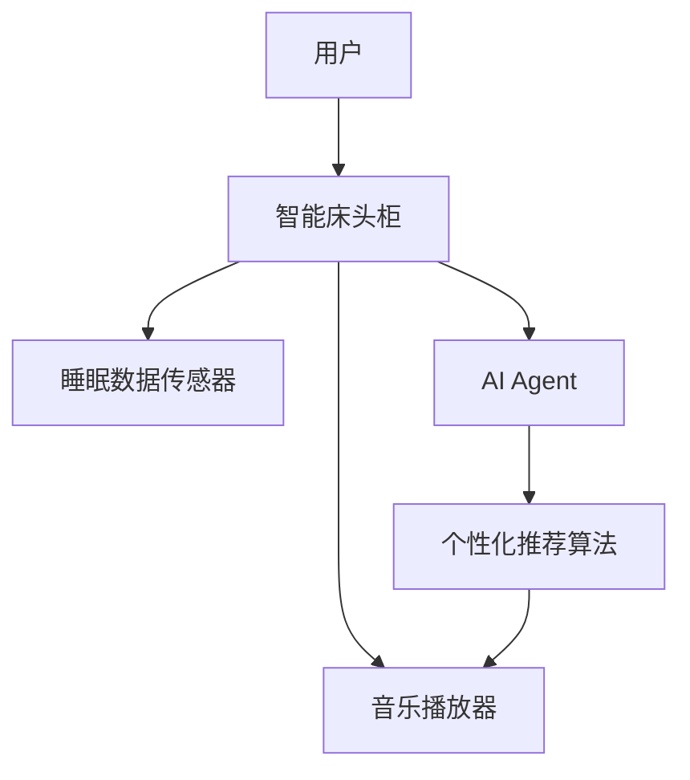
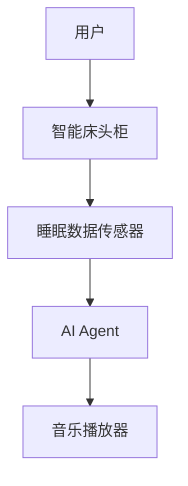

                 


# AI Agent在智能床头柜中的睡眠音乐定制

## 关键词：AI Agent、智能床头柜、睡眠音乐、个性化推荐、深度学习、协同过滤、物联网

## 摘要：  
本文探讨了AI Agent在智能床头柜中的应用，特别是在睡眠音乐定制方面的创新与实践。通过分析睡眠健康的重要性，结合AI Agent的核心原理，详细阐述了如何利用机器学习算法实现个性化音乐推荐，进而优化用户的睡眠质量。文章从理论到实践，系统性地介绍了AI Agent在智能床头柜中的设计、实现与优化过程，为智能家居领域提供了新的思路。

---

# 第1章: AI Agent与睡眠健康概述

## 1.1 AI Agent的基本概念  
### 1.1.1 AI Agent的定义与特点  
AI Agent（人工智能代理）是指能够感知环境、自主决策并执行任务的智能实体。其特点包括：  
- **自主性**：无需外部干预，自主完成任务。  
- **反应性**：能够实时感知环境并做出响应。  
- **学习性**：通过数据学习优化自身行为。  
- **交互性**：能够与用户和其他设备进行交互。  

### 1.1.2 AI Agent的核心功能与应用场景  
AI Agent的核心功能包括：  
- 数据采集与分析：通过传感器获取环境数据和用户行为数据。  
- 智能决策：基于数据进行分析和推理，做出最优决策。  
- 自动执行：根据决策结果执行相应的操作。  

应用场景包括智能家居、医疗健康、交通控制等领域。  

### 1.1.3 AI Agent在智能家居中的地位与作用  
在智能家居中，AI Agent是连接各个设备的核心枢纽，负责协调设备之间的交互，优化用户的使用体验。  

## 1.2 睡眠健康与音乐疗法  
### 1.2.1 睡眠健康的重要性  
睡眠是人体恢复和修复的关键过程，直接影响健康、情绪和认知能力。现代人因压力、环境噪音等因素，普遍存在睡眠问题。  

### 1.2.2 音乐疗法对睡眠的影响  
音乐通过调节大脑的神经活动，缓解压力、降低焦虑，从而改善睡眠质量。不同节奏和音调的音乐对睡眠有不同的影响，例如：  
- **慢节奏音乐**：有助于放松身心，进入深度睡眠。  
- **轻音乐**：适合浅眠者，帮助缓解入睡困难。  

### 1.2.3 智能床头柜的定义与功能  
智能床头柜是一种集成AI技术的床头设备，具备以下功能：  
- 睡眠监测：通过传感器采集用户的睡眠数据（如心率、呼吸频率）。  
- 音乐播放：根据用户的睡眠数据推荐合适的音乐。  
- 交互控制：支持语音或触控操作，方便用户与设备交互。  

## 1.3 睡眠音乐定制的背景与需求  
### 1.3.1 现代人睡眠问题的现状  
现代社会节奏快、压力大，许多人面临入睡困难、睡眠浅、多梦等问题。  

### 1.3.2 睡眠音乐定制的需求分析  
用户对个性化睡眠音乐的需求日益增长，传统音乐播放器无法满足用户的个性化需求。  

### 1.3.3 智能床头柜的睡眠音乐定制功能  
智能床头柜通过AI Agent实现睡眠音乐的个性化推荐，满足用户的多样化需求。  

## 1.4 本章小结  
本章介绍了AI Agent的基本概念、睡眠健康的重要性以及智能床头柜的功能与需求。通过AI Agent的技术支持，智能床头柜能够为用户提供个性化的睡眠音乐服务，改善用户的睡眠质量。

---

# 第2章: AI Agent在智能床头柜中的核心概念与联系  

## 2.1 AI Agent的核心原理  
### 2.1.1 AI Agent的基本工作原理  
AI Agent通过感知环境、分析数据、制定决策并执行操作来实现目标。  

### 2.1.2 AI Agent的感知与决策机制  
AI Agent通过传感器和用户输入获取数据，利用算法分析数据并做出决策。  

### 2.1.3 AI Agent的学习与优化能力  
AI Agent通过机器学习算法不断优化自身的推荐算法，提高推荐的准确性和个性化程度。  

## 2.2 睡眠音乐定制的核心要素  
### 2.2.1 用户睡眠数据的采集与分析  
智能床头柜通过传感器采集用户的睡眠数据，分析用户的睡眠状态和习惯。  

### 2.2.2 音乐风格与节奏的关联性分析  
不同音乐风格和节奏对睡眠的影响不同，AI Agent需要分析这些关联性，为用户提供最佳的音乐推荐。  

### 2.2.3 睡眠音乐的个性化推荐算法  
个性化推荐算法是睡眠音乐定制的核心，AI Agent通过分析用户的偏好和睡眠数据，推荐适合的音乐。  

## 2.3 AI Agent与智能床头柜的实体关系图  


## 2.4 本章小结  
本章详细介绍了AI Agent的核心原理和智能床头柜中的睡眠音乐定制的核心要素，通过实体关系图展示了AI Agent与智能床头柜之间的交互关系。

---

# 第3章: AI Agent的算法原理与数学模型  

## 3.1 睡眠音乐推荐算法  
### 3.1.1 基于协同过滤的推荐算法  
协同过滤是一种常用的推荐算法，通过分析用户的相似性来推荐音乐。  

### 3.1.2 基于内容的推荐算法  
内容推荐算法通过分析音乐的特征（如音调、节奏）来推荐相似的音乐。  

### 3.1.3 基于深度学习的推荐算法  
深度学习推荐算法通过神经网络模型学习用户的偏好，推荐更准确的音乐。  

## 3.2 算法流程图  


## 3.3 数学模型与公式  
### 3.3.1 协同过滤算法公式  
$$相似度计算：sim(i,j) = \frac{\sum_{k} r_{ik} r_{jk}}{\sqrt{\sum_{k} r_{ik}^2} \sqrt{\sum_{k} r_{jk}^2}}$$  

### 3.3.2 深度学习模型公式  
$$y = \sigma(wx + b)$$  

## 3.4 本章小结  
本章介绍了几种常用的睡眠音乐推荐算法，通过流程图和数学公式详细解释了算法的实现过程。

---

# 第4章: 智能床头柜的系统分析与架构  

## 4.1 系统功能设计  
智能床头柜的功能模块包括：  
- 睡眠监测模块：采集用户的睡眠数据。  
- 音乐播放模块：播放推荐的音乐。  
- 用户交互模块：支持用户与设备的交互。  

## 4.2 系统架构设计  


## 4.3 系统交互设计  


## 4.4 本章小结  
本章详细介绍了智能床头柜的系统功能设计、架构设计和交互设计，展示了AI Agent在系统中的核心作用。

---

# 第5章: 项目实战  

## 5.1 环境安装  
- 安装Python和相关库（如numpy、pandas、scikit-learn）。  

## 5.2 核心功能实现  
```python
def recommend_music(user_id):
    # 数据预处理
    user_data = preprocess(user_id)
    # 特征提取
    features = extract_features(user_data)
    # 模型训练
    model = train_model(features)
    # 推荐音乐
    recommended_music = model.predict(user_id)
    return recommended_music
```

## 5.3 实际案例分析  
通过实际案例分析，展示了AI Agent如何根据用户的睡眠数据推荐适合的音乐。  

## 5.4 本章小结  
本章通过实际案例分析和代码实现，展示了AI Agent在智能床头柜中的应用。

---

# 第6章: 最佳实践与注意事项  

## 6.1 最佳实践  
- 定期更新模型，提高推荐的准确性。  
- 提供多种交互方式，方便用户操作。  

## 6.2 小结  
总结全文，强调AI Agent在智能床头柜中的重要性。  

## 6.3 注意事项  
- 数据隐私保护：确保用户的睡眠数据不被泄露。  
- 设备兼容性：确保智能床头柜与其他智能家居设备的兼容性。  

## 6.4 拓展阅读  
推荐相关领域的书籍和论文，供读者进一步学习。  

---

# 附录  

## 附录A: 常用工具与库  
- Python：编程语言  
- scikit-learn：机器学习库  
- Mermaid：图表绘制工具  

## 附录B: 代码示例  
```python
import numpy as np
from sklearn.metrics.pairwise import cosine_similarity

# 协同过滤算法实现
def collaborative_filtering(X):
    user_mean = np.mean(X, axis=1)
    centered_X = X - user_mean[:, np.newaxis]
    similarity = cosine_similarity(centered_X)
    return similarity
```

---

# 结束语  

通过本文的详细介绍，读者可以全面了解AI Agent在智能床头柜中的应用，从理论到实践，掌握如何利用AI技术改善睡眠质量。未来，随着技术的不断发展，AI Agent在智能家居中的应用将更加广泛，为用户带来更智能、更便捷的生活体验。

