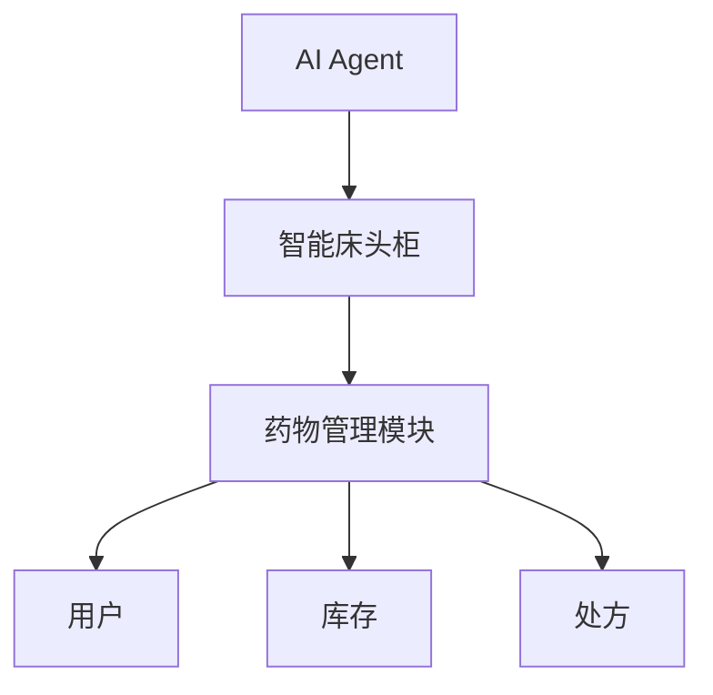
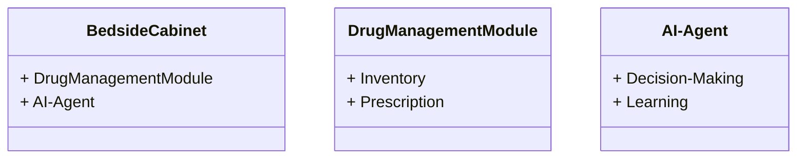
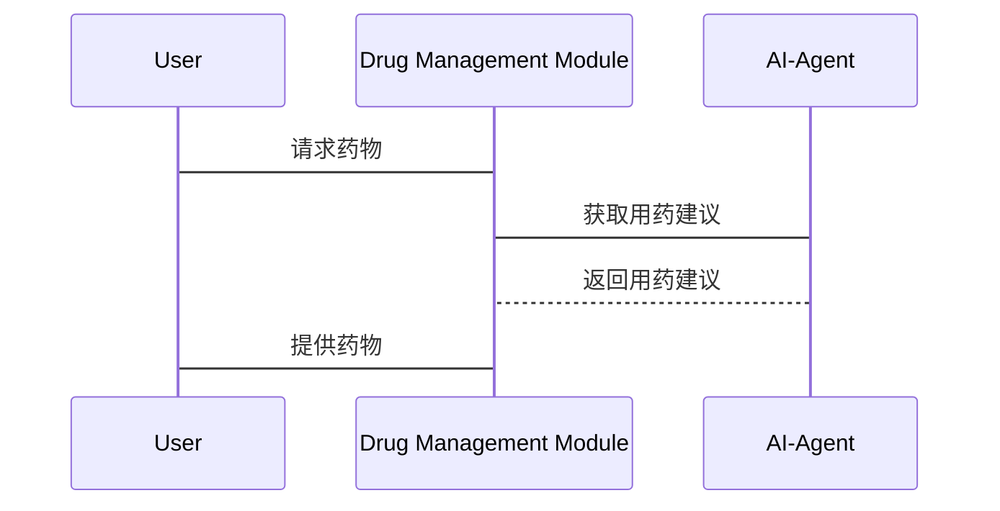

                 


# AI Agent在智能床头柜中的药物管理

## 关键词
- AI Agent
- 智能床头柜
- 药物管理
- 医疗系统
- 人工智能
- 系统架构

## 摘要
AI Agent在智能床头柜中的药物管理是一种创新的医疗解决方案，通过人工智能代理优化药物管理流程，提高患者安全和用药效率。本文详细分析了AI Agent的核心原理、系统架构设计、实际应用案例，并探讨了其在医疗领域的潜力。

---

# 第一部分: 背景介绍

## 第1章: 背景介绍

### 1.1 问题背景
#### 1.1.1 医疗领域中的药物管理问题
- 传统药物管理的低效和错误率
- 医疗事故中的药物管理失误
- 患者用药安全的重要性

#### 1.1.2 智能床头柜的应用场景
- 智能床头柜的功能与应用场景
- 智能床头柜在医疗中的优势

#### 1.1.3 AI Agent在药物管理中的必要性
- AI Agent如何提高药物管理效率
- AI Agent在智能床头柜中的作用

### 1.2 问题描述
#### 1.2.1 药物管理中的常见问题
- 药物误给、过期、剂量错误等问题
- 医药管理流程中的低效环节

#### 1.2.2 智能床头柜的药物管理需求
- 智能床头柜的药物管理功能需求
- 患者、医护人员对智能床头柜的需求

#### 1.2.3 AI Agent如何解决药物管理问题
- AI Agent在药物管理中的具体应用
- AI Agent如何优化药物管理流程

### 1.3 问题解决
#### 1.3.1 AI Agent的核心作用
- AI Agent在药物管理中的决策能力
- AI Agent如何提高药物管理的准确性和效率

#### 1.3.2 智能床头柜的药物管理流程优化
- 智能床头柜如何优化药物管理流程
- AI Agent在流程优化中的作用

#### 1.3.3 AI Agent在药物管理中的具体应用
- AI Agent在药物库存管理中的应用
- AI Agent在药物给药提醒中的应用
- AI Agent在药物剂量计算中的应用

### 1.4 边界与外延
#### 1.4.1 AI Agent的适用范围
- AI Agent在药物管理中的适用场景
- AI Agent的局限性和边界

#### 1.4.2 智能床头柜的药物管理边界
- 智能床头柜的功能边界
- 药物管理模块与其他模块的关系

#### 1.4.3 AI Agent的扩展应用
- AI Agent在其他医疗领域的应用潜力
- AI Agent的未来发展方向

### 1.5 概念结构与核心要素组成
#### 1.5.1 AI Agent的构成要素
- AI Agent的核心算法
- AI Agent的感知与决策能力

#### 1.5.2 智能床头柜的药物管理模块
- 药物管理模块的功能构成
- 药物管理模块的实现方式

#### 1.5.3 AI Agent与智能床头柜的交互关系
- AI Agent与智能床头柜的协同工作
- 交互流程与数据流分析

---

# 第二部分: 核心概念与联系

## 第2章: 核心概念原理

### 2.1 AI Agent的原理
#### 2.1.1 AI Agent的定义与特点
- AI Agent的定义
- AI Agent的核心特点

#### 2.1.2 AI Agent的核心算法
- 基于规则的推理算法
- 机器学习模型的应用
- 深度学习在AI Agent中的应用

#### 2.1.3 AI Agent的决策机制
- 基于规则的决策
- 基于概率的决策
- 基于强化学习的决策

### 2.2 智能床头柜的药物管理模块
#### 2.2.1 智能床头柜的功能模块
- 药物存储模块
- 药物给药模块
- 药物监控模块

#### 2.2.2 药物管理模块的实现原理
- 药物库存管理
- 药物给药提醒
- 药物剂量计算

#### 2.2.3 AI Agent在药物管理模块中的作用
- AI Agent如何优化药物库存管理
- AI Agent如何实现药物给药提醒
- AI Agent如何进行药物剂量计算

### 2.3 核心概念对比分析
#### 2.3.1 AI Agent与传统药物管理系统的对比
- 传统药物管理系统的优缺点
- AI Agent的优势

#### 2.3.2 智能床头柜与其他医疗设备的对比
- 智能床头柜的优势
- 其他医疗设备的特点

#### 2.3.3 药物管理模块与AI Agent的协同关系
- 药物管理模块与AI Agent的协同工作
- 交互流程与数据流分析

---

## 第3章: 实体关系图与流程图

### 3.1 ER实体关系图
```mermaid
erd
    title 药物管理系统的实体关系图
    Bedside Cabinet
    Drug Management Module
    AI Agent
    User
    Inventory
    Pres
```

### 3.2 流程图


---

# 第三部分: 算法原理讲解

## 第3章: 算法原理

### 3.1 AI Agent的算法
#### 3.1.1 基于规则的推理算法
- 规则的建立与应用
- 基于规则的决策过程

#### 3.1.2 机器学习模型
- 分类算法在药物管理中的应用
- 回归算法在药物剂量计算中的应用

#### 3.1.3 强化学习算法
- 强化学习在AI Agent决策中的应用
- 强化学习模型的训练过程

### 3.2 代码实现
#### 3.2.1 Python代码示例
```python
# 基于规则的决策算法
def drug_recommendation(rules, patient_info):
    for rule in rules:
        if rule['condition'](patient_info):
            return rule['action'](patient_info)
    return default_action

# 机器学习模型训练代码
from sklearn import tree
model = tree.DecisionTreeClassifier()
model.fit(X, y)
```

#### 3.2.2 数学公式
- 分类算法的数学模型
  $$ P(class | features) = \frac{P(features | class)P(class)}{P(features)} $$
- 回归算法的数学模型
  $$ y = a_0 + a_1x_1 + ... + a_nx_n $$

---

# 第四部分: 系统分析与架构设计方案

## 第4章: 系统分析与架构设计

### 4.1 问题场景介绍
- 智能床头柜的应用场景
- 药物管理模块的功能需求

### 4.2 系统功能设计
#### 4.2.1 领域模型


#### 4.2.2 系统架构设计


### 4.3 接口设计与交互流程
#### 4.3.1 接口设计
- 药物管理模块与AI Agent的接口
- 药物管理模块与用户的接口

#### 4.3.2 交互流程


---

# 第五部分: 项目实战

## 第5章: 项目实战

### 5.1 环境安装
- 安装Python和相关库
- 安装Mermaid和相关工具

### 5.2 系统核心实现
#### 5.2.1 核心代码实现
```python
# 药物管理模块的核心代码
class DrugManagement:
    def __init__(self, inventory):
        self.inventory = inventory

    def dispense_drug(self, prescription):
        # 使用AI Agent进行决策
        decision = self.ai_agent.decide(prescription)
        if decision == "dispense":
            return self.inventory dispense(prescription)
        else:
            return "拒绝发药"
```

#### 5.2.2 代码应用解读与分析
- 代码的功能解读
- 代码的优化建议

### 5.3 实际案例分析
#### 5.3.1 案例背景
- 病例描述
- 病例处理过程

#### 5.3.2 处理过程分析
- AI Agent在案例中的决策过程
- 药物管理模块的实现细节

### 5.4 项目小结
- 项目实现的成果
- 项目中的经验总结

---

# 第六部分: 最佳实践

## 第6章: 最佳实践

### 6.1 小结
- AI Agent在智能床头柜中的药物管理的优势
- 项目中的关键点总结

### 6.2 注意事项
- AI Agent的局限性
- 系统设计中的注意事项
- 实际应用中的注意事项

### 6.3 拓展阅读
- 相关领域的最新研究
- 未来的发展方向
- 进一步学习的资源推荐

---

# 总结

通过本文的详细分析，我们可以看到AI Agent在智能床头柜中的药物管理具有巨大的潜力。随着技术的不断进步，AI Agent将更加智能化，为医疗领域带来更多的创新和变革。

