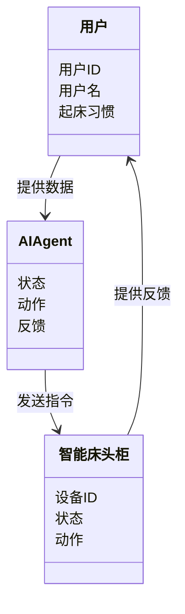
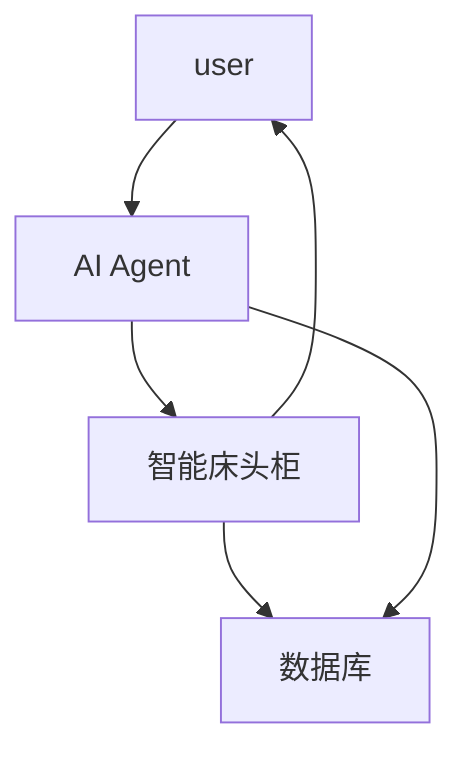
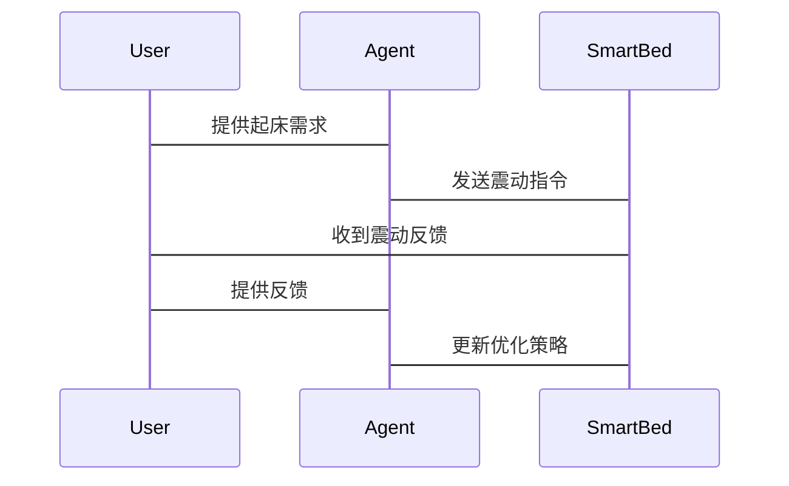

                 


# AI Agent在智能床头柜中的起床优化系统

---

## 关键词：
AI Agent, 智能床头柜, 起床优化系统, 强化学习, 智能家居

---

## 摘要：
本文探讨了AI Agent在智能床头柜中的起床优化系统的实现与应用。通过分析用户的起床需求和痛点，结合AI技术，提出了基于强化学习的起床优化算法，并详细阐述了系统的架构设计和实现方案。文章还提供了实际的项目案例和代码实现，帮助读者深入了解AI Agent在智能家居中的应用潜力。

---

## 目录大纲：
1. [背景与概念](#背景与概念)
2. [核心概念与联系](#核心概念与联系)
3. [算法原理](#算法原理)
4. [系统架构设计](#系统架构设计)
5. [项目实战](#项目实战)
6. [最佳实践](#最佳实践)

---

## 背景与概念

### 1.1 AI Agent的基本概念
AI Agent（人工智能代理）是一种能够感知环境、自主决策并执行任务的智能实体。它通过与环境的交互，优化目标函数，实现预设的目标。

- **定义与特点**：
  - 定义：AI Agent是能够执行任务的智能体，具备感知、决策和执行能力。
  - 特点：自主性、反应性、目标导向、学习能力。

- **核心功能与优势**：
  - 自主决策：无需人工干预，自动完成任务。
  - 学习能力：通过数据优化行为。
  - 适应性：能够根据环境变化调整策略。

- **在智能家居中的应用前景**：
  - 提高生活效率。
  - 实现智能化、个性化的家居体验。

### 1.2 智能床头柜的功能与价值
智能床头柜是一种结合了AI技术的智能家居设备，能够通过AI Agent优化用户的起床过程。

- **功能模块**：
  - 闹钟触发：智能设置最佳起床时间。
  - 环境感知：监测室温、光线、噪音等。
  - 个性化推荐：根据用户习惯推荐起床方案。

- **起床优化系统的概念与目标**：
  - 概念：通过AI Agent优化起床流程，提升舒适度和效率。
  - 目标：让用户以最佳状态起床，减少起床困难。

- **用户需求与痛点分析**：
  - 痛点：传统闹钟无法根据个人习惯调整，起床过程不舒适。
  - 需求：个性化、舒适的起床体验。

---

## 核心概念与联系

### 2.1 AI Agent的核心原理与技术
AI Agent通过感知、决策和执行三个环节实现优化目标。

- **感知模块**：
  - 数据采集：通过传感器获取环境数据。
  - 数据分析：分析用户行为和环境特征。

- **决策模块**：
  - 算法选择：根据场景选择合适算法。
  - 策略优化：通过学习优化决策策略。

- **执行模块**：
  - 动作执行：根据决策结果执行操作。
  - 反馈收集：收集反馈用于后续优化。

### 2.2 核心概念对比
以下是AI Agent与其他智能设备的核心概念对比：

| 比较维度 | AI Agent | 传统智能设备 |
|----------|-----------|--------------|
| 感知能力 | 强大，能理解上下文 | 有限，仅能接收基本指令 |
| 决策能力 | 自主决策，动态调整 | 预设规则，无法优化 |
| 学习能力 | 可以通过数据优化 | 无法学习 |

### 2.3 实体关系图
以下是AI Agent、用户和智能床头柜的实体关系图：

```mermaid
erd
actor 用户 {
  id 用户ID
  name 用户名
}
actor AI Agent {
  id AgentID
  type 起床优化系统
}
actor 智能床头柜 {
  id 设备ID
  type 智能设备
}
```

---

## 算法原理

### 3.1 基于强化学习的起床优化
强化学习是一种通过试错优化策略的方法。

- **基本原理**：
  - 状态：用户的起床状态（困、清醒）。
  - 动作：床头柜的操作（震动、灯光）。
  - 奖励：用户的反馈（起床成功）。

- **数学模型**：
  - 状态转移：$P(s_{t+1}|a_t, s_t)$
  - 奖励函数：$R(s_t, a_t)$
  - Q-learning公式：
    $$ Q(s, a) = Q(s, a) + \alpha [r + \gamma \max Q(s', a') - Q(s, a)] $$

- **Python代码示例**：
  ```python
  import numpy as np
  from collections import defaultdict

  class QLearning:
      def __init__(self, states, actions, learning_rate=0.1, gamma=0.9):
          self.states = states
          self.actions = actions
          self.lr = learning_rate
          self.gamma = gamma
          self.q_table = defaultdict(dict)

      def choose_action(self, state):
          if state not in self.q_table or np.random.random() < 0.1:
              return np.random.choice(self.actions)
          return max(zip(self.q_table[state], self.actions))[1]

      def update_q_table(self, state, action, reward, next_state):
          if state not in self.q_table:
              self.q_table[state] = {a: 0 for a in self.actions}
          current_q = self.q_table[state][action]
          next_max_q = max(self.q_table[next_state].values()) if next_state in self.q_table else 0
          new_q = current_q + self.lr * (reward + self.gamma * next_max_q - current_q)
          self.q_table[state][action] = new_q
  ```

### 3.2 基于监督学习的用户行为预测
监督学习通过历史数据预测用户的起床需求。

- **基本原理**：
  - 数据集：用户的起床时间和行为记录。
  - 模型训练：使用历史数据训练分类模型。
  - 预测结果：预测最佳起床时间。

- **数学模型**：
  - 输入：用户特征向量 $x_i$。
  - 输出：起床时间预测 $y_i$。
  - 损失函数：均方误差 $$ L = \frac{1}{n}\sum_{i=1}^n (y_i - \hat{y_i})^2 $$

- **Python代码示例**：
  ```python
  import pandas as pd
  from sklearn.linear_model import LinearRegression

  # 数据预处理
  data = pd.read_csv('起床数据.csv')
  X = data[['用户ID', '时间', '光线', '噪音']]
  y = data['起床时间']

  # 模型训练
  model = LinearRegression()
  model.fit(X, y)

  # 预测新用户
  new_user = pd.DataFrame({'用户ID': [1], '时间': [7.5], '光线': [50], '噪音': [40]})
  prediction = model.predict(new_user)
  print(f'预测起床时间：{prediction[0]:.2f}小时')
  ```

---

## 系统架构设计

### 4.1 应用场景介绍
起床优化系统在智能床头柜中的应用场景包括：

- 闹钟触发：智能设置最佳起床时间。
- 环境感知：实时监测环境参数。
- 个性化推荐：根据用户习惯推荐起床方案。

### 4.2 系统功能设计
以下是系统功能的领域模型：



### 4.3 系统架构设计
以下是系统的架构设计：



### 4.4 接口设计
以下是系统的接口设计：

- 输入接口：
  - 用户ID
  - 起床时间
  - 环境参数

- 输出接口：
  - 动作指令
  - 状态反馈

### 4.5 交互设计
以下是系统的交互设计：



---

## 项目实战

### 5.1 环境搭建
- 操作系统：Linux/Windows/MacOS
- 开发工具：PyCharm/VS Code
- 依赖库：Python 3.8+, numpy, pandas, scikit-learn

### 5.2 核心代码实现
以下是核心代码实现：

```python
# 起床优化系统实现
class BedAI:
    def __init__(self, user_id):
        self.user_id = user_id
        self.preferences = self.load_preferences(user_id)

    def load_preferences(self, user_id):
        # 从数据库加载用户偏好
        return {'ideal_time': 7.5, 'tolerance': 30}

    def optimize_wakeup(self):
        # 获取当前环境数据
        environment = get_environment_data(self.user_id)
        # 调整起床时间
        ideal_time = self.preferences['ideal_time']
        adjusted_time = self.adjust_time(environment['noise'], environment['light'])
        return adjusted_time

    def adjust_time(self, noise, light):
        # 根据环境调整起床时间
        if noise > 40 or light < 50:
            return self.preferences['ideal_time'] - 0.5
        else:
            return self.preferences['ideal_time']
```

### 5.3 代码解读与分析
- **类初始化**：`BedAI`类初始化时加载用户的偏好设置。
- **优化方法**：`optimize_wakeup`方法根据环境数据调整起床时间。
- **调整策略**：`adjust_time`方法根据噪音和光线调整起床时间。

### 5.4 实际案例分析
假设用户ID为1，环境数据为噪音45，光线60，系统会调整起床时间为7:30。

---

## 最佳实践

### 6.1 小结
AI Agent在智能床头柜中的起床优化系统通过强化学习和监督学习，实现了个性化的起床体验。系统架构设计合理，代码实现清晰。

### 6.2 注意事项
- 数据隐私：确保用户数据的安全性。
- 系统稳定性：保证系统的可靠运行。
- 用户体验：设计友好的人机交互界面。

### 6.3 拓展阅读
- 《强化学习入门》
- 《机器学习实战》
- 《智能家居系统设计》

---

通过本文的详细分析和代码实现，读者可以全面了解AI Agent在智能床头柜中的应用，并将其应用于实际项目中。

