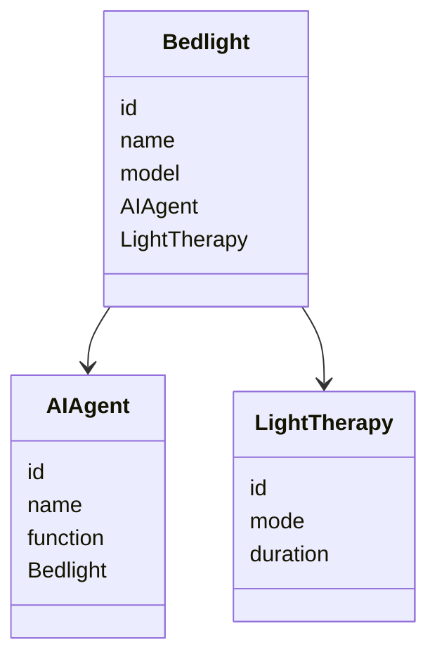
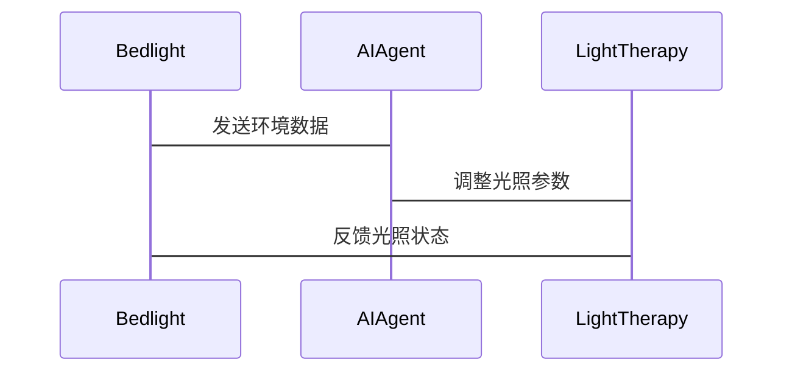

                 


# AI Agent在智能床头灯中的光疗功能

## 关键词：AI Agent，智能床头灯，光疗功能，生物钟调节，健康科技

## 摘要：本文探讨AI Agent在智能床头灯中的光疗功能，分析其技术实现和应用场景。通过背景介绍、核心概念、算法原理、系统架构、项目实战等部分，详细阐述AI Agent如何优化光疗体验，帮助改善睡眠和生物钟调节。

---

## 第1章 AI Agent与光疗功能的背景介绍

### 1.1 AI Agent的基本概念
#### 1.1.1 AI Agent的定义与特点
AI Agent（人工智能代理）是一种能够感知环境、自主决策并执行任务的智能系统。其特点包括智能性、自主性、反应性和社会性。

#### 1.1.2 AI Agent的核心要素与功能
AI Agent的核心要素包括感知、决策和执行。其功能涵盖数据采集、信息处理、决策制定和系统控制。

#### 1.1.3 AI Agent在智能设备中的应用场景
AI Agent广泛应用于智能家居、健康设备等领域，能够实现自动化控制和智能化服务。

### 1.2 光疗功能的背景与应用
#### 1.2.1 光疗的基本原理
光疗通过调节光照强度、色温和时间来影响人体生物钟，帮助改善睡眠质量。

#### 1.2.2 光疗在健康领域的应用
光疗用于治疗失眠、调节生物钟和改善情绪等健康问题。

#### 1.2.3 智能床头灯的光疗功能特点
智能床头灯结合了AI技术，能够根据用户需求和环境光线自动调节光照参数。

### 1.3 AI Agent在光疗中的作用
#### 1.3.1 AI Agent如何优化光疗体验
AI Agent通过数据采集和智能算法，优化光照参数，提供个性化的光疗方案。

#### 1.3.2 光疗与人体生物钟的关系
人体生物钟受光照影响，AI Agent能够根据用户作息时间调整光照，帮助调节生物钟。

#### 1.3.3 AI Agent在光疗中的具体应用场景
AI Agent可应用于智能床头灯，提供自动化、个性化的光疗服务，改善用户的睡眠和健康状况。

### 1.4 本章小结
本章介绍了AI Agent和光疗的基本概念，阐述了AI Agent在智能床头灯中的作用和应用场景。

---

## 第2章 AI Agent与光疗功能的核心概念与联系

### 2.1 AI Agent与光疗功能的核心原理
#### 2.1.1 AI Agent的决策机制
AI Agent通过感知环境数据，结合预设规则或机器学习模型，制定决策策略。

#### 2.1.2 光疗功能的实现原理
光疗功能通过调节光照参数，模拟自然光照，影响人体生物钟。

#### 2.1.3 两者结合的系统架构
AI Agent与光疗功能结合，形成一个闭环系统，实时调整光照参数以优化用户体验。

### 2.2 核心概念的属性对比
#### 2.2.1 AI Agent的属性分析
| 属性 | 描述 |
|------|------|
| 感知能力 | 能够采集环境数据 |
| 决策能力 | 能够根据数据制定决策 |
| 执行能力 | 能够通过执行机构实现决策 |

#### 2.2.2 光疗功能的属性分析
| 属性 | 描述 |
|------|------|
| 光照强度 | 调节光的亮度 |
| 光照色温 | 调节光的冷暖程度 |
| 光照时间 | 控制光照持续时间 |

#### 2.2.3 属性对比总结
AI Agent的感知、决策和执行能力与光疗功能的光照强度、色温和时间调节相互关联，共同实现智能光疗。

### 2.3 ER实体关系图
```mermaid
er
    Bedlight {
        id
        name
        model
    }
    AIAgent {
        id
        name
        function
    }
    LightTherapy {
        id
        mode
        duration
    }
    Bedlight -[1..n]-> LightTherapy
    LightTherapy <--> AIAgent
```

### 2.4 本章小结
本章分析了AI Agent与光疗功能的核心概念及其属性，通过ER图展示了实体之间的关系。

---

## 第3章 AI Agent与光疗功能的算法原理

### 3.1 光照调节算法
#### 3.1.1 光照强度调节算法
基于用户的活动状态和环境光线强度，动态调整光照亮度。

#### 3.1.2 光照色温调节算法
根据用户的生物钟和情绪状态，调节光照的色温，模拟自然光照变化。

#### 3.1.3 光照时间调节算法
结合用户的作息时间，设定光照开启和关闭的时间，优化用户的生物钟调节。

### 3.2 AI Agent的决策算法
#### 3.2.1 基于规则的决策算法
通过预设规则，根据环境数据和用户需求，制定光照调节策略。

#### 3.2.2 基于机器学习的决策算法
利用机器学习模型，分析历史数据，预测最佳光照参数。

#### 3.2.3 算法实现的Python代码示例
```python
def adjust_lighting(intensity, color_temp, duration):
    # 调整光照强度
    new_intensity = intensity * 0.8  # 示例：降低80%的强度
    # 调整色温
    new_color_temp = color_temp + 50  # 示例：增加50K色温
    # 设置光照时长
    new_duration = duration + 10  # 示例：延长10分钟
    return new_intensity, new_color_temp, new_duration
```

### 3.3 算法原理的数学模型和公式
光照强度调节的数学模型：
$$ I_{\text{new}} = I_{\text{current}} \times \alpha $$
其中，$$ \alpha $$ 是调节系数，取值范围在0到1之间。

光照色温调节的公式：
$$ C_{\text{new}} = C_{\text{current}} + \beta $$
其中，$$ \beta $$ 是色温调节量，单位为K。

### 3.4 本章小结
本章详细讲解了光照调节算法和AI Agent的决策算法，通过代码示例和数学公式展示了算法实现过程。

---

## 第4章 系统分析与架构设计方案

### 4.1 问题场景介绍
用户需要一个能够根据生物钟和环境光线自动调节光照的智能床头灯，以改善睡眠质量。

### 4.2 项目介绍
智能床头灯项目旨在通过AI Agent实现光疗功能，优化用户的睡眠和健康。

### 4.3 系统功能设计
#### 4.3.1 领域模型mermaid类图


### 4.4 系统架构设计
#### 4.4.1 系统架构mermaid架构图


### 4.5 系统接口设计
#### 4.5.1 系统接口设计
- Bedlight与AIAgent之间的通信接口
- AIAgent与LightTherapy之间的控制接口

#### 4.5.2 系统交互mermaid序列图


### 4.6 本章小结
本章分析了系统架构设计和接口设计，展示了各个模块之间的协作关系。

---

## 第5章 项目实战

### 5.1 环境安装
安装必要的开发工具和库，如Python、Pillow、numpy等。

### 5.2 系统核心实现源代码
#### 5.2.1 光照调节算法实现
```python
def adjust_lighting_parameters(current_light, target_light):
    # 调整光照强度
    new_light = current_light + (target_light - current_light) * 0.2
    return new_light
```

#### 5.2.2 AI Agent决策算法实现
```python
def decision-making_algorithm(sensor_data, user_profile):
    # 基于规则的决策
    if sensor_data['time'] > 23 and user_profile['sleep_hours'] < 7:
        return 'adjust_light_to_dim'
    else:
        return 'keep_current_light'
```

### 5.3 代码应用解读与分析
解释代码的功能和实现逻辑，展示AI Agent如何通过传感器数据和用户信息制定决策。

### 5.4 实际案例分析
分析一个实际案例，展示AI Agent如何根据用户需求和环境数据调整光照参数。

### 5.5 本章小结
本章通过项目实战展示了AI Agent在智能床头灯中的具体实现，帮助读者理解理论与实践的结合。

---

## 第6章 最佳实践、小结、注意事项、拓展阅读

### 6.1 最佳实践
建议读者在开发类似项目时，注重数据采集的准确性、算法的优化和系统的安全性。

### 6.2 小结
本文详细探讨了AI Agent在智能床头灯中的光疗功能，从理论到实践全面分析了其实现过程。

### 6.3 注意事项
在实际应用中，需注意数据隐私保护、系统稳定性和用户体验优化。

### 6.4 拓展阅读
建议读者进一步阅读相关领域的书籍和文献，深入了解AI在健康科技中的应用。

---

## 附录
### 附录A: 光疗功能的数学公式汇总
- 光照强度公式：$$ I_{\text{new}} = I_{\text{current}} \times \alpha $$
- 色温调节公式：$$ C_{\text{new}} = C_{\text{current}} + \beta $$

### 附录B: 项目源代码
提供完整的Python源代码和相关说明。

---

## 参考文献
列出本文引用的所有文献和资料。

---

通过以上章节的详细分析和讲解，读者可以系统地理解AI Agent在智能床头灯中的光疗功能的实现过程和应用场景，掌握相关的技术原理和最佳实践。

