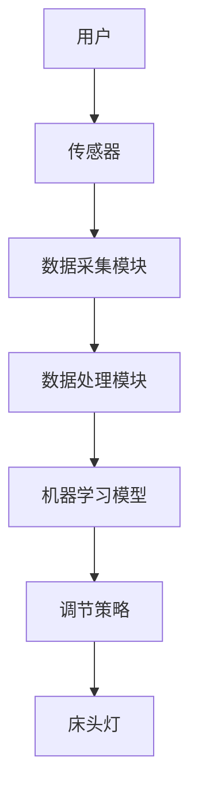
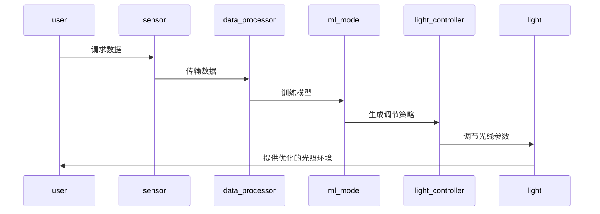

                 


# AI Agent在智能床头灯中的生理节律调节

> 关键词：AI Agent, 生理节律, 智能床头灯, 睡眠健康, 人工智能, 健康监测

> 摘要：本文详细探讨了AI Agent在智能床头灯中的应用，特别是在调节生理节律方面的作用。文章从生理节律调节的重要性入手，分析了AI Agent的核心概念与算法原理，并通过系统架构设计和项目实战，展示了AI Agent在智能床头灯中的具体实现。最后，本文总结了AI Agent在智能床头灯中的优势，并展望了其未来的发展方向。

---

# 第一部分: AI Agent与生理节律调节概述

## 第1章: AI Agent与生理节律调节的背景介绍

### 1.1 生理节律调节的重要性
生理节律是人体内部的一种生物钟，调控着我们的睡眠、觉醒、体温、激素分泌等重要生理活动。良好的生理节律对人体健康至关重要，它不仅影响我们的睡眠质量，还与情绪稳定、免疫力强弱等密切相关。现代生活中，由于工作压力、电子设备的普及等因素，越来越多的人出现了生理节律紊乱的问题，导致睡眠障碍、注意力不集中、情绪波动等问题。

AI Agent作为一种智能代理，能够通过感知环境、学习用户行为模式，并根据用户的需求进行实时调节，为生理节律的调节提供了新的可能性。

### 1.2 AI Agent的定义与特点
AI Agent（人工智能代理）是一种能够感知环境、自主决策、执行任务的智能系统。它具有以下特点：
- **自主性**：AI Agent能够自主决策，无需人工干预。
- **反应性**：能够实时感知环境变化并做出响应。
- **学习能力**：通过机器学习算法，AI Agent能够不断优化自身的调节策略。
- **适应性**：能够根据用户的需求和环境变化进行自适应调整。

### 1.3 智能床头灯的应用场景与优势
智能床头灯是一种结合了物联网技术与人工智能技术的智能设备，其核心功能是通过调节光线的亮度、色温和开关时间，帮助用户调节生理节律。与传统床头灯相比，智能床头灯的优势在于：
- **智能化调节**：能够根据用户的生理节律需求，自动调节光线。
- **个性化服务**：通过学习用户的使用习惯，提供个性化的调节方案。
- **健康促进**：通过优化用户的生理节律，提升睡眠质量，进而促进整体健康。

---

## 第2章: 生理节律调节的核心概念与联系

### 2.1 生理节律调节的原理
生理节律调节主要依赖于人体的生物钟，而生物钟的核心是下丘脑的视交叉上核（SCN）。SCN通过接收光线信号（尤其是蓝光）来调节人体的生物节律。当外界光线发生变化时，SCN会向身体发送信号，调整激素分泌（如褪黑激素）和体温，从而影响睡眠和觉醒周期。

AI Agent在生理节律调节中的作用主要是通过调节床头灯的光线参数，模拟自然光照的变化，帮助用户建立健康的生物钟。

### 2.2 AI Agent与生理节律调节的关系
AI Agent在生理节律调节中的作用可以分为以下几个方面：
- **数据采集**：通过传感器采集用户的生理数据（如心率、体温、光照强度等）。
- **数据分析**：利用机器学习算法分析数据，识别用户的生理节律模式。
- **智能调节**：根据分析结果，调节床头灯的光线参数，优化用户的生理节律。

### 2.3 核心概念对比与ER实体关系图
为了更好地理解AI Agent与生理节律调节的关系，我们可以通过对比分析和实体关系图来展示。

#### 2.3.1 对比分析
| **特征**       | **传统调节方法**                | **AI Agent调节方法**                  |
|----------------|-------------------------------|--------------------------------------|
| 调节方式       | 手动调节或固定时间             | 智能感知与自适应调节                 |
| 调节精度       | 低，依赖人工经验               | 高，基于数据学习优化                 |
| 适应性         | 差，无法根据个体差异调整       | 强，能够个性化定制                   |
| 响应速度       | 慢，需要人工干预               | 快，实时感知与响应                   |

#### 2.3.2 ER实体关系图
以下是AI Agent、用户和交互的核心实体关系图：

```mermaid
erDiagram
    user {
        +int id
        +string name
        +string email
    }
    agent {
        +int id
        +string name
        +string type
    }
    interaction {
        +int id
        +datetime timestamp
        +int userId
        +int agentId
    }
    user --> interaction : "触发调节"
    agent --> interaction : "响应调节"
```

---

## 第3章: AI Agent的算法原理与实现

### 3.1 AI Agent的算法原理
AI Agent的核心算法主要基于机器学习和自然语言处理技术。以下是AI Agent在生理节律调节中的主要算法步骤：

#### 3.1.1 数据采集
AI Agent通过传感器采集用户的生理数据，包括：
- 心率
- 体温
- 睡眠状态
- 光线强度

#### 3.1.2 数据分析
通过对采集到的数据进行分析，识别用户的生理节律模式。常用的分析方法包括：
- 时间序列分析
- 聚类分析
- 分类分析

#### 3.1.3 模型训练
基于历史数据，训练一个机器学习模型，用于预测用户的生理节律需求。常用的算法包括：
- 线性回归
- 支持向量机（SVM）
- 随机森林

#### 3.1.4 调节策略
根据模型预测结果，调节床头灯的光线参数，优化用户的生理节律。

### 3.2 基于时间序列的生理节律预测模型

#### 3.2.1 时间序列模型
时间序列模型是一种用于预测未来数据的统计模型。常用的模型包括ARIMA（自回归积分滑动平均模型）和LSTM（长短期记忆网络）。

##### ARIMA模型
ARIMA模型的数学公式如下：
$$ ARIMA(p, d, q) $$
其中：
- $p$ 是自回归部分的阶数
- $d$ 是差分的阶数
- $q$ 是移动平均部分的阶数

##### LSTM模型
LSTM模型是一种特殊的RNN（循环神经网络），适用于处理长序列数据。其核心在于引入了记忆单元（Cell）和遗忘门（Forget Gate）。

#### 3.2.2 基于LSTM的生理节律预测
以下是基于LSTM的时间序列预测模型的代码示例：

```python
import numpy as np
from keras import layers
from keras.models import Model

# 定义LSTM模型
input_seq = layers.Input(shape=(timesteps, features))
lstm_layer = layers.LSTM(64)(input_seq)
dense_layer = layers.Dense(1, activation='sigmoid')(lstm_layer)
model = Model(inputs=input_seq, outputs=dense_layer)
model.compile(loss='binary_crossentropy', optimizer='adam', metrics=['accuracy'])
```

---

## 第4章: 系统架构设计与实现

### 4.1 系统功能设计
智能床头灯系统的核心功能包括：
- **数据采集**：通过传感器采集用户的生理数据。
- **数据处理**：对采集到的数据进行清洗和预处理。
- **模型训练**：基于历史数据训练生理节律预测模型。
- **智能调节**：根据模型预测结果，调节床头灯的光线参数。

### 4.2 系统架构设计
以下是智能床头灯系统的架构图：



### 4.3 系统接口设计
系统接口设计主要涉及以下几个方面：
- **用户接口**：用户可以通过手机APP或床头灯的控制面板与系统交互。
- **传感器接口**：传感器通过蓝牙或Wi-Fi与床头灯连接。
- **床头灯接口**：床头灯通过I2C或PWM接口与主控板连接。

### 4.4 交互流程设计
以下是用户与智能床头灯的交互流程图：



---

## 第5章: 项目实战与分析

### 5.1 项目环境搭建
要实现智能床头灯的AI Agent功能，首先需要搭建以下环境：
- **硬件设备**：床头灯主控板、光线传感器、心率传感器。
- **软件工具**：Python编程环境、TensorFlow框架、Keras库。

### 5.2 核心代码实现
以下是AI Agent的核心代码实现：

```python
import numpy as np
import tensorflow as tf
from tensorflow.keras import layers

# 数据预处理
def preprocess_data(data):
    # 数据标准化
    mean = np.mean(data)
    std = np.std(data)
    normalized_data = (data - mean) / std
    return normalized_data

# 模型训练
def train_model(train_data, train_labels):
    input_shape = (train_data.shape[1], train_data.shape[2])
    model = tf.keras.Sequential()
    model.add(layers.LSTM(64, input_shape=input_shape))
    model.add(layers.Dense(1, activation='sigmoid'))
    model.compile(loss='binary_crossentropy', optimizer='adam', metrics=['accuracy'])
    model.fit(train_data, train_labels, epochs=10, batch_size=32)
    return model

# 模型预测
def predict Physiological_rhythm(model, test_data):
    predictions = model.predict(test_data)
    return predictions
```

### 5.3 实际案例分析
以下是一个实际案例分析：
假设用户A是一个经常熬夜的上班族，他的生理节律严重紊乱。通过智能床头灯的AI Agent功能，系统会根据他的生理数据（如心率、体温）和光照环境，自动调节床头灯的光线参数。例如，在睡前1小时，系统会将床头灯的光线调暗，帮助用户放松，进入深度睡眠状态。

### 5.4 项目小结
通过本项目，我们可以看到AI Agent在智能床头灯中的应用潜力。通过实时采集用户的生理数据，结合机器学习算法，AI Agent能够为用户提供个性化的生理节律调节服务，从而提升用户的睡眠质量和整体健康水平。

---

## 第6章: 最佳实践与注意事项

### 6.1 最佳实践
- **数据隐私保护**：在采集和处理用户数据时，必须严格遵守数据隐私保护法规。
- **系统稳定性**：确保AI Agent的算法稳定，避免因为系统故障影响用户的正常使用。
- **用户体验优化**：通过用户反馈不断优化系统的交互设计，提升用户体验。

### 6.2 注意事项
- **数据质量问题**：数据采集过程中需要注意数据的准确性和完整性。
- **模型优化**：定期更新模型，确保模型的预测精度。
- **系统兼容性**：确保系统能够兼容不同的硬件设备和软件环境。

---

## 第7章: 未来展望与总结

### 7.1 未来展望
随着人工智能技术的不断发展，AI Agent在智能床头灯中的应用将更加广泛。未来，我们可以期待以下发展方向：
- **多模态数据融合**：结合更多的生理数据（如心电图、血氧饱和度）进行综合分析。
- **个性化服务**：基于用户的基因信息和生活习惯，提供更加个性化的调节方案。
- **边缘计算**：通过边缘计算技术，提升系统的实时性和响应速度。

### 7.2 总结
本文详细探讨了AI Agent在智能床头灯中的生理节律调节应用。从生理节律调节的原理，到AI Agent的核心算法，再到系统的实现与优化，我们全面分析了AI Agent在智能床头灯中的应用潜力。通过本文的分析，我们相信，随着技术的不断进步，AI Agent将在未来的健康科技领域发挥越来越重要的作用。

--- 

希望这篇文章能为读者提供有价值的参考和启发！

