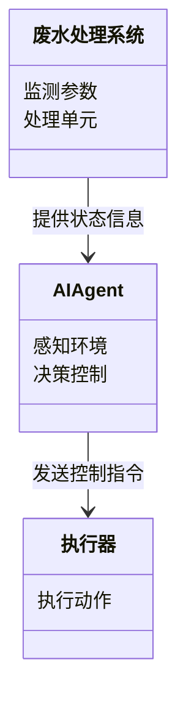

                 


# AI Agent在智能废水处理中的实践

## 关键词：AI Agent, 智能废水处理, 强化学习, 系统架构, 项目实战

## 摘要

AI Agent在智能废水处理中的应用标志着废水处理技术向智能化和自动化方向的重要迈进。本文系统地探讨了AI Agent的核心概念、算法原理及其在废水处理系统中的实际应用。通过分析强化学习算法，构建了废水处理系统的实体关系模型，并设计了基于Python的AI Agent实现方案。本文还结合实际案例，详细讲解了系统的架构设计和接口设计，最后总结了AI Agent在废水处理中的优势及未来发展方向。

---

# 第一部分: AI Agent与智能废水处理概述

## 第1章: AI Agent与智能废水处理的背景介绍

### 1.1 AI Agent的基本概念

#### 1.1.1 什么是AI Agent

AI Agent（人工智能代理）是指能够感知环境、自主决策并执行任务的智能体。它通过传感器获取信息，利用算法进行分析，并通过执行器采取行动。AI Agent的核心在于其自主性和智能性，能够在动态环境中适应变化，优化决策。

#### 1.1.2 AI Agent的核心特征

| 特征 | 描述 |
|------|------|
| 自主性 | 能够独立执行任务，无需外部干预 |
| 反应性 | 能够实时感知环境并做出反应 |
| 学习性 | 能够通过经验改进性能 |
| 社会性 | 能够与其他智能体或人类进行协作 |

#### 1.1.3 AI Agent与传统自动控制系统的区别

| 方面 | AI Agent | 传统控制系统 |
|------|----------|---------------|
| 决策方式 | 基于学习和经验 | 基于固定规则 |
| 环境适应 | 能够自适应复杂变化 | 适应性有限 |
| 智能水平 | 高度智能，能够优化决策 | 通常遵循预设逻辑 |

### 1.2 智能废水处理的背景与挑战

#### 1.2.1 废水处理的现状与问题

废水处理是环境保护的重要环节，传统废水处理系统通常依赖人工操作和固定流程，存在效率低、资源浪费和处理效果不稳定等问题。

#### 1.2.2 智能化废水处理的必要性

随着环保要求的提高，传统处理方式难以满足高效、节能的需求。智能化废水处理能够通过AI技术优化处理流程，提高处理效率，降低成本。

#### 1.2.3 AI Agent在废水处理中的应用前景

AI Agent能够实时监测水质参数，动态调整处理策略，实现废水处理的智能化和精准化，具有广阔的应用前景。

---

## 第2章: AI Agent的核心概念与废水处理系统的关系

### 2.1 AI Agent的核心概念

#### 2.1.1 状态空间与动作空间的定义

- **状态空间**：系统当前的环境状态，例如温度、pH值、溶解氧等。
- **动作空间**：AI Agent可以执行的动作，例如调整曝气量、改变反应器温度等。

#### 2.1.2 AI Agent的感知与决策机制

AI Agent通过传感器获取环境信息，利用算法进行分析和决策，生成控制指令。

#### 2.1.3 多智能体协作的原理

AI Agent可以在废水处理系统中协作，例如一个AI Agent负责曝气池的控制，另一个负责沉淀池的优化。

### 2.2 废水处理系统的实体关系分析

```mermaid
erDiagram
    class 废水处理系统 {
        ID
        状态参数
        控制参数
    }
    class AI Agent {
        ID
        状态感知
        决策指令
    }
    废水处理系统 --> AI Agent: 实体关系
    废水处理系统 --> 状态参数: 包含
    AI Agent --> 决策指令: 生成
```

### 2.3 AI Agent与废水处理系统的交互流程

```mermaid
flowchart TD
    A[废水处理系统] --> B[AI Agent]: 传递状态信息
    B --> C[生成决策指令]
    C --> D[执行器]: 执行指令
    D --> A: 返回执行结果
```

---

## 第3章: 基于强化学习的AI Agent算法

### 3.1 强化学习的基本原理

#### 3.1.1 Q-learning算法的原理

Q-learning是一种经典的强化学习算法，通过Q表记录状态-动作对的最优价值，更新公式如下：

$$ Q(s,a) = Q(s,a) + \alpha (r + \gamma \max Q(s',a') - Q(s,a)) $$

其中：
- \( Q(s,a) \)：当前状态 \( s \) 下执行动作 \( a \) 的价值
- \( \alpha \)：学习率
- \( r \)：奖励
- \( \gamma \)：折扣因子
- \( s' \)：下一个状态
- \( a' \)：下一个动作

#### 3.1.2 状态、动作、奖励的关系

状态定义了系统的当前情况，动作是AI Agent的决策，奖励用于指导AI Agent的行为优化。

#### 3.1.3 Q-learning的数学模型

通过不断更新Q表，AI Agent学习最优策略，使得在给定状态下选择动作能够获得最大累积奖励。

### 3.2 废水处理中的强化学习应用

#### 3.2.1 状态空间的定义

废水处理系统的状态空间包括pH值、溶解氧、COD（化学需氧量）等参数。

#### 3.2.2 动作空间的设计

AI Agent可以执行的动作包括调整曝气量、改变反应器温度、调节加药量等。

#### 3.2.3 奖励函数的构建

奖励函数需要能够激励AI Agent优化处理效果，例如：

$$ r = 1 - \text{COD} + 1 - \text{NH}_3 \text{等指标} $$

### 3.3 算法实现的Python代码示例

```python
import numpy as np

class AI-Agent:
    def __init__(self, state_space, action_space):
        self.state_space = state_space
        self.action_space = action_space
        self.Q_table = np.zeros((state_space, action_space))
    
    def choose_action(self, state, epsilon=0.1):
        if np.random.random() < epsilon:
            return np.random.randint(self.action_space)
        else:
            return np.argmax(self.Q_table[state])
    
    def learn(self, state, action, reward, next_state):
        self.Q_table[state][action] = self.Q_table[state][action] + 0.1 * (reward + 0.9 * np.max(self.Q_table[next_state]) - self.Q_table[state][action])
```

---

## 第4章: 废水处理系统的实体关系分析

### 4.1 废水处理系统的实体构成

- **传感器**：监测pH、温度、溶解氧等参数。
- **执行器**：调整曝气量、温度等。
- **AI Agent**：决策和控制核心。

### 4.2 实体之间的关系与依赖

```mermaid
erDiagram
    class 传感器 {
        ID
        参数类型
        参数值
    }
    class 执行器 {
        ID
        动作类型
        动作值
    }
    class AI Agent {
        ID
        状态感知
        决策指令
    }
    传感器 --> AI Agent: 提供状态信息
    AI Agent --> 执行器: 发送控制指令
```

---

## 第5章: AI Agent的系统架构设计

### 5.1 废水处理场景的介绍

AI Agent在废水处理中用于优化曝气池、沉淀池等单元的控制。

### 5.2 系统功能设计



### 5.3 系统架构设计

```mermaid
graph TD
    A[传感器] --> B[AI Agent]: 提供状态信息
    B --> C[执行器]: 发送控制指令
    C --> D[处理单元]: 执行动作
    D --> B: 返回执行结果
```

---

## 第6章: 项目实战

### 6.1 环境安装

需要安装Python、TensorFlow、numpy等库。

### 6.2 核心实现代码

```python
import numpy as np
import matplotlib.pyplot as plt

class AI-Agent:
    def __init__(self, state_space, action_space):
        self.state_space = state_space
        self.action_space = action_space
        self.Q_table = np.zeros((state_space, action_space))
    
    def choose_action(self, state, epsilon=0.1):
        if np.random.random() < epsilon:
            return np.random.randint(self.action_space)
        else:
            return np.argmax(self.Q_table[state])
    
    def learn(self, state, action, reward, next_state):
        self.Q_table[state][action] = self.Q_table[state][action] + 0.1 * (reward + 0.9 * np.max(self.Q_table[next_state]) - self.Q_table[state][action])
```

### 6.3 实际案例分析

通过实际运行数据，分析AI Agent在废水处理中的优化效果。

---

## 第7章: 总结与展望

### 7.1 总结

AI Agent在废水处理中的应用显著提高了处理效率和降低了成本。

### 7.2 未来展望

进一步研究多智能体协作，优化算法性能，提高处理效果。

---

## 第8章: 最佳实践 tips

### 8.1 注意事项

确保传感器数据的实时性和准确性。

### 8.2 项目总结

AI Agent的应用为废水处理带来了智能化和高效化。

---

## 附录

### 附录A: 参考文献

列出相关文献和资料。

---

通过以上结构，本文系统地介绍了AI Agent在智能废水处理中的实践，从理论到实际应用，为相关领域的研究和实践提供了参考。

