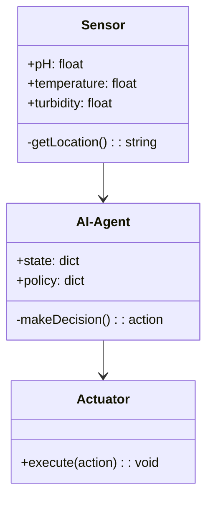
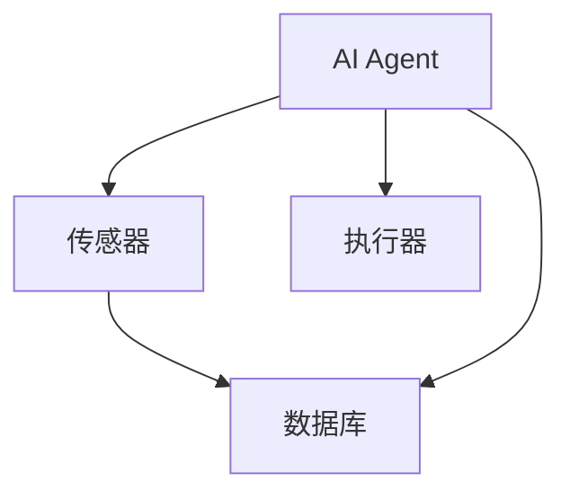
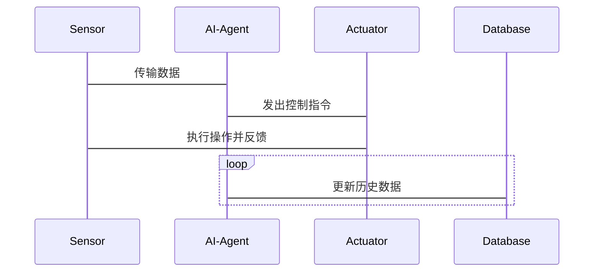

                 


# AI Agent在智能废水处理控制中的实践

> 关键词：AI Agent，智能废水处理，控制优化，算法原理，系统设计

> 摘要：本文探讨了AI Agent在智能废水处理控制中的应用，从背景介绍、核心概念、算法原理到系统设计和项目实战，详细分析了如何通过AI技术优化废水处理过程，实现智能化监控与管理。

---

## 第1章 AI Agent与智能废水处理概述

### 1.1 AI Agent的基本概念

#### 1.1.1 什么是AI Agent
AI Agent（人工智能代理）是一种能够感知环境、自主决策并执行任务的智能实体。它通过传感器获取信息，利用算法进行分析，并通过执行器与环境互动。AI Agent的核心特征包括自主性、反应性、目标导向和社会能力。

#### 1.1.2 AI Agent的核心特征
- **自主性**：AI Agent能够独立执行任务，无需外部干预。
- **反应性**：能够实时感知环境变化并做出反应。
- **目标导向**：通过优化目标函数实现特定目标。
- **社会能力**：能够与其他AI Agent或人类协同工作。

#### 1.1.3 AI Agent在废水处理中的应用潜力
AI Agent可以通过实时监测水质数据、优化处理流程和预测潜在问题，显著提升废水处理的效率和效果。

---

### 1.2 智能废水处理的背景与挑战

#### 1.2.1 废水处理的基本概念
废水处理是指将工业或生活污水经过物理、化学和生物处理，达到排放标准的过程。传统处理方法包括过滤、沉淀、氧化还原等。

#### 1.2.2 智能化废水处理的必要性
随着环保要求的提高和处理成本的增加，传统方法已难以满足高效处理的需求。智能化废水处理能够通过实时监控和优化控制提高处理效率。

#### 1.2.3 当前废水处理中的主要问题
- **处理效率低**：传统方法缺乏灵活性，难以应对复杂工况。
- **资源浪费**：能源和化学品的使用效率不高。
- **人工干预多**：需要大量人工监控和调整。

---

### 1.3 AI Agent在废水处理中的优势

#### 1.3.1 提高处理效率
AI Agent能够实时分析水质数据，优化处理参数，显著提高处理效率。

#### 1.3.2 实现智能化监控
通过AI Agent，可以实现对废水处理系统的全天候监控，及时发现并解决问题。

#### 1.3.3 优化资源利用
AI Agent可以通过预测模型优化化学品使用量，降低资源浪费。

---

## 第2章 AI Agent与废水处理的核心概念

### 2.1 AI Agent的基本原理

#### 2.1.1 智能体的感知与决策
AI Agent通过传感器获取数据，利用算法进行分析，做出决策并执行操作。

#### 2.1.2 多智能体系统简介
多智能体系统由多个AI Agent组成，通过协作完成复杂任务。

#### 2.1.3 AI Agent在废水处理中的应用场景
- **实时监控**：监测水质参数。
- **优化控制**：调整处理流程参数。
- **预测维护**：预测设备故障。

---

### 2.2 废水处理系统的关键要素

#### 2.2.1 废水处理流程
处理流程包括预处理、生物处理和深度处理。

#### 2.2.2 处理单元的功能分析
- **预处理**：过滤、沉淀。
- **生物处理**：利用微生物分解污染物。
- **深度处理**：进一步净化水质。

#### 2.2.3 系统监控与反馈机制
通过传感器实时监测水质数据，并将反馈信息传递给AI Agent进行调整。

---

### 2.3 AI Agent与废水处理的结合点

#### 2.3.1 数据采集与分析
AI Agent通过传感器采集水质数据，利用机器学习算法进行分析。

#### 2.3.2 智能决策与控制
基于分析结果，AI Agent做出最优决策并控制处理单元。

#### 2.3.3 系统优化与维护
通过历史数据优化处理流程，预测设备维护需求。

---

## 第3章 AI Agent在废水处理中的算法原理

### 3.1 强化学习算法

#### 3.1.1 强化学习的基本原理
强化学习通过智能体与环境的交互，学习最优策略。

#### 3.1.2 废水处理中的强化学习应用
AI Agent通过强化学习优化处理参数，降低处理成本。

#### 3.1.3 算法实现步骤
1. 初始化状态空间和动作空间。
2. 环境反馈奖励或惩罚。
3. 更新策略以最大化累积奖励。

#### 3.1.4 代码实现
```python
class AI-Agent:
    def __init__(self):
        self.Q-learning算法初始化
    def perceive(self, data):
        # 接收环境数据
        pass
    def decide(self):
        # 根据当前状态选择动作
        pass
```

---

## 第4章 系统分析与架构设计

### 4.1 问题场景介绍
废水处理系统需要实时监控pH值、温度、悬浮物浓度等参数。

### 4.2 系统功能设计

#### 4.2.1 领域模型类图


#### 4.2.2 系统架构图


#### 4.2.3 系统接口设计
- **数据接口**：传感器数据输入和输出。
- **控制接口**：AI Agent发送控制指令。
- **监控接口**：用户实时查看处理状态。

#### 4.2.4 交互流程图


---

## 第5章 项目实战

### 5.1 环境安装
安装Python、TensorFlow、Keras等库。

### 5.2 系统核心实现
实现AI Agent的感知、决策和控制功能。

#### 5.2.1 代码实现
```python
import numpy as np
from tensorflow import keras

# 加载预训练模型
model = keras.models.load_model('ai_agent_model.h5')

def make_decision(data):
    prediction = model.predict(np.array([data]))
    return prediction.argmax()
```

#### 5.2.2 代码解读
- 使用预训练模型进行预测。
- 根据预测结果选择最优动作。

### 5.3 实际案例分析
通过实际数据验证AI Agent的优化效果。

---

## 第6章 最佳实践与小结

### 6.1 小结
本文详细介绍了AI Agent在智能废水处理中的应用，从理论到实践，展示了其在提高效率和降低成本方面的优势。

### 6.2 注意事项
- 数据质量对AI Agent性能影响重大。
- 系统维护和更新不可忽视。

### 6.3 拓展阅读
建议进一步研究强化学习在废水处理中的应用，以及多智能体协作系统的设计。

---

以上为《AI Agent在智能废水处理控制中的实践》的技术博客文章大纲和部分详细内容。

