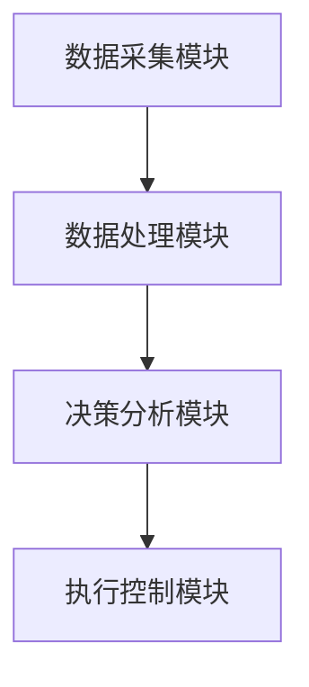
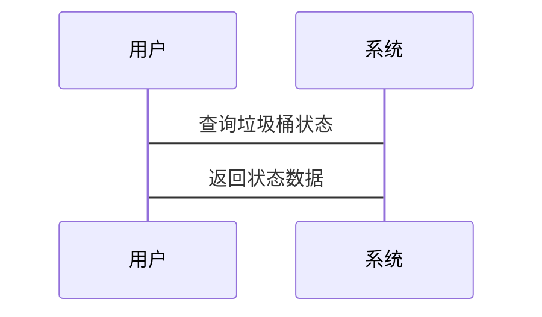

                 

# AI Agent在智能废物管理中的实践

> 关键词：AI Agent, 智能废物管理, 机器学习, 废物分类, 路径规划

> 摘要：本文探讨了AI Agent在智能废物管理中的应用，从核心原理到实际案例，详细分析了如何利用AI技术优化废物管理流程，包括分类、监测和路径规划等方面，展示了AI在提升管理效率和环保效果中的潜力。

---

## 第1章: AI Agent与智能废物管理概述

### 1.1 AI Agent的基本概念

AI Agent，即人工智能代理，是指能够感知环境、做出决策并采取行动以实现目标的智能实体。它具备自主性、反应性、目标导向性和社会性四大特征。

#### 1.1.1 什么是AI Agent

AI Agent通过传感器和数据源获取信息，利用算法处理信息，做出决策，并通过执行器或接口与环境互动。例如，在废物管理中，AI Agent可以监控垃圾桶的填充情况，优化收集路线。

#### 1.1.2 AI Agent的核心特征

| 特征 | 描述 |
|------|------|
| 自主性 | 能够独立运作，无需外部干预 |
| 反应性 | 能够实时响应环境变化 |
| 目标导向性 | 以明确目标为导向，优化行动 |
| 社会性 | 能够与其他系统或人类交互协作 |

#### 1.1.3 AI Agent在废物管理中的应用潜力

AI Agent可以用于废物分类、路径优化、监测预警等领域，帮助提高管理效率，降低成本，减少环境影响。

### 1.2 智能废物管理的背景与挑战

#### 1.2.1 全球废物管理现状

随着城市化进程加快，废物产生量急剧增加，传统管理方式效率低下，资源浪费严重，环境污染加剧。

#### 1.2.2 传统废物管理的局限性

- 人工分类效率低，错误率高
- 收集路线固定，浪费时间与资源
- 缺乏实时监测，难以及时响应问题

#### 1.2.3 智能化管理的必要性

通过AI技术实现智能化管理，可以显著提高效率，降低成本，减少环境影响。

---

## 第2章: AI Agent的核心原理与技术

### 2.1 AI Agent的基本原理

AI Agent的工作流程包括感知、决策和执行三个阶段。

#### 2.1.1 感知层

AI Agent通过传感器或数据源获取环境信息，如垃圾桶的填充情况、地理位置等。

#### 2.1.2 决策层

基于感知信息，AI Agent利用算法做出最优决策，如选择最佳收集路线。

#### 2.1.3 执行层

通过执行器或接口将决策转化为实际行动，如调整收集车辆的路线。

### 2.2 AI Agent的关键技术

#### 2.2.1 机器学习算法

机器学习用于模式识别和预测，如垃圾分类中的图像识别。

#### 2.2.2 自然语言处理

用于处理文本数据，如分析用户反馈或处理相关文本信息。

#### 2.2.3 计算机视觉

用于图像识别，如识别垃圾桶中的物品类型。

### 2.3 AI Agent的数学模型

#### 2.3.1 感知模型

感知模型通过传感器数据进行特征提取，常用的模型包括卷积神经网络（CNN）。

$$ \text{CNN结构：} \text{输入} \rightarrow \text{卷积层} \rightarrow \text{池化层} \rightarrow \text{全连接层} \rightarrow \text{输出} $$

#### 2.3.2 决策模型

决策模型通常使用强化学习，通过状态、动作和奖励来优化决策过程。

#### 2.3.3 执行模型

执行模型将决策转化为具体行动，如调整车辆路线。

---

## 第3章: AI Agent在废物管理中的应用场景

### 3.1 智能分类与识别

#### 3.1.1 垃圾分类的挑战

人工分类效率低，错误率高，需要自动化解决方案。

#### 3.1.2 基于AI的分类算法

使用卷积神经网络（CNN）进行图像分类，识别不同类型的垃圾。

### 3.2 智能路径规划

#### 3.2.1 废物收集路径优化

通过强化学习优化路径，减少时间和成本。

#### 3.2.2 基于AI的路径规划算法

使用遗传算法或蚁群算法优化路径。

### 3.3 智能监测与预警

#### 3.3.1 废物管理中的监测需求

实时监测垃圾桶状态，及时响应溢满情况。

#### 3.3.2 基于AI的监测系统

通过图像识别和传感器数据，实时监测垃圾桶状态。

---

## 第4章: 智能废物管理系统的架构设计

### 4.1 系统总体架构

系统包括数据采集、数据处理、决策分析和执行控制四个模块。

#### 4.1.1 系统架构图

### 4.2 功能模块设计

#### 4.2.1 数据采集模块

负责收集垃圾桶的状态、地理位置等数据。

#### 4.2.2 数据处理模块

对采集的数据进行清洗、转换和存储。

#### 4.2.3 决策分析模块

利用算法生成最优决策，如路径规划。

#### 4.2.4 执行控制模块

将决策转化为具体行动，如调整车辆路线。

---

## 第5章: 系统接口与交互设计

### 5.1 系统接口设计

#### 5.1.1 数据接口

定义数据格式和接口协议，如REST API。

#### 5.1.2 用户接口

提供友好的人机交互界面，方便用户查看和管理。

### 5.2 系统交互设计

#### 5.2.1 用户与系统交互

---

## 第6章: 项目实战与总结

### 6.1 项目实战

#### 6.1.1 智能垃圾分类系统

开发一个基于AI的垃圾分类系统，实现自动分类和路径优化。

#### 6.1.2 环境安装与代码实现

安装必要的库，如TensorFlow、OpenCV，编写垃圾分类算法。

#### 6.1.3 测试与优化

测试系统性能，优化算法，提高分类准确率。

### 6.2 总结与展望

#### 6.2.1 项目总结

AI Agent在智能废物管理中的应用显著提高了效率和环保效果。

#### 6.2.2 未来展望

未来，AI Agent将在废物管理中发挥更大的作用，推动智能化管理的发展。

---

## 参考资料

- [1] 《深度学习》, Ian Goodfellow
- [2] 《机器学习实战》, 周志华
- [3] 《Python机器学习》, Aurélien Géron

通过本文，读者可以深入了解AI Agent在智能废物管理中的应用，从理论到实践，全面掌握其技术细节和实际案例。

