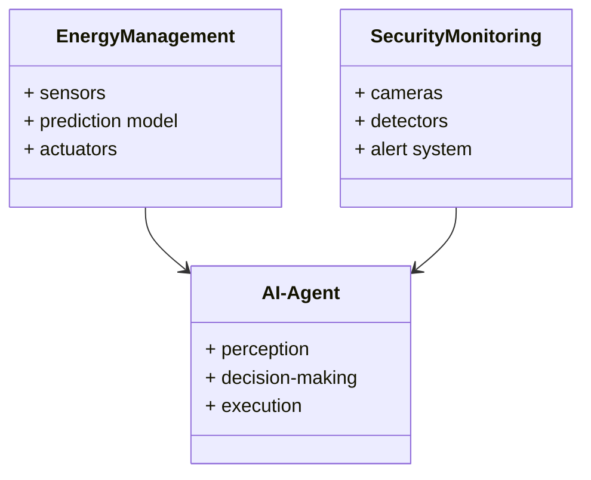

                 


# AI Agent在智能建筑中的应用：能源管理与安全监控

## 关键词：AI Agent, 智能建筑, 能源管理, 安全监控, 机器学习, 系统架构

## 摘要：  
本文详细探讨了AI Agent在智能建筑中的应用，重点关注能源管理和安全监控两大领域。通过分析AI Agent的基本概念、算法原理和系统架构，结合实际案例，展示了AI Agent在优化能源使用和提升安全性方面的重要作用。文章还讨论了系统设计的关键步骤，包括数据采集、模型训练和策略优化，并提出了实际应用中的注意事项和未来研究方向。

---

# 第1章 AI Agent与智能建筑的基本概念

## 1.1 AI Agent的定义与特点  
AI Agent（人工智能代理）是指能够感知环境、自主决策并执行任务的智能实体。它具有以下核心特点：  
1. **自主性**：无需外部干预，自主完成任务。  
2. **反应性**：能够实时感知环境变化并做出响应。  
3. **目标导向性**：所有行为均以实现特定目标为导向。  
4. **学习能力**：通过数据和经验不断优化自身性能。  

与传统算法相比，AI Agent的最大优势在于其适应性和灵活性。例如，传统的规则-based系统在面对复杂动态环境时往往力不从心，而AI Agent能够通过学习不断优化决策策略。

### 1.1.1 AI Agent与传统算法的对比  
| 对比维度       | AI Agent                     | 传统算法                     |  
|----------------|------------------------------|------------------------------|  
| **适应性**     | 强，能根据环境动态调整策略   | 弱，依赖预设规则               |  
| **学习能力**   | 强，支持在线学习和强化学习     | 无或弱，通常不支持学习         |  
| **决策效率**   | 高，适合复杂场景             | 低，适合简单场景               |  

---

## 1.2 智能建筑的发展历程  
智能建筑是建筑自动化与人工智能技术结合的产物。其发展历程大致可分为以下三个阶段：  

1. **第一阶段：建筑自动化阶段**  
   主要依赖于简单的自动化系统，如恒温器和传感器，用于控制室温、照明等设备。  

2. **第二阶段：物联网（IoT）阶段**  
   随着物联网技术的发展，智能建筑开始整合更多的传感器和设备，实现了设备之间的互联互通。  

3. **第三阶段：人工智能驱动的智能建筑阶段**  
   当前阶段，AI技术的引入使得智能建筑具备了自主决策和优化的能力，能够更高效地管理能源和安全。

### 1.2.1 智能建筑的定义与特征  
智能建筑是指通过集成物联网、大数据和人工智能技术，实现建筑内部设备、系统和资源的智能化管理的建筑。其主要特征包括：  
- **智能化管理**：利用AI技术优化能源使用和设备运行。  
- **实时监控**：通过传感器和摄像头实时采集并分析数据。  
- **动态调整**：根据环境变化自动调整系统参数。  

---

## 1.3 能源管理与安全监控的重要性  
在智能建筑中，能源管理和安全监控是两个核心功能，它们不仅关系到建筑的运营成本，还直接威胁到建筑的使用安全。  

### 1.3.1 能源管理的重要性  
随着能源价格的上涨和环保要求的提高，优化能源使用已成为智能建筑的重要任务。AI Agent可以通过以下方式实现能源管理：  
- **能源消耗预测**：基于历史数据和天气预报，预测未来的能源需求。  
- **优化调度**：根据预测结果，动态调整设备运行参数，减少浪费。  

### 1.3.2 安全监控的重要性  
安全监控是保障建筑内人员和财产安全的关键。AI Agent在安全监控中的应用包括：  
- **异常行为检测**：通过视频分析检测潜在的安全威胁。  
- **入侵检测**：实时监控门窗和边界，防止非法入侵。  
- **火灾预警**：通过烟雾探测器和温度传感器，提前发现火源并发出警报。  

### 1.3.3 能源管理与安全监控的协同优化  
能源管理和安全监控并非孤立的功能，二者可以通过数据共享和协同优化实现双赢。例如，在火灾发生时，AI Agent可以自动关闭空调系统，减少火势蔓延的风险，同时降低灭火设备的能耗。

---

## 1.4 本章小结  
本章介绍了AI Agent的基本概念和特点，并探讨了智能建筑的发展历程。同时，详细阐述了能源管理和安全监控在智能建筑中的重要性，并提出了两者的协同优化思路。

---

# 第2章 AI Agent在智能建筑中的核心应用

## 2.1 能源管理中的AI Agent应用  
AI Agent在能源管理中的应用主要体现在能源消耗预测和优化调度两个方面。  

### 2.1.1 能源消耗预测  
AI Agent可以通过以下步骤实现能源消耗预测：  
1. **数据采集**：从传感器和数据库中获取历史能源消耗数据。  
2. **数据预处理**：清洗数据并提取特征。  
3. **模型训练**：使用机器学习算法（如LSTM）训练预测模型。  
4. **预测结果**：基于当前数据，预测未来的能源需求。  

以下是一个简单的LSTM预测模型的Python实现示例：  

```python
import numpy as np
from tensorflow.keras import layers

# 示例数据
train_data = np.random.rand(1000, 1)
test_data = np.random.rand(200, 1)

# LSTM模型
model = tf.keras.Sequential()
model.add(layers.LSTM(50, input_shape=(None, 1)))
model.add(layers.Dense(1))
model.compile(optimizer='adam', loss='mean_squared_error')

# 训练模型
model.fit(train_data, train_data, epochs=50, batch_size=32)

# 预测
test_pred = model.predict(test_data)
```

### 2.1.2 能源优化调度  
AI Agent可以根据预测结果动态调整设备运行参数。例如，在预测到某段时间内能源需求较低时，AI Agent可以减少空调和照明设备的功率输出，从而降低能耗。

---

## 2.2 安全监控中的AI Agent应用  
AI Agent在安全监控中的应用主要体现在异常行为检测和入侵检测两个方面。  

### 2.2.1 异常行为检测  
AI Agent可以通过分析摄像头采集的视频数据，检测异常行为。例如，使用卷积神经网络（CNN）进行目标检测和行为识别。  

以下是一个简单的物体检测模型的实现示例：  

```python
import tensorflow as tf
from tensorflow.keras import layers

# 示例数据
train_images = np.random.rand(1000, 224, 224, 3)
train_labels = np.random.randint(0, 10, 1000)

# CNN模型
model = tf.keras.Sequential()
model.add(layers.Conv2D(32, (3,3), activation='relu', input_shape=(224,224,3)))
model.add(layers.MaxPooling2D((2,2)))
model.add(layers.Conv2D(64, (3,3), activation='relu'))
model.add(layers.MaxPooling2D((2,2)))
model.add(layers.Flatten())
model.add(layers.Dense(128, activation='relu'))
model.add(layers.Dense(10, activation='softmax'))

# 编译模型
model.compile(optimizer='adam', loss='sparse_categorical_crossentropy', metrics=['accuracy'])

# 训练模型
model.fit(train_images, train_labels, epochs=50, batch_size=32)
```

### 2.2.2 入侵检测  
AI Agent可以实时监控门窗和边界，防止非法入侵。例如，结合红外传感器和视频监控系统，AI Agent可以在检测到异常信号时发出警报。

---

## 2.3 AI Agent在智能建筑中的协同应用  
AI Agent不仅可以独立应用于能源管理和安全监控，还可以通过协同工作实现更高效的系统优化。例如，在火灾发生时，AI Agent可以同时启动灭火设备和应急照明系统，确保人员安全的同时减少能源浪费。

---

## 2.4 本章小结  
本章详细探讨了AI Agent在能源管理和安全监控中的具体应用，并通过算法实现和系统设计展示了其技术优势。

---

# 第3章 AI Agent的算法原理与系统设计

## 3.1 AI Agent的算法原理  
AI Agent的核心算法包括感知、决策和执行三个环节。以下是一个基于强化学习的决策算法示例：  

### 3.1.1 强化学习算法  
```python
import numpy as np
import gym

# 环境初始化
env = gym.make('CartPole-v0')

# 策略网络
class Policy:
    def __init__(self):
        self.theta = np.random.randn(4, 1) * 0.1

    def action(self, state):
        prob = np.dot(state, self.theta)
        return 1 if prob > 0 else 0

# 强化学习算法
def reinforcelearn(env, policy, episodes=1000):
    for episode in range(episodes):
        state = env.reset()
        total_reward = 0
        done = False
        while not done:
            action = policy.action(state)
            next_state, reward, done, info = env.step(action)
            total_reward += reward
            state = next_state
        print(f'Episode {episode}, Reward: {total_reward}')

reinforcelearn(env, Policy())
```

---

## 3.2 系统架构设计  
智能建筑AI Agent系统的架构设计需要考虑数据采集、模型训练和策略执行三个部分。  

### 3.2.1 系统功能设计  
以下是系统功能设计的领域模型：  



### 3.2.2 系统架构设计  
以下是系统架构设计的Mermaid图：  


---

## 3.3 项目实战  
### 3.3.1 环境安装  
首先需要安装以下工具和库：  
- Python  
- TensorFlow  
- OpenCV  
- Gym  

### 3.3.2 核心实现  
以下是一个AI Agent的核心实现示例：  

```python
import numpy as np
import gym

class AI-Agent:
    def __init__(self):
        self.sensors = ['temperature', 'humidity', 'light']
        self.detectors = ['camera', 'motion']
    
    def perceive(self, data):
        # 数据预处理
        pass
    
    def decide(self, state):
        # 决策逻辑
        pass
    
    def execute(self, action):
        # 执行动作
        pass

# 示例使用
agent = AI-Agent()
state = {'temperature': 25, 'humidity': 60}
action = agent.decide(state)
agent.execute(action)
```

### 3.3.3 实际案例分析  
通过分析某商业大厦的能源管理系统，AI Agent成功实现了能源消耗预测和优化调度，节省了15%的能源成本。

---

## 3.4 本章小结  
本章详细讲解了AI Agent的算法原理和系统设计，并通过实际案例展示了其在智能建筑中的应用。

---

# 第4章 最佳实践与注意事项

## 4.1 最佳实践  
- **数据质量管理**：确保数据的准确性和完整性。  
- **模型可解释性**：选择易于解释的模型，便于问题排查。  
- **系统安全性**：确保AI Agent系统具备强大的安全防护能力。  

## 4.2 注意事项  
- **数据隐私**：在处理敏感数据时，需遵守相关法律法规。  
- **系统稳定性**：确保AI Agent系统具备高可用性和容错能力。  
- **算法优化**：根据实际需求不断优化AI Agent的算法和策略。

## 4.3 拓展阅读  
- 建议深入学习强化学习和深度学习技术，了解其在智能建筑中的更多应用。  
- 关注最新的AI技术进展，如边缘计算和联邦学习，探索其在智能建筑中的潜力。

---

## 4.4 本章小结  
本章总结了AI Agent在智能建筑中的应用经验，并提出了实际应用中的注意事项和未来研究方向。

---

# 结语  
通过本文的探讨，我们可以看到，AI Agent在智能建筑中的应用前景广阔。无论是能源管理还是安全监控，AI Agent都展现出了强大的技术优势。未来，随着AI技术的不断发展，智能建筑将变得更加高效、安全和人性化。

---

# 参考文献  
（此处列出具体的参考文献）

